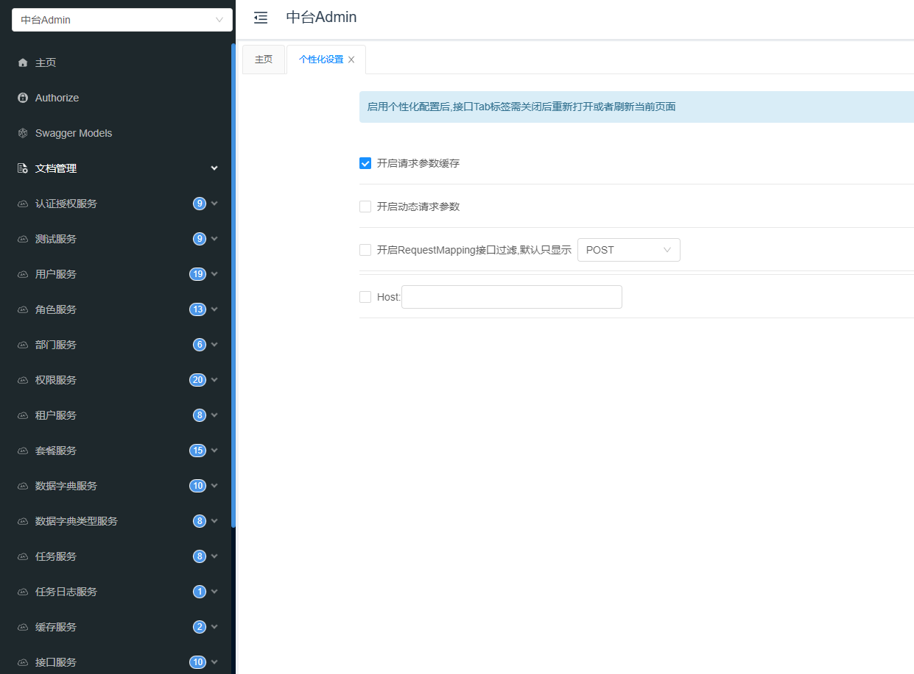

## 中台框架后端项目 Admin.Core 的介绍与配置说明

> 中台 admin 是前后端分离权限管理系统，Admin.Core 为后端项目，基于.NET 7.0 开发。  
> 支持多租户、数据权限、动态 Api、任务调度、OSS 文件上传、滑块拼图验证、多数据库，分布式缓存、分布式事务等

- 接口文档一览
  

- 项目地址
  - Github https://github.com/zhontai/Admin.Core
- 技术栈
  - dotnet7
  - FreeSql
  - Autofac
  - CAP
  - Mapster
- 特点
  - 快速启动，上手简单
  - 系统模块化
  - Swagger 的模块化封装
  - 读写分离
  - 分库分表
  - 分布式事务 TCC/ SAGA
  - 动态 API
  - 系统权限封装基本满足大部分项目
  - 多租户实现
- 开发环境
  - Vs2022
  - dotnet7
- 项目结构
  - hosts
    - `ZhonTai.Host`:默认启动项目,添加对 ZhonTai.Admin.Dev，模块的引用，并将程序集配置到 assemblyNames
  - platform
    - `ZhonTai.Admin` 核心服务
    - `ZhonTai.ApiUI` 接口文档封装，分模块加载
    - `zhonTai.Common` 通用库封装
    - `ZhonTai.DynamicApi` 动态 WebApi 库
    - `ZhonTai.Admin.Dev` 代码生成器添加
  - tests
    - `ZhonTai.Tests` 测试库
  - modules
    - XX.XX 我准备放自己的模块

### 默认实现功能

1. 用户管理：配置用户，查看部门用户列表，支持禁用/启用、重置密码、设置主管、用户可配置多角色、多部门和上级主管。
2. 角色管理：配置角色，支持角色分组、设置角色菜单和数据权限、批量添加和移除角色员工。
3. 部门管理：配置部门，支持树形列表展示。
4. 权限管理：配置分组、菜单、操作、权限点、权限标识，支持树形列表展示。
5. 租户套餐：配置租户套餐，支持新增/移除套餐企业。
6. 租户管理：配置租户，新增租户时初始化部门、角色和管理员数据，支持租户配置套餐、禁用/启用功能。
7. 字典管理：配置字典，查看字典类型和字典数据列表，支持字典类型和字典数据维护。
8. 任务调度：查看任务和任务日志列表，支持任务启动、执行、暂停等功能。
9. 缓存管理：缓存列表查询，支持根据缓存键清除缓存
10. 接口管理：配置接口，支持接口同步功能，用于新增权限点选择接口，支持树形列表展示。
11. 视图管理：配置视图，支持视图维护功能，用于新增菜单选择视图，支持树形列表展示。
12. 文件管理：支持文件列表查询、文件上传/下载、查看大图、复制文件地址、删除文件功能。
13. 登录日志：登录日志列表查询，记录用户登录成功和失败日志。
14. 操作日志：操作日志列表查询，记录用户操作正常和异常日志。

### 框架的使用

#### 1. 从 GitHub 克隆/下载项目

- 后端：`git clone https://github.com/zhontai/Admin.Core.git`
- 前端：`git clone https://github.com/zhontai/admin.ui.plus.git`

#### 2. 后端项目的启动

> 使用新下的 VS2022 打开后，默认启动项目 ZhonTai.Host ，直接 Ctrl+F5 运行即可  
> 系统将会根据实体生成数据库及表，并根据 Configs/dbconfig.json 配置将 initData/\*.json 的数据生成到本地 Sqlite 中  
> (ps:第一次搞 dotnet7 的项目，vs2019+自己下 SDK 折腾半天搞不了一点，需要 vs2022 17.4+)

- 官方文档：https://zhontai.net/backend/new-project.html

#### 3. 配置文件说明

- launchSettings.json
  - 默认本地启动配置
    - 配置项
      - 运行环境
        - ASPNETCORE_ENVIRONMENT:Development
      - 启动端口
        - 默认：8000
        - 优先级低于 appconfig.urls 的配置
- appsettings.{Env}.json
  - 默认的应用配置文件
  - 配置项
    - 日志等级
      - 默认：Information
    - 跨域
      - 默认：\*
    - CAP 配置
      - 默认：未启用
    - 滑动验证码
      - 默认：300s 有效期
      - 是否开启在 appconfig.json 配置 varifyCode.enable
- Configs\*.{Env}.json

  - 自定义的应用配置文件
  - dbconfig.json
    - 数据库配置
    - 绑定模型
      - 单例：`DbConfig`
    - 配置项
      - 支持类型：type
        - 默认：Sqlite
          MySql = 0, SqlServer = 1, PostgreSQL = 2,Oracle = 3, Sqlite = 4, OdbcOracle = 5,OdbcSqlServer = 6, OdbcMySql = 7,OdbcPostgreSQL = 8, Odbc = 9, OdbcDameng =10, MsAccess = 11, Dameng = 12,OdbcKingbaseES = 13, ShenTong = 14,KingbaseES = 15, Firebird = 16
      - 连接字符串：connectionString
        - 默认：admindb.db
      - 同步结构
        - syncStructure：true
          - 默认启用
          - 分布式部署需要注意关闭
        - 监听同步结构脚本 syncStructureSql：false
          > 将会输出 codeFirst 执行的脚本
          > 将 assemblyNames 配置的所有实体执行结构移 `db.CodeFirst.SyncStructure `  
          > 1.创建临时表  
          > 2.插入历史数据，修改字段名称情况注意  
          > 3.删除旧表，重命名临时表为新表  
          > 生产上该自己执行脚本的还是自己执行
      - 同步数据
        - syncData：true
        - sysUpdateData:false
          - 同步更新数据
          - 确定要修改表数据是最新数据再开启，除 localdb 测试就不要使用
        - syncDataIncludeTables：[]
          - 同步数据包含表，指定表同步，不填同步所有表
        - syncDataExcludeTables：[]
          - 同步数据排除表，指定表不同步
        - syncDataUser
          - 同步数据操作用户
        - syncDataPath
          - 不配置默认为   项目目录/InitData/Admin
          - 默认会将文件夹下的所有 表名.json 添加到数库中，默认新增所有数据
          - 如果是租户数据，格式为 表.tenant.json
        - syncDataCurd：false - 监听同步数据 Curd 操作 -
          > 设置是否将 syncDataPath 文件夹下的 表名.json 加/修改到数据库中
      - 生成数据
        - generateData：true
          默认开启但无效，需要将禁用创建数据库及禁用步：createDb:false && syncData:false
        - 加了视图菜单就可以使用这个功能来创建生成默认数据

- cacheconfig.json
  - 缓存配置，未绑定模型，redis 缓存，限流参数配置
  - 配置项
    - 支持类型
      - 默认：Memory
      - Memory = 0,Redis = 1
    - 限流缓存类型
      - 默认：Memory
      - Memory = 0,Redis = 1
    - Redis 配置
      - 127.0.0.1:6379
- appconfig.json
  - 应用配置
  - 绑定模型
    - 单例: `AppConfig`
  - 配置项
    - appType 应用程序类型
      - 默认：Controllers
      - Controllers ControllersWithViews MVC
    - urls 启动地址
      - http://\*:8000
    - corUrls 跨域
      - []
    - assemblyNames 程序集名称
      - ZhonTai.Admin
      - Mapster 自动注册程序集
    - tenantc 租户
      - true
    - distributeKey 分布式事务唯一标识
      - 为空则不生成分布式事务表
    - validate 验证开关
      - 登录,接口权限,数据权限验证
    - swagger Swagger 文档 s
      - http://localhost:8000/admin/swagger
    - apiUI 接口文档地址
      - http://localhost:8000/admin/index.html
    - MiniProfiler 性能分析器
      - false
    - identityServer 统一认证授权服务器
      - false
    - aop 面向切面编程 s
      - 开启事务
    - log 数据库日志
      - 操作日志
    - rateLimit 限流开关
      - false
    - varifyCode 登录验证码
      - true
    - defaultPassword 默认密码
      - 111111
    - dynamicApi 动态 api
      - 结果格式化
    - passwordHasher 标准标识密码哈希
      - 启用后相同密码加密后各不相同
    - maxRequestBodySize 最大请求大小
      - 104857600
    - healthChecks 健康检查
      - enable:true 启用
      - path:/admin/health
- jwtconfig.json
  - JWT 配置
  - 绑定模型
    - 单例：`JwtConfig`
  - 配置项
    - issuer 发行者
    - audience 订阅者
    - securityKey 密钥
    - expires 有效期(分钟) 120
    - refreshExpires 刷新有效期(分钟) 1440
- ossconfig.json
  - 本地上传配置
  - 绑定模型
    - `IOptions<OSSConfig>`
  - OSS 配置
    - Minio
    - 阿里云
    - 腾讯云
    - 七牛
    - 华为云
- uploadconfig.json
  - 上传配置
  - 绑定模型
    - `IOptions<UploadConfig>`
- ratelimitconfig.json
  - 限流配置
  - 绑定模型
    - `IOptions`
  - 支持类型
    - IP 限流
      - 默认未启用
      - 需要在 appconfig.json 中配置 rateLimit:true 生效
      - 使用 Redis 实现限流
      - 需要在 cacheconfig.json 中配置 typeRateLimit
- InitData\模块\*.{tenant}.json
  - 默认初始化数据

#### 4. 代码生成

- 官方默认模板生成：
  - `dotnet new install ZhonTai.Template`
  - `dotnet new MyApp -n MyCompanyName.MyProjectName`
- 第三方代码生成器：
  - 后端：https://github.com/share36/Admin.Core.Dev
  - 前端：https://github.com/share36/admin.ui.plus.dev

前端及代码生成见下篇

### 写在最后

文章的起因是想找个不错的框架用来搞个自己用的系统，找了几个 dotnet+vue 的框架，zhontai 的这个是看到上手最容易，前后台的代码也没有封装得太深，二开也很方便，看着用着都挺舒服的。
唯一的不足就是文档了，一点资料都找不到，就只能一点点看代码，然后边看边记录，以备后用，又想着既然都写了，那就再整理一下了，顺便分享出来咯，希望能够对后面使用框架的有所帮助。
