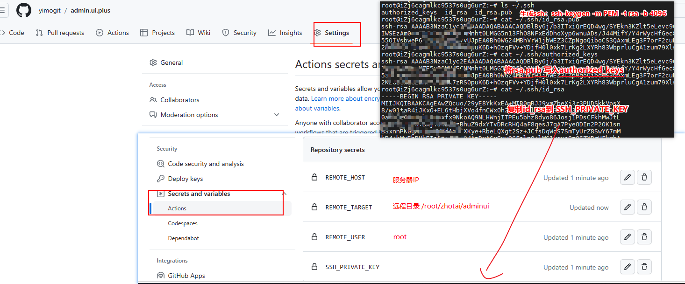
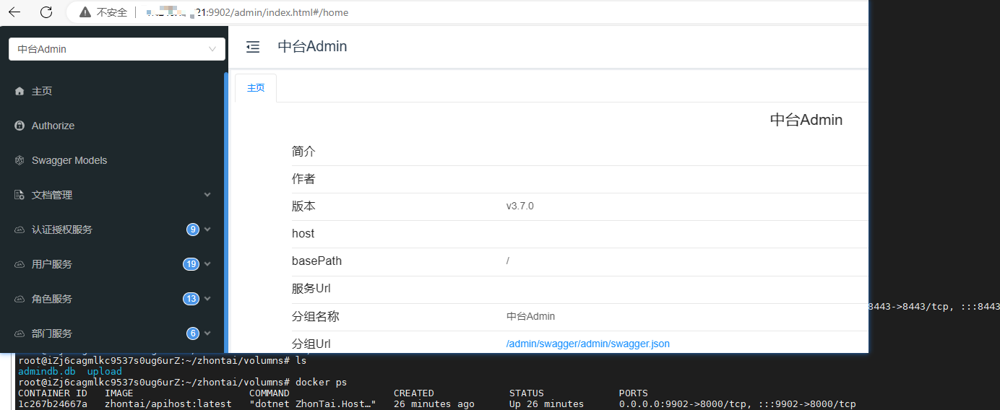
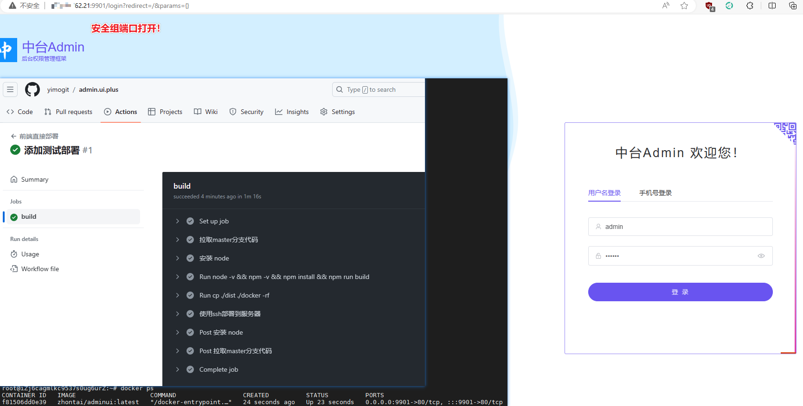

## 前言

> Github Actions是什么？是 GitHub 提供的一种持续集成/持续部署（CI/CD）工作流程自动化服务,助力项目的自动化构建、测试和部署。  
> 依托于平台，本文将分享使用 GitHub Actions 完成对一个.Net Core+Vue 的前后端分离项目 zhontai 的构建，并使用 docker 部署到云服务器(阿里云)

### 使用说明

经过一番尝试学习，个人感受是其功能齐全,文档完善，使用 GitHub 托管仓库完成自己的 CI/CD，不再需要自己搞构建服务了。  
关于使用费用问题：每个用户/组织都有免费的使用额度：2000 分钟/月, 不同的项目归类到不同的组织，完全足够使用了。

### 本文环境

- GitHub 项目
  - .Net Core 项目：[https://github.com/yimogit/Admin.Core](https://github.com/yimogit/Admin.Core) fork 自 [zhontai/Admin.Core](https://github.com/zhontai/Admin.Core)
  - Vue 项目：[https://github.com/yimogit/admin.ui.plus](https://github.com/yimogit/admin.ui.plus) fork 自 [zhontai/admin.ui.plus](https://github.com/zhontai/admin.ui.plus)
- 安装了 docker 的 Linux 服务器

## 后端 asp.net core7.0 项目的部署

### 执行步骤及重点

- 仓库地址：[https://github.com/yimogit/Admin.Core](https://github.com/yimogit/Admin.Core)
- 部署文件：[`.github\workflows\test-deploy.yml`](https://github.com/yimogit/Admin.Core/blob/master/.github/workflows/test-deploy.yml)
- 目录结构
  ```
  ├─.github
  │  └─workflows
  │    └─test-deploy.yml
  ├─docker
  │    ├─Dockerfile
  │    - publish_output publish生成的文件会复制到此，rsync上传到linux服务器
  ├─src
  │    ├─hosts
  ├─...
  ```

1. 新建 github actions 配置文件: `.github\workflows\test-deploy.yml`

   - 仓库的 .github/workflows 目录中定义将会被 github actions 识别
   - 测试可以用，生产则可以用 `on: workflow_dispatch` 指定手动构建

2. 拉取分支
   - actions 库：`actions/checkout@v3`
3. 安装 Dotnet7
   - actions 库：`actions/setup-dotnet@v3`
4. 执行打包生成 publish_output 目录
   - `dotnet publish ./src/hosts/ZhonTai.Host -c Release -o ./publish_output --self-contained true --runtime linux-x64 --framework net7.0`
5. 使用 ssh 部署到服务器
   - actions 库：`easingthemes/ssh-deploy@v4.1.8`
   - 将 publish_output 复制到 docker 目录，在将 docker 目录，将其上传到服务器后执行脚本
   - ssh 连接后需要创建挂载目录，一个数据库的目录，一个上传目录
   - 默认 ZhonTai.Host 的端口是 8000
   - 创建挂载目录：`mkdir /root/zhontai/volumns/upload -p`
   - docker 运行:`docker run --name my-zhontai-apihost -d -p 9902:8000 -e -v /root/zhontai/volumns/admindb.db:/app/admindb.db -v /root/zhontai/volumns/upload:/app/wwwroot/upload zhontai/apihost:latest`
6. ssh 使用需要配置的环境变量
   - `${{ secrets.SSH_PRIVATE_KEY }}`：服务器的 ssh 密钥:~/.ssh/id_rsa 内容
   - `${{ secrets.REMOTE_HOST }}`：服务器 IP: xxx.xxx.xxx.xxx
   - `${{ secrets.REMOTE_USER }}`：用户名 root
   - `${{ secrets.REMOTE_TARGET }}`：远程目录 /root/zhontai/api
7. 配置需要的环境变量
   - 配置路径：项目->Settings->Security->Secrets and variables->Actions->New repository secret
   - 
   - ssh 的生成参考[ssh-deploy 配置部分](https://github.com/marketplace/actions/ssh-deploy#configuration)
   - `ssh-keygen -m PEM -t rsa -b 4096` 生成 ssh，然后复制公钥到 authorized_keys (`cat ~/.ssh/id_rsa.pub>>~/.ssh/authorized_keys`)
   - 设置完最好是重启下
8. 构建完成
   - 记得开启云服务器的防火墙端口：9902，即可在浏览器中访问到前台页面
   - 

### .github/workflows/test-deploy.yml

```yml
# test-deploy.yml
name: 后端测试环境直接部署
# 手动构建
#on: workflow_dispatch
on:
  push:
    branches:
      - master
jobs:
  build:
    runs-on: ubuntu-latest
    steps:
      # 拉取仓库文件
      - name: 拉取master分支代码
        uses: actions/checkout@v3
        with:
          # 默认当前分支
          ref: 'master'
      # action命令，安装Dotnet7
      - name: 安装 Dotnet7
        uses: actions/setup-dotnet@v3
        with:
          dotnet-version: 7.0.400
      # 执行打包命令
      - run: dotnet --version && dotnet publish ./src/hosts/ZhonTai.Host -c Release -o ./publish_output --self-contained true --runtime linux-x64 --framework net7.0
      # 将dist复制到docker目录中
      - run: cp ./publish_output ./docker -rf
      # 使用 ssh 将api-dist文件拷贝到 linux
      - name: 使用ssh部署
        uses: easingthemes/ssh-deploy@v4.1.8
        with:
          SSH_PRIVATE_KEY: ${{ secrets.SSH_PRIVATE_KEY }}
          ARGS: '-rlgoDzvc -i --delete'
          SOURCE: 'docker'
          REMOTE_HOST: ${{ secrets.REMOTE_HOST }}
          REMOTE_USER: ${{ secrets.REMOTE_USER }}
          TARGET: ${{ secrets.REMOTE_TARGET }}
          EXCLUDE: '/node_modules/'
          SCRIPT_BEFORE: |
            mkdir ${{ secrets.REMOTE_TARGET }} -p
          SCRIPT_AFTER: |
            cd ${{ secrets.REMOTE_TARGET }}
            cd docker
            docker build --rm -f ./Dockerfile -t zhontai/apihost:latest .
            # 检查容器是否存在
            if docker container ls -a | grep -q "my-zhontai-apihost"; then
                echo "容器已存在"
                # 停止并移除容器
                docker stop my-zhontai-apihost
                docker rm my-zhontai-apihost
            fi
            # 容器挂载的路径
            mkdir /root/zhontai/volumns/upload -p
            docker run --name my-zhontai-apihost -d -p 9902:8000  -e ASPNETCORE_ENVIRONMENT=Testing  -v /root/zhontai/volumns/admindb.db:/app/admindb.db -v /root/zhontai/volumns/upload:/app/wwwroot/upload zhontai/apihost:latest
```

### docker/Dockerfile

- 打包在 GitHub Actions 完成，生成了 publish_output,所以只需要运行时镜像部署即可
- 指定工作目录为 /app
- 指定监听应用端口，Admin.Core 默认端口为 8000,启动库为 ZhonTai.Host

```docker
# 使用 ASP.NET Core 运行时镜像作为最终镜像
FROM mcr.microsoft.com/dotnet/aspnet:7.0 AS runtime

WORKDIR /app

# 复制构建好的应用程序文件
COPY ./publish_output /app

# 设置运行时环境变量
ENV ASPNETCORE_URLS=http://+:8000

# 指定容器启动时要执行的命令
ENTRYPOINT ["dotnet", "ZhonTai.Host.dll"]
```

## 前台 vue 项目的部署

整个过程类似镜像构建一样，一步步设置自己需要的环境，然后执行命令或者设置对应的操作，可以在使用前过一遍[中文文档](https://docs.github.com/zh/actions)有个大概的了解，本文就跳过基础介绍直接说实现方式及重点

### 执行的步骤及重点

- 仓库地址：[https://github.com/yimogit/admin.ui.plus](https://github.com/yimogit/admin.ui.plus)
- 部署文件：[`.github\workflows\test-deploy.yml`](https://github.com/yimogit/admin.ui.plus/blob/master/.github/workflows/test-deploy.yml)
- 目录结构
  ```
  ├─.github
  │  └─workflows
  │    └─test-deploy.yml
  ├─docker
  │    ├─Dockerfile
  │    └─nginx.conf
  │    - dist build生成的dist会复制到此，rsync上传到linux服务器
  ├─public
  ├─src
  ├─...
  ```

1. 新建 github actions 配置文件: `.github\workflows\test-deploy.yml`

   - 仓库的 .github/workflows 目录中定义将会被 github actions 识别
   - 测试可以用，生产则可以用 `on: workflow_dispatch` 指定手动构建

2. 拉取分支
   - actions 库：`actions/checkout@v3`
3. 安装 node v18.17.1
   - actions 库：`actions/setup-node@v3`
4. 执行打包生成 dist 目录
   - `npm install && npm run build`
   - 默认打包使用的 production 环境的配置，如需打包其他环境则可以使用`npm run build --mode testing` 指定环境 testing，并使用 .env.testing 环境变量文件
   - 使用`echo -e "\nVITE_API_URL=${{ secrets.API_HOST }}" >> .env.production` 将配置中的 API_HOST 写入环境变量中
5. 使用 ssh 部署到服务器
   - actions 库：`easingthemes/ssh-deploy@v4.1.8`
   - 将 dist 复制到 docker 目录，在将 docker 目录，将其上传到服务器后执行脚本
6. ssh 使用需要配置的环境变量
   - `${{ secrets.SSH_PRIVATE_KEY }}`：服务器的 ssh 密钥
   - `${{ secrets.REMOTE_HOST }}`：服务器 IP
   - `${{ secrets.REMOTE_USER }}`：用户名
   - `${{ secrets.REMOTE_TARGET }}`：远程目录
   - `${{ secrets.API_HOST }}`: 接口地址，配置后写入`VITE_API_URL=xxx.com`
7. 配置需要的环境变量
   - 配置路径：项目->Settings->Security->Secrets and variables->Actions->New repository secret
   - 
   - ssh 的生成参考[ssh-deploy 配置部分](https://github.com/marketplace/actions/ssh-deploy#configuration)
   - `ssh-keygen -m PEM -t rsa -b 4096` 生成 ssh，然后复制公钥到 authorized_keys
8. 构建完成
   - 记得开启云服务器的防火墙端口：9901，即可在浏览器中访问到前台页面
   - 

### .github/workflows/test-deploy.yml

- 完整的部署配置

```yml
# test-deploy.yml
name: 前端直接部署
# 手动构建
# on: workflow_dispatch
# 自动构建
on:
  push:
    branches:
      - master
jobs:
  build:
    runs-on: ubuntu-latest
    steps:
      # 拉取仓库文件
      - name: 拉取master分支代码
        uses: actions/checkout@v3
        with:
          # 默认当前分支
          ref: 'master'
      # action命令，安装Node v18.17.1
      - name: 安装 node
        uses: actions/setup-node@v3
        with:
          node-version: 18.17.1
          cache: 'npm'
      # 执行打包命令
      - run: |
          if [ -n "${{ secrets.API_HOST }}" ]; then
            # 使用设置中的接口地址
            echo -e "\nVITE_API_URL=${{ secrets.API_HOST }}" >> .env.production
          fi
      - run: node -v && npm -v && npm install && npm run build
      # 将dist复制到docker目录中
      - run: cp ./dist ./docker -rf
      # 使用 ssh 将dist文件拷贝到 linux
      - name: 使用ssh部署到服务器
        uses: easingthemes/ssh-deploy@v4.1.8
        with:
          SSH_PRIVATE_KEY: ${{ secrets.SSH_PRIVATE_KEY }}
          ARGS: '-rlgoDzvc -i --delete'
          SOURCE: 'docker'
          REMOTE_HOST: ${{ secrets.REMOTE_HOST }}
          REMOTE_USER: ${{ secrets.REMOTE_USER }}
          TARGET: ${{ secrets.REMOTE_TARGET }}
          EXCLUDE: '/node_modules/'
          SCRIPT_BEFORE: |
            mkdir ${{ secrets.REMOTE_TARGET }} -p
          SCRIPT_AFTER: |
            cd ${{ secrets.REMOTE_TARGET }}
            cd docker
            docker build --rm -f ./Dockerfile -t zhontai/adminui:latest .
            # 检查容器是否存在
            if docker container ls -a | grep -q "my-zhontai-adminui"; then
                echo "容器已存在,停止并移除容器"
                docker stop my-zhontai-adminui
                docker rm my-zhontai-adminui
            fi
            docker run --name my-zhontai-adminui -d -p 9901:80 zhontai/adminui:latest
```

### docker/Dockerfile

- 使用 nginx 1.18 镜像，添加前端页面及 nginx 配置
- 对应使用脚本：`docker build --rm -f ./Dockerfile -t zhontai/adminui:latest .`

```docker
FROM nginx:1.18
EXPOSE 80
COPY ./dist /usr/share/nginx/html
COPY ./nginx.conf /etc/nginx/conf.d/default.conf
```

### docker/nginx.conf

- nginx v1.18 的配置,外层没有 http 节点了
- 并且会覆盖默认的 default.conf 才行

```nginx
server {
    listen       80;
    server_name  localhost;
    charset utf-8;
    location / {
        root   /usr/share/nginx/html;
        try_files $uri $uri/ /index.html;
        index  index.html index.htm;
    }

    #error_page  404              /404.html;
    error_page   500 502 503 504  /50x.html;
    location = /50x.html {
        root   html;
    }
}
```

## 一些碎碎念

1. 本文的做法适用于测试，如果要构建生产，还需要更加严谨，比如需要手动执行，而不是自动构建，以及可以将打包和部署分开，生成构建物体，快速回滚部署
2. 本文为了演示远程 docker，所以每次都是构建了 docker，其实也可以直接上传到服务器目录，不需要重启 docker    
3. 文章大部分都是用命令完成，方便迁移到其他构建工具，后续也可以直接在Github使用。

不完全踩坑记录
- ssh部署：看了好久才看明白，一开始生成了没有复制到authorized_keys，然后生成了密钥没重启就是连接不上   
- [actions/ssh-deploy 使用私钥链接提示无权限](https://github.com/marketplace/actions/ssh-deploy#issues)的时候需要将公钥复制到 authorized_keys：`cat ~/.ssh/id_rsa.pub>>~/.ssh/authorized_keys`
- docker nginx：nginx.conf挂载的地址不对，之前的旧版本是在/etc/nginx/nginx.conf,新的在/etc/nginx/conf.d/default.conf    
- nginx.conf的格式新版去掉了http节点，直接配置server节点就行，配置文件没对，导致误以为是我history模式nginx写法不对      
- 覆盖.env.production中接口地址的配置，想要换行加一句，试了好多次才行：`echo -e "\nVITE_API_URL=xxx" >> .env.production`      
- api项目挂载的位置搞错了几次：数据库和文件上传的地址分别是：/app/admindb.db,/app/wwwroot/upload    
- api项目挂载文件需要先行创建目录，启动后将会生成数据库
- api项目的端口默认8000

时间过得太快了，周末两天第一次沉下心研究了一天Github Actions,各种尝试踩坑，第二天将过程整理分享出来，写完这句，发现眨眼间就周一了。
似乎学习，能让我在迷茫中找到些许方向吧。

By [易墨](https://www.cnblogs.com/morang) 转载请注明出处

## 相关资料

### 项目说明

如果对部署的项目感兴趣可以参考前两篇文章

- zhontai Admin.Core: [01.前后端分离中台框架后端 Admin.Core 学习-介绍与配置说明](https://www.cnblogs.com/morang/p/zhontai_admin_core_book_01.html)
- zhontai admin.ui.plus：[02.前后端分离中台框架前端 admin.ui.plus 学习-介绍与简单使用](https://www.cnblogs.com/morang/p/zhontai_admin_core_book_02.html)
- zhontai 代码生成：[03.前后端分离中台框架 zhontai 项目代码生成器的使用](https://www.cnblogs.com/morang/p/zhontai_admin_core_book_03.html)

### Github Actions 相关地址

- [GitHub Actions 中文文档](https://docs.github.com/zh/actions)
- [GitHub Actions 计费](https://docs.github.com/zh/billing/managing-billing-for-github-actions/about-billing-for-github-actions)
- [GitHub Actions 个人使用情况](https://github.com/settings/billing)

### 本文使用到的 action 库

- `actions/checkout@v3` 拉取仓库代码:[v3.6.0 文档](https://github.com/marketplace/actions/checkout?version=v3.6.0)
- `actions/setup-node@v3` 安装 node [v3.8.1 文档 ](https://github.com/marketplace/actions/setup-node-js-environment?version=v3.8.1)
- `actions/setup-dotnet@v3` 安装 dotnet [v3.2.0 文档](https://github.com/marketplace/actions/setup-net-core-sdk?version=v3.2.0)
- `easingthemes/ssh-deploy@v4.1.8` ssh 连接服务器 [v4.1.8 文档](https://github.com/marketplace/actions/ssh-deploy?version=v4.1.8)
- 其他
  - `actions/upload-artifact@v3` 上传文件 [v3.1.2 文档](https://github.com/marketplace/actions/upload-a-build-artifact?version=v3.1.2)
  - `actions/download-artifact@v3` 下载文件 [v3.0.2 文档](https://github.com/marketplace/actions/download-a-build-artifact?version=v3.0.2)

