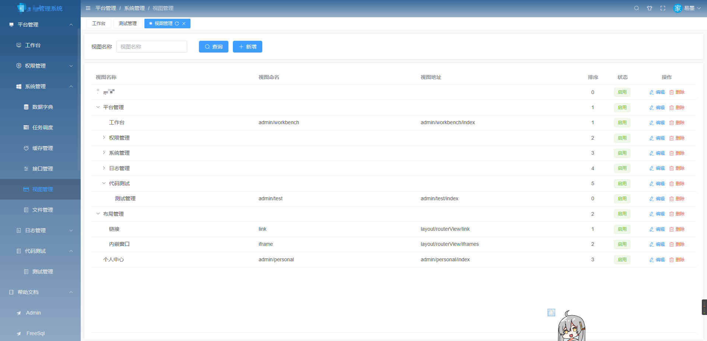
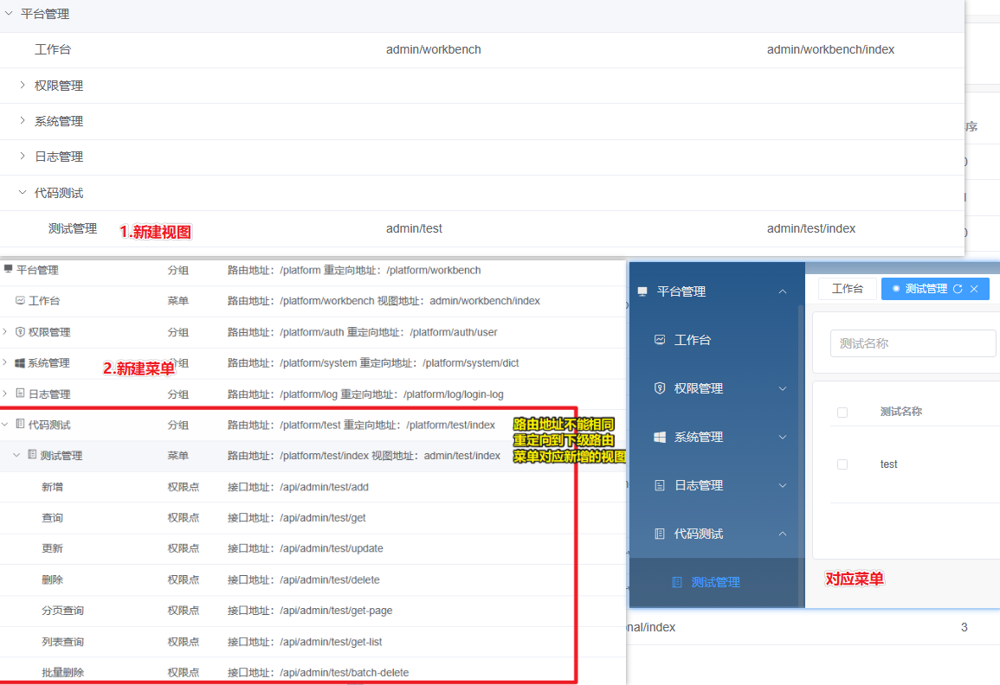

## 中台框架前台项目 admin.ui.plus 的初识
> 基于 vue3.x + CompositionAPI setup 语法糖 + typescript + vite + element plus + vue-router-next + pinia 技术，内置支持一键生成微服务接口，适配手机、平板、pc 的后台权限管理框架，希望减少工作量，帮助大家实现快速开发。

- 框架一览


- 项目地址
	- https://github.com/zhontai/admin.ui.plus
- 技术栈
	- node 16+
	- vue 3.x
	- typescript
	- element plus
- 特点
	- 界面还可以，自定义度高，适配移动端
	- 自动生成api接口定义文件
	- 没有过度封装
	- 系统权限封装基本满足大部分项目
- 推荐环境
	- Node v18
	- VsCode
	- VsCode插件
		- TypeScript Vue Plugin (Volar)
		- Vue Language Features (Volar)
		- Vue 3 Snippets
		- ESLint
		- Prettier - Code formatter
- 项目结构
  - `bin` 打包脚本
  - `gen` 根据./templates生成api相关文件，接口更新后执行`npm run gen:api`会生成接口的定义和接口模型
  - `public` 不需要打包的资源
  - `src` 源码，vue项目结构，具体文档参考[vue-next-admin](https://github.com/lyt-Top/vue-next-admin)，[element-plus](https://element-plus.gitee.io/zh-CN/component/button.html)
  - package.json script
    - `npm run dev` 运行
    - `npm run build` 打包
    - `npm run gen:api` 生成api代码，添加了模块后加入到apis中

### 默认实现功能
1. 用户管理：配置用户，查看部门用户列表，支持禁用/启用、重置密码、设置主管、用户可配置多角色、多部门和上级主管。
2. 角色管理：配置角色，支持角色分组、设置角色菜单和数据权限、批量添加和移除角色员工。
3. 部门管理：配置部门，支持树形列表展示。
4. 权限管理：配置分组、菜单、操作、权限点、权限标识，支持树形列表展示。
5. 租户套餐：配置租户套餐，支持新增/移除套餐企业。
6. 租户管理：配置租户，新增租户时初始化部门、角色和管理员数据，支持租户配置套餐、禁用/启用功能。
7. 字典管理：配置字典，查看字典类型和字典数据列表，支持字典类型和字典数据维护。
8. 任务调度：查看任务和任务日志列表，支持任务启动、执行、暂停等功能。
9. 缓存管理：缓存列表查询，支持根据缓存键清除缓存
10. 接口管理：配置接口，支持接口同步功能，用于新增权限点选择接口，支持树形列表展示。
11. 视图管理：配置视图，支持视图维护功能，用于新增菜单选择视图，支持树形列表展示。
12. 文件管理：支持文件列表查询、文件上传/下载、查看大图、复制文件地址、删除文件功能。
13. 登录日志：登录日志列表查询，记录用户登录成功和失败日志。
14. 操作日志：操作日志列表查询，记录用户操作正常和异常日志。

### 框架的使用

#### 1. 从GitHub 克隆/下载项目         
- 前端：`git clone https://github.com/zhontai/admin.ui.plus.git`        
- 后端：`git clone https://github.com/zhontai/Admin.Core.git`          

#### 2. 启动运行
安装好nodejs18+,vscode，执行 `npm i` && `npm run dev` 运行即可   
启动地址：http://localhost:8100     
默认会跳转到登录页，账号密码 admin 111111 会自动赋值        
后台 ZhonTai.Host 接口运行起来，登录无阻碍

#### 3. 修改事项

- 修改系统名称
  - 需要修改的文件
  - index.html
  - src/layout/footer/index.vue
  - src/layout/stores/themeConfig.ts
- 更新logo
  - 可以从[iconfont](https://www.iconfont.cn/)字体网站找个字体文件当logo,然后再前往[图标工场](https://icon.wuruihong.com/tools)生成需要的图片
- 更新api接口
  - 使用 `npm run gen:api` 生成，将会根据接口文档生成对应的模型，接口ts文件
  - 如果加了新的模块，配置 /gen/gen-api.js 中的apis即可
    ``` js
    const apis =[
        {
            output: path.resolve(__dirname, '../src/api/admin'),
            url: 'http://localhost:8000/admin/swagger/admin/swagger.json',
        },
        //添加模块 dev
        {
            output: path.resolve(__dirname, '../src/api/dev'),
            url: 'http://localhost:8000/admin/swagger/dev/swagger.json',
        }
    ]
    ```
- 平台管理-系统管理-视图管理
  - 视图配置对应vue视图文件地址，权限菜单配置路由，路由对应跳转到视图
  - views模块正常添加文件copy其他的页面即可
- 平台管理-权限管理-权限管理(菜单)
  - 对应vue的路由配置，后台返回，前台动态加载
- 平台管理-系统管理-接口管理-同步，将接口定义写入到数据库，用于指定页面权限及按钮权限的控制
- 新增一个模块页面的步骤
  - 在项目中添加视图文件，如 /views/admin/test/index.vue 
  - 在视图管理中添加视图，配置为新增视图的信息 视图名称：admin/test 视图地址：admin/test/index
  - 新增权限，分组(一级导航)，菜单(下级导航)，权限点 ，分组和菜单的路由地址不能一致，路由前缀也需要一致切换菜单时才能准确定位菜单
  - 测试菜单：路由地址：/platform/test/index 视图地址：选择admin/test/index
   


#### 4. 代码生成
  - 后端：https://github.com/share36/Admin.Core.Dev
  - 前端：https://github.com/share36/admin.ui.plus.dev

代码生成的使用见下篇

