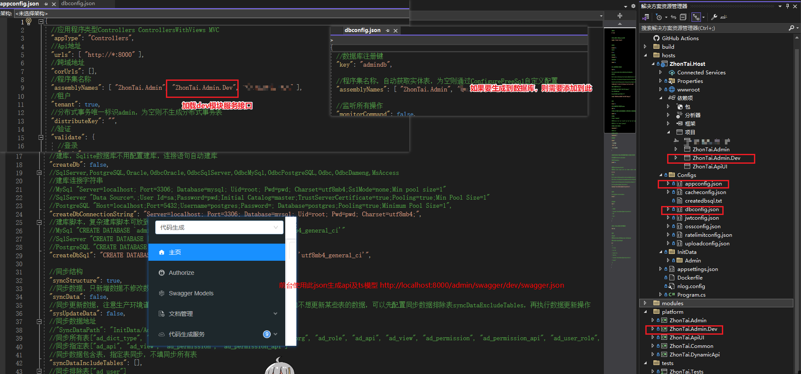
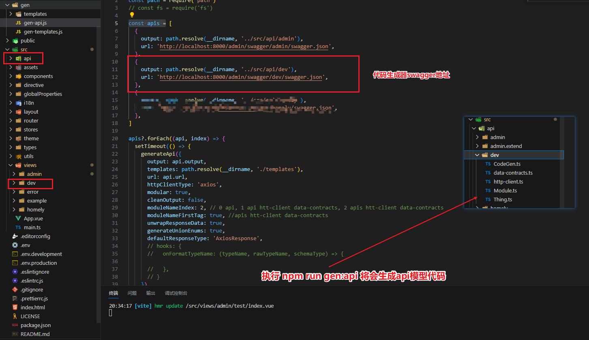
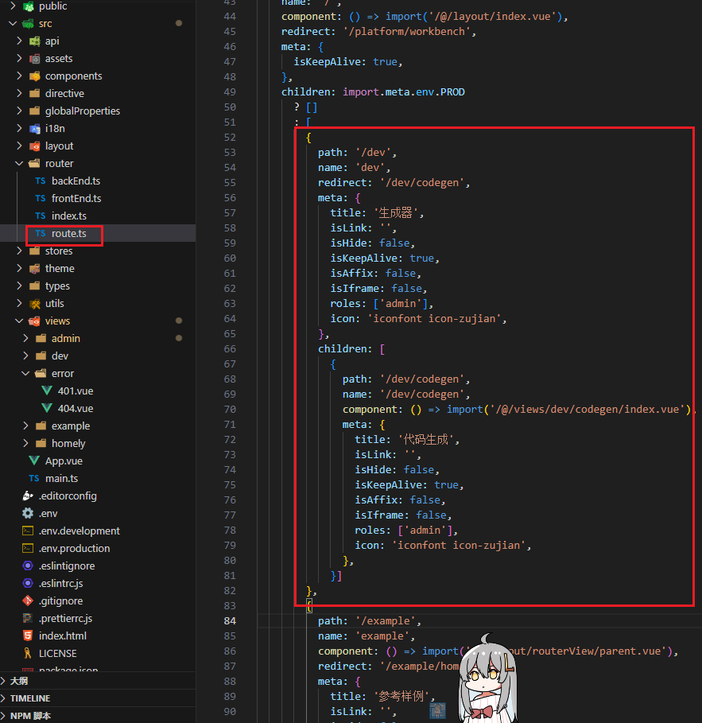
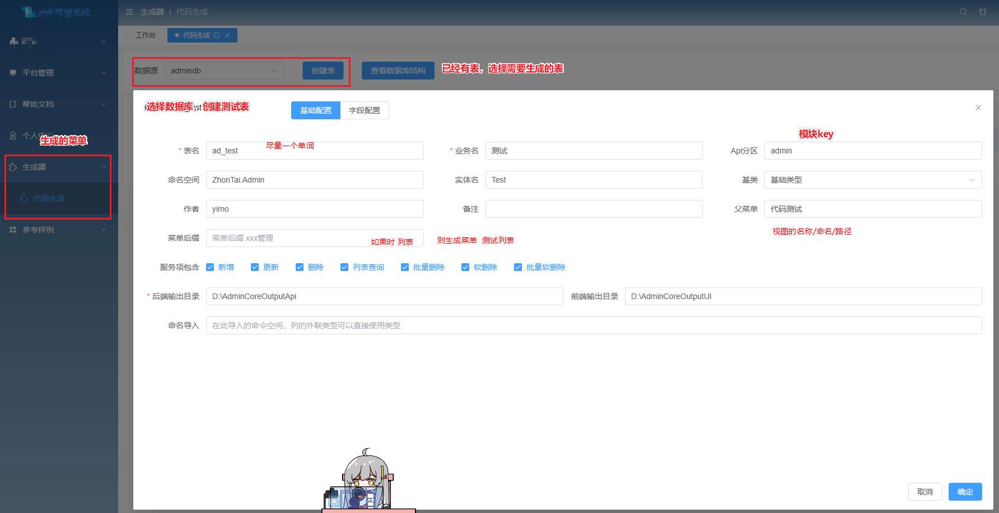
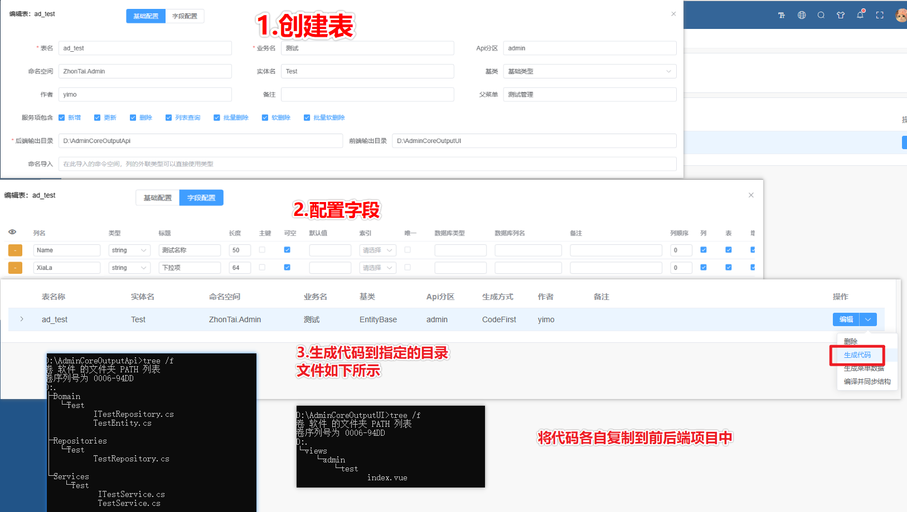
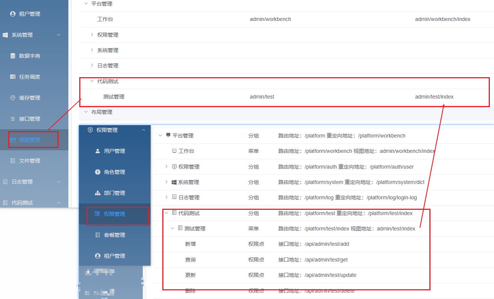
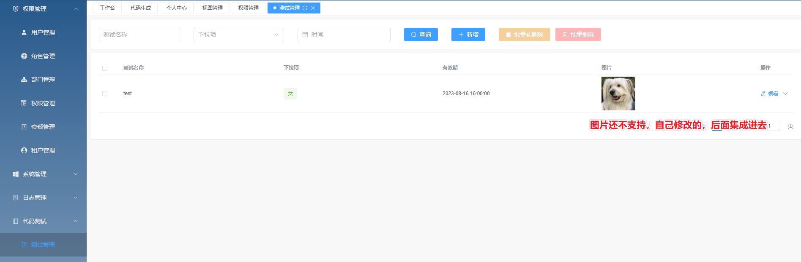

## zhontai 项目
> 基于 .Net7.x + Vue 等技术的前后端分离后台权限管理系统，想你所想的开发理念，希望减少工作量，帮助大家实现快速开发

后端地址：https://github.com/zhontai/Admin.Core
前端地址：https://github.com/zhontai/admin.ui.plus

- 代码生成器：
  - 后端：https://github.com/yimogit/Admin.Core.Dev Fork 自 https://github.com/share36/Admin.Core.Dev
  - 前端：https://github.com/yimogit/admin.ui.plus.dev Fork 自  https://github.com/share36/admin.ui.plus.dev

- 官方默认项目模板生成：
  - `dotnet new install ZhonTai.Template`
  - `dotnet new MyApp -n MyCompanyName.MyProjectName`

本文主要介绍使用第三方的可视化代码生成器生成前后台代码

## 后端生成
- 代码仓库 https://github.com/yimogit/Admin.Core.Dev
- 在 ZhonTai.Host 添加对 ZhonTai.Admin.Dev 的项目引用
- 修改 ZhonTai.Host 项目 Config\appconfig.json 配置
    - assemblyNames：`[... "ZhonTai.Admin.Dev" ]`
    - swagger节点projects增加项 `[...{"name":"代码生成","code":"dev","version":"v0.0.1","description":""}]`
- 已经在开发环境对CodeGenService忽略权限,前端直接显示代码生成不需要加到数据库中
    ``` cs
    #if DEBUG
    [AllowAnonymous]
    #endif
    public partial class CodeGenService{}
    ```
- 后端生成器配置图片说明


## 前端生成
- 代码仓库 https://github.com/yimogit/admin.ui.plus.dev
- 复制 gen/gen-dev-api.js 到项目
- 修改 gen/gen-api.js，添加 dev 模块
  ```
  const apis = [
    {
      output: path.resolve(__dirname, '../src/api/admin'),
      url: 'http://localhost:8000/admin/swagger/admin/swagger.json',
    },
    {
      output: path.resolve(__dirname, '../src/api/dev'),
      url: 'http://localhost:8000/admin/swagger/dev/swagger.json',
    }
  ]
  ```
- 添加package.json命令：`"gen:dev:api": "node ./gen/gen-dev-api"`
- 执行`npm run gen:dev:api`生成接口定义
- 将src/views/dev添加到项目src/views文件夹
- 修改/src/router/route.ts,将生成器节点添加到 '/example' 即可
  ```js
  [
        {
          path: '/dev',
          name: 'dev',
          redirect: '/dev/codegen',
          meta: {
            title: '生成器',
            isLink: '',
            isHide: false,
            isKeepAlive: true,
            isAffix: false,
            isIframe: false,
            roles: ['admin'],
            icon: 'iconfont icon-zujian',
          },
          children: [
            {
              path: '/dev/codegen',
              name: '/dev/codegen',
              component: () => import('/@/views/dev/codegen/index.vue'),
              meta: {
                title: '代码生成',
                isLink: '',
                isHide: false,
                isKeepAlive: true,
                isAffix: false,
                isIframe: false,
                roles: ['admin'],
                icon: 'iconfont icon-zujian',
              },
            }]
        },
        //...{path: '/example',...}
  ]
  ```
- 配置api+模型生成


- 配置路由


因为框架有些更新改动，未做适配会存在一些报错，解决即可，已经提PR了，可以根据需要查看pr或我的主页获取代码

## 生成器使用
配置就绪，项目就可以丝滑的运行起来了

- 可以直接创建数据表，再生成代码，亦可以根据已有的数据库表来生成


- 创建完成后，在列表右侧下拉按钮 生成代码 即可


- 生成菜单数据的前置操作，正常需要手动添加视图及权限分组，再生成菜单
  - 新建视图
    - 视图名称：代码测试
    - 上级视图：平台管理
  - 新建权限分组
    - 上级分组：平台管理
    - 名称：代码测试
    - 路由地址：/platform/test
    - 重定向：/platform/test/index
- 生成菜单
    - 点击生成菜单数据
    - 将会在[视图管理]页面下生成
        - 测试管理 视图命名：admin/test 视图地址：admin/test/index
        - 这里生成的是会加载到vue-router，地址如果有下划线，横杠等特殊符号需要自己修改
    - 将会在[权限管理]页生成
        测试管理 菜单 路由地址：/admin/test 视图地址：admin/test/index  路由命名：admin/test    
        这个测试页因为是生成到平台管理模块所以才需要修改，因为平台模块的key是platform， 
        打开后左侧导航会无法正确定位，所以需要修改下生成的权限菜单项   
        将路由地址修改为：/platform/test/index    
        将路由名称修改为：platform/test/index   

- 生成结果示例





## 结语
至此，对于zhontai的框架使用产出了三篇文章，框架上手还是比较简单，有了代码生成器也可以快速开发；目前得知作者也在弄微服务的框架，表示期待，默默点赞，觉得有用的也可以去[zhontai/Admin.Core](https://github.com/zhontai/Admin.Core)点个Star，希望后来者可以少踩一些坑吧。
目前准备使用框架来整个管理系统，等我边踩坑边记录吧，后面有空再分享。
