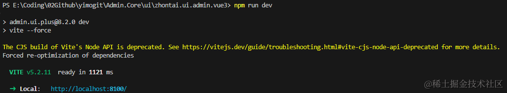

## 前言

> 之前已经分享过几篇关于中台项目框架的文章，相关介绍就不再赘述
>
> 所谓工欲善其事必先利其器，一个项目拥有一个代码生成器是很有必要的，能够大大的节省时间，减少手误，提供开发效率(ps:特别小团队搞微服务但是没有代码生成器，简直要了老命)
>
> 本文将分享如何在中台框架项目 Admin.Core 中添加代码生成器模块，助力项目的快速开发

## 准备

作为本系列的第一篇第一个模块，我们将从拉取代码开始，当然也可以通过仓库的脚手架直接创建自己的项目，本系列后续都将直接基于源码开发，保持框架的同步更新

### 克隆或下载 Admin.Core 代码

` git clone  https://github.com/zhontai/Admin.Core.git`

当然，也可以直接拉取改造创建好的模块仓库 https://github.com/yimogit/Admin.Core

### 新建模块文件夹

添加 `modules` 文件夹及解决方案文件夹，存放模块代码


## 添加代码生成器模块

-   功能：

    -   中台模块服务代码生成

    -   后续计划

        -   自定义模板管理
        -   通用代码生成器

-   参考之前的[配置文章](https://www.cnblogs.com/morang/p/zhontai_admin_core_book_03.html)，代码可直接从当前[仓库](https://github.com/yimogit/Admin.Core/tree/main/src/modules/ZhonTai.Module.Dev)获取最新代码

### 配置后端

-   添加模块类库 ZhonTai.Module.Dev


-   ZhonTai.Module.Dev 需添加对 ZhonTai.Admin 的引用

-   ZhonTai.Host 需添加对 modules/ZhonTai.Module.Dev 的引用，确保 xml 生成，不然 swagger 显示不了中文

-   修改配置 Configs/appconfig.json

    -   程序集配置：`"assemblyNames": [ "ZhonTai.Admin", "ZhonTai.Module.Dev" ]`
    -   Swagger 配置：
    -   ```
        "swagger": {
          //启用
          "enable": true,
          "projects": [
            {
              "name": "中台Admin",
              "code": "admin",
              "version": "v8.2.0",
              "description": ""
            },
            {
              "name": "代码生成",
              "code": "dev",
              "version": "v8.2.0",
              "description": ""
            }
          ]
        }
        ```

-   Ctrl+F5 运行后模块加载成功，后端配置完成


### 配置前端

-   安装包：`npm run install`
-   修改 gen/gen-api.js 添加生成器模块


-   将生成器代码复制到 views 中


-   执行：`npm run gen:api` 重新生成接口映射，会把后端接口转为前台可以直接调用的 ts 代码


-   个人建议：可以根据模块独立一个文件，添加模块生成 gen-module.js，就只会重新生成模块文件


-   运行项目：`npm run dev` 使用 admin 123asd 即可登录到系统



### 配置菜单

-   代码生成器的代码添加了，但是目前还无法再页面中显示出来，有~~两~~三种做法

-   第一种：可以直接修改 /src/router/route.ts 将下面的路由配置添加到参考样例的路由中，只能在开发时使用

    -   ```
            {
                path: '/dev',
                name: 'dev',
                redirect: '/dev/codegen',
                meta: {
                  title: '生成器',
                  isLink: '',
                  isHide: false,
                  isKeepAlive: true,
                  isAffix: false,
                  isIframe: false,
                  roles: ['admin'],
                  icon: 'iconfont icon-zujian',
                },
                children: [
                  {
                    path: '/dev/codegen',
                    name: '/dev/codegen',
                    component: () => import('/@/views/dev/codegen/index.vue'),
                    meta: {
                      title: '代码生成',
                      isLink: '',
                      isHide: false,
                      isKeepAlive: true,
                      isAffix: false,
                      isIframe: false,
                      roles: ['admin'],
                      icon: 'iconfont icon-zujian',
                    },
                  }]
              }
              //...{path: '/example',...}
        ```

-   第二种方法是正常使用动态路由添加

    -   系统管理-视图管理中添加对应的视图（代码中的路由的定义，地址为 dev/codegen/index）
    -   
    -   权限管理-权限管理中添加对应菜单（路由地址：/codegen，路由命名：devgen）
    -   
    -   添加后刷新页面即可访问到代码生成页面
    -   

-   第三种方法：直接执行 sql 即可（这个也是根据前面的操作生成的）

```
--添加视图
INSERT INTO ad_view (Id,ParentId,Name,Label,"Path",Description,Cache,Sort,Enabled,CreatedUserId,CreatedUserName,CreatedUserRealName,CreatedTime,ModifiedUserId,ModifiedUserName,ModifiedUserRealName,ModifiedTime,IsDeleted) VALUES
         (558530915442693,0,NULL,'代码管理',NULL,NULL,0,99,1,161223411986501,'admin','管理员','2024-06-16 16:08:08',161223411986501,'admin','管理员','2024-06-16 16:08:16',0),
         (558531082424325,558530915442693,'codegen','代码生成','dev/codegen/index',NULL,0,1,1,161223411986501,'admin','管理员','2024-06-16 16:08:49',NULL,NULL,NULL,NULL,0);
-- 添加权限
INSERT INTO ad_permission (Id,ParentId,Label,Code,"Type",ViewId,Name,"Path",Redirect,Icon,Hidden,Opened,NewWindow,"External",IsKeepAlive,IsAffix,Link,IsIframe,Sort,Description,Enabled,CreatedUserId,CreatedUserName,CreatedUserRealName,CreatedTime,ModifiedUserId,ModifiedUserName,ModifiedUserRealName,ModifiedTime,IsDeleted) VALUES
         (558531409440773,0,'代码生成',NULL,2,558531082424325,'devgen','/codegen',NULL,'ele-Memo',0,0,0,0,0,0,NULL,0,5,NULL,1,161223411986501,'admin','管理员','2024-06-16 16:10:09',161223411986501,'admin','管理员','2024-06-16 16:10:55',0);
```

代码生成服务已就位，接下来分享如何使用

## 使用代码生成器的使用

-   使用需知：在本地运行访问生成器列表时，将会同步迁移生成器表，自动创建表到数据库（默认与后台模块同一个库）

    -   

-   使用前确保有可用数据源，本地直接运行默认 sqlite 数据库，选择数据库后可以查看已有数据库表来进行代码生成


-   当然，也可以直接创建表生成代码&创建表，这里以新建一个家常管理系统的模块作为演示
-   ~~前置条件：需要先在 modules 中创建对应类库 ZhonTai.Module.Homely，并添加对 ZhonTai.Admin 的引用，创建 DbKeys.AppDb 指定数据库注册键，HomelyConsts.AreaName 指定默认区域名称 ~~（目前已支持类库的自动创建）

### 配置生成规则

-   第一步：选择数据源后，创建业务相关表：家常管理-物品管理

    -   根据格式来创建即可，实体名帕斯卡命名，会自动转换写法
    -   父菜单：需要在生成菜单前创建菜单分组


建议保存后再进行字段配置，避免误操作


创建完成后点击按钮【生成代码】即可


### 添加代码到项目

-   第二步：生成代码后，将【后台代码】其拷贝到对应模块文件夹 ZhonTai.Module.Homely 中，并添加类库添加到 modules 文件夹（可根据需要分离 Default_Consts 内容，其中包含了路由前缀，数据库键值的默认配置，Core 文件夹只第一次使用，后续生成可以只覆盖实体&仓储&服务）

    -   
    -     修改 ZhonTai.Host 项目，添加对模块类库 ZhonTai.Module.Homely 的引用，并修改配置文件 appconfig.json 或者 appconfig.Development.json（若启用了配置中心 UseConfigCenter:true 则修改 ConfigCenter 文件夹下的配置，我这里因为配置中心的配置无效，于是禁用了）
    -   
    -     配置完成运行项目即可
    -   
    -     然后将前台代码【views】 文件夹拷贝到对应前端目录中，执行 `npm run gen:api` 或 `npm run gen:module` 生成新接口的前端映射文件，**重新启动** **下前端项目**
    -   

### 生成迁移数据&菜单&权限

-   第三步：生成迁移脚本到剪切板，连接到数据库进行执行（没有直接生成，实际应用场景中，生产环境一般手动执行，为了确保脚本的正确性，还是先看一眼，后面加个生成并执行）


-   第四步：因为是模块的第一个服务，所以需要先在权限管理中创建一个【家常管理】的分组，这里的名字和代码生成器中填写的父菜单需要一致，否则无法生成菜单

    -   
    -     这里可以重定向的路由地址由后续生成，默认列表页以 /list 结尾

-   第五步：接口管理中同步最新接口


-   第六步：在代码生成列表点击【生成菜单数据】将会自动将模块的菜单，视图生成


### 效果展示

生成成功，刷新页面，一个简单的物品管理的基础功能就出来了


新增编辑页面已同步优化为弹窗


## 后语

至此，代码生成器又一次被我重新改造了一番，后续有时间还会继续完善代码生成器。

flag 先立在这：做一个可以自定义模块的通用代码生成器

有感兴趣的小伙伴欢迎一起加 zhontai 群沟通交流

改代码不易，写作更不易，希望路过的大佬们点个赞，指点一二

### 相关仓库

-   新版代码生成器模块源码仓库：https://github.com/yimogit/Admin.Core [生成器模块代码](https://github.com/yimogit/Admin.Core/tree/main/src/modules/ZhonTai.Module.Dev)
-   中台框架仓库：https://github.com/zhontai/Admin.Core
