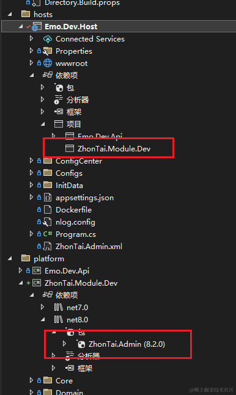

## 前言

> 之前分享中台 Admin.Core 的模块代码生成器，陆续也结合群友们的反馈，完善了一些功能和模板上的优化，而本篇将基于此代码生成器生成一个通用代码生成器模块的基本代码
>
> 后续再在此代码的基础上进行完善，制作一个通用的代码生成器

要做一个项目，首先我们要弄清楚需求，这里简单规划了下所需要的功能模块

可从脑图中看到，基本除了项目生成这块需要添加代码，相关模块的增删改查都可以由代码生成器来生成


## 准备

> 本文开发完成的项目将放在：[yimogit/Emo.Dev](https://github.com/yimogit/Emo.Dev)
>
> 本篇开发代码在我 Fork 的仓库 [yimogit/Admin.Core](https://github.com/yimogit/Admin.Core)


本文主要的阅读者：开发完成后的代码生成器的使用者，使用/将要用 Admin.Core 框架的猿们，如果觉得有用，欢迎点赞留言

## 实现

-   效果一览

[超大gif](https://p3-juejin.byteimg.com/tos-cn-i-k3u1fbpfcp/f851594a8d1a44e98cb92958eaf63040~tplv-k3u1fbpfcp-jj-mark:0:0:0:0:q75.image#?w=1064&h=732&s=5375728&e=gif&f=894&b=fdfdfd)

### 项目代码准备

```
git clone https://github.com/yimogit/Admin.Core.git
```

在运行项目后连接到数据库执行 sql 创建

```
--添加视图
INSERT INTO ad_view (Id,ParentId,Name,Label,"Path",Description,Cache,Sort,Enabled,CreatedUserId,CreatedUserName,CreatedUserRealName,CreatedTime,ModifiedUserId,ModifiedUserName,ModifiedUserRealName,ModifiedTime,IsDeleted) VALUES
         (558530915442693,0,NULL,'代码管理',NULL,NULL,0,99,1,161223411986501,'admin','管理员','2024-06-16 16:08:08',161223411986501,'admin','管理员','2024-06-16 16:08:16',0),
         (558531082424325,558530915442693,'codegen','代码生成','dev/codegen/index',NULL,0,1,1,161223411986501,'admin','管理员','2024-06-16 16:08:49',NULL,NULL,NULL,NULL,0);
-- 添加权限
INSERT INTO ad_permission (Id,ParentId,Label,Code,"Type",ViewId,Name,"Path",Redirect,Icon,Hidden,Opened,NewWindow,"External",IsKeepAlive,IsAffix,Link,IsIframe,Sort,Description,Enabled,CreatedUserId,CreatedUserName,CreatedUserRealName,CreatedTime,ModifiedUserId,ModifiedUserName,ModifiedUserRealName,ModifiedTime,IsDeleted) VALUES
         (558531409440773,0,'代码生成',NULL,2,558531082424325,'devgen','/codegen',NULL,'ele-Memo',0,0,0,0,0,0,NULL,0,5,NULL,1,161223411986501,'admin','管理员','2024-06-16 16:10:09',161223411986501,'admin','管理员','2024-06-16 16:10:55',0);
```

或根据前文 [中台框架模块开发实践-代码生成器的添加及使用](https://www.cnblogs.com/morang/p/18261754/zhontai_admin_core_module_dev_gencode) 在前台添加代码生成器菜单

  


#### 生成器的生成方式说明

代码生成器支持DBFirst和CodeFirst两种方式

1.  DBFirst 需要选择数据源并选择数据表进行生成配置的保存


2.  CodeFirst 可以直接生成配置，配置保存后再使用生成迁移SQL或者将迁移执行到数据库的方式同步数据库表信息


这里为了更方便的生成，做了一个 json 的导入导出，可以快速复制/导入分享的配置，下面会贴出配置，直接导入即可,导入时会将id重置，都为新增


  


### 建立数据模型并生成代码

通过前面理的需求，可以创建相关模型

-   模板分组

    -   模板信息实体
    -   DevGroup

-   模板列表

    -   模板信息实体
    -   DevTemplate

-   项目生成

    -   以项目，项目模型，模型字段组成
    -   DevProject
    -   DevProjectModel
    -   DevProjectModelField

对应代码生成器数据如下，提供这几个模型的基础增删改查功能

对应 json 配置，导入即可

```
[{"id":563489262788677,"authorName":"yimo","tablePrefix":true,"generateType":"2","dbKey":"admindb","dbType":"Sqlite","tableName":"dev_template","namespace":"ZhonTai.Module.Dev","entityName":"DevTemplate","busName":"模板","apiAreaName":"dev","baseEntity":"EntityBase","menuPid":"代码管理","menuAfterText":"管理","backendOut":"E:\\CodeGenOutput\\ZhonTai.Module.Dev","frontendOut":"E:\\CodeGenOutput","dbMigrateSqlOut":"E:\\MigrateSqls","comment":"","usings":"ZhonTai.Module.Dev.Domain.DevGroup","genEntity":false,"genRepository":false,"genService":false,"genAdd":true,"genUpdate":true,"genDelete":true,"genGetList":true,"genSoftDelete":true,"genBatchDelete":true,"genBatchSoftDelete":true,"fields":[{"id":563489262813253,"codeGenId":563489262788677,"dbKey":"","columnName":"Name","columnRawName":null,"netType":"string","dbType":"","comment":"","defaultValue":"","title":"模板名称","isPrimary":false,"isNullable":false,"length":"200","editor":"el-input","position":1,"whetherCommon":false,"whetherRetract":false,"whetherQuery":true,"whetherAdd":true,"whetherUpdate":true,"whetherTable":true,"whetherList":true,"indexMode":null,"isUnique":false,"queryType":"0","dictTypeCode":"","includeEntity":"","includeMode":0,"includeEntityKey":"","displayColumn":"","valueColumn":"","pidColumn":"","effectType":"input","frontendRuleTrigger":"blur"},{"id":563489262813254,"codeGenId":563489262788677,"dbKey":"","columnName":"GroupId","columnRawName":null,"netType":"long","dbType":"","comment":"","defaultValue":"","title":"模板分组","isPrimary":false,"isNullable":false,"length":"64","editor":"my-bussiness-select","position":2,"whetherCommon":false,"whetherRetract":false,"whetherQuery":true,"whetherAdd":true,"whetherUpdate":true,"whetherTable":true,"whetherList":true,"indexMode":null,"isUnique":false,"queryType":"6","dictTypeCode":"","includeEntity":"DevGroupEntity","includeMode":0,"includeEntityKey":"Name","displayColumn":"","valueColumn":"","pidColumn":"","effectType":"input","frontendRuleTrigger":"blur"},{"id":563489262813255,"codeGenId":563489262788677,"dbKey":"","columnName":"Path","columnRawName":null,"netType":"string","dbType":"","comment":"","defaultValue":"","title":"生成路径","isPrimary":false,"isNullable":true,"length":"500","editor":"el-input","position":3,"whetherCommon":false,"whetherRetract":false,"whetherQuery":false,"whetherAdd":true,"whetherUpdate":true,"whetherTable":true,"whetherList":true,"indexMode":null,"isUnique":false,"queryType":"6","dictTypeCode":"","includeEntity":"","includeMode":0,"includeEntityKey":"","displayColumn":"","valueColumn":"","pidColumn":"","effectType":"input","frontendRuleTrigger":"blur"},{"id":563489262813256,"codeGenId":563489262788677,"dbKey":"","columnName":"Content","columnRawName":null,"netType":"string","dbType":"text","comment":"","defaultValue":"","title":"模板内容","isPrimary":false,"isNullable":false,"length":"-1","editor":"my-input-textarea","position":5,"whetherCommon":false,"whetherRetract":false,"whetherQuery":false,"whetherAdd":true,"whetherUpdate":true,"whetherTable":true,"whetherList":true,"indexMode":null,"isUnique":false,"queryType":"6","dictTypeCode":"","includeEntity":"","includeMode":0,"includeEntityKey":"","displayColumn":"","valueColumn":"","pidColumn":"","effectType":"input","frontendRuleTrigger":"blur"}]},{"id":563487794356293,"authorName":"yimo","tablePrefix":true,"generateType":"1","dbKey":"admindb","dbType":"Sqlite","tableName":"dev_group","namespace":"ZhonTai.Module.Dev","entityName":"DevGroup","busName":"模板组","apiAreaName":"dev","baseEntity":"EntityBase","menuPid":"代码管理","menuAfterText":"管理","backendOut":"E:\\CodeGenOutput\\ZhonTai.Module.Dev","frontendOut":"E:\\CodeGenOutput","dbMigrateSqlOut":"E:\\MigrateSqls","comment":"","usings":null,"genEntity":true,"genRepository":true,"genService":true,"genAdd":true,"genUpdate":true,"genDelete":true,"genGetList":true,"genSoftDelete":true,"genBatchDelete":true,"genBatchSoftDelete":true,"fields":[{"id":563487794380869,"codeGenId":563487794356293,"dbKey":"","columnName":"Name","columnRawName":null,"netType":"string","dbType":"","comment":"","defaultValue":"","title":"模板组名称","isPrimary":false,"isNullable":false,"length":"200","editor":"el-input","position":0,"whetherCommon":false,"whetherRetract":false,"whetherQuery":true,"whetherAdd":true,"whetherUpdate":true,"whetherTable":true,"whetherList":true,"indexMode":null,"isUnique":false,"queryType":"0","dictTypeCode":"","includeEntity":"","includeMode":0,"includeEntityKey":"","displayColumn":"","valueColumn":"","pidColumn":"","effectType":"input","frontendRuleTrigger":"blur"},{"id":563487794380870,"codeGenId":563487794356293,"dbKey":"","columnName":"Remark","columnRawName":null,"netType":"string","dbType":"","comment":"","defaultValue":"","title":"备注","isPrimary":false,"isNullable":true,"length":"500","editor":"my-input-textarea","position":0,"whetherCommon":false,"whetherRetract":false,"whetherQuery":false,"whetherAdd":true,"whetherUpdate":true,"whetherTable":true,"whetherList":true,"indexMode":null,"isUnique":false,"queryType":"6","dictTypeCode":"","includeEntity":"","includeMode":0,"includeEntityKey":"","displayColumn":"","valueColumn":"","pidColumn":"","effectType":"input","frontendRuleTrigger":"blur"}]},{"id":563486126821445,"authorName":"yimo","tablePrefix":true,"generateType":"2","dbKey":"admindb","dbType":"Sqlite","tableName":"dev_project_model_field","namespace":"ZhonTai.Module.Dev","entityName":"DevProjectModelField","busName":"项目模型字段","apiAreaName":"dev","baseEntity":"EntityBase","menuPid":null,"menuAfterText":"管理","backendOut":"E:\\CodeGenOutput\\ZhonTai.Module.Dev","frontendOut":"E:\\CodeGenOutput","dbMigrateSqlOut":"E:\\MigrateSqls","comment":"","usings":"ZhonTai.Module.Dev.Domain.DevProjectModel","genEntity":false,"genRepository":false,"genService":false,"genAdd":true,"genUpdate":true,"genDelete":true,"genGetList":true,"genSoftDelete":true,"genBatchDelete":true,"genBatchSoftDelete":true,"fields":[{"id":563486126850117,"codeGenId":563486126821445,"dbKey":"","columnName":"Name","columnRawName":null,"netType":"string","dbType":"","comment":"","defaultValue":"","title":"字段名称","isPrimary":false,"isNullable":false,"length":"200","editor":"el-input","position":0,"whetherCommon":false,"whetherRetract":false,"whetherQuery":true,"whetherAdd":true,"whetherUpdate":true,"whetherTable":true,"whetherList":true,"indexMode":null,"isUnique":false,"queryType":"6","dictTypeCode":"","includeEntity":"","includeMode":0,"includeEntityKey":"","displayColumn":"","valueColumn":"","pidColumn":"","effectType":"input","frontendRuleTrigger":"blur"},{"id":563486126850118,"codeGenId":563486126821445,"dbKey":"","columnName":"Description","columnRawName":null,"netType":"string","dbType":"","comment":"","defaultValue":"","title":"字段描述","isPrimary":false,"isNullable":true,"length":"-1","editor":"el-input","position":0,"whetherCommon":false,"whetherRetract":false,"whetherQuery":false,"whetherAdd":true,"whetherUpdate":true,"whetherTable":true,"whetherList":true,"indexMode":null,"isUnique":false,"queryType":"6","dictTypeCode":"","includeEntity":"","includeMode":0,"includeEntityKey":"","displayColumn":"","valueColumn":"","pidColumn":"","effectType":"input","frontendRuleTrigger":"blur"},{"id":563486126850119,"codeGenId":563486126821445,"dbKey":"","columnName":"DataType","columnRawName":null,"netType":"string","dbType":"","comment":"","defaultValue":"","title":"字段类型","isPrimary":false,"isNullable":true,"length":"64","editor":"el-input","position":0,"whetherCommon":false,"whetherRetract":false,"whetherQuery":false,"whetherAdd":true,"whetherUpdate":true,"whetherTable":true,"whetherList":true,"indexMode":null,"isUnique":false,"queryType":"6","dictTypeCode":"","includeEntity":"","includeMode":0,"includeEntityKey":"","displayColumn":"","valueColumn":"","pidColumn":"","effectType":"input","frontendRuleTrigger":"blur"},{"id":563486126850120,"codeGenId":563486126821445,"dbKey":"","columnName":"IsRequired","columnRawName":null,"netType":"string","dbType":"","comment":"","defaultValue":"","title":"是否必填","isPrimary":false,"isNullable":true,"length":"64","editor":"el-input","position":0,"whetherCommon":false,"whetherRetract":false,"whetherQuery":false,"whetherAdd":true,"whetherUpdate":true,"whetherTable":true,"whetherList":true,"indexMode":null,"isUnique":false,"queryType":"6","dictTypeCode":"","includeEntity":"","includeMode":0,"includeEntityKey":"","displayColumn":"","valueColumn":"","pidColumn":"","effectType":"input","frontendRuleTrigger":"blur"},{"id":563486126850121,"codeGenId":563486126821445,"dbKey":"","columnName":"MaxLength","columnRawName":null,"netType":"int","dbType":"","comment":"","defaultValue":"","title":"最大长度","isPrimary":false,"isNullable":true,"length":"-1","editor":"el-input-number","position":0,"whetherCommon":false,"whetherRetract":false,"whetherQuery":false,"whetherAdd":true,"whetherUpdate":true,"whetherTable":true,"whetherList":true,"indexMode":null,"isUnique":false,"queryType":"6","dictTypeCode":"","includeEntity":"","includeMode":0,"includeEntityKey":"","displayColumn":"","valueColumn":"","pidColumn":"","effectType":"input","frontendRuleTrigger":"blur"},{"id":563486126850122,"codeGenId":563486126821445,"dbKey":"","columnName":"MinLength","columnRawName":null,"netType":"int","dbType":"","comment":"","defaultValue":"","title":"最小长度","isPrimary":false,"isNullable":true,"length":"-1","editor":"el-input-number","position":0,"whetherCommon":false,"whetherRetract":false,"whetherQuery":false,"whetherAdd":true,"whetherUpdate":true,"whetherTable":true,"whetherList":true,"indexMode":null,"isUnique":false,"queryType":"6","dictTypeCode":"","includeEntity":"","includeMode":0,"includeEntityKey":"","displayColumn":"","valueColumn":"","pidColumn":"","effectType":"input","frontendRuleTrigger":"blur"},{"id":563492098199621,"codeGenId":563486126821445,"dbKey":"","columnName":"ModelId","columnRawName":null,"netType":"long","dbType":"","comment":"","defaultValue":"","title":"模型Id","isPrimary":false,"isNullable":false,"length":"64","editor":"my-bussiness-select","position":0,"whetherCommon":false,"whetherRetract":false,"whetherQuery":true,"whetherAdd":true,"whetherUpdate":true,"whetherTable":true,"whetherList":true,"indexMode":null,"isUnique":false,"queryType":"6","dictTypeCode":"","includeEntity":"DevProjectModel","includeMode":0,"includeEntityKey":"Name","displayColumn":"","valueColumn":"","pidColumn":"","effectType":"input","frontendRuleTrigger":"blur"}]},{"id":563484091809861,"authorName":"yimo","tablePrefix":true,"generateType":"2","dbKey":"admindb","dbType":"Sqlite","tableName":"dev_project_model","namespace":"ZhonTai.Module.Dev","entityName":"DevProjectModel","busName":"项目模型","apiAreaName":"dev","baseEntity":"EntityBase","menuPid":"代码管理","menuAfterText":"管理","backendOut":"E:\\CodeGenOutput\\ZhonTai.Module.Dev","frontendOut":"E:\\CodeGenOutput","dbMigrateSqlOut":"E:\\MigrateSqls","comment":"","usings":"ZhonTai.Module.Dev.Domain.DevProject","genEntity":false,"genRepository":false,"genService":false,"genAdd":true,"genUpdate":true,"genDelete":true,"genGetList":true,"genSoftDelete":true,"genBatchDelete":true,"genBatchSoftDelete":true,"fields":[{"id":563484091834437,"codeGenId":563484091809861,"dbKey":"","columnName":"Name","columnRawName":null,"netType":"string","dbType":"","comment":"","defaultValue":"","title":"模型名称","isPrimary":false,"isNullable":false,"length":"200","editor":"el-input","position":0,"whetherCommon":false,"whetherRetract":false,"whetherQuery":true,"whetherAdd":true,"whetherUpdate":true,"whetherTable":true,"whetherList":true,"indexMode":null,"isUnique":false,"queryType":"0","dictTypeCode":"","includeEntity":"","includeMode":0,"includeEntityKey":"","displayColumn":"","valueColumn":"","pidColumn":"","effectType":"input","frontendRuleTrigger":"blur"},{"id":563484091834438,"codeGenId":563484091809861,"dbKey":"","columnName":"Code","columnRawName":null,"netType":"string","dbType":"","comment":"","defaultValue":"","title":"模型编码","isPrimary":false,"isNullable":false,"length":"200","editor":"el-input","position":0,"whetherCommon":false,"whetherRetract":false,"whetherQuery":true,"whetherAdd":true,"whetherUpdate":true,"whetherTable":true,"whetherList":true,"indexMode":null,"isUnique":false,"queryType":"0","dictTypeCode":"","includeEntity":"","includeMode":0,"includeEntityKey":"","displayColumn":"","valueColumn":"","pidColumn":"","effectType":"input","frontendRuleTrigger":"blur"},{"id":563484091834439,"codeGenId":563484091809861,"dbKey":"","columnName":"Remark","columnRawName":null,"netType":"string","dbType":"","comment":"","defaultValue":"","title":"备注","isPrimary":false,"isNullable":true,"length":"-1","editor":"my-input-textarea","position":0,"whetherCommon":false,"whetherRetract":false,"whetherQuery":false,"whetherAdd":true,"whetherUpdate":true,"whetherTable":true,"whetherList":true,"indexMode":null,"isUnique":false,"queryType":"6","dictTypeCode":"","includeEntity":"","includeMode":0,"includeEntityKey":"","displayColumn":"","valueColumn":"","pidColumn":"","effectType":"input","frontendRuleTrigger":"blur"},{"id":563484091834440,"codeGenId":563484091809861,"dbKey":"","columnName":"ProjectId","columnRawName":null,"netType":"long","dbType":"","comment":"","defaultValue":"","title":"所属项目","isPrimary":false,"isNullable":false,"length":"64","editor":"my-bussiness-select","position":0,"whetherCommon":false,"whetherRetract":false,"whetherQuery":true,"whetherAdd":true,"whetherUpdate":true,"whetherTable":true,"whetherList":true,"indexMode":null,"isUnique":false,"queryType":"6","dictTypeCode":"","includeEntity":"DevProject","includeMode":0,"includeEntityKey":"Name","displayColumn":"","valueColumn":"","pidColumn":"","effectType":"input","frontendRuleTrigger":"blur"}]},{"id":563483673227333,"authorName":"yimo","tablePrefix":true,"generateType":"2","dbKey":"admindb","dbType":"Sqlite","tableName":"dev_project","namespace":"ZhonTai.Module.Dev","entityName":"DevProject","busName":"项目","apiAreaName":"dev","baseEntity":"EntityBase","menuPid":"代码管理","menuAfterText":"管理","backendOut":"E:\\CodeGenOutput\\ZhonTai.Module.Dev","frontendOut":"E:\\CodeGenOutput","dbMigrateSqlOut":"E:\\MigrateSqls","comment":"","usings":"","genEntity":false,"genRepository":false,"genService":false,"genAdd":true,"genUpdate":true,"genDelete":true,"genGetList":true,"genSoftDelete":true,"genBatchDelete":true,"genBatchSoftDelete":true,"fields":[{"id":563483673256005,"codeGenId":563483673227333,"dbKey":"","columnName":"Name","columnRawName":null,"netType":"string","dbType":"","comment":"","defaultValue":"","title":"项目名称","isPrimary":false,"isNullable":false,"length":"200","editor":"el-input","position":0,"whetherCommon":false,"whetherRetract":false,"whetherQuery":true,"whetherAdd":true,"whetherUpdate":true,"whetherTable":true,"whetherList":true,"indexMode":null,"isUnique":false,"queryType":"0","dictTypeCode":"","includeEntity":"","includeMode":0,"includeEntityKey":"","displayColumn":"","valueColumn":"","pidColumn":"","effectType":"input","frontendRuleTrigger":"blur"},{"id":563483673284677,"codeGenId":563483673227333,"dbKey":"","columnName":"Code","columnRawName":null,"netType":"string","dbType":"","comment":"","defaultValue":"","title":"项目编码","isPrimary":false,"isNullable":false,"length":"200","editor":"el-input","position":0,"whetherCommon":false,"whetherRetract":false,"whetherQuery":true,"whetherAdd":true,"whetherUpdate":true,"whetherTable":true,"whetherList":true,"indexMode":null,"isUnique":false,"queryType":"0","dictTypeCode":"","includeEntity":"","includeMode":0,"includeEntityKey":"","displayColumn":"","valueColumn":"","pidColumn":"","effectType":"input","frontendRuleTrigger":"blur"},{"id":563483673284678,"codeGenId":563483673227333,"dbKey":"","columnName":"Remark","columnRawName":null,"netType":"string","dbType":"","comment":"","defaultValue":"","title":"备注","isPrimary":false,"isNullable":true,"length":"-1","editor":"my-input-textarea","position":0,"whetherCommon":false,"whetherRetract":false,"whetherQuery":false,"whetherAdd":true,"whetherUpdate":true,"whetherTable":true,"whetherList":true,"indexMode":null,"isUnique":false,"queryType":"6","dictTypeCode":"","includeEntity":"","includeMode":0,"includeEntityKey":"","displayColumn":"","valueColumn":"","pidColumn":"","effectType":"input","frontendRuleTrigger":"blur"}]}]
```

生成模型一览


模板的模型配置参考


生成的后端代码（E:\CodeGenOutput\ZhonTai.Module.Dev）


前端代码（ E:\CodeGenOutput\views）


### 在 Admin.Core 中使用生成的代码

如果已经有项目可以直接添加对库的引用，这里直接新建一个项目 Emo.Dev

```
dotnet new install ZhonTai.Template::8.2.0
dotnet new MyApp -n Emo.Dev
```


可以看到这里只生成了后端接口，目前 v8.2.0 还不支持前端代码的生成，所以我们还需要手动去将对应版本的 [前端代码](https://github.com/zhontai/Admin.Core/tree/v8.2.0/ui/zhontai.ui.admin.vue3) 下载一份到项目中(只保留)，并调整下目录结构,前端代码放到 admin-ui ,后端代码放到 admin-api


运行前后端项目，确认项目运行没问题后开始添加通用代码生成器模块代码。后续任意模块代码都可以参考步骤

#### 1.后端项目引用关系配置

-   将生成的模块代码 ZhonTai.Module.Dev 拷贝到在新项目中


修改库中的引用，默认生成的 ZhonTai.Module.Dev.csproj 引用是相对源码的路径

-   所以需要修改下,直接引用 ZhonTai.Admin 的包

```
  <ItemGroup>
    <PackageReference Include="ZhonTai.Admin" Version="$(PackageZhonTaiVersion)">
      <CopyToOutputDirectory>***.xml</CopyToOutputDirectory>
    </PackageReference>
  </ItemGroup>
```

-   Host 项目添加对 ZhonTai.Module.Dev 的引用



-   签名文件未找到报错处理

添加完成后如果提示前面文件找不到，可将Api下的签名文件复制过来或自行生成


我这里是将Emo.Dev.Api的key.snk文件复制到了platform文件夹，并改了02.build/Directory.Build.props 中程序集签名的文件路径到 ..\kye.snk ，这样就可以让项目中的所有程序集就用这个前面文件


-   整体修改情况


#### 2.后端配置修改

-   修改应用配置： ConfigCenter/appconfig.json

    -   修改程序集名称和swagger配置
    -   ```
        //程序集名称
        "assemblyNames": [ "Emo.Dev.Api", "ZhonTai.Admin", "ZhonTai.Module.Dev" ],
        //Swagger接口文档
        "swagger": [
            ...
            {
              "name": "代码生成",
              "code": "dev",
              "version": "v8.2.0",
              "description": "代码生成"
            }
            ...
        ]
        ```


-   修改数据库配置： ConfigCenter/dbconfig.json

    -   增加dbs配置节点：指定数据库的key,assemblyNames,type,connectionString
    -   默认将创建实体表对应的数据表


生成的数据库表


修改后配置后 Ctrl+F5运行即可查看代码生成接口


#### 3.前端项目配置

-   先安装包 `pnpm install`
-   复制生成的代码 views 到前端项目


-   修改并执行 gen/gen-api.js 生成前端项目文件

增加正确的后端swagger地址,当前版本默认的gen-api.js有问题需要修改路由前缀，如图所示，如果要将/app修改为其他的，几个地方都要修改


执行：`npm run gen:api` 进行接口文件生成


-   运行项目：`npm run dev` 开始配置菜单和视图

#### 4.系统中配置菜单

1.  同步模块接口


2.  添加视图地址

-   父级视图可以不添加命名，参考其他的添加即可
-   视图地址和views下文件路径对应


3.  添加分组及菜单

-   【分组】为一级菜单，【菜单】为二级菜单，【权限点】对应为按钮
-   默认选择了视图将会自动带出视图信息，直接保存接口


  


4.  配置权限点

这里需要注意，选择api接口时点击图标咱开下级，否则将会选中父级的编码和名称


当然，也可以自行改下代码 让api接口选中的时候判断最下级才选中


配置完成如下所示


5.  刷新页面即可访问到新添加的代码管理模块

-   如果创建后访问报错，大概率是因为还没有初始化数据库
-   访问示例


#### 5.复制生成器附带的样式

因为在做代码生成器的时候为了生成更舒服一点，添加了一些通用的样式，但是没有提交到主库，所以这里可以将我的[自定义样式](https://github.com/yimogit/Admin.Core/blob/main/ui/zhontai.ui.admin.vue3/src/theme/my-custom.scss)复制到自己的项目中


至此，成功将生成的代码应用到独立项目中


## 后语

> 花了一天的时间重新整理了代码生成器的使用，将其应用到一个独立项目中，在此期间也发现框架的一些问题，给作者提了PR，也在这个过程中学到许多
>
> 对于Admin.Core框架，总体来讲使用起来还是很顺畅的，代码也比较好阅读，简单的 crud 结合代码生成器，做一些小项目，完全是够用的了

### 相关文档

-   通用代码生成器仓库：https://github.com/yimogit/Emo.Dev
-   专属代码生成器仓库：https://github.com/yimogit/Admin.Core
-   项目框架：https://github.com/zhontai/Admin.Core
-   相关博客教程：[中台框架模块开发实践](https://www.cnblogs.com/morang/p/18261754/zhontai_admin_core_module_dev_gencode)
