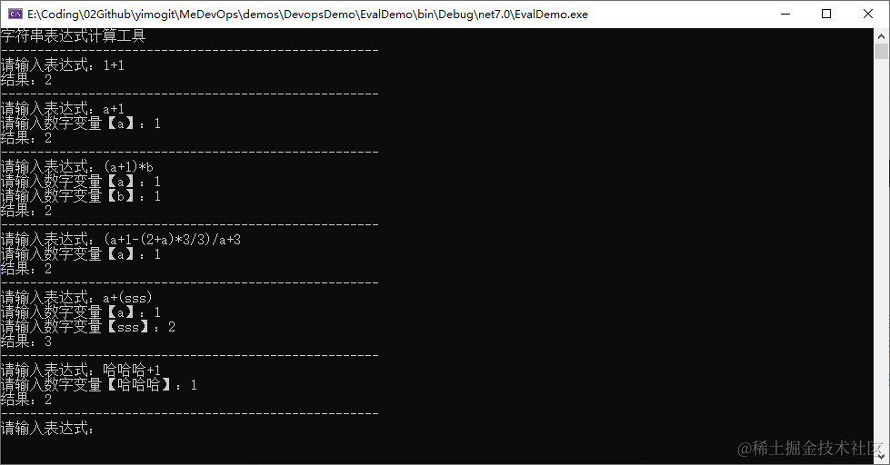
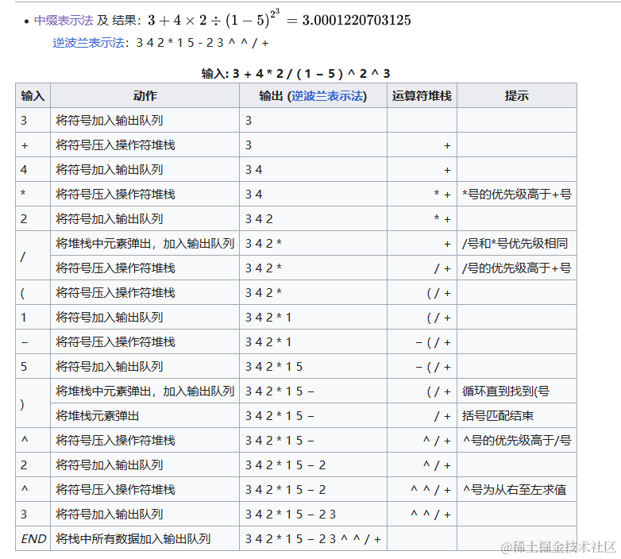

## 前言

> 为满足业务需要，需要为项目中自定义模板添加一个计算字段的组件，通过设置字符串表达式，使用时在改变表达式其中一个字段的数据时，自动计算另外一个字段的值。
>
> 本篇为上篇，介绍原理，简单实现一个工具，输入**字符串表达式**，解析其中的参数，输入参数**计算结果。**
>
> 下篇将基于此封装实现对Mongo查询语法的封装，通过addFields的方式转换表达式，后续等封装成NuGet包再分享

实现如下所示

```
输入 1+1  输出 2
输入 a+1 参数a:1 输出 2
输入 (a+1)*b 输入a:1,b:1 输出 2
输入 (a+1-(2+a)*3/3)/a+3 输入a:1 输出 2
```



## 实现思路

想要实现上面这个功能，需要先了解诸如 `(a+1-(2+a)*3/3)/a+3` 这个是什么？

> 维基百科：**[中缀表示法](https://zh.wikipedia.org/wiki/%E4%B8%AD%E7%BC%80%E8%A1%A8%E7%A4%BA%E6%B3%95)**（或**中缀记法**）是一个通用的算术或逻辑公式表示方法， 操作符是以中缀形式处于操作数的中间（例：3 + 4）。与前缀表达式（例：+ 3 4 ）或后缀表达式（例：3 4 + ）相比，中缀表达式不容易被电脑解析逻辑优先顺序，但仍被许多程序语言使用，因为它符合大多数自然语言的写法。
>
> 前缀表示法 （+ 3 4 ）也叫 波兰表示法
>
> 后缀表示法 （3 4 + ）也叫 逆波兰表示法

在维基百科的说明中，也给出了和其相关的另外两种表示法，以及用于把中缀表达式转换到后缀表达式或树的算法：[调度场算法](https://zh.wikipedia.org/wiki/%E8%B0%83%E5%BA%A6%E5%9C%BA%E7%AE%97%E6%B3%95) ，如下图所示



## 实现代码

找了很多的开源项目，最终基于 [qinfengzhu/Evaluator](https://github.com/qinfengzhu/Evaluator) ，实现了上述功能。

### 调用代码

```
using Evaluator;
using System.Text.RegularExpressions;

Console.WriteLine("字符串表达式计算工具");
EvalTest();

void EvalTest()
{
    Console.WriteLine("----------------------------------------------------");
    var parse = new EvalParser();
    Console.Write("请输入表达式：");//a+b*3/5+a
    var evalStr = Console.ReadLine();
    if (string.IsNullOrEmpty(evalStr))
    {
        Console.WriteLine("Game Over");
        return;
    }
    //解析其中的变量并让用户输入
    var matchs = Regex.Matches(evalStr, @"\b[\w$]+\b");
    var paramsDic = new Dictionary<string, object>();
    //预定义参数
    paramsDic.Add("now_year", DateTime.Now.Year);
    paramsDic.Add("now_month", DateTime.Now.Month);
    paramsDic.Add("now_day", DateTime.Now.Day);
    foreach (Match match in matchs)
    {
        if (decimal.TryParse(match.Value, out decimal kp))
            continue;
        if (!paramsDic.ContainsKey(match.Value))
        {
            Console.Write($"请输入数字变量【{match.Value}】：");
            var paramValue = Console.ReadLine();
            decimal dvalue;
            while (!decimal.TryParse(paramValue, out dvalue))
            {
                Console.WriteLine($"输入有误，请输入数字变量【{match.Value}】：");
                paramValue = Console.ReadLine();
            }
            paramsDic.Add(match.Value, dvalue);
        }
    }
    var result = parse.EvalNumber(evalStr, paramsDic);
    Console.WriteLine($"结果：{result}");
    EvalTest();
}
```

  


### EvalParser 类的实现

通过上面调用代码可以看到，核心的计算类是 EvalParser ，调用其 EvalNumber 进行计算

### EvalNumber 实现

-   EvalNumber 方法,主要分为3步

    -   第一步将表达式解析转换到队列中，即将 中缀表达式，转换成后缀表达式
    -   第二步将队列中的表达式加入表达式栈中
    -   第三步使用表达式树进行计算

-   返回值处理

    -   已知的错误有除以0和溢出的异常，所以直接捕获返回null，也可以在计算除数的时候判断值为0就直接返回null，
    -   精度处理

-   EvalNumber 计算核心代码

    -   ```
        /// <summary>
        /// 计算表达式的计算结果
        /// </summary>
        /// <param name="expression">表达式</param>
        /// <param name="dynamicObject">动态对象</param>
        /// <param name="precision">精度 默认2</param>
        /// <returns>计算的结果</returns>
        public decimal? EvalNumber(string expression, Dictionary<string, object> dynamicObject, int precision = 2)
        {
            var values = dynamicObject ?? new Dictionary<string, object>();
            //中缀表达式，转换成后缀表达式并入列
            var queue = ParserInfixExpression(expression, values);
            var cacheStack = new Stack<Expression>();
            while (queue.Count > 0)
            {
                var item = queue.Dequeue();
                if (item.ItemType == EItemType.Value && item.IsConstant)
                {
                    var itemExpression = Expression.Constant(item.Value);
                    cacheStack.Push(itemExpression);
                    continue;
                }
                if (item.ItemType == EItemType.Value && !item.IsConstant)
                {
                    var propertyName = item.Content.Trim();
                    //将参数替换回来
                    propertyName = PreReplaceTextToOprator(propertyName, values);
                    //参数为空的情况
                    if (!values.ContainsKey(propertyName) || values[propertyName] == null || !decimal.TryParse(values[propertyName].ToString(), out decimal propertyValue))
                        return null;
                    //var propertyValue = decimal.Parse(values[propertyName].ToString());
                    var itemExpression = Expression.Constant(propertyValue);
                    cacheStack.Push(itemExpression);
                }
                if (item.ItemType == EItemType.Operator)
                {
                    if (cacheStack.Count <= 1)
                        continue;
                    Expression firstParamterExpression = Expression.Empty();
                    Expression secondParamterExpression = Expression.Empty();
                    switch (item.Content[0])
                    {
                        case EvalParser.AddOprator:
                            firstParamterExpression = cacheStack.Pop();
                            secondParamterExpression = cacheStack.Pop();
                            var addExpression = Expression.Add(secondParamterExpression, firstParamterExpression);
                            cacheStack.Push(addExpression);
                            break;
                        case EvalParser.DivOperator:
                            firstParamterExpression = cacheStack.Pop();
                            secondParamterExpression = cacheStack.Pop();
                            var divExpression = Expression.Divide(secondParamterExpression, firstParamterExpression);
                            cacheStack.Push(divExpression);
                            break;
                        case EvalParser.MulOperator:
                            firstParamterExpression = cacheStack.Pop();
                            secondParamterExpression = cacheStack.Pop();
                            var mulExpression = Expression.Multiply(secondParamterExpression, firstParamterExpression);
                            cacheStack.Push(mulExpression);
                            break;
                        case EvalParser.SubOperator:
                            firstParamterExpression = cacheStack.Pop();
                            secondParamterExpression = cacheStack.Pop();
                            var subExpression = Expression.Subtract(secondParamterExpression, firstParamterExpression);
                            cacheStack.Push(subExpression);
                            break;
                        case EvalParser.LBraceOperator:
                        case EvalParser.RBraceOperator:
                            continue;
                        default:
                            throw new Exception("计算公式错误");
                    }
                }
            }
            if (cacheStack.Count == 0)
                return null;
            var lambdaExpression = Expression.Lambda<Func<decimal>>(cacheStack.Pop());
            try
            {
                // 除0 溢出
                var value = lambdaExpression.Compile()();
                return Math.Round(value, precision);
            }
            catch (Exception ex)
            {
                //System.OverflowException
                //System.DivideByZeroException
                if (ex is DivideByZeroException
                    || ex is OverflowException)
                    return null;
                throw ex;
            }
        }
        ```

### ParserInfixExpression 实现

-   在EvalNumber 方法的第一步调用了 ParserInfixExpression 方法来进行表达式的预处理

    -   PreReplaceOpratorToText 如果变量中带有一些计算符号(+-*/())，通过这个方法转换临时变量，在获取值的时候再转换回来

        -   ```

            /// <summary>
            /// 符号转换字典
            /// </summary>
            private static Dictionary<char, string> OperatorToTextDic = new Dictionary<char, string>()
            {
                { '+', "_JIA_" },
                { '-', "_JIAN_" },
                { '/', "_CHENG_" },
                { '*', "_CHU_" },
                { '(', "_ZKH_" },
                { ')', "_YKH_" }
            };
            /// <summary>
            /// 预处理参数符号转文本
            /// </summary>
            /// <param name="expression"></param>
            /// <param name="dynamicObject"></param>
            /// <returns></returns>
            public string PreReplaceOpratorToText(string expression, Dictionary<string, object> dynamicObject)
            {
                //如果是参数里面包含了括号,将其中的参数替换成特殊字符
                var existOperatorKeys = dynamicObject.Keys.Where(s => OperatorToTextDic.Keys.Any(s2 => s.Contains(s2))).ToList();
                //存在特殊字符变量的
                if (existOperatorKeys.Any())
                {
                    //将符号替换成字母
                    foreach (var s in existOperatorKeys)
                    {
                        var newKey = s;
                        foreach (var s2 in OperatorToTextDic)
                        {
                            newKey = newKey.Replace(s2.Key.ToString(), s2.Value);
                        }
                        expression = expression.Replace(s, newKey);
                    }
                }
                return expression;
            }
            ```

    -   PreParserInfixExpression 计算嵌套(),以及先行计算纯数字，主要是在后面转换为mongo语法的时候用到，让纯数字计算在内存中运行而不是数据库中计算

        -   ```
            /// <summary>
            /// 预处理计算表达式
            /// </summary>
            /// <param name="expression">表达式</param>
            /// <param name="dynamicObject">参数</param>
            /// <param name="isCompile">是否是编译</param>
            /// <returns></returns>
            public string PreParserInfixExpression(string expression, Dictionary<string, object> dynamicObject, bool isCompile = false)
            {
                expression = expression.Trim();
                string pattern = @"((.*?))";
                Match match = Regex.Match(expression, pattern);
                if (match.Success && match.Groups.Count > 1)
                {
                    var constText = match.Groups[0].Value;
                    var constValue = match.Groups[1].Value;
                    string numPattern = @"(([\s|0-9|+-*/|.]+))";
                    //纯数字计算 或者 不是编译预约
                    if (Regex.IsMatch(constText, numPattern) || !isCompile)
                    {
                        var evalValue = EvalNumber(constValue, dynamicObject);
                        if (evalValue == null)
                            return string.Empty;
                        var replaceText = evalValue.ToString();
                        expression = expression.Replace(constText, replaceText);
                    }
                    else if (isCompile)
                    {
                        //编译计算
                        var completeText = Compile(constValue, dynamicObject).ToString();
                        //临时参数Key
                        var tempPramKey = "temp_" + Guid.NewGuid().ToString("n");
                        dynamicObject.Add(tempPramKey, completeText);
                        expression = expression.Replace(constText, tempPramKey);
                    }
                    else
                    {
                        return expression;
                    }
                    return PreParserInfixExpression(expression, dynamicObject, isCompile);
                }
                return expression;
            }
            ```

-   ParserInfixExpression 表达式转换核心代码

    -   ```
        /// <summary>
        /// 转换表达式
        /// </summary>
        /// <param name="expression"></param>
        /// <param name="dynamicObject"></param>
        /// <param name="isComplete"></param>
        /// <returns></returns>
        public Queue<EvalItem> ParserInfixExpression(string expression, Dictionary<string, object> dynamicObject, bool isComplete = false)
        {
            var queue = new Queue<EvalItem>();
            if (string.IsNullOrEmpty(expression))
                return queue;
            expression = PreReplaceOpratorToText(expression, dynamicObject);
            expression = PreParserInfixExpression(expression, dynamicObject, isComplete);
            if (string.IsNullOrEmpty(expression))
                return queue;
            var operatorStack = new Stack<OperatorChar>();

            int index = 0;
            int itemLength = 0;
            //当第一个字符为+或者-的时候
            char firstChar = expression[0];
            if (firstChar == AddOprator || firstChar == SubOperator)
            {
                expression = string.Concat("0", expression);
            }
            int expressionLength = expression.Length;
            using (var scanner = new StringReader(expression))
            {
                string operatorPreItem = string.Empty;
                while (scanner.Peek() > -1)
                {
                    char currentChar = (char)scanner.Read();
                    switch (currentChar)
                    {
                        case AddOprator:
                        case SubOperator:
                        case DivOperator:
                        case MulOperator:
                        case LBraceOperator:
                        case RBraceOperator:
                            //直接把数字压入到队列中
                            operatorPreItem = expression.Substring(index, itemLength);
                            if (operatorPreItem != "")
                            {
                                var numberItem = new EvalItem(EItemType.Value, operatorPreItem);
                                queue.Enqueue(numberItem);
                            }
                            index = index + itemLength + 1;
                            itemLength = -1;
                            //当前操作符
                            var currentOperChar = new OperatorChar() { Operator = currentChar };
                            if (operatorStack.Count == 0)
                            {
                                operatorStack.Push(currentOperChar);
                                break;
                            }
                            //处理当前操作符与操作字符栈进出
                            var topOperator = operatorStack.Peek();
                            //若当前操作符为(或者栈顶元素为(则直接入栈
                            if (currentOperChar == LBraceOperatorChar || topOperator == LBraceOperatorChar)
                            {
                                operatorStack.Push(currentOperChar);
                                break;
                            }
                            //若当前操作符为),则栈顶元素顺序输出到队列,至到栈顶元素(输出为止,单(不进入队列,它自己也不进入队列
                            if (currentOperChar == RBraceOperatorChar)
                            {
                                while (operatorStack.Count > 0)
                                {
                                    if (operatorStack.Peek() != LBraceOperatorChar)
                                    {
                                        var operatorItem = new EvalItem(EItemType.Operator, operatorStack.Pop().GetContent());
                                        queue.Enqueue(operatorItem);
                                    }
                                    else
                                    {
                                        break;
                                    }
                                }
                                if (operatorStack.Count > 0 && operatorStack.Peek() == RBraceOperatorChar)
                                {
                                    operatorStack.Pop();
                                }
                                break;
                            }
                            //若栈顶元素优先级高于当前元素，则栈顶元素输出到队列,当前元素入栈
                            if (topOperator.Level > currentOperChar.Level || topOperator.Level == currentOperChar.Level)
                            {
                                var topActualOperator = operatorStack.Pop();
                                var operatorItem = new EvalItem(EItemType.Operator, topActualOperator.GetContent());
                                queue.Enqueue(operatorItem);

                                while (operatorStack.Count > 0)
                                {
                                    var tempTop = operatorStack.Peek();
                                    if (tempTop.Level > currentOperChar.Level || tempTop.Level == currentOperChar.Level)
                                    {
                                        var topTemp = operatorStack.Pop();
                                        var operatorTempItem = new EvalItem(EItemType.Operator, topTemp.GetContent());
                                        queue.Enqueue(operatorTempItem);
                                    }
                                    else
                                    {
                                        break;
                                    }
                                }
                                operatorStack.Push(currentOperChar);
                            }
                            //当当前元素小于栈顶元素的时候，当前元素直接入栈
                            else
                            {
                                operatorStack.Push(currentOperChar);
                            }
                            break;
                        default:
                            break;
                    }
                    itemLength++;
                }
            }
            //剩余无符号的字符串
            if (index < expressionLength)
            {
                string lastNumber = expression.Substring(index, expressionLength - index);
                var lastNumberItem = new EvalItem(EItemType.Value, lastNumber);
                queue.Enqueue(lastNumberItem);
            }
            //弹出栈中所有操作符号
            if (operatorStack.Count > 0)
            {
                while (operatorStack.Count != 0)
                {
                    var topOperator = operatorStack.Pop();
                    var operatorItem = new EvalItem(EItemType.Operator, topOperator.GetContent());
                    queue.Enqueue(operatorItem);
                }
            }
            return queue;
        }
        ```

### EvalDate 实现指定日期类型输出

因项目需要，需要将当前日期，当前时间加入默认变量，并支持加入计算公式中，计算的结果也可以选择是日期或者数值。

需要实现这个功能，需要先定义好，时间如何计算，我们将日期时间转换成时间戳来进行转换后参与计算，计算完成后再转换成日期即可。

所以只需要在上面的数值计算包裹一层就可以得到日期的计算结果

-   EvalDate 核心代码

    -   ```
        /// <summary>
        /// 计算表达式的日期结果
        /// </summary>
        /// <param name="expression">表达式</param>
        /// <param name="dynamicObject">动态对象</param>
        /// <returns>计算的结果</returns>
        public DateTime? EvalDate(string expression, Dictionary<string, object> dynamicObject)
        {
            var dateNumValue = EvalNumber(expression, dynamicObject);
            if (dateNumValue == null)
                return null;
            if (long.TryParse(dateNumValue.ToString(), out long dateNum))
            {
                return JsTimeToDateTime(dateNum);
            }
            return null;
        }

        /// <summary>
        /// 毫秒级时间戳转成 DateTime
        /// </summary>
        /// <param name="unixTimestamp"></param>
        /// <returns></returns>
        private DateTime JsTimeToDateTime(long unixTimestamp)
        {
            return DateTimeOffset.FromUnixTimeMilliseconds(unixTimestamp).LocalDateTime;
        }
        ```

### 代码中的数据定义

其他数据定义 OperatorChar EvalItem EItemType CharExtension 可以查看[完整demo](https://github.com/yimogit/MeDevOps/blob/main/demos/DevopsDemo/EvalDemo)

## 相关说明

-   相关算法：中缀表达式，后缀表达式，逆波兰算法，调度场算法
-   相关语言：C#
-   参考项目：[qinfengzhu/Evaluator](https://github.com/qinfengzhu/Evaluator)
-   本文Demo: [DevopsDemo/EvalDemo](https://github.com/yimogit/MeDevOps/tree/main/demos/DevopsDemo/EvalDemo)

## 后语

>
> 期间找了很多开源项目参考，需求的独特性，最终是实现了功能
> 
> 整个计算字段的实现花了3周时间，终于是顺利上线。
>
> 沉迷学习，无法自拔。
