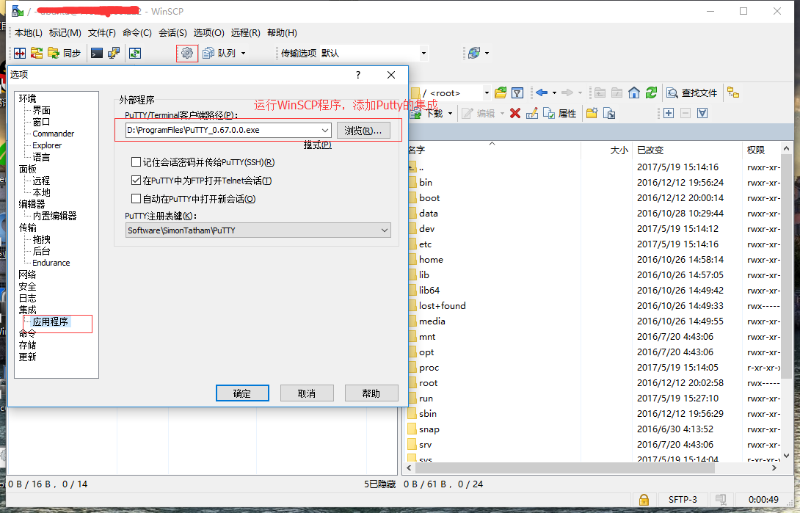
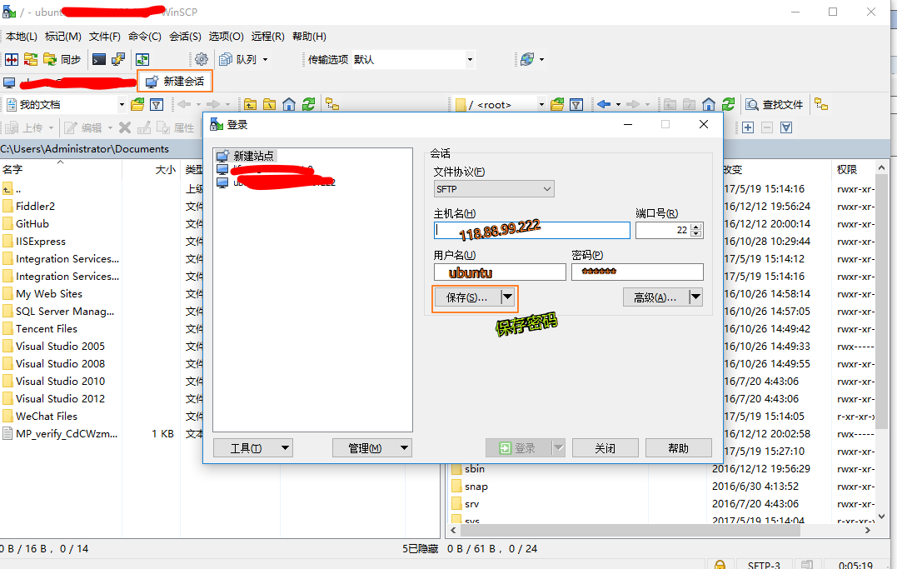
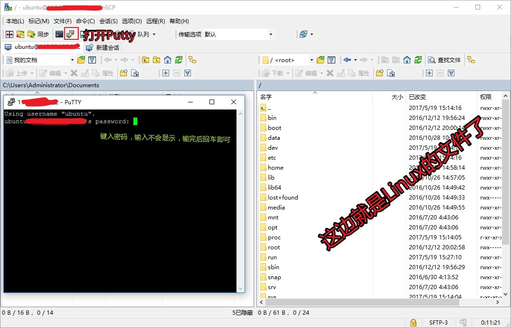
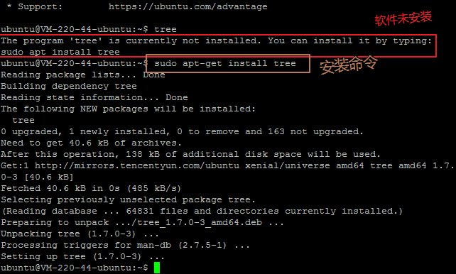
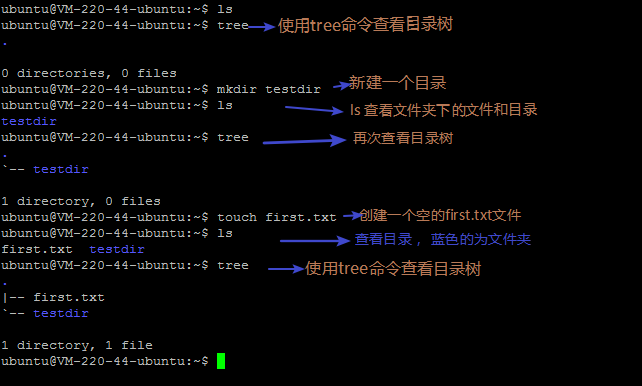

## 假如我有一个Linux系统


    安装过程：加载中...

    版本：Ubuntu Server 16.04.1 LTS 64位

    得到一个IP：*.*.*.*


## 下载工具   


> [WinSCP](http://baike.baidu.com/item/winscp): WinSCP是一个Windows环境下使用SSH的开源图形化SFTP客户端      

> [PuTTY](http://baike.baidu.com/item/putty): PuTTY是一个Telnet、SSH、rlogin、纯TCP以及串行接口连接软件     

> [网盘下载](http://pan.baidu.com/s/1qXMTI0W)   


## 设置winscp集成终端Putty    


   


## 新建会话   





## 连接Putty





若出现 服务器拒绝了SETP连接，但它监听FTP链接。。。没有安装sshd

解决方案

1. `sudo apt-get install yum` 安装 ，中间有输入：Y


2. `sudo apt-get install openssh-server`，中间有输入：Y


3. `sudo ps -e |grep ssh` 回车可以看到sshd


参考：http://blog.csdn.net/shenwb110/article/details/70228984


## 安装一个软件然后学习一堆命令


> ubuntu安装软件可参考：http://www.cnblogs.com/xwdreamer/p/3623454.html

   1. 安装一个tree来查看目录树     

    `sudo apt-get install tree`：意作以管理员身份使用apt-get安装tree程序

    

   2. 命令示例   

   


## 文件操作的一些命令


> 更多总结：http://www.cnblogs.com/chenhaoyu/p/6668571.html


``` sh


      ls    显示文件或目录

         -l 列出文件详细信息l(list)

         -a 列出当前目录下所有文件及目录，包括隐藏文件

    touch   创建空文件

              创建示例：touch hello.txt

     echo   写入字符到文件  

              打印示例：echo 'hello world'

              写入示例: echo "hello">hello.txt

              追加示例: echo "hello233">>hello.txt

              `echo -n`:去除换行符(no enter)

              更多技巧：http://blog.csdn.net/xukai871105/article/details/35834703


      cat   查看文件内容

              查看示例：cat hello.txt

       wc   统计文本中行数，字数，字符数

       cp   复制文件

              复制示例：cp hello.txt hello2.txt

       mv   移动或重命名

              移动示例：mv hello2.txt hello3.txt #移动到同一个目录==重命名

       rm   删除文件

         -r 递归删除

         -f 强制删除

              删除文件示例：rm hello3.txt

              删除目录示例：rm ./testdir -r

              


    mkdir   创建目录

         -p 创建上层目录，如目录早已存在则不当作错误

              创建示例： mkdir testdir/a   #testdir存在

              创建示例2： mkdir testdir2/test/ -p  #testdir2不存在

              

       cd   切换目录


    rmdir   删除空目录

              删除示例：rmdir testdir #非空目录使用rm testdir -r

      pwd   显示当前目录


     find   在文件系统中搜索某文件

              查找示例：find testdir *.txt #查找testdir下所有txt文件

              更多技巧：http://www.cnblogs.com/wanqieddy/archive/2011/06/09/2076785.html

     grep   在文本文件中查找字符串

              查找示例：grep 'he' ./hello.txt

              更多技巧：http://www.cnblogs.com/end/archive/2012/02/21/2360965.html

              

     tree  安装后使用tree命令以树节点查看目录文件

     nano  一个文本编辑器

             使用示例：nano  hello.txt 编辑完成Ctrl+X，y，回车~~

     

```

##  apt-get和dpkg的一些命令 


> 更多详情见：http://www.cnblogs.com/forward/archive/2012/01/10/2318483.html    


``` sh   


    apt-cache search # ------(package 搜索包)

    apt-cache show #------(package 获取包的相关信息，如说明、大小、版本等)

    apt-get install # ------(package 安装包)

    apt-get install # -----(package --reinstall 重新安装包)

    apt-get -f install # -----(强制安装, "-f = --fix-missing"当是修复安装吧...)

    apt-get remove #-----(package 删除包)

    apt-get remove --purge # ------(package 删除包，包括删除配置文件等)

    apt-get autoremove --purge # ----(package 删除包及其依赖的软件包+配置文件等（只对6.10有效，强烈推荐）)

    apt-get update #------更新源

    apt-get upgrade #------更新已安装的包

    apt-get dist-upgrade # ---------升级系统

    apt-get dselect-upgrade #------使用 dselect 升级

    apt-cache depends #-------(package 了解使用依赖)

    apt-cache rdepends # ------(package 了解某个具体的依赖,当是查看该包被哪些包依赖吧...)

    apt-get build-dep # ------(package 安装相关的编译环境)

    apt-get source #------(package 下载该包的源代码)

    apt-get clean && apt-get autoclean # --------清理下载文件的存档 && 只清理过时的包

    apt-get check #-------检查是否有损坏的依赖

    dpkg -S filename -----查找filename属于哪个软件包

    apt-file search filename -----查找filename属于哪个软件包

    apt-file list packagename -----列出软件包的内容

    apt-file update --更新apt-file的数据库


    dpkg --info "软件包名" --列出软件包解包后的包名称.

    dpkg -l --列出当前系统中所有的包.可以和参数less一起使用在分屏查看. (类似于rpm -qa)

    dpkg -l |grep -i "软件包名" --查看系统中与"软件包名"相关联的包.

    dpkg -s 查询已安装的包的详细信息.

    dpkg -L 查询系统中已安装的软件包所安装的位置. (类似于rpm -ql)

    dpkg -S 查询系统中某个文件属于哪个软件包. (类似于rpm -qf)

    dpkg -I 查询deb包的详细信息,在一个软件包下载到本地之后看看用不用安装(看一下呗).

    dpkg -i 手动安装软件包(这个命令并不能解决软件包之前的依赖性问题),如果在安装某一个软件包的时候遇到了软件依赖的问题,可以用apt-get -f install在解决信赖性这个问题.

    dpkg -r 卸载软件包.不是完全的卸载,它的配置文件还存在.

    dpkg -P 全部卸载(但是还是不能解决软件包的依赖性的问题)

    dpkg -reconfigure 重新配置


```


## 搭建一个nodejs环境


  1. `wget -qO- https://raw.githubusercontent.com/creationix/nvm/v0.31.1/install.sh | bash`

  2. `source ~/.bashrc`

  3. `nvm install stable` #安装最新稳定版          

  4. `nano hello.js` 新建一个文件;注：nano,vi都是Linux自带的文本编辑器，我选择了nano，不要问我为什么~    

  输入完成后 `Ctrl+x`保存，输入`y`,然后回车就可退出，若想查看hello.js: `cat hello.js` 


``` js 

        //粘贴下面的代码到编辑器（复制后单右键）

        var http = require('http');

        http.createServer(function (req, res) {

          res.writeHead(200, {'Content-Type': 'text/plain'});

          res.end('Hello World233\n');

        }).listen(2323, '0.0.0.0');//这里需要监听0.0.0.0,使其能在外网访问到

        console.log('服务启动：http://ip:2323/');  

``` 


  4. 现在就可以在本地访问`http://服务器ip:2323/`看到输出了


## 激活root用户


>root用户是系统中唯一的超级管理员，它具有等同于操作系统的权限

  0. 第一次激活需要设置root用户的密码，如果出现`su: Authentication failure`就需要重置密码

  1. 设置root密码：`sudo passwd`  

    Password:就输入你当前的用户密码    

    Enter new UNIX password：root的新密码    

    Retype new UNIX password：重复设置的新密码   


  2. 切换用户   

    切换到root用户：`su root`     

    切换到ubuntu:`su ubuntu`   


 3. 运行远程连接

    编辑  `vim /etc/ssh/sshd_config`

    修改 `#PermitRootLogin prohibit-password` 为 `PermitRootLogin yes`

    重启ssh服务：`service ssh restart`


## 获取md5值


获取字符串md5(-n表示no Enter)

` echo -n 'hello'|md5sum|cut -d ' ' -f1`


获取文件md5

`md5sum *.txt|cut -d ' ' -f1`


获取文件md5值并写入txt文本


`(md5sum **/*.txt|cut -d ' ' -f1) | tee jjfa.txt`


## 对比文件


`diff ./jjfa.txt ./jjfa-new.txt`


对比并执行

```

(diff ./jjfa.txt ./jjfa-new.txt) 2> /dev/null && [ $? -eq 0 ] && echo "完全相同，跳过执行命令" || echo '文件不同执行'

```


最后，园子虐我千万遍，我待园子如初恋~
