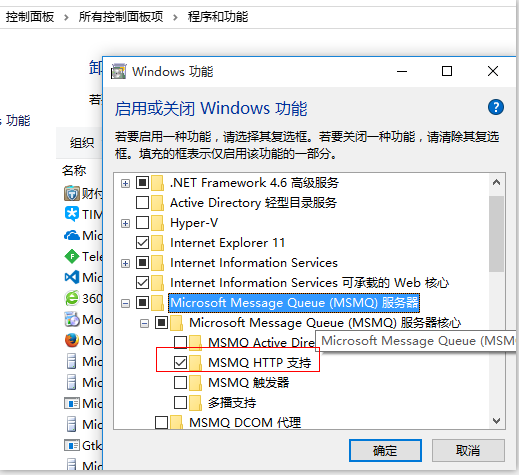
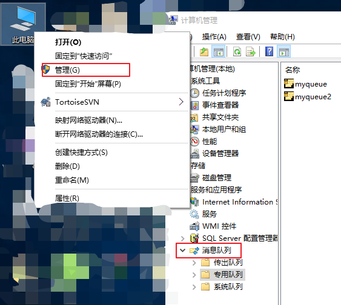

# 微软消息队列-MicroSoft Message Queue(MSMQ)

>使用感受：简单。

## 一、windows安装MSMQ服务     

控制面板->控制面板->所有控制面板项->程序和功能->选中安装      

   

然后可在计算机管理-->服务和应用程序->消息队列查看队列信息   

    

## 二、C#中使用MSMQ  

使用MessageQueue类操作MSMQ，其在System.Messaging命名空间下，需要添加引用

### 定义的接口   

    public interface IMessageSender<T> : IDisposable

    {

        /// 

        ///     发送消息

        /// 

        /// <param name="message">消息对象</param>

        void SendMessage(T message);

        void SendMessages(List<T> message);

        /// 

        ///     发送消息

        /// 

        /// <param name="message">消息对象</param>

        /// <param name="label">消息标签</param>

        void SendMessage(T message, string label);

    }

### 接口实现        

    /// 

    ///     消息队列对象，由MQueueFactory创建指定路径的队列对象，可发送或批量接收消息。

    /// 

    /// <typeparam name="T">消息队列存储的消息对象类型</typeparam>

    public sealed class MQueue<T> : IDisposable, IMessageSender<T>, IMessageReceiver<T>

    {

        public MQueue(MessageQueue mq, string user = "Everyone")

        {

            InnerQueue = mq;

            InnerQueue.Formatter = new XmlMessageFormatter(new[] { typeof(T) });

            InnerQueue.SetPermissions(user ?? "Everyone",

                MessageQueueAccessRights.GenericRead | MessageQueueAccessRights.DeleteMessage |

                MessageQueueAccessRights.DeleteQueue | MessageQueueAccessRights.DeleteJournalMessage);

        }

        #region IMessageSender

        /// 

        ///     内部消息队列对象

        /// 

        private MessageQueue InnerQueue { get; set; }

        /// 

        ///     发送消息

        /// 

        /// <param name="message">消息对象</param>

        public void SendMessage(T message)

        {

            InnerQueue.Send(message);

        }

        public void SendMessages(List<T> message)

        {

            foreach (var item in message)

            {

                InnerQueue.Send(item);

            }

        }

        /// 

        ///     发送消息

        /// 

        /// <param name="message">消息对象</param>

        /// <param name="label">消息标签</param>

        public void SendMessage(T message, string label)

        {

            try

            {

                InnerQueue.Send(message, label);

            }

            catch (Exception ex)

            {

                var path = InnerQueue.Path;

                InnerQueue = new MessageQueue(path);

            }

        }

        #endregion 

        #region IMessageReceiver

        /// 

        /// 获取队列中所有消息

        /// 

        /// <typeparam name="T">消息类型</typeparam>

        /// <param name="exTarget">异常时触发</param>

        /// <returns></returns>

        public List<T> GetAllMessages<T>(MQExceptionTarget exTarget = null)

        {

            return GetMessagesByNum<T>(null, exTarget);

        }

        /// 

        /// 获取队列中指定数量消息

        /// 

        /// <typeparam name="T">消息类型</typeparam>

        /// <param name="num">一次最多取num条数据，默认取所有数据</param>

        /// <param name="exTarget">异常委托</param>

        /// <returns></returns>

        public List<T> GetMessagesByNum<T>(int? num = null, MQExceptionTarget exTarget = null)

        {

            var list = new List<T>();

            if (num.HasValue && num <= 0)

            {

                return list;

            }

            MessageEnumerator enumerator = InnerQueue.GetMessageEnumerator2();

            while (enumerator.MoveNext())

            {

                Message msg = enumerator.RemoveCurrent();

                enumerator.Reset();

                if (msg != null)

                {

                    try

                    {

                        list.Add((T)msg.Body);

                        if (num.HasValue && list.Count >= num)

                        {

                            break;

                        }

                    }

                    catch (Exception ex)

                    {

                        if (exTarget != null)

                            exTarget(ex);

                    }

                }

            }

            return list;

        }

        #endregion

        public void Dispose()

        {

            if (InnerQueue != null)

            {

                InnerQueue.Dispose();

            }

        }

    }

### 建立队列工厂

    /// 

    ///  消息队列工厂，通过指定路径创建或获取相应队列对象

    /// 

    public class MQueueFactory

    {

        /// 

        ///     默认队列路径，在未指定路径的情况下，将创建并返回该路径的消息队列对象

        /// 

        private const string DefaultPath = @".\private$\myQueue";

        /// 

        ///     创建默认路径的消息队列对象

        /// 

        /// <typeparam name="T">消息队列存储的消息对象类型</typeparam>

        /// <returns></returns>

        public static MQueue<T> Create<T>()

        {

            return Create<T>(DefaultPath);

        }

        /// 

        ///     创建指定路径的消息队列路径

        /// 

        /// <typeparam name="T">消息队列存储的消息对象类型</typeparam>

        /// <param name="connStr">指定的消息队列链接字符串 def:".\private$\myQueue"</param>

        /// <param name="autoCreate">不存在则创建队列 远程地址不能创建</param>

        /// <param name="user">获得队列额外权限的个人、组或计算机</param>

        /// <param name="cacheKey">web中Cache键值</param>

        /// <returns></returns>

        public static MQueue<T> Create<T>(string connStr=@".\private$\myQueue", bool autoCreate = false, string user = "Everyone", string cacheKey = "MQCache")

        {

            string path = connStr ?? DefaultPath;

            HttpContext httpContext = HttpContext.Current;

            if (autoCreate && !MessageQueue.Exists(path))

            {

                MessageQueue.Create(path);

            }

            var mq = new MessageQueue(path);

            if (httpContext != null)

            {

                string key = "MQueue" + typeof(T).Name + cacheKey;

                if ((httpContext.Cache[key] == null))

                {

                    httpContext.Cache[key] = new MQueue<T>(mq);

                }

                return httpContext.Cache[key] as MQueue<T>;

            }

            return new MQueue<T>(mq,user);

        }

    }

### 写入队列        

`MQueueFactory.Create<string>(@".\private$\myQueue", autoCreate: true).SendMessage("我是写入的数据~~~");`

### 获取消息    

`MQueueFactory.Create<string>(@".\private$\myQueue").GetAllMessages<string>();`
