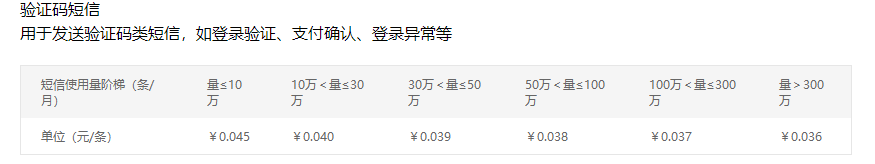
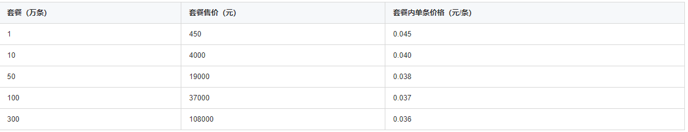
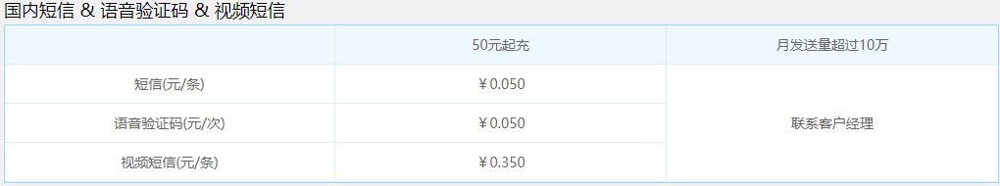
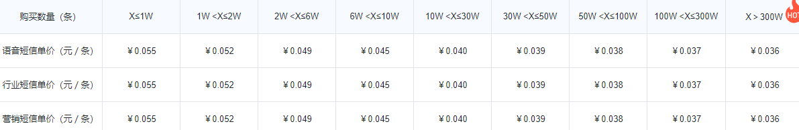
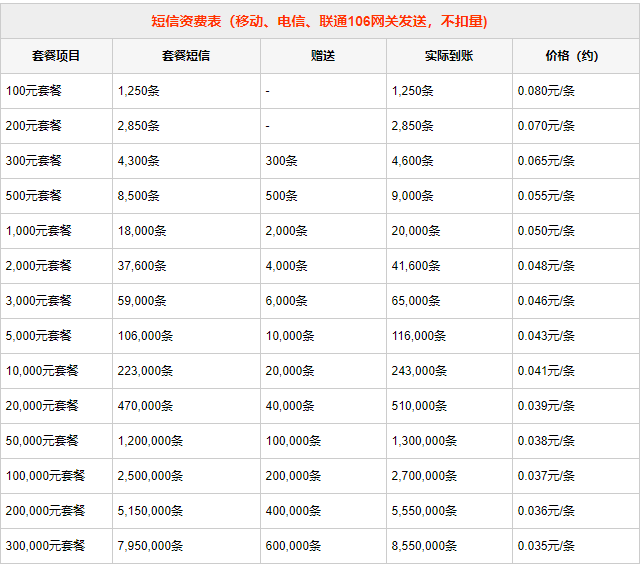

> 此篇作为部分短信服务供应商价格的快速预览与地址导航，可参考其以选择合适的供应商。

> 此信息于 2018/12/13 汇总，欢迎[评论补充](https://www.cnblogs.com/morang/p/10117065.html#lnk_RefreshComments)。

## 阿里云  

### 详细介绍地址  

> https://www.aliyun.com/price/product?spm=5176.8195934.907839.sms7.5c344183EOESSh#/sms/detail

### 价格  

## 腾讯云

### 详细介绍地址

>https://buy.cloud.tencent.com/price/sms

### 价格

## 云片  

### 详细介绍地址  

> https://www.yunpian.com/price.html

### 价格

## 极光短信

### 详细介绍地址

> https://www.jiguang.cn/sms#product-menu-4

### 价格

## SMS短信通

### 详细介绍地址

> http://www.smschinese.cn/Rates.shtml

### 价格

