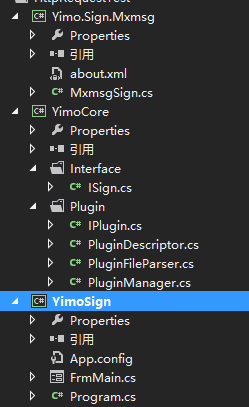
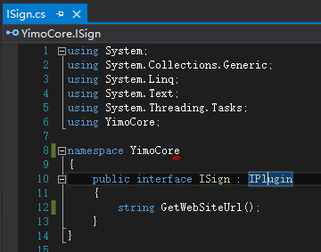
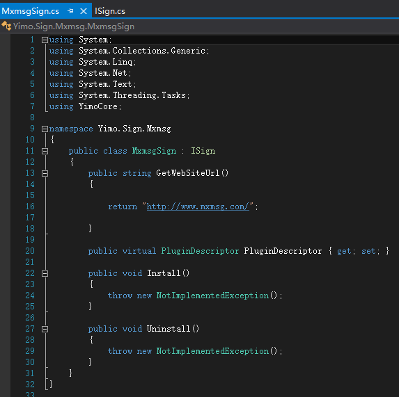
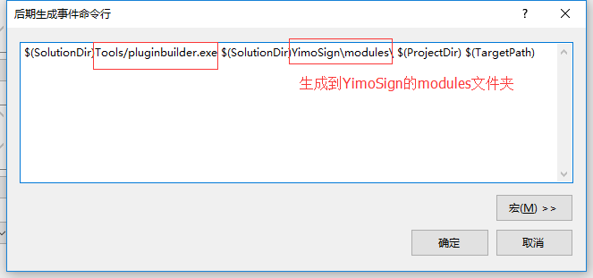
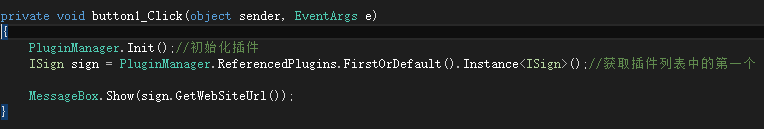
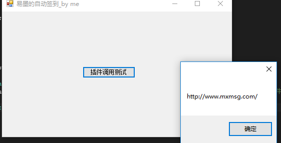

\-\-\-
title: 插件化编程实现的一份糖炒栗子\~\~
date: 2016\-07\-02 17:44:00
category:
 \- Developer
tag:
 \- C\#
 \- winform
\-\-\-

迷茫的原因是因为想得太多，做得太少。因为只是 想 真的很容易，转瞬之间就会产生无数个念头，或许是该做点什么了吧。


但是整个人都是懒的，是废的，是大脑控制不住自己的行为的。解决方案唯有一步一步的去把行为变成习惯。


坚持一件事挺不容易的，不论结果的好坏，过程中总有收获的，坚持，不会是一件坏事。


胡言乱语结束\~\~\~


下面是记录分享的一点东西\~\~请笑纳


# 0\.结构一览


　　


# 1\.定义插件接口


```
using System;

using System.Collections.Generic;

using System.Linq;

using System.Text;


namespace YimoCore

{

    public interface IPlugin

    {

        /// <summary>

        /// Gets or sets the plugin descriptor

        /// </summary>

        PluginDescriptor PluginDescriptor { get; set; }


        /// <summary>

        /// Install plugin

        /// </summary>

        void Install();


        /// <summary>

        /// Uninstall plugin

        /// </summary>

        void Uninstall();

    }

}
```


定义插件
# 2\.添加插件信息类


```
using System;

using System.Collections.Generic;

using System.IO;

using System.Linq;

using System.Reflection;

using System.Text;

using System.Threading.Tasks;


namespace YimoCore

{

    /// <summary>

    /// 插件信息

    /// </summary>

    public sealed class PluginDescriptor

    {

        /// <summary>

        /// 插件主目录

        /// </summary>

        public string PluginFileName { get; set; }

        /// <summary>

        /// 插件类型

        /// </summary>

        public Type PluginType { get; set; }


        /// <summary>

        /// 插件主程序集

        /// </summary>

        public Assembly ReferencedAssembly { get; internal set; }


        /// <summary>

        /// 原始程序集文件

        /// </summary>

        public FileInfo OriginalAssemblyFile { get; internal set; }

        /// <summary>

        /// 插件包目录

        /// </summary>

        public FileInfo PluginConfigFile { get; internal set; }

        /// <summary>

        /// 类别

        /// </summary>

        public string Group { get; set; }

        /// <summary>

        /// 插件名称

        /// </summary>

        public string FriendlyName { get; set; }

        /// <summary>

        /// 程序集名称

        /// </summary>

        public string SystemName { get; set; }

        /// <summary>

        /// 描述

        /// </summary>

        public string Description { get; set; }

        /// <summary>

        /// 版本号

        /// </summary>

        public string Version { get; set; }

        /// <summary>

        /// 支持版本

        /// </summary>

        public IList<string> SupportedVersions { get; set; }

        /// <summary>

        /// 作者

        /// </summary>

        public string Author { get; set; }

        /// <summary>

        /// 排序

        /// </summary>

        public int DisplayOrder { get; set; }

        /// <summary>

        /// 获取插件实例

        /// </summary>

        /// <typeparam name="T"></typeparam>

        /// <returns></returns>

        public T Instance<T>() where T : class, IPlugin

        {

            var instance = Activator.CreateInstance(PluginType) as T;

            if (instance != null)

                instance.PluginDescriptor = this;


            return instance;

        }


        public IPlugin Instance()

        {

            return Instance<IPlugin>();

        }


        public int CompareTo(PluginDescriptor other)

        {

            if (DisplayOrder != other.DisplayOrder)

                return DisplayOrder.CompareTo(other.DisplayOrder);

            else

                return System.String.Compare(FriendlyName, other.FriendlyName, System.StringComparison.Ordinal);

        }


        public override string ToString()

        {

            return FriendlyName;

        }


        public override bool Equals(object obj)

        {

            var other = obj as PluginDescriptor;

            return other != null &&

                SystemName != null &&

                SystemName.Equals(other.SystemName);

        }


        public override int GetHashCode()

        {

            return SystemName.GetHashCode();

        }

    }

}
```


插件信息类
# 3\.插件读取


```
using System;

using System.Collections.Generic;

using System.IO;

using System.Linq;

using System.Reflection;

using System.Text;

using System.Threading.Tasks;

using System.Web;


namespace YimoCore

{

    public class PluginManager

    {

        private const string PluginsPath = "/modules"; //插件目录

        private const string ShadowCopyPath = "/modules/bin"; //插件影子目录


        public static IEnumerable<PluginDescriptor> ReferencedPlugins { get; set; }


        public static void Init()

        {

            var appdir = AppDomain.CurrentDomain.BaseDirectory.Substring(0, AppDomain.CurrentDomain.BaseDirectory.LastIndexOf("\\"));

            appdir = appdir.Substring(0, appdir.LastIndexOf("\\"));

            appdir = appdir.Substring(0, appdir.LastIndexOf("\\"));

            //插件目录

            var pluginFolder = new DirectoryInfo(appdir + PluginsPath);

            //插件bin目录

            var shadowFolder = new DirectoryInfo(appdir + ShadowCopyPath);

            var referencedPlugins = new List<PluginDescriptor>();

            try

            {

                pluginFolder.Create();

                shadowFolder.Create();

                //清空bin目录

                foreach (var fileInfo in shadowFolder.GetFiles())

                {

                    fileInfo.Delete();

                }

                var pluginConfigFiles = pluginFolder.GetFiles("about.xml", SearchOption.AllDirectories);

                foreach (var pluginConfigFile in pluginConfigFiles)

                {

                    //获取插件信息

                    var pluginDescriptor = PluginFileParser.ParsePluginDescriptionFile(pluginConfigFile.FullName);

                    try

                    {

                        if (pluginConfigFile.Directory == null)

                            continue;

                        //获取插件所有的dll

                        var pluginFiles = pluginConfigFile.Directory.GetFiles("*.dll", SearchOption.AllDirectories);

                        var mainPluginFile = pluginFiles.FirstOrDefault(

                            item =>

                            item.Name.Equals(pluginDescriptor.PluginFileName,

                            StringComparison.InvariantCultureIgnoreCase));

                        pluginDescriptor.PluginConfigFile = pluginConfigFile;

                        pluginDescriptor.OriginalAssemblyFile = mainPluginFile;

                        pluginDescriptor.ReferencedAssembly = DeployDllFile(mainPluginFile, shadowFolder);

                        foreach (var t in pluginDescriptor.ReferencedAssembly.GetTypes())

                        {

                            if (typeof(IPlugin).IsAssignableFrom(t))

                            {

                                if (t.IsInterface == false && t.IsClass && !t.IsAbstract)

                                {

                                    pluginDescriptor.PluginType = t;

                                    break;

                                }

                            }

                        }


                        referencedPlugins.Add(pluginDescriptor);


                    }

                    catch (ReflectionTypeLoadException ex)

                    {


                        throw;

                    }


                }


            }

            catch (ReflectionTypeLoadException ex)

            {

            }


            ReferencedPlugins = referencedPlugins;


        }


        /// <summary>

        /// 部署程序集

        /// </summary>

        /// <param name="dllFile">插件程序集文件</param>

        /// <param name="shadowFolder">/Plugins/bin目录</param>

        private static Assembly DeployDllFile(FileInfo dllFile, DirectoryInfo shadowFolder)

        {

            DirectoryInfo copyFolder;

            //根据当前的信任级别设置复制目录


            copyFolder = shadowFolder;


            var newDllFile = new FileInfo(copyFolder.FullName + "\\" + dllFile.Name);

            try

            {

                File.Copy(dllFile.FullName, newDllFile.FullName, true);

            }

            catch (Exception ex1)//在某些情况下会出现"正由另一进程使用，因此该进程无法访问该文件"错误，所以先重命名再复制

            {

                try

                {

                    File.Move(newDllFile.FullName, newDllFile.FullName + Guid.NewGuid().ToString("N") + ".locked");

                }

                catch (Exception ex2)

                {

                    throw ex2;

                }


                File.Copy(dllFile.FullName, newDllFile.FullName, true);

            }


            var assembly = Assembly.LoadFrom(newDllFile.FullName);

            //将程序集添加到当前应用程序域

            //BuildManager.AddReferencedAssembly(assembly);

            return assembly;

        }

    }

}
```


插件读取


```
using System;

using System.Collections.Generic;

using System.IO;

using System.Linq;

using System.Text;

using System.Xml.Linq;


namespace YimoCore

{


    /// <summary>

    /// Plugin files parser

    /// </summary>

    public static class PluginFileParser

    {

        public static IList<string> ParseInstalledPluginsFile(string filePath)

        {

            if (!File.Exists(filePath))

                return new List<string>();


            var text = File.ReadAllText(filePath);

            if (String.IsNullOrEmpty(text))

                return new List<string>();


            var lines = new List<string>();

            using (var reader = new StringReader(text))

            {

                string str;

                while ((str = reader.ReadLine()) != null)

                {

                    if (String.IsNullOrWhiteSpace(str))

                        continue;

                    lines.Add(str.Trim());

                }

            }

            return lines;

        }


        public static void SaveInstalledPluginsFile(IList<String> pluginSystemNames, string filePath)

        {

            if (pluginSystemNames == null || pluginSystemNames.Count == 0)

                return;


            string result = "";

            foreach (var sn in pluginSystemNames)

                result += string.Format("{0}{1}", sn, Environment.NewLine);


            File.WriteAllText(filePath, result);

        }


        public static PluginDescriptor ParsePluginDescriptionFile(string filePath)

        {

            XDocument doc;


            try

            {

                doc = XDocument.Load(filePath);

            }

            catch (Exception)

            {

                return null;

            }


            var pluginEle = doc.Element("plugin");

            if (pluginEle == null)

                return null;


            var descriptor = new PluginDescriptor();


            var ele = pluginEle.Element("SystemName");

            if (ele != null)

                descriptor.SystemName = ele.Value;


            ele = pluginEle.Element("Group");

            if (ele != null)

                descriptor.Group = ele.Value;


            ele = pluginEle.Element("FriendlyName");

            if (ele != null)

                descriptor.FriendlyName = ele.Value;


            ele = pluginEle.Element("Description");

            if (ele != null)

                descriptor.Description = ele.Value;


            ele = pluginEle.Element("Version");

            if (ele != null)

                descriptor.Version = ele.Value;


            ele = pluginEle.Element("SupportedVersions");

            if (ele != null)

            {

                //parse supported versions

                descriptor.SupportedVersions = ele.Value.Split(new[] { ',' }, StringSplitOptions.RemoveEmptyEntries)

                    .Select(x => x.Trim())

                    .ToList();

            }


            ele = pluginEle.Element("Author");

            if (ele != null)

                descriptor.Author = ele.Value;


            ele = pluginEle.Element("DisplayOrder");

            if (ele != null)

            {

                int displayOrder;

                int.TryParse(ele.Value, out displayOrder);

                descriptor.DisplayOrder = displayOrder;

            }


            ele = pluginEle.Element("FileName");

            if (ele != null)

                descriptor.PluginFileName = ele.Value;


            if (descriptor.SupportedVersions.Count == 0)

                descriptor.SupportedVersions.Add("2.00");


            return descriptor;

        }


        public static void SavePluginDescriptionFile(PluginDescriptor plugin)

        {

            if (plugin == null)

                throw new ArgumentException("plugin");


            if (plugin.PluginConfigFile == null)

                throw new Exception(string.Format("没有加载插件 {0} 的配置文件", plugin.SystemName));


            var doc = new XDocument(

                 new XDeclaration("1.0", "utf-8", "yes"),

                 new XElement("Group", plugin.Group),

                 new XElement("FriendlyName", plugin.FriendlyName),

                 new XElement("SystemName", plugin.SystemName),

                 new XElement("Description", plugin.Description),

                 new XElement("Version", plugin.Version),

                 new XElement("SupportedVersions", string.Join(",", plugin.SupportedVersions)),

                 new XElement("Author", plugin.Author),

                 new XElement("DisplayOrder", plugin.DisplayOrder),

                 new XElement("FileName", plugin.PluginFileName)

             );


            doc.Save(plugin.PluginConfigFile.FullName);

        }

    }

}
```


加载插件\-PluginFileParser
 


# 4\.使用


## 4\.0新建插件接口并继承IPlugin


　　


## 4\.1：为插件类库添加about.xml文件配置插件信息


```
<?xml version="1.0" encoding="utf-8" ?>

<plugin>

  <Group>Sign</Group>

  <FriendlyName>素材网</FriendlyName>

  <SystemName>素材网</SystemName>

  <Description>素材网签到</Description>

  <Version>1.0</Version>

  <SupportedVersions>1.0</SupportedVersions>

  <Author>YiMo</Author>

  <DisplayOrder>1</DisplayOrder>

  <FileName>素材网.dll</FileName>

</plugin>
```


View Code
## 4\.2在插件类库中实现ISign接口 （这里需要将PluginDescriptor字段实现）


　　


## 4\.3：修改插件所在类库的生成事件 [工具下载](http://files.cnblogs.com/files/morang/Tools.rar)


　　


　　生成......


## 4\.4：生成解决方案后，就可以愉快的使用了


　　


　　


Over\~\~\~完整Demo [代码](http://files.cnblogs.com/files/morang/%E6%8F%92%E4%BB%B6%E5%8A%A0%E8%BD%BDDemo.rar)[下载](http://files.cnblogs.com/files/morang/%E6%8F%92%E4%BB%B6%E5%8A%A0%E8%BD%BDDemo.rar)。 


 


最后附上使用上述方式写的的一个签到程序：<https://github.com/yimogit/YimoCustomizedSign>


 


现已经实现三个网站的的一键签到。后续会实现更多网站的签到功能等\~\~


跪求路过的大牛指点一二，也极度希望有人能和我一起来探讨，优化，扩展这个小软件和 更多更多更多的想法。


无论如何，每天都要进步一点点，基础再牢一点，效率再高一点，代码再风骚一点，生活再开心一点。每天只要一点点就好。


 


