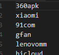

使用Python生成多渠道包   

-------------------------

>往apk包中追加到一个空文件到META-INF目录以标识渠道，Android中获取此文件即可获得App的下载渠道

1. 首先在info文件夹新建一个qdb.txt的空文本文件

2. 新建channel.txt存放渠道来源  

        

3. 运行Python代码即可将目录下的apk生成多渠道文件包     

    

## Python代码如下：         

        #!/usr/bin/python

        # coding=utf-8

        import zipfile

        import shutil

        import os

        # 空文件 便于写入此空文件到apk包中作为channel文件

        src_empty_file = 'info/qdb.txt'

        # 创建一个空文件（不存在则创建）

        f = open(src_empty_file, 'w') 

        f.close()

        # 获取当前目录中所有的apk源包

        src_apks = []

        # python3 : os.listdir()即可，这里使用兼容Python2的os.listdir('.')

        for file in os.listdir('.'):

            if os.path.isfile(file):

                extension = os.path.splitext(file)[1][1:]

                if extension in 'apk':

                    src_apks.append(file)

        # 获取渠道列表

        channel_file = 'info/channel.txt'

        f = open(channel_file)

        lines = f.readlines()

        f.close()

        for src_apk in src_apks:

            # file name (with extension)

            src_apk_file_name = os.path.basename(src_apk)

            # 分割文件名与后缀

            temp_list = os.path.splitext(src_apk_file_name)

            # name without extension

            src_apk_name = temp_list[0]

            # 后缀名，包含.   例如: ".apk "

            src_apk_extension = temp_list[1]

            

            # 创建生成目录,与文件名相关

            output_dir = 'output_' + src_apk_name + '/'

            # 目录不存在则创建

            if not os.path.exists(output_dir):

                os.mkdir(output_dir)

                

            # 遍历渠道号并创建对应渠道号的apk文件

            for line in lines:

                # 获取当前渠道号，因为从渠道文件中获得带有\n,所有strip一下

                target_channel = line.strip()

                # 拼接对应渠道号的apk

                target_apk = output_dir + src_apk_name + "-" + target_channel + src_apk_extension  

                # 拷贝建立新apk

                shutil.copy(src_apk,  target_apk)

                # zip获取新建立的apk文件

                zipped = zipfile.ZipFile(target_apk, 'a', zipfile.ZIP_DEFLATED)

                # 初始化渠道信息

                empty_channel_file = "META-INF/qdb_{channel}".format(channel = target_channel)

                # 写入渠道信息

                zipped.write(src_empty_file, empty_channel_file)

                # 关闭zip流

                zipped.close()

## Android中读取文件取得渠道ID       

        /** 获取渠道ID **/

            public String getChannelId() {

                Context context = cordova.getActivity().getApplicationContext();

                //从apk包中获取

                ApplicationInfo appinfo = context.getApplicationInfo();

                String sourceDir = appinfo.sourceDir;

                //默认放在meta-inf/里， 所以需要再拼接一下

                String key = "META-INF/qdbchannel";

                String ret = "";

                ZipFile zipfile = null;

                try {

                    zipfile = new ZipFile(sourceDir);

                    Enumeration<?> entries = zipfile.entries();

                    while (entries.hasMoreElements()) {

                        ZipEntry entry = ((ZipEntry) entries.nextElement());

                        String entryName = entry.getName();

                        if (entryName.startsWith(key)) {

                            ret = entryName;

                            break;

                        }

                    }

                } catch (IOException e) {

                    e.printStackTrace();

                } finally {

                    if (zipfile != null) {

                        try {

                            zipfile.close();

                        } catch (IOException e) {

                            e.printStackTrace();

                        }

                    }

                }

                String[] split = ret.split("_");

                String channel = "";

                if (split != null && split.length >= 2) {

                    channel = ret.substring(split[0].length() + 1);

                }

                return channel;

            }

### 附上查看apk内文件方法

1. 新建一个压缩包

2. 打开压缩包

3. 在压缩包内回退双击进入apk文件即可
