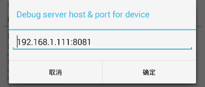
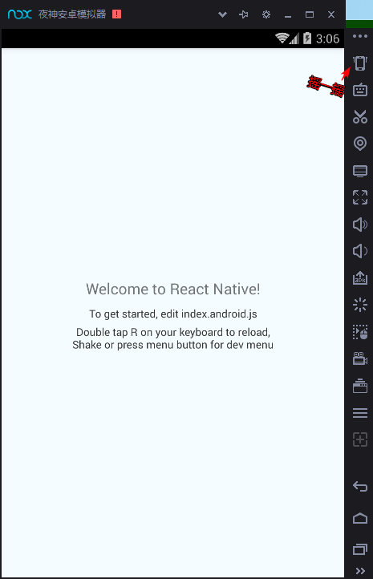

react-native 项目初始化

--------------------

1. 搭建java，android，node环境    

    [http://www.cnblogs.com/morang/p/react-native-java-build.html](http://www.cnblogs.com/morang/p/react-native-java-build.html)    

2. 全局安装脚手架  

    `npm install react-native-cli -g`  

3. 使用react-native-cli初始化项目          

    `react-native init 项目名称`

4. 修改android/gradle/wrapper/gradle-wrapper.properties文件的`distributionUrl`值为本地路径(墙)     

    `distributionUrl=file:///F:/CodingRepos/reactDemo/gradle-2.4-all.zip`

5. 绑定模拟器或真机 可以使用adb devices查看连接的设备         

    5.1 使用[夜神模拟器](https://www.yeshen.com/)安装调试app   

    5.2 使用adb命令链接设备到模拟器：`adb connect 127.0.0.1:62001`       

        端口号可使用 安装目录nox/bin/下的nox_adb devices查看或者查看进程PID         

        多个真机连接可用此connect Ip:port的方式连接到指定设备

    5.3 若使用真机调试需要打开USB调试并允许通过USB安装应用

6. 开始构建

    `react-native run-android`

    

7. 构建时会启动8081端口为服务端来在保存代码后进行更新          

8. 点击模拟器的摇一摇（Ctrl+0）选择Dev Setting->Debug Server host & port for device-> 电脑IP:8081        

    

9. 返回到桌面摇一摇~~~Reload~~~Over。        

