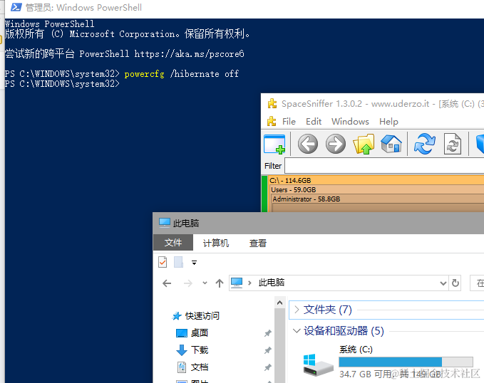

## 前言

> Spacesniffer 是一个免费的文件扫描工具，通过使用树状图可视化布局，可以立即了解大文件夹的位置，帮助用户处理找到这些文件夹

### 当前系统C盘空间


### 清理后系统C盘空间


## 下载 Spacesniffer

下载地址：https://spacesniffer.en.softonic.com/download

## 使用管理员身份启动 Spacesniffer


## 扫描C盘


## 等待扫描完成


## 分析大文件

主要针对一些不常见但又占很大的做处理，系统和开发的包是尽量不动，处理通信工具和一些可以移动或删除的文件即可

### 系统 AppData/Documents

首先眼熟的目录 AppData，Documents ，这两个如果占用过大，一般都可能是 QQ，微信等一些软件的存储目录默认设置的是 C 盘，可以去软件里面修改下对应的文件目录。

比如 QQ


修改后还会提示自动转移


再比如 微信


修改后也会提示并转移。

不够的第一时间可以优先把这些工具的缓存文件删除/移动/设置到其他盘

另外，辞职跑路记得情况其他盘~

### 开发包文件

做开发的 对于 .nuget/.android/sdk文件 等自行斟酌处理，移动或删除即可

### hiberfil.sys

> 系统休眠文件，可以删除，win10中管理员身份运行cmd执行命令关闭，会自动删除。 [参考](https://zhuanlan.zhihu.com/p/392894378)

```
powercfg /hibernate off
```

直接空间就回来了



### pagefile.sys

> 虚拟内存页面文件，不建议直接删除，可以根据需要重新设置下虚拟内存的大小或者将其设置到其他盘；ps: 这个之前公司的C盘给我占了10G+，换到其他盘了


设置内存-内存*1.5的大小就可以了，点击设置保存，重启后生效，根据自己内存情况设置


## 后语

至此，操作完毕，我成功找回了 48G 的C盘空间


工具好用还免费，强烈推荐！

另外看到大文件要删的时候不知道怎么弄，还是先搜一搜再决定如何处理，结合本篇分享的经验，救救C盘吧！！！
