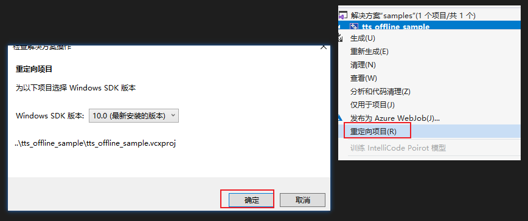
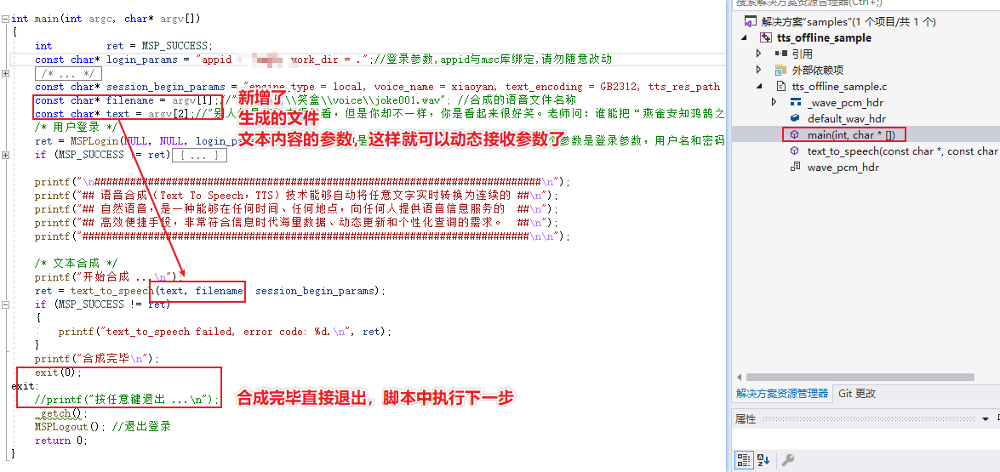
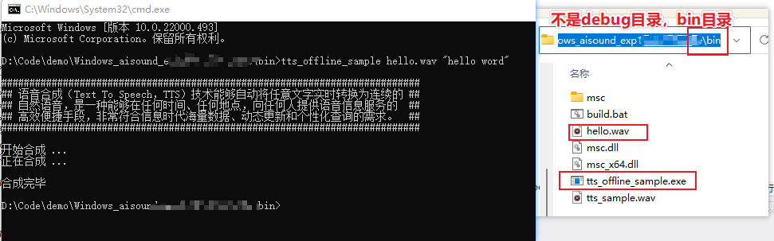
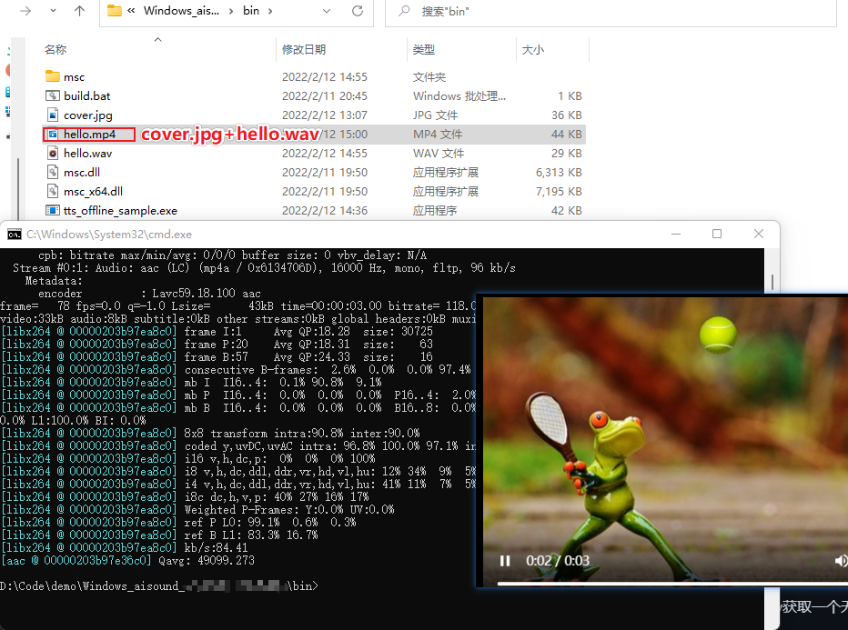

## 参考
- [FFmpeg](https://www.ffmpeg.org/)
- [讯飞离线语音合成](https://www.xfyun.cn/doc/tts/offline_tts/Windows-SDK.html)

## 起因
> 某日，看到一个营销号的视频说做视频日进斗金，大意是用软件识别文章小说，搭配一些图片转换成自己的视频。看完当时脑海里冒出一个念头，我也可以，于是有了这番尝试。

## 方案
> 首先文字方面，我选择了【聚合数据的笑话接口】(https://www.juhe.cn/docs/api/id/95),就不需要费力去自己找资源了
> 其次需要将文字转换为音频，我选择了【讯飞的语音合成】，因为其有[Windows离线版SDK](https://www.xfyun.cn/doc/tts/offline_tts/Windows-SDK.html)，修改了一些就可以根据需要使用了
> 最后是音频转视频方面，采用了【FFmpeg】，为视频添加了封面图与滚动字幕

## 使用脚本实现自动生成视频
### 准备笑话文本
>将笑话文本复制保存到一个文本中即可

### 下载讯飞语音合成离线包
- 需要注册并身份认证后在控制台下载，[下载地址](https://console.xfyun.cn/services/aisound)
- 安装文档中使用vs运行samples中的解决方案(使用的是VS2010)，若项目加载失败则升级下项目的框架版本：项目右键->重定向项目->安装最新版本即可。



- 为了能够在后续可以直接调用sdk，则根据需要改动此示例即可,此处改动了入参和退出。



重新生成后，找到外层bin目录下的exe，就可以直接使用`tts_offline_sample hello.wav "hello word"`调用程序合成文本音频到指定路径。



将bin和libs目录拷贝到需要的地方，或者将bin目录添加到环境变量中，就可以在任意地方使用了

### 下载ffmpeg
现在已经使用tts生成了音频文件，接下来使用 ffmpeg 将音频转换为视频并且生成字幕即可得到一个新鲜出炉的视频了
[ffmpeg下载地址](https://www.gyan.dev/ffmpeg/builds/ffmpeg-release-full.7z)
下载解压后将ffmpeg所在目录设置到环境变量，这样就可以在任意地方使用

### 生成视频

先从pixabay获取一个无版权的素材图片保存为 cover.jpg 作为封面，执行以下命令即可生成视频

`ffmpeg -y -loop 1 -i cover.jpg -i hello.wav  -c:v libx264 -c:a aac -b:a 192k -shortest hello.mp4`



### 生成滚动字幕
创建一个content.txt文件，写入内容“hello word，你好世界”
x,y为坐标，根据需要调整即可，fontfile设置为中文字体，不设置，中文将会乱码，执行命令后即可得到一个带滚动字幕的视频。

`ffmpeg -y -i hello.mp4 -vf "drawtext=fontfile=C\\:/Windows/Fonts/msyh.ttc:fontcolor=ffcc00:fontsize=40:shadowx=2:shadowy=2:textfile=./content.txt:reload=1:y=h/5:x=w-(mod(8*n\,w+tw)-tw/100)"  -c:a copy hellofull.mp4`

注意vf参数中的路径需要特殊处理，`Replace("\\", "/").Replace(":", "\\:")`

自此，技术点已经说明完毕，后续的就是一些优化和脚本的组合了。

### 图片转视频
> 注意：./ 为图片目录，且 img_ 为前缀,%03d 为格式( C语言中的格式化输出 %0nd )，不足3位长度的左补齐0，即必须为img_001,img_002这种格式，并且图片需要从第一张图片开始的序号开始依次排列，图片后缀与其格式需要一致。否则都不能成功
> 以下命令正确执行文件名需要为：img_001.png,img_002.png,img_003.png...
> -r 0.500 ，1/0.500= 2秒 一张图片显示
> -y 覆盖生成的文件
 `ffmpeg -y -r 0.500 -i ./img_%03d.png ./output.mp4`
 
## 完整脚本
```
set coverPath=F:\\Project\\JokeBox\\cover.jpg
set contentPath=F:\\Project\\JokeBox\\content.txt
set /P jokeContent=<%contentPath%
set videoName=video%date:~0,4%%date:~5,2%%date:~8,2%0%time:~1,1%%time:~3,2%%time:~6,2%
set outDic=F:\\Project\\JokeBox\\output\\%videoName%
set voicePath=%outDic%\\voice.wav
set videoPath=%outDic%\\video.mp4
set videoFullPath=%outDic%\\每日笑话-%date:~5,2%-%date:~8,2%.mp4
set srtPath=F\\:/Project/JokeBox/zimu.txt

echo 音频：%voicePath% 
echo 视频：%videoPath%
echo 字幕：%srtPath%
echo 文本：%jokeContent%

echo 创建输出目录
mkdir %outDic%

echo 生成音频
tts_offline_sample.exe "%voicePath%" "%jokeContent%"

echo 生成视频
ffmpeg -loop 1 -i %coverPath% -i %voicePath%  -c:v libx264 -c:a aac -b:a 192k -shortest %videoPath%

echo 生成字幕
ffmpeg -y -i %videoPath% -vf "drawtext=fontfile=C\\:/Windows/Fonts/msyh.ttc:fontcolor=ffcc00:fontsize=40:shadowx=2:shadowy=2:textfile=%srtPath%:reload=1:y=h/5:x=w-(mod(8*n\,w+tw)-tw/100)"  -c:a copy %videoFullPath%

copy %contentPath% %outDic%

echo 移除音频视频
del %voicePath:\\=\%
del %videoPath:\\=\%

pause
```
