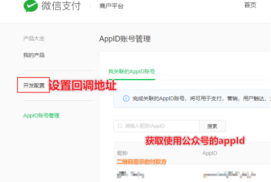
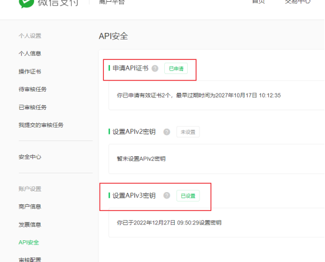
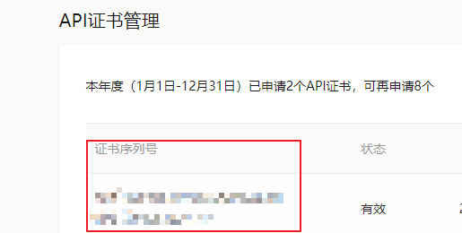
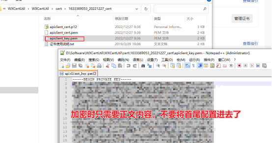

## 0.需要从商户平台获取/设置的配置
公众号appId
商户号
APIv3密钥
证书序列号
证书密钥

##1.扫码登录商户平台
网址：https://pay.weixin.qq.com/
## 2.确认已开通Native支付
网址：https://pay.weixin.qq.com/index.php/public/product/detail?pid=38&productType=0

需要设置操作密码及短信验证
## 3.设置回调地址并获取公众号appId和商户号(开发配置查看)
网址：https://pay.weixin.qq.com/index.php/extend/pay_setting

## 4.申请API证书
网址：https://pay.weixin.qq.com/index.php/core/cert/api_cert#/

根据提示申请即可(证书根据提示下载WXCertUtil.exe生成)，过程中需要操作密码及验证码，最终获取到
- APIv3密钥
自行设置的字符串

- 证书序列号

多个的时候注意不要复制错了

- 证书密钥

## 5.完成扫码支付需要的配置项
WechatPayApiUrl = https://api.mch.weixin.qq.com
WechatPayAPIV3Key = APIv3密钥
WechatPayApiAppid = 公众号appid
WechatPayApiPrivateKey= 私钥文本
WechatPayApiMerchantId = 商户号
WechatPayApiSerialNo = 证书序列号
WechatPayApiNotifyUrl = https://xxxx.com/回调地址
