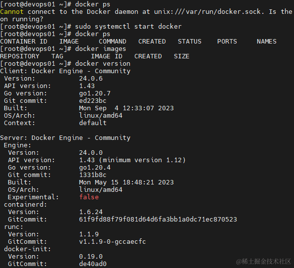

#### 前言

-   Docker 是一款流行的开源容器化平台,使用 Docker 可以有效地隔离应用程序和系统环境，使得应用程序在不同的环境中具有相同的行为
-   Docker Compose 是一个用于定义和管理多个 Docker 容器的工具
-   Docker 官方文档：[文档地址](https://docs.docker.com/)
-   Docker Hub: [容器镜像库和社区](https://hub.docker.com/)
-   作者：[易墨](https://github.com/yimogit)
-   发布时间：2023.10.02

#### 软件包源配置

跟着文档第一句就报错了,需要配置包源下

```
[root@devops01 ~]# sudo yum install -y yum-utils
CentOS Linux 8 - AppStream                             77  B/s |  38  B     00:00
Error: Failed to download metadata for repo 'appstream': Cannot prepare internal mirrorlist: No URLs in mirrorlist
```

-   配置包源

```
curl -o /etc/yum.repos.d/CentOS-Base.repo https://mirrors.aliyun.com/repo/Centos-vault-8.5.2111.repo
rm /etc/yum.repos.d/CentOS-Linux-AppStream.repo -f
rm /etc/yum.repos.d/CentOS-Linux-BaseOS.repo -f
dnf clean all
```

#### Docker 安装

-   官方文档：[Install Docker Engine on CentOS](https://docs.docker.com/engine/install/centos/)

-   安装时的版本

    -   查看版本列表：`yum list docker-ce --showduplicates | sort -r`
    -   当前 docker-ce 版本：3:24.0.0-1.el8
    -   当前 docker-ce-cli：1:24.0.6-1.el8

-   卸载旧版本,新机器跳过即可

    -   ```
        sudo yum remove docker-ce docker-ce-cli containerd.io docker-buildx-plugin docker-compose-plugin docker-ce-rootless-extras
        sudo rm -rf /var/lib/docker
        sudo rm -rf /var/lib/containerd
        ```

-   安装

    -   ```
        sudo yum install -y yum-utils device-mapper-persistent-data lvm2
        sudo yum-config-manager --add-repo https://download.docker.com/linux/centos/docker-ce.repo
        sudo yum install -y docker-ce-3:24.0.0-1.el8 docker-ce-cli-1:24.0.6-1.el8 containerd.io docker-buildx-plugin docker-compose-plugin
        ```

-   启动

    -     docker未启动将会报错：`Cannot connect to the Docker daemon at unix:///var/run/docker.sock. Is the docker daemon running?`
    -   ```
        sudo systemctl start docker
        ```

-   安装完毕

    -   

#### Docker 镜像加速器配置

docker镜像默认是从hub.docker.com拉取镜像，国内访问太慢了，可以配置国内的镜像源

1.  阿里云私有加速器 登录后获取 [配置镜像加速器](https://cr.console.aliyun.com/cn-hongkong/instances/mirrors)

```
sudo mkdir -p /etc/docker
sudo tee /etc/docker/daemon.json <<-'EOF'
{
  "registry-mirrors": ["https://dist7hw1.mirror.aliyuncs.com"]
}
EOF
sudo systemctl daemon-reload
sudo systemctl restart docker
```

2.  百度及网易公共加速器

    1.  ```
        cat > /etc/docker/daemon.json << EOF
        {
          "registry-mirrors": [
            "https://hub-mirror.c.163.com",
            "https://mirror.baidubce.com"
          ] 
        }
        EOF
        ```

2.  其他可以通过 [docker-registry-cn-mirror-test](https://github.com/docker-practice/docker-registry-cn-mirror-test) 项目查看是否可以使用

#### Docker 常用命令一览

1.  镜像相关命令：

    1.  `docker images`：列出本地的镜像列表。
    1.  `docker pull <image_name>`：从 Docker Hub 下载指定名称的镜像。
    1.  `docker push <image_name>`：将本地的镜像推送到 Docker Hub 或私有镜像仓库中。
    1.  `docker rmi <image_name>`：删除指定的镜像。

1.  容器相关命令：

    1.  `docker ps`：列出运行中的容器列表。
    1.  `docker ps -a`：列出所有的容器列表，包括已停止的容器。
    1.  `docker run <image_name>`：创建并启动一个新的容器。
    1.  `docker start <container_id>`：启动已停止的容器。
    1.  `docker stop <container_id>`：停止运行中的容器。
    1.  `docker restart <container_id>`：重启容器。
    1.  `docker rm <container_id>`：删除指定的容器。
    1.  `docker exec -it <container_id> <command>`：在运行中的容器中执行命令。
    1.  `docker logs <container_id>`：查看容器的日志输出。

1.  网络相关命令：

    1.  `docker network ls`：列出 Docker 网络列表。
    1.  `docker network create <network_name>`：创建一个新的网络。
    1.  `docker network connect <network_name> <container_id>`：将容器连接到指定的网络。
    1.  `docker network disconnect <network_name> <container_id>`：断开容器与指定网络的连接。

1.  其他常用命令：

    1.  `docker version`：查看 Docker 版本信息。
    1.  `docker info`：查看 Docker 系统信息。
    1.  `docker search <term>`：在 Docker Hub 上搜索镜像。
    1.  `docker pull <image_name>:<tag>`：下载指定标签的镜像。
    1.  `docker tag <source_image_name> <target_image_name>`：给镜像打标签。
    1.  `docker login`：登录到 Docker Hub 或私有镜像仓库。
    1.  `docker logout`：退出当前登录的 Docker Hub 或私有镜像仓库。

#### Docker Compose V2 安装

-   官方文档：[Install using the repository](https://docs.docker.com/compose/install/linux/#install-using-the-repository)

-   当前版本：v2.21.0

    -   > 使用的语法变了，用 docker compose 来运行命令，去掉了 - ,详情可以看[迁移指南](https://docs.docker.com/compose/migrate/)

-   安装

    -   ```
        sudo yum update
        sudo yum install docker-compose-plugin -y
        ```

-   使用

    -   `docker compose xxxx`同之前的docker-compose
    -   `docker-compose scale` 需要修改`docker compose up --scale`
    -   `docker-compose config` 命令用于验证和查看 Docker Compose 文件的配置

-   使用示例：[官方示例](https://docs.docker.com/compose/gettingstarted/)

-   旧版本1.x 的安装，安装后使用 docker-compose

    -   ```
        # 下载docker-compose,服务器下不下来可以本地下然后传到服务器
        sudo curl -L "https://github.com/docker/compose/releases/download/1.27.4/docker-compose-$(uname -s)-$(uname -m)" -o /usr/local/bin/docker-compose
        # 添加可执行权限
        sudo chmod +x /usr/local/bin/docker-compose
        # 输出版本
        docker-compose --version
        # 输出：docker-compose version 1.27.4, build xxx
        ```

#### 使用实践

-   创建容器网络：`docker network create devopsnetwork`

一般来讲一个项目的服务都应该在一个网络中，所以在创建容器前都需要先创建容器网络

-   指定容器网络：

    -   运行 docker 时 `docker run --network=devopsnetwork xxxximages`
    -   创建 compose.yml 中指定网络, 运行：`docker compose up`
    -   查看容器网络信息：`docker inspect e54c | grep Networks -A 20`
    -   ```
        services:
          web:
            image: nginx
            ports:
              - "8080:80"
            networks:
              - devopsnetwork
        networks:
          devopsnetwork:
        ```

#### 后语

-   安装&记录耗时：6小时
-   参考：[linux中使用docker-compose部署软件配置分享](https://www.cnblogs.com/morang/p/docker-compose-yml-share.html)
