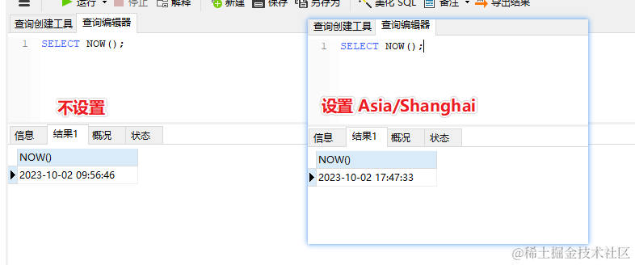
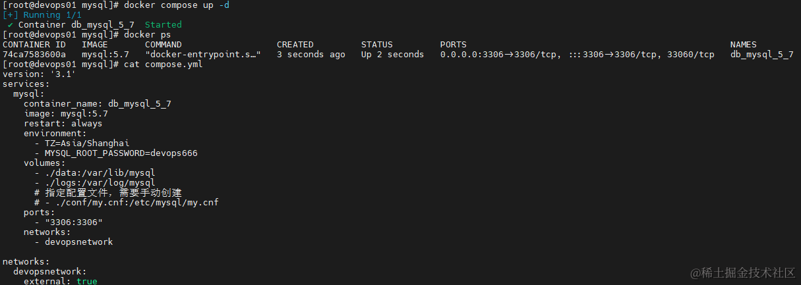
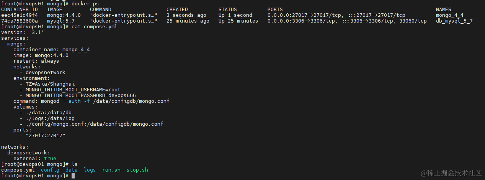

### 前言
> 书接上篇：[Docker V24 及 Docker Compose V2 的安装及使用](https://www.cnblogs.com/morang/p/devops-docker24-composev2-install.html)   
> 本篇操作都在 centos8 虚拟机 devops01 中进行，并都归属网络：devopsnetwork  
> 主要增加对容器中 数据文件，日志，配置，网络，时区，端口映射，密码 的配置，更贴合生产实际使用

###  Docker Compose 安装 MySQL v5.7

目录 /app/mysql 中创建 compose.yml 并运行

-   指定 mysql 版本 5.7

-   指定网络：devopsnetwork

-   指定时区：Asia/Shanghai

    -     不设置默认是GMT时间，会比北京时间少8h，直接的影响就是 NOW() 函数会有差异
    -   

-   指定 root 密码：devops666

-   挂载卷：`./data` `./logs`，无需手动创建

-   挂载配置文件： 配置文件根据情况挂载，需要手动创建 conf/my.conf ,以下为示例配置

    -   ```
        [mysqld]
        #必须保证在mysql集群中，该字段唯一
        server_id=1
        #指定归档日志的存储文件
        log-bin=master-bin
        log-bin-index=master-bin.index
        #指定忽略的数据库
        binlog-ignore-db=mysql
        #指定时区
        default-time-zone='Asia/Shanghai'
        #可以通过增加”replicate-do-db” 指定需要复制的数据库，
        #如果不指定则是所有的数据。如果需要指定多个数据库，只需要增加多个”replicate-do-db” 即可。
        #replicate-do-db

        #设置这个最大连接数值
        max_connections=1024
        ```

-   暴露端口：3306

-   启动 mysql 容器： `docker compose up -d`

    -   ```
        version: '3.1'
        services:
          mysql:
            container_name: db_mysql_5_7
            image: mysql:5.7
            restart: always
            environment:
              - TZ=Asia/Shanghai
              - MYSQL_ROOT_PASSWORD=devops666
            volumes:
              - ./data:/var/lib/mysql
              - ./logs:/var/log/mysql
              # 指定配置文件，需要手动创建
              # - ./conf/my.cnf:/etc/mysql/my.cnf
            ports:
              - "3306:3306"
            networks:
              - devopsnetwork

        networks:
          devopsnetwork:
            external: true
        ```

-   运行示例

    -   

-   若需要使用 mysql8.0 ，可使用下面配置，根据需要设置身份验证插件

    -   ```
        version: '3.1'
        services:
          mysql:
            container_name: db_mysql_8
            image: mysql:8.0
            restart: always
            # MySQL 8.0 默认使用 caching_sha2_password 身份验证插件，而不是 mysql_native_password 插件。在生产环境中，我们应该遵循官方建议，使用 caching_sha2_password 插件提供更强大的安全性
            # command: --default-authentication-plugin=mysql_native_password
            environment:
              MYSQL_ROOT_PASSWORD: devops666
            volumes:
              - ./data:/var/lib/mysql
            ports:
              - "3306:3306"
            networks:
              - devopsnetwork

        networks:
          devopsnetwork:
            external: true
        ```

-   参考 [docker-library/mysql](https://github.com/docker-library/docs/blob/master/mysql/README.md)

### Docker Compose 安装 MongoDB  v4.4

目录 /app/mongo 中创建 compose.yml 并运行

-   指定 mongo 版本 4.4

-   指定网络：devopsnetwork

-   指定时区：Asia/Shanghai

-   指定账号密码：root devops666

-   挂载卷：./data 即：/app/mongo/data，无需手动创建

-   挂载配置文件：./config/mongo.conf 需要手动创建

    -   ```
        net:
          bindIpAll: true

        security:
          authorization: enabled
        ```

-   暴露端口：27017

-   运行 compose.yml:`docker compose up -d`

    -   ```
        version: '3.1'
        services:
          mongo:
            container_name: mongo_4_4
            image: mongo:4.4.0
            restart: always
            networks:
              - devopsnetwork
            environment:
              - TZ=Asia/Shanghai
              - MONGO_INITDB_ROOT_USERNAME=root
              - MONGO_INITDB_ROOT_PASSWORD=devops666
            command: mongod --config /etc/mongo/mongod.conf
            volumes:
              - ./data:/data/db
              - ./logs:/data/log
              - ./config/mongo.conf:/etc/mongo/mongod.conf
            ports:
              - "27017:27017"

        networks:
          devopsnetwork:
            external: true
        ```

-   运行示例

    -   

-   参考 [docker-library/mongo](https://github.com/docker-library/docs/blob/master/mongo/README.md)

### 后语
- 安装&记录耗时：5 小时
- 后面还会补充 clickhouse 和一个 web 管理工具的使用  
- 创作不易，且行且珍惜！！！
