## 前言

> 前面分享了 k8s 的部署安装，本篇来点实操，将会把一个 .net core + vue 的项目（zhontai），打包构建成 docker 镜像，推送到 nexus 镜像仓库，并部署到 k8s 中

## 准备

> 要实现项目的部署，除了准备要部署的环境（k8s），还需要准备项目所用到的各中间件，本文旨在分享部署的一个整体流程，对项目中所使用到的各中间件（mysql，redis 等）的安装使用可自行在本[ DevOps 系列文章](https://www.cnblogs.com/morang/category/2348249.html)中找到

-   一个 .net core+vue 的项目   
    -   使用 zhontai 项目，之前也有做分享，[文章介绍](https://www.cnblogs.com/morang/p/zhontai_admin_core_book_01.html) 
    -   后端 [Admin.Core v3.7.1](https://github.com/zhontai/Admin.Core/tree/v3.7.1)
    -   前端 [admin.ui.plus v2.2.0](https://github.com/zhontai/admin.ui.plus/tree/v2.2.0)

-   Nexus 的安装部署，[文章介绍](https://www.cnblogs.com/morang/p/devops-nexus3-nuget-docker-install-use.html)    
    -   做为镜像仓库使用，将项目打包镜像及项目镜像推送到仓库，k8s 也从此仓库拉取镜像
    -   版本为 v3.61 ，安装地址为 192.168.0.214：8081，并使用局域网域名解析，
    -   在目标机器先登录能够拉取推送镜像，[参考](https://juejin.cn/spost/7298189093808128010#heading-25)
    -   拉取镜像地址：https://nexus.devops.test.com
    -   推送镜像地址：https://push.nexus.devops.test.com
    -   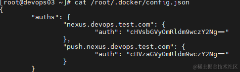

-   Docker 的安装部署，[文章介绍](https://www.cnblogs.com/morang/p/devops-docker24-composev2-install.html)
    -   使用 doker 拉取 sdk、nodejs 镜像进行打包，构建 k8s 所需要的项目镜像
    -   版本：v24.0.6
    -   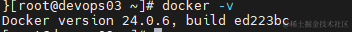

-   K8S 的安装与部署，[文章介绍](https://www.cnblogs.com/morang/p/devops-k8s-install-use.html)

    -   部署项目服务
    -   使用 ingress 解析域名到服务

-   部署前后端项目到 K8S，本文介绍

## 使用 Docker 打包应用镜像

不管什么语言，基本都可以使用这个打包流程，将官方镜像打包推送到私有镜像仓库个人认为是必要的，不然如果一旦远端的镜像失效，又需要重新拉取镜像时就会很尬尴。

1.  准备打包所需镜像

    1.  获取基础打包镜像（dotnet 获取 sdk 镜像，vue 获取 node 镜像）
    1.  基于基础镜像，安装所需软件，设置默认配置，复制默认文件，封装项目的打包镜像
    1.  挂载项目到 sdk 镜像进行打包，打包后获取构建完成的产物

1.  准备运行所需的基础镜像

    1.  获取运行时镜像（.net core 获取 runtime 镜像，vue 获取 nginx 镜像）
    1.  基于运行时镜像，将打包构建完从的产物添加到镜像，构建项目镜像
    1.  推送项目镜像到仓库

### .Net Core 7.0 项目镜像

构建所需一个 sdk 镜像用于打包编译项目，一个 runtime 镜像运行 .net core 项目，版本选择对应的 7.0 即可

-   dotnet sdk 镜像地址：https://hub.docker.com/_/microsoft-dotnet-sdk/
-   dotnet runtime 镜像地址： https://hub.docker.com/_/microsoft-dotnet-runtime/

#### 构建 dotnet sdk 7.0 打包镜像

1.  拉取 dotnet sdk 镜像：` docker pull  mcr.microsoft.com/dotnet/sdk:7.0`

    1.  目前可以直接拉取，若无法拉取则配置国内镜像源
    1.  临时运行容器进行测试：` docker run -it --rm  mcr.microsoft.com/dotnet/sdk:7.0`，可以将需要的东西进行安装测试再编写 dockerfile
    1.  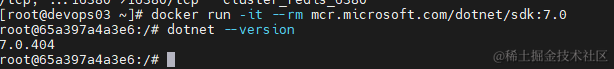

1.  使用 Dockerfile 构建打包镜像 dotnet-sdk-7.0

    1.  为了便于后期维护，使用 Dockerfile 来构建
    1.  目录文件：dotnet-sdk-7.0/Dockerfile
    1.  基于 sdk 安装 dotnet-monitor v7.3.2， [文档](https://github.com/dotnet/dotnet-monitor/blob/v7.3.2/documentation/setup.md) 这里只做演示，暂时没用上，后续使用多阶段构建的时候可以将其复制到运行时镜像中
    1.  ```
        # 基础sdk镜像 v7.0    
        FROM mcr.microsoft.com/dotnet/sdk:7.0
        # 将tools目录加入环境变量
        ENV PATH="$PATH:/root/.dotnet/tools"
        # 安装 dotnet-monitor 
        RUN dotnet tool install -g dotnet-monitor --version 7.3.2
        ```
    1.  执行构建：`docker build -t dotnet-sdk-7.0 -f ./Dockerfile .`
    1.  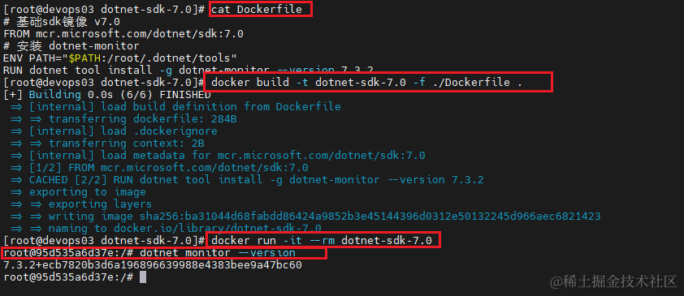

1.  推送镜像到 Nexus 仓库

    1.  镜像登录认证：` docker login  push.nexus.devops.test.com  -u pusher -p devops666 `
    1.  打标签：` docker tag dotnet-sdk-7.0  push.nexus.devops.test.com/projectbuild/dotnet-sdk-7.0`
    1.  推送镜像：` docker push  push.nexus.devops.test.com/projectbuild/dotnet-sdk-7.0`
    1.  记得清理本地缓存镜像：` docker rmi  dotnet-sdk-7.0  && docker rmi  push.nexus.devops.test.com/projectbuild/dotnet-sdk-7.0`
    1.  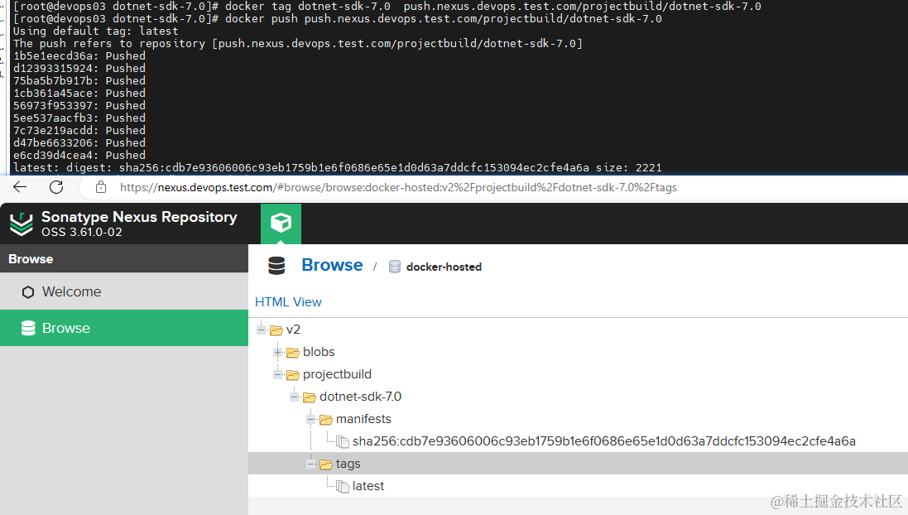

1.  使用镜像

    1.  后续使用 dotnet sdk 7.0 就可以直接使用 `nexus.devops.test.com/projectbuild/dotnet-sdk-7.0` 即可
    1.  直接拉取：` docker pull  nexus.devops.test.com/projectbuild/dotnet-sdk-7.0`
    1.  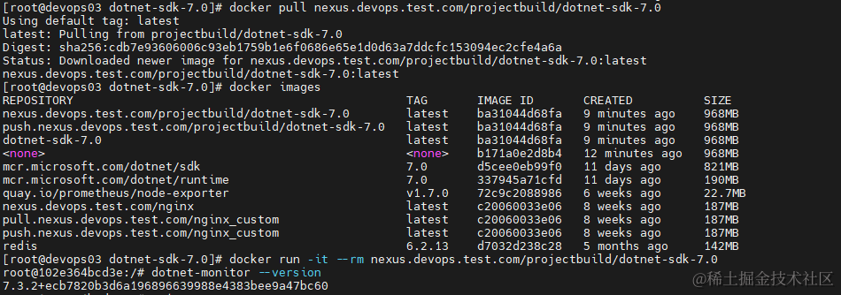

#### 构建 dotnet runtime 7.0 运行时镜像

1.  拉取 dotnet runtime 镜像：` docker pull  mcr.microsoft.com/dotnet/runtime:7.0`

    1.  临时运行容器进行测试：` docker run -it --rm  mcr.microsoft.com/dotnet/runtime:7.0`

1.  使用 Dockerfile 构建运行时镜像

    1.  为了便于后期维护，使用 Dockerfile 来构建
    1.  目录文件：dotnet-runtime-7.0/Dockerfile
    1.  若非需要，可以不安装软件，安装软件后镜像会多个 100M
    1.  ```
        # 基础runtime镜像 v7.0   
        FROM mcr.microsoft.com/dotnet/aspnet:7.0

        # 写入阿里云镜像源
        RUN echo " \
        deb http://mirrors.aliyun.com/debian/ bullseye main contrib non-free\n \
        deb-src http://mirrors.aliyun.com/debian/ bullseye main contrib non-free\n \
        \n \
        deb http://mirrors.aliyun.com/debian-security bullseye-security main contrib non-free\n \
        deb-src http://mirrors.aliyun.com/debian-security bullseye-security main contrib non-free\n \
        \n \
        deb http://mirrors.aliyun.com/debian/ bullseye-updates main contrib non-free\n \
        deb-src http://mirrors.aliyun.com/debian/ bullseye-updates main contrib non-free\n \
        \n \
        deb http://mirrors.aliyun.com/debian/ bullseye-backports main contrib non-free\n \
        deb-src http://mirrors.aliyun.com/debian/ bullseye-backports main contrib non-free\n \
        " | tee /etc/apt/sources.list

        # 安装 curl&&vim
        RUN apt-get update -y && apt-get install -y curl && apt-get install -y vim
        ```
    1.  执行构建：`docker build -t dotnet-runtime-7.0 -f ./Dockerfile .`
    1.  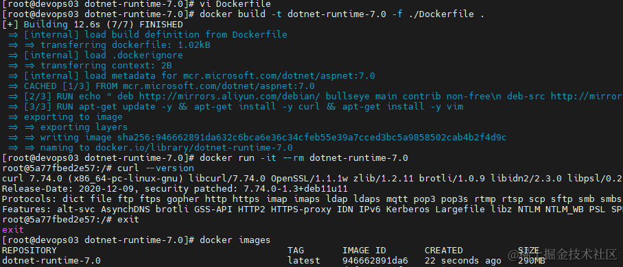

1.  推送镜像到 Nexus 仓库

    1.  镜像登录认证：` docker login  push.nexus.devops.test.com  -u pusher -p devops666 `
    1.  打标签：`docker tag dotnet-runtime -7.0 push.nexus.devops.test.com/projectbuild/dotnet-runtime-7.0`
    1.  推送镜像：` docker push  push.nexus.devops.test.com/projectbuild/dotnet-runtime-7.0`
    1.  记得清理本地缓存镜像：` docker rmi  dotnet-runtime-7.0  && docker rmi  push.nexus.devops.test.com/projectbuild/dotnet-runtime-7.0`
    1.  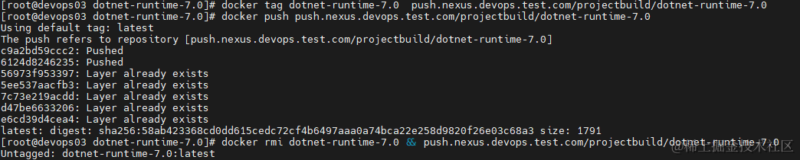
    1.  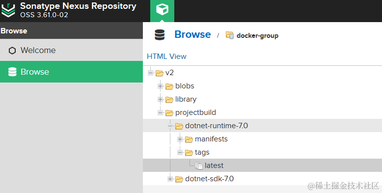

1.  使用镜像

    1.  后续使用 dotnet runtime 7.0 就可以直接使用 `nexus.devops.test.com/projectbuild/dotnet-runtime-7.0` 即可
    1.  直接拉取：` docker pull  nexus.devops.test.com/projectbuild/dotnet-runtime-7.0`

#### 构建 zhontai 后端项目的应用镜像

制作完镜像，下面将使用 sdk 镜像打包项目生成部署文件，再使用 runtime 镜像部署运行。

1.  下载/克隆项目 admin.core 到服务器，进入项目目录开始执行

    1.  ```
        # 克隆项目
        git clone https://github.com/zhontai/Admin.Core.git -b v3.7.0
        # 进入项目 cd Admin.Core
        cd Admin.Core
        ```
    1.  src 为.net core 项目代码

1.  使用 sdk 镜像进行打包，生成部署文件到 publish_output

    1.  `docker run -i --rm` 创建一个临时容器，容器退出后自动删除容器
    1.  `-v ./build:/build` 挂载 MSBuild 属性文件目录（./src/Directory.Build.props 中使用）
    1.  `-v ./src:/src` 挂载源码到容器中
    1.  `-v ./publish_output:/publish_output`挂载构建物输出目录
    1.  `--name build_zhontai_api` 指定运行的容器名称
    1.  `nexus.devops.test.com/projectbuild/dotnet-sdk-7.0` sdk 镜像
    1.  `/bin/bash -c "xxx"`以交互模式运行容器，运行时执行命令
    1.  若有自定义 nuget 仓库的包还需挂载 `/root/.nuget` 目录，或直接制作在镜像中
    1.  记得挂载 build 目录，否则会提示：Invalid framework identifier
    1.  ```
        docker run -i --rm \
        -v ./build:/build \
        -v ./src:/src \
        -v ./publish_output:/publish_output \
        --name build_zhontai_api \
        nexus.devops.test.com/projectbuild/dotnet-sdk-7.0 \
        /bin/bash -c 'dotnet publish /src/hosts/ZhonTai.Host -c Release -o /publish_output --runtime linux-x64 --framework net7.0'
        ```
    1.  执行成功后程序包就生成到 publish_output 中了
    1.  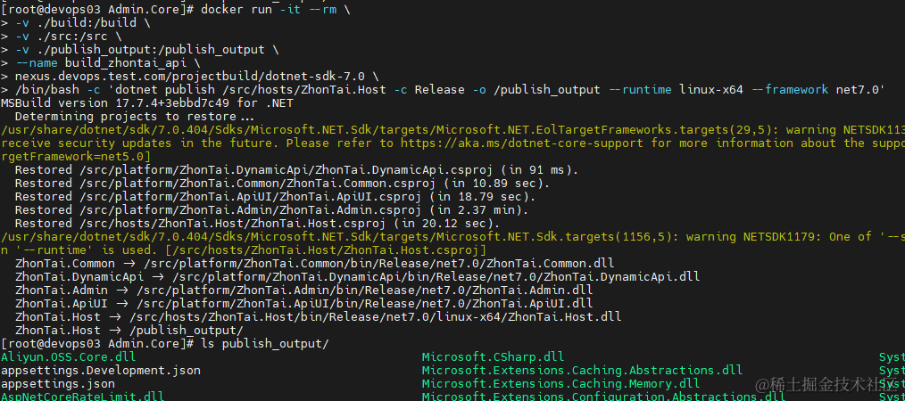

1.  使用 runtime 镜像制作应用镜像

    1.  将上一步的构建物 Admin.Core/publish_output 添加到运行时镜像中
    1.  使用 echo 创建一个 Dockerfile
    1.  ```
        #创建Dockerfile
        echo 'FROM nexus.devops.test.com/projectbuild/dotnet-runtime-7.0 AS runtime 
        WORKDIR /app 
        COPY ./publish_output /app 
        ENV ASPNETCORE_URLS=http://+:8000 
        ENTRYPOINT ["dotnet", "ZhonTai.Host.dll"]' > Dockerfile
        ```
    1.  执行构建：`docker build -t zhontai_api .`
    1.  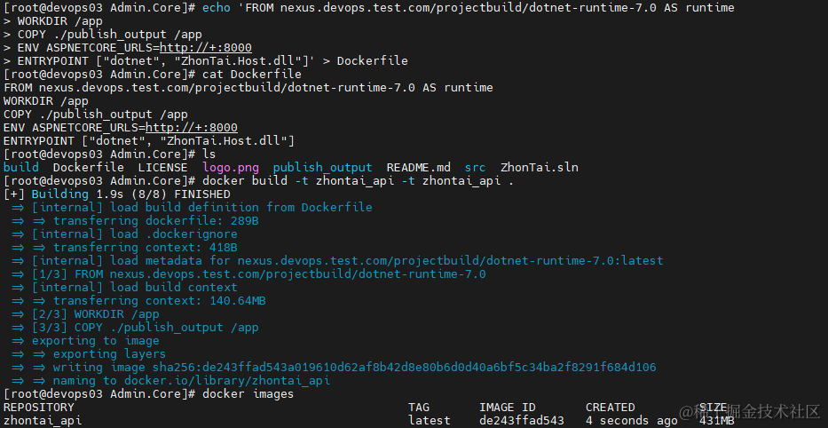
    1.  运行测试，成功
    1.  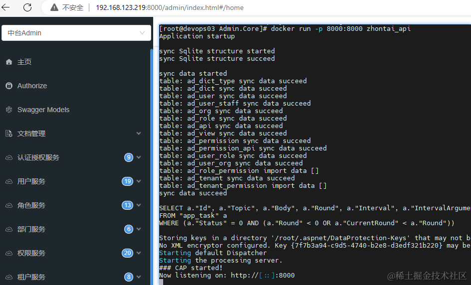

1.  推送镜像到仓库

    1.  ```
        #打标签
        docker tag zhontai_api push.nexus.devops.test.com/projectapp/zhontai_api
        #推送
        docker push push.nexus.devops.test.com/projectapp/zhontai_api
        ```
    1.  推送成功，这里手动只构建的 latest 版本，若使用自动化构建，还需构建对应版本的镜像，以支持快速回滚
    1.  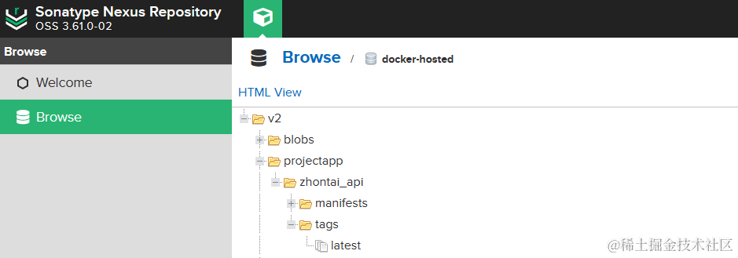

### Vue 3 项目打包

构建所需一个 node 镜像用于 vue 项目打包，nginx 用于部署前台项目

1.  node 镜像地址：https://hub.docker.com/r/library/node ，选择版本：node:18.17.1
1.  nginx 镜像地址：https://hub.docker.com/_/nginx ，选择版本：nginx:1.24.0

#### 构建 nodejs 18.17.1 打包镜像

1.  拉取 nodejs 镜像：`docker pull node:18.17.1`

1.  将 node 镜像 vue-node-18 打上标签推送到仓库

    1.  ```
        #拉取仓库
        docker pull node:18.17.1
        # 打标签
        docker tag node:18.17.1 push.nexus.devops.test.com/projectbuild/vue-node-18.17
        #推送
        docker push push.nexus.devops.test.com/projectbuild/vue-node-18.17
        ```
    1.  测试使用：` docker run -it --rm  nexus.devops.test.com/projectbuild/vue-node-18.17 /bin/bash -c "node -v"`
    1.  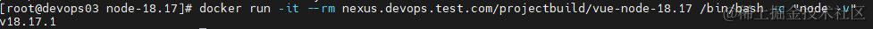
    1.  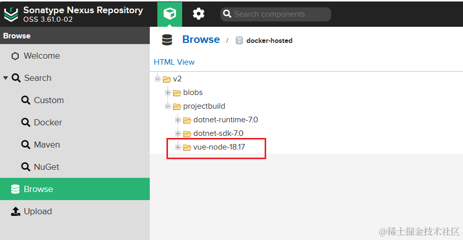

#### 构建 nginx 1.24 运行时镜像

1.  拉取 nginx 镜像：`docker pull nginx:1.24`

1.  将 nginx 镜像 vue-nginx-1.24 打上标签推送到仓库

    1.  ```
        #拉取仓库
        docker pull nginx:1.24
        # 打标签
        docker tag nginx:1.24 push.nexus.devops.test.com/projectbuild/vue-nginx-1.24
        #推送
        docker push push.nexus.devops.test.com/projectbuild/vue-nginx-1.24
        ```
    1.  测试使用：` docker run -it --rm  nexus.devops.test.com/projectbuild/vue-nginx-1.24 /bin/bash`进入容器后启用 nginx，并使用 curl http://localhost 测试 nginx 可用
    1.  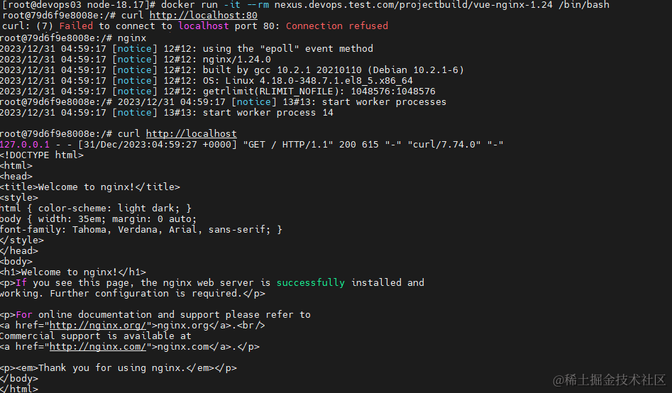
    1.  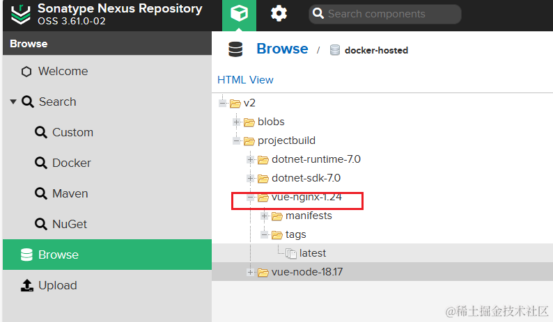

#### 构建 zhontai 前端项目的应用镜像

1.  下载/克隆项目 admin.ui.plus 到文件夹

    1.  ```
        # 克隆项目
        git clone https://github.com/zhontai/admin.ui.plus.git -b v2.2.0
        # 进入项目cd admin.ui.plus
        cd admin.ui.plus

        # 修改接口地址 
        # 编辑.env.production 中的 VITE_API_URL 配置为接口地址
        ```

1.  使用 node 镜像进行打包，生成文件到 dist

    1.  ```
        docker run -i --rm \
        -v ./:/app \
        --name build_zhontai_webui \
        nexus.devops.test.com/projectbuild/vue-node-18.17 \
        /bin/bash -c 'cd /app 
        npm config set registry https://registry.npmmirror.com
        npm install
        npm run build'
        ```
    1.  执行成功，构建输出到 dist 中
    1.  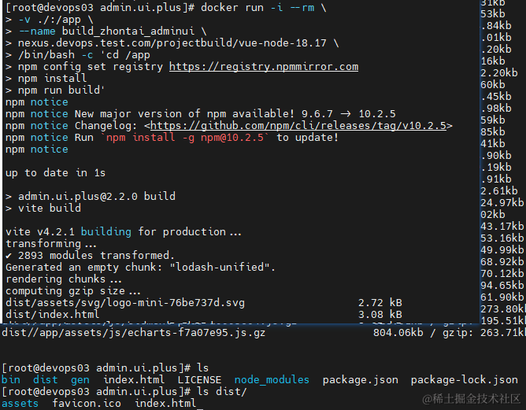

1.  使用 nginx 镜像制作应用镜像

    1.  ```
        # 创建nginx.conf

        echo '
        server {
            listen       80;
            server_name  localhost;
            charset utf-8;
            location / {
                root   /usr/share/nginx/html;
                try_files $uri $uri/ /index.html;
                index  index.html index.htm;
            }

            #error_page  404              /404.html;
            error_page   500 502 503 504  /50x.html;
            location = /50x.html {
                root   html;
            }
        }
        '> vue-nginx.conf
        #创建Dockerfile
        echo '
        FROM nexus.devops.test.com/projectbuild/vue-nginx-1.24
        EXPOSE 80
        COPY ./dist /usr/share/nginx/html
        COPY ./vue-nginx.conf /etc/nginx/conf.d/default.conf' > Dockerfile
        ```
    1.  执行构建：`docker build -t zhontai_webui .`
    1.  测试访问成功
    1.  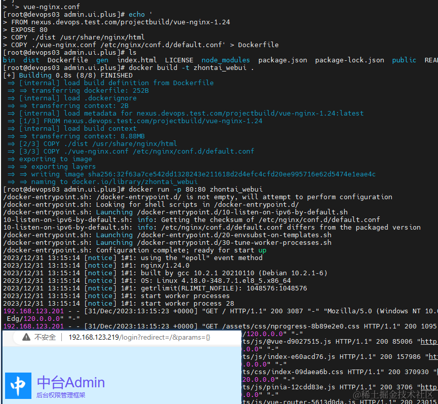

1.  推送镜像到仓库

```
#打标签
docker tag zhontai_webui push.nexus.devops.test.com/projectapp/zhontai_webui
#推送
docker push push.nexus.devops.test.com/projectapp/zhontai_webui
```

  


## 将 Docker 应用镜像部署到 K8S

应用镜像打包成功，现在需要将两个应用精选镜像部署到 k8s 中

#### 应用镜像的拉取凭证设置

因为 nexus 部署在局域网，并且配置的域名是局域网域名，所以面临着如何在 k8s 中访问 https://nexus.devops.test.com 获取镜像的问题，目前我的解决方法时每个节点机器都配置好对应 dns

要想访问到 nexus 仓库，需要满足两个条件，一个是访问到仓库，一个是仓库的认证

1.  给 k8s 所有节点添加 dns 设置`nameserver 192.168.123.214`

    1.  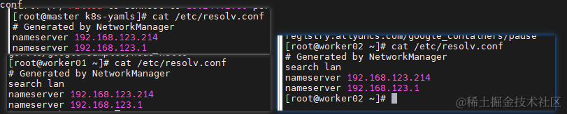
    1.  使用 ` docker login  nexus.devops.test.com  -u puller -p devops666 ` 在宿主机中登录仓库确保可以在节点拉取镜像

1.  创建 nexus 登录凭证

    1.  ```
        kubectl create secret \
        docker-registry \
        nexus-login-registry \
        --docker-server=nexus.devops.test.com \
        --docker-username=puller \
        --docker-password=devops666 \
        -n default
        ```
    1.  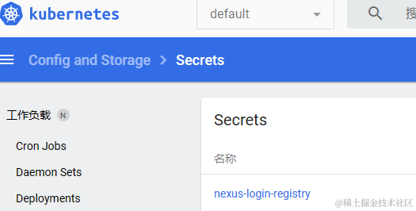

#### 使用 Deployment 部署应用

配置仅供参考，关于数据库，配置文件，日志，上传文件等未处理

-   创建后端部署配置：zhontai_api.yaml

    -   ```
        ---
        ## 配置服务
        kind: Service
        apiVersion: v1
        metadata:
          name: app-zhontai-api
          namespace: default
          labels:
            app: app-zhontai-api
        spec:
          selector:
            app: app-zhontai-api
          type: ClusterIP
          ports:
            - name: p80
              port: 80
              targetPort: 8000
        ---

        kind: Deployment # 指定创建资源的角色/类型
        apiVersion: apps/v1 # 指定api版本，此值必须在kubectl api-versions中
        metadata: # 资源的元数据/属性
          name: app-zhontai-api # 资源的名字，在同一个namespace中必须唯一
          namespace: default # 部署在哪个namespace中
          labels: # 设定资源的标签
            app: app-zhontai-api
        spec: # 资源规范字段  
          selector:
            matchLabels:
              app: app-zhontai-api
          replicas: 2 # 声明副本数目
          revisionHistoryLimit: 2 # 保留历史版本
          strategy: # 策略
            rollingUpdate: # 滚动更新
              maxSurge: 1 # 最大额外可以存在的副本数，可以为百分比，也可以为整数
              maxUnavailable: 1 # 示在更新过程中能够进入不可用状态的 Pod 的最大值，可以为百分比，也可以为整数
            type: RollingUpdate # 滚动更新策略
          template: # 模版
            metadata: # 资源的元数据/属性
              labels: # 设定资源的标签
                app: app-zhontai-api
            spec: # 资源规范字段
              containers:
                - image: nexus.devops.test.com/projectapp/zhontai_api:latest # 容器使用的镜像地址
                  name: app-zhontai-api # 容器的名字
                  # 每次Pod启动拉取镜像策略，三个选择 Always、Never、IfNotPresent
                  # Always，每次都检查；Never，每次都不检查（不管本地是否有）；IfNotPresent，如果本地有就不检查，如果没有就拉取
                  imagePullPolicy: Always 
                  resources: # 资源管理
                    # limits: # 最大使用
                    #   cpu: 300m # CPU，1核心 = 1000m
                    #   memory: 500Mi # 内存，1G = 1024Mi
                    # requests: # 容器运行时，最低资源需求，也就是说最少需要多少资源容器才能正常运行
                    #   cpu: 100m
                    #   memory: 100Mi
                  livenessProbe: # pod 内部健康检查的设置
                    httpGet: # 通过httpget检查健康，返回200-399之间，则认为容器正常
                      path: /admin/health # URI地址
                      port: 8000 # 端口
                      scheme: HTTP # 协议
                    initialDelaySeconds: 10 # 表明第一次检测在容器启动后多长时间后开始
                    timeoutSeconds: 5 # 检测的超时时间
                    periodSeconds: 30 # 检查间隔时间
                    successThreshold: 1 # 成功门槛
                    failureThreshold: 5 # 失败门槛，连接失败5次，pod杀掉，重启一个新的pod
                  ports:
                    - name: http # 名称
                      containerPort: 80 # 容器开发对外的端口
                      protocol: TCP # 协议
                  env:
                    # 时区
                    - name: TZ
                      value: Asia/Shanghai
                    # app name
                    - name: APP_NAME
                      value: app.zhontai.api
                  # 挂载
                  volumeMounts:
                    - name: app-logs
                      mountPath: /logs #容器中的路径
              # 卷轴
              volumes:
                - name: app-logs
                  hostPath: 
                    path: /app/logs #将日志存放在宿主机的路径，需要在宿主机创建目录
                    type: Directory
              #重启策略
              restartPolicy: Always    
              imagePullSecrets: # 镜像仓库拉取密钥
                - name: nexus-login-registry
        ```

-   执行部署：`kubectl apply -f zhontai_api.yaml`

-   创建前端部署配置：zhontai_webui.yaml

    -   ```
        ---
        ## 配置服务
        kind: Service
        apiVersion: v1
        metadata:
          name: app-zhontai-webui
          namespace: default
          labels:
            app: app-zhontai-webui
        spec:
          selector:
            app: app-zhontai-webui
          type: ClusterIP
          ports:
            - name: p80
              port: 80
              targetPort: 80
        ---

        kind: Deployment # 指定创建资源的角色/类型
        apiVersion: apps/v1 # 指定api版本，此值必须在kubectl api-versions中
        metadata: # 资源的元数据/属性
          name: app-zhontai-webui # 资源的名字，在同一个namespace中必须唯一
          namespace: default # 部署在哪个namespace中
          labels: # 设定资源的标签
            app: app-zhontai-webui
        spec: # 资源规范字段  
          selector:
            matchLabels:
              app: app-zhontai-webui
          replicas: 2 # 声明副本数目
          revisionHistoryLimit: 2 # 保留历史版本
          strategy: # 策略
            rollingUpdate: # 滚动更新
              maxSurge: 1 # 最大额外可以存在的副本数，可以为百分比，也可以为整数
              maxUnavailable: 1 # 示在更新过程中能够进入不可用状态的 Pod 的最大值，可以为百分比，也可以为整数
            type: RollingUpdate # 滚动更新策略
          template: # 模版
            metadata: # 资源的元数据/属性
              labels: # 设定资源的标签
                app: app-zhontai-webui
            spec: # 资源规范字段
              containers:
                - image: nexus.devops.test.com/projectapp/zhontai_webui:latest # 容器使用的镜像地址
                  name: app-zhontai-webui # 容器的名字
                  # 每次Pod启动拉取镜像策略，三个选择 Always、Never、IfNotPresent
                  # Always，每次都检查；Never，每次都不检查（不管本地是否有）；IfNotPresent，如果本地有就不检查，如果没有就拉取
                  imagePullPolicy: Always 
                  resources: # 资源管理
                    # limits: # 最大使用
                    #   cpu: 300m # CPU，1核心 = 1000m
                    #   memory: 500Mi # 内存，1G = 1024Mi
                    # requests: # 容器运行时，最低资源需求，也就是说最少需要多少资源容器才能正常运行
                    #   cpu: 100m
                    #   memory: 100Mi
                  livenessProbe: # pod 内部健康检查的设置
                    httpGet: # 通过httpget检查健康，返回200-399之间，则认为容器正常
                      path: / # URI地址
                      port: 80 # 端口
                      scheme: HTTP # 协议
                    initialDelaySeconds: 10 # 表明第一次检测在容器启动后多长时间后开始
                    timeoutSeconds: 5 # 检测的超时时间
                    periodSeconds: 30 # 检查间隔时间
                    successThreshold: 1 # 成功门槛
                    failureThreshold: 5 # 失败门槛，连接失败5次，pod杀掉，重启一个新的pod
                  ports:
                    - name: http # 名称
                      containerPort: 80 # 容器开发对外的端口
                      protocol: TCP # 协议
                  env:
                    # 时区
                    - name: TZ
                      value: Asia/Shanghai
                    # app name
                    - name: APP_NAME
                      value: app.zhontai.webui
              #重启策略
              restartPolicy: Always    
              imagePullSecrets: # 镜像仓库拉取密钥
                - name: nexus-login-registry
        ```

-   执行部署：`kubectl apply -f zhontai_webui.yaml`

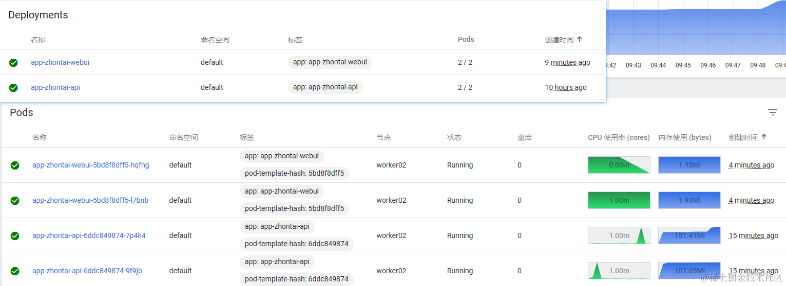

#### 配置 Ingress 使用域名访问

-   部署成功后添加对应 ingress 配置，即可使用域名访问

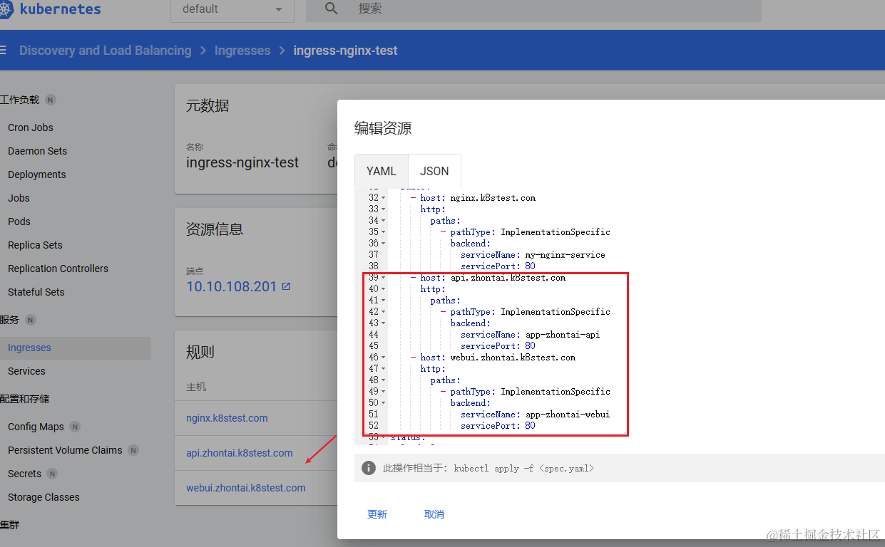

前端项目需要修改为对应的接口地址

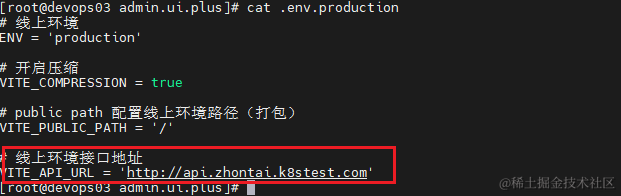

确保绑定的域名正常解析到 k8s 节点，即可使用域名访问了，我这里使用的 DnsServer 泛解析，故可以直接访问，

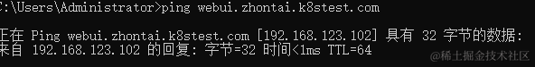

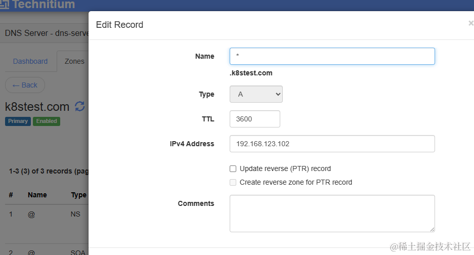

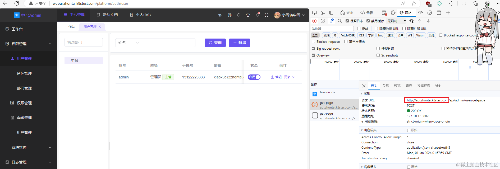

至此，一步步将一个单体项目部署到了 k8s 中，仅供参考，实际如果时微服务，还设计到一些通用和环境的配置，后面再慢慢分享。

根据上面的步骤，后面分享将其整理成脚本，以便后续可以直接使用。

## 相关文档

-   相关文章

    -   [一篇适合躺收藏夹的 Nexus3 搭建 NuGet&Docker 私有库的安装使用总结](https://www.cnblogs.com/morang/p/devops-nexus3-nuget-docker-install-use.html)
    -   [一篇可供参考的 K8S 落地实践经验](https://www.cnblogs.com/morang/p/devops-k8s-install-use.html)
    -   [前后端都用得上的 Nginx 日常使用经验](https://www.cnblogs.com/morang/p/devops-nginx-install-use.html)

-   参考文章

    -   [如何创建一个带诊断工具的.net 镜像](https://www.cnblogs.com/InCerry/p/how-to-build-dotnet-image-with-trace-tool.html)

## 后语

> 本文始于2023末，结束于2024始。
>
> 2023的最后两个月，是这几年以来，学习，产出最高的的两个月。
>
> 始于国庆，不止步于元旦。
>
> 新年快乐！
