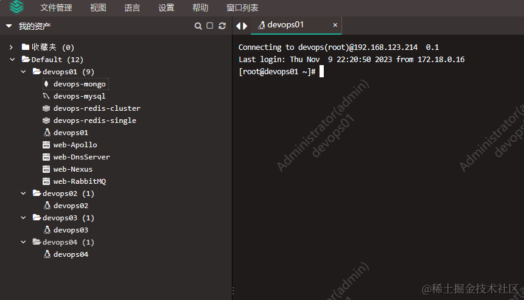

## 前言

> JumpServer 是一个开源的跳板机的解决方案，提供了对远程服务器的安全访问、会话录制和审计、用户身份管理等功能，适用于需要管理机器资源&大量服务器资源的情况。       
> 本文将分享在 docker 中 JumpServer 的安装使用经验，并使用油猴插件扩展其功能

### 特点

-   开源免费，安装使用简单
-   文档完善，成熟文档
-   极致的 Web Terminal 使用体验
-   支持管理 Linux / Windows / 数据库 / K8S 集群 / Web 应用 / Remote App
-   符合 4A 规范的堡垒机：`身份验证 / Authentication` `授权控制 / Authorization` `账号管理 / Accounting` `安全审计 / Auditing`

### 使用情况

-   使用 docker compose 安装
-   web 终端除了传文件没有 MobaXterm 方便， 但是其显示和命令记录以及快捷命令都挺舒服的




## 实践

### 使用 docker compose 安装 JumpServer

-   文件由三部分组成

    -   mariadb 数据库：`jms_mysql` 镜像：mariadb:10.6
    -   reids 缓存：`jms_redis` 镜像： redis:6.2
    -   jumpserver 服务：`jms_server`镜像：jumpserver/jms_all:v3.8.1

-   开放端口

    -   未开放 mysql 和 redis 的端口，只给 jumpserver 提供服务
    -   Jumpserver 开放[端口说明](https://docs.jumpserver.org/zh/v3/installation/network_port)：81:80（未配置域名时验证访问），其他 nginx 使用了 80，通过 nginx 转发到 http://jms_all:80 即可。
    -   定义可信任的访问 [DOMAINS 配置](https://docs.jumpserver.org/zh/v3/installation/setup_linux_standalone/online_install/?h=domains#1)：`jumpserver.devops.test.com``,192.168.123.214:81`

-   指定 mysql 数据库账号密码：root devops666

-   指定 redis 密码：devops666

-   添加了健康检查节点，mysql -p 后面需要紧跟密码，不能有空格
    -   `mysql -h127.0.0.1 -uroot -pdevops666 -e 'SHOW DATABASES;'` 参数后面需要紧跟值，不能有空格

-   对应服务的挂载目录

    -   ./data-mysql
    -   ./data-redis
    -   ./data-server

-   指定网络：devopsnetwork （`docker network create devopsnetwork`）

-   启动时会自动创建&初始化数据库，无需手动初始化

-   以特权模式运行 jms_server

-   参考自官方的 [allinone](https://github.com/jumpserver/Dockerfile/tree/master/allinone) 配置文件

```
version: '3.1'
services:
  jms_mysql:
    image: mariadb:10.6
    container_name: jms_mysql
    restart: always
    environment:
      MARIADB_DATABASE: jumpserver
      MARIADB_ROOT_PASSWORD: devops666
    healthcheck:
      test: "mysql -h127.0.0.1 -uroot -pdevops666 -e 'SHOW DATABASES;'"
      interval: 10s
      timeout: 5s
      retries: 3
      start_period: 30s
    volumes:
      - ./data-mysql:/var/lib/mysql
    networks:
      - devopsnetwork

  jms_redis:
    image: redis:6.2
    container_name: jms_redis
    restart: always
    command: redis-server --requirepass devops666
    environment:
      REDIS_PASSWORD: devops666
    healthcheck:
      test: "redis-cli -h 127.0.0.1 -a devops666 info Replication"
      interval: 10s
      timeout: 5s
      retries: 3
      start_period: 10s
    volumes:
      - ./data-redis:/data
    networks:
      - devopsnetwork
      
  jms_server:
    container_name: jms_all
    restart: always
    image: jumpserver/jms_all:v3.8.1
    volumes:
      - ./data-server/core/data:/opt/jumpserver/data # Core 持久化目录, 存储录像日志
      - ./data-server/koko/data:/opt/koko/data # Koko 持久化目录
      - ./data-server/lion/data:/opt/lion/data # Lion 持久化目录
      - ./data-server/magnus/data:/opt/magnus/data # Magnus 持久化目录
      - ./data-server/kael/data:/opt/kael/data # Kael 持久化目录
      - ./data-server/chen/data:/opt/chen/data # Chen 持久化目录
      - ./data-server/web/log:/var/log/nginx # Nginx 日志持久化目录
    privileged: true
    environment:
      # 自行生成随机的字符串, 不要包含特殊字符串, 长度推荐大于等于 50
      - SECRET_KEY=2FsdGVkX19mzMum9dqqphTCNpm9dqqphTCNpm9dqqphTCNpm9dqqphTCNpm9dqqphTCNpm9dqqphTCNpm9dqqphTCNpCPV
      # 自行生成随机的字符串, 不要包含特殊字符串, 长度推荐大于等于 24
      - BOOTSTRAP_TOKEN=m9dqqphTCNpm9dqqphTCNpm9dqqphTCNp 
      # 日志等级, 测试环境推荐设置为 DEBUG
      - LOG_LEVEL=ERROR
      # redis配置
      - REDIS_HOST=jms_redis
      - REDIS_PORT=6379
      - REDIS_PASSWORD=devops666
      # mysql配置
      - DB_HOST=jms_mysql
      - DB_PORT=3306
      - DB_USER=root
      - DB_NAME=jumpserver
      - DB_PASSWORD=devops666
      # 不设置无法登录,可以设置域名或者服务器的IP
      - DOMAINS=jumpserver.devops.test.com,192.168.123.214:81
    ports:
      - '81:80'
    networks:
      - devopsnetwork

networks:
  devopsnetwork:
    external: true
```

-   运行：`docker compose up -d` 即可
-   一切正常：默认访问 http://192.168.123.214:81 则启动成功


-   DOMAINS 配置了域名和 IP 端口访问，所以现在可以直接使用默认账号密码 admin admin 进行登录
-   登录成功修改密码

### JumpServer 使用 nginx 配置域名转发

还不会在局域网申请 ssl 及配置的可以参考之前的文章 [前后端都用得上的 Nginx 日常使用经验](https://juejin.cn/post/7296754422750232576)

```
server {

    listen 80;
    listen       443 ssl;
    server_name jumpserver.devops.test.com;  # 自行修改成你的域名

    client_max_body_size 4096m;  # 上传文件大小限制

    ssl_certificate      /certs/jumpserver.devops.test.com/server.crt;
    ssl_certificate_key  /certs/jumpserver.devops.test.com/server.key;
    ssl_session_cache    shared:SSL:1m;
    ssl_session_timeout  5m;
    ssl_ciphers  HIGH:!aNULL:!MD5;
    ssl_prefer_server_ciphers  on;

    location / {
            # 这里的 ip 是后端 JumpServer nginx 的 ip
            proxy_pass http://jms_server:80;
            proxy_http_version 1.1;
            proxy_buffering off;
            proxy_request_buffering off;
            proxy_set_header Upgrade $http_upgrade;
            proxy_set_header Connection "upgrade";
            proxy_set_header Host $host;
            proxy_set_header X-Forwarded-For $remote_addr;
    }
}
```

-   配置好 nginx 重载配置生效后访问成功


### JumpServer 的常规使用

-   通过 控制台-资产管理，增加需要管理的 机器、应用，将之前文章安装的 linux 服务器，mysql，redis，mongo 都配置好


-   通过控制台-权限管理 授权用户能够管理的资产


-   通过用户管理和权限管理分配资产权限，可以是用户或者组


-   通过右上角的 Web 终端可以远程连接资产


-   添加 WebSite 后，如果 JumpServer 安装在 Linux，无法在终端预览！！！但是，想了个办法让他直接新窗口打开


### 在终端通过油猴插件打开 WebSite 资产

-   首先需要安装油猴插件：[tampermonkey](https://www.tampermonkey.net/)
-   添加油猴脚本

```
// ==UserScript==
// @name         直接打开JumpServer网站
// @namespace    http://tampermonkey.net/
// @version      0.1
// @description  try to take over the world!
// @author       yimo
// @match        https://jumpserver.devops.test.com/luna/*
// @icon         https://www.google.com/s2/favicons?sz=64&domain=test.com
// @grant        none
// ==/UserScript==

(function() {
    'use strict';

    window.onload=function(){
        console.log('load custom js')
        var ulElement = document.querySelector("#winContainer > div > div > div > ul");
        if(ulElement){
            var newLi = document.createElement('li');
            newLi.innerHTML = '<span style="color:#7494f3;margin-right: 6px">油猴插件 → 网站资产</span> 直接新窗口打开网站';
            ulElement.appendChild(newLi);
        }
        setInterval(()=>{
            document.querySelectorAll(".node_name").forEach(s=>{
                if(s.isAddHtml)return;
                s.isAddHtml=true;
                if(s.parentNode.getAttribute("title").indexOf('http')==0){
                    console.log('检测到站点:'+s.parentNode.getAttribute("title"))
                    s.addEventListener('click',function(e){
                         console.log('click')
                         var titleUrl = s.parentNode.getAttribute("title");
                         window.open(titleUrl);
                         e.stopPropagation();
                    })
                    return;
                }
            })
        },500);
    }
})();
```

-   生效后即可直接打开站点了


-   希望后面可以加个配置直接打开站点吧

## 踩坑记录

-   Jumpserver 默认账号密码 admin admin

-   Mysql 默认账号 root ，密码修改的地方都同步修改
-   mysql健康检查失败，需要将参数值紧跟参数后


-   DOMAINS 为可信域名，配置不存在无法登录

      

-   mysql 和 mongodb 连接使用可以，但是连接测试有问题，待解决 [issues](https://github.com/jumpserver/jumpserver/issues/12028)

       

  


## 相关文档

-   [官网](https://jumpserver.org/)
-   [Github 仓库](https://github.com/jumpserver/jumpserver)
-   [官方 Docker Compose 部署](https://github.com/jumpserver/Dockerfile/tree/master/allinone)
-   [本文相关配置](https://github.com/yimogit/MeDevOps)
-   [JumpServer nginx https 配置参考](https://juejin.cn/post/7296754422750232576)

## 后语

> 通过 JumpServer 可以搭建一套测试环境的相关环境，并且将相关的网站通过其公开，成员可以直接使用，而无需记录地址账号等信息，研究过程中也看了 1Panel，发现对 Docker 没有很好的支持，准备后续接入夜莺监控更好的检测局域网资源的一个状态，敬请期待。
