## 前言

> Nexus 是支持 Nuget、Docker、Npm 等多种包的仓库管理器，可用做私有包的存储分发，缓存官方包。本篇将手把手教学使用 Nexus 搭建自己的 NuGe t& Docker 私有仓库。


### 特点

-   私有化仓库管理

-   支持权限管理

-   缓存依赖包

-   支持插件机制和 REST API

-   成熟稳定强大

-   支持的仓库/包管理
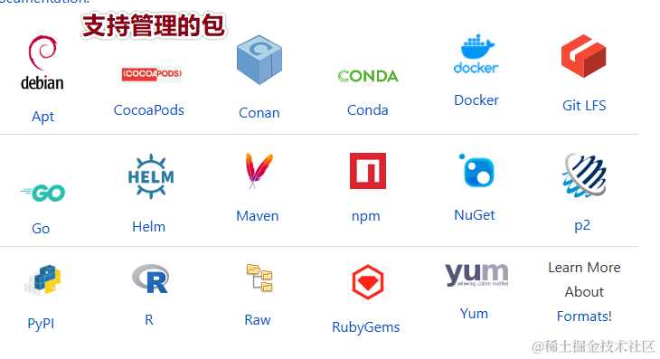
            


### 使用情况

-   成熟文档，使用四平八稳，部署完基本就不需要操心太多
-   功能强大，启动起来内存大概 1.4G+，目前团队使用4G内存的服务器部署，差不多是够用的
-   支持 docker 仓库，尝试一番终于搞定，后续会在 DevOps 系列中使用
-   文档比较完善，遇到问题可以多理解理解文档

## 安装部署

### 使用 docker compose 安装

-   创建数据挂载目录并赋予权限：以 UID 200 的形式运行 `mkdir ./data && chown -R 200 ./data`

-   指定版本：`sonatype/nexus3:3.61.0`

-   默认端口：`8081`

-   指定访问前缀：/

-   指定网络：devopsnetwork （`docker network create devopsnetwork`）

-   部署服务器 IP：`192.168.123.214`

-   创建 compose.yml

       ```
        version: '3.1'
        services:
          nexus:
            image: sonatype/nexus3:3.61.0
            container_name: nexus_3_61 
            restart: always
            environment:
            # Nexus 上下文路径
               NEXUS_CONTEXT: /       
            # 指定jvm参数
               INSTALL4J_ADD_VM_PARAMS: -Xms1g -Xmx1g -XX:MaxDirectMemorySize=3g
            volumes:
            # 需要先给权限 chown -R 200 ./data
            - ./data:/nexus-data
            ports:
              - "8081:8081"
              
            networks:
              - devopsnetwork

        networks:
          devopsnetwork:
            external: true
       ```

-   运行：`docker compose up -d`

-   运行需要时间，耐心等待 2-3 分钟，访问：`http://192.168.123.214:8081/`

-   可以看到提示默认 admin 的密码在 ./data/admin.password ，获取后点击右上角 Sign In 进行登录

       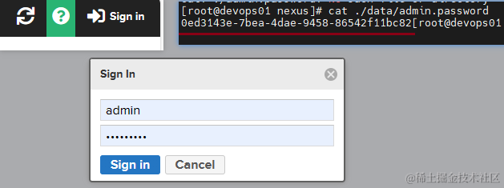

-   登录成功会进行引导修改密码 devops666 和禁用匿名访问

       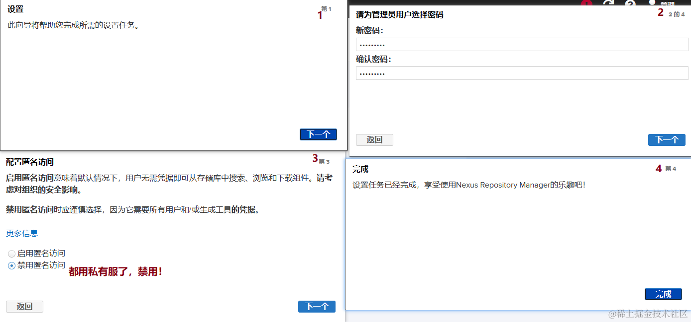

### 使用 nginx 配置域名访问

-   使用 ./02.build-ssl.sh nexus.devops.test.com 生成证书，重载配置即可

```
server {
    listen       80;
    listen       443 ssl;
    server_name  nexus.devops.test.com;
    # allow large uploads of files
    client_max_body_size 1G;

    ssl_certificate      /certs/nexus.devops.test.com/server.crt;
    ssl_certificate_key  /certs/nexus.devops.test.com/server.key;
    ssl_session_cache    shared:SSL:1m;
    ssl_session_timeout  5m;
    ssl_ciphers  HIGH:!aNULL:!MD5;
    ssl_prefer_server_ciphers  on;

    location / {
      proxy_pass   http://nexus_3_61:8081/;
      proxy_set_header Host $host;
      proxy_set_header X-Real-IP $remote_addr;
      proxy_set_header X-Forwarded-For $proxy_add_x_forwarded_for;
    }
}
```

## 落地实践

### 使用 Nexus 管理 Nuget 包

#### 默认项说明

-   nuget-group：组合存储库，可以将多个远程或本地存储库组合成一个虚拟存储库，默认包含 nuget-hosted，nuget.org-proxy。拉取包的地址一般配置此仓库地址
-   nuget-hosted：托管存储库，本地发布的包可以存储到此存储库。推送包的地址需要配置此仓库地址
-   nuget.org-proxy：代理存储库，缓存 nuget.org 的包并从本地服务器上提供它们

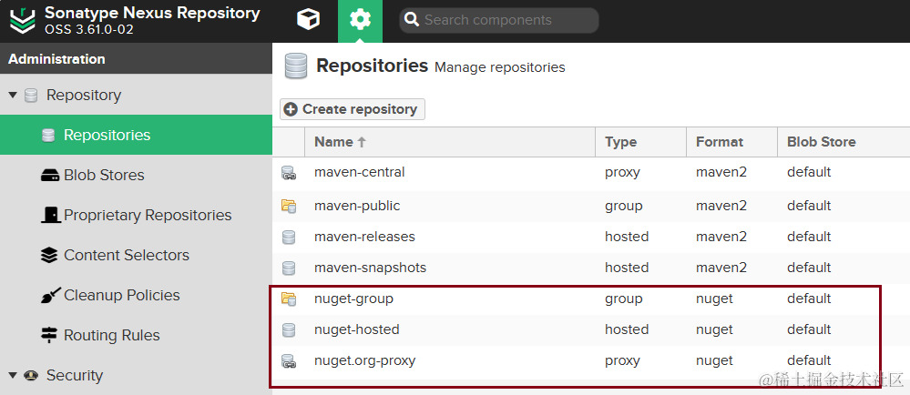

#### 账号的规划及创建

一个企业可能存在着多个团队或项目组，每个团队的包可以分开或者约定好不同的名称前缀

包的读写权限需要分离，即上传者和使用者分开，上传者包含读写权限，使用者只需要有访问权限

#### 创建角色

权限说明：[文档](https://help.sonatype.com/repomanager3/nexus-repository-administration/access-control/privileges#Privileges-PrivilegeActions)

拉取角色：pull-man ，设置权限：`nx-repository-view-*-*-browse` `nx-repository-view-*-*-read`

推送角色：push-man ，设置权限：`nx-component-upload` `nx-repository-view-*-`*`-`*

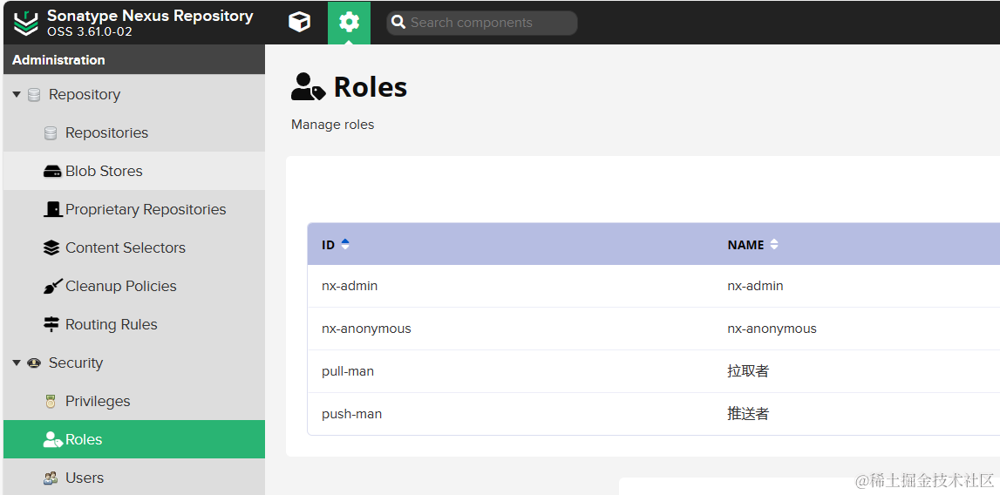

#### 创建账号

拉取账号：puller ， 设置密码 devops666，设置角色：pull-man

推送账号：pusher，设置密码 devops666，设置角色：push-man，nuget 使用的 APIKey 所以暂时没有用到，后面管理 docker 的时候使用

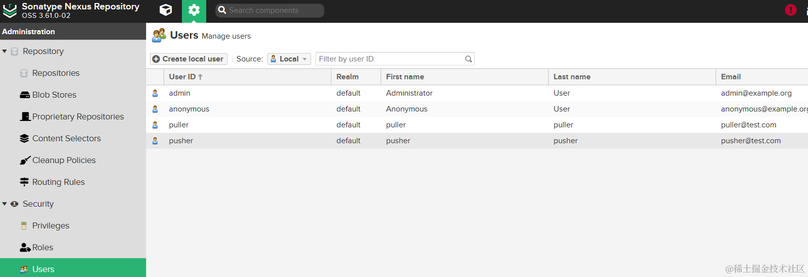

#### 生成 NuGet API 密钥

推送 NuGet 包时需要使用，点击管理员头像->**NuGet** **API** **密钥->生成密钥**

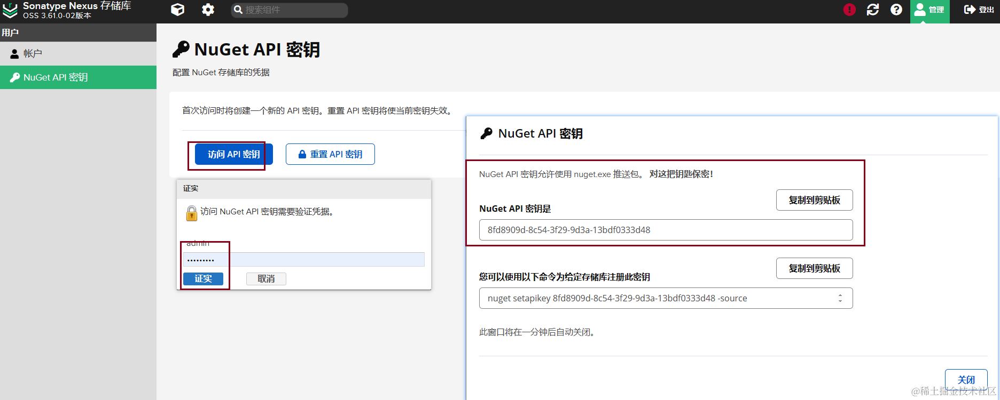

#### 启用 NuGet API 密钥领域

上一步获取了密钥，还无法直接使用，还需要在设置中 Security>Realms 中启用 NuGet API-Key Realm。

类似启用的验证方式，领域说明[见文档](https://help.sonatype.com/repomanager3/nexus-repository-administration/user-authentication/realms#Realms-NuGetAPI-KeyRealm)

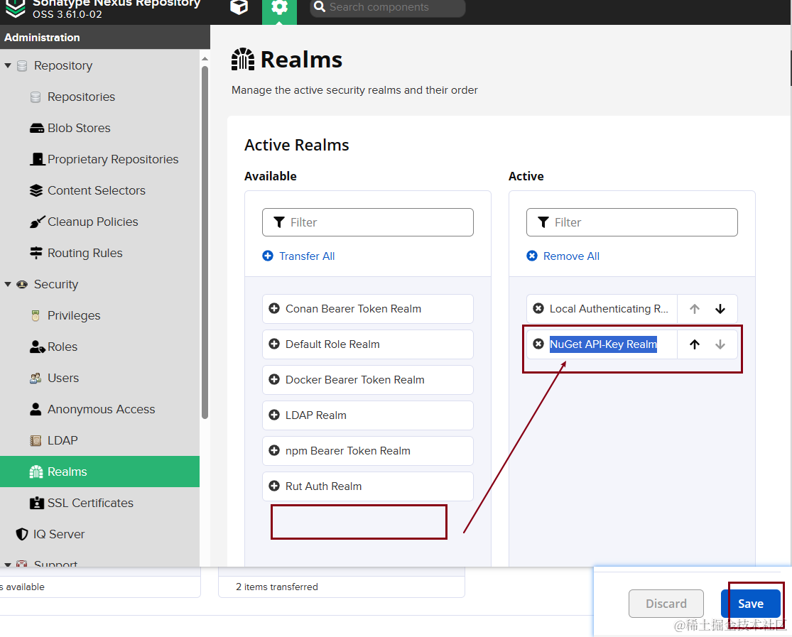

#### 设置部署策略

默认 nuget 包托管是启用了， 而为了防止包被恶意篡改，可以将 nuget-hosted 仓库修改为禁用重新部署，多人协同开发时可防止包被被其他人覆盖，[相关文档说明](https://help.sonatype.com/fw/namespace-confusion-protection#NamespaceConfusionProtection-ConfigureNexusRepository3) 。在设置了禁用重新部署时，推送重复包的时候将会返回 400 错误

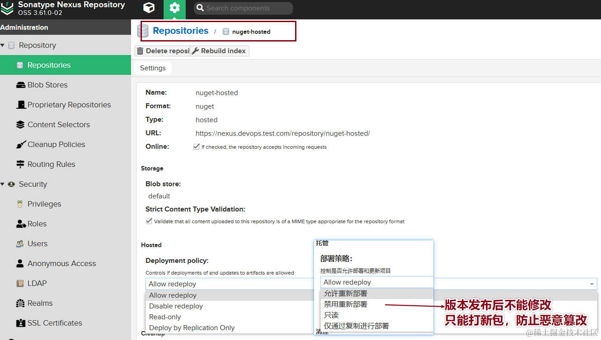

#### 使用 Nexus 的 NuGet 包源

因为前面配置关闭了匿名访问以及配置了相应的账号，所以为了方便的从 Nexus 服务中拉取 Nuget 包，可以通过配置文件 nuget.config （[文档](https://learn.microsoft.com/zh-cn/nuget/reference/nuget-config-file)）来指定 nuget 源为 Nexus 服务 nexus.devops.test.com

-   指定配置节的名称和源（默认使用 NuGet V3，V2 不需要加 index.json）

-   指定使用包源的账号密码

-   将其放到和解决方案同级目录即可生效

       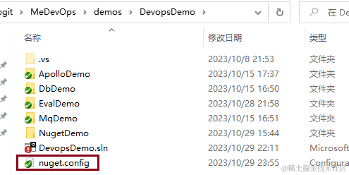

-   nuget.config 文件

       ```
        <?xml version="1.0" encoding="utf-8"?>
        <configuration>
          <packageSources>
            <add key="nexus.devops.test.com" value="https://nexus.devops.test.com/repository/nuget-group/index.json" />
          </packageSources>
          <packageSourceCredentials>
            <nexus.devops.test.com>
              <add key="Username" value="puller" />
              <add key="ClearTextPassword" value="devops666" />
            </nexus.devops.test.com>
          </packageSourceCredentials>
        </configuration>
       ```

#### 推送 NuGet 包到 Nexus

从本地推送一个 NuGet 包到 Nexus 服务进行托管，需要两步，打包，推送。为了更好的使用，可以结合脚本来快速打包，以之前的一个计算字段封装为例将其打包成 NuGet 包推送到 Nexus 中

-   目录结构如下

       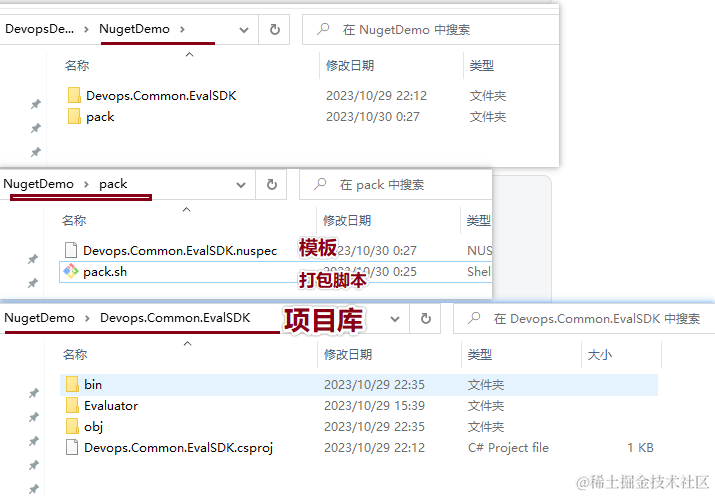

-   首先新建配置一个 .nuspec 模板，根据需要修改库的相关信息，[nuspec 配置文档](https://learn.microsoft.com/zh-cn/nuget/reference/nuspec)

       ```
        <?xml version="1.0" encoding="utf-8"?>
        <package xmlns="http://schemas.microsoft.com/packaging/2010/07/nuspec.xsd">
            <metadata>
                <id>Devops.Common.EvalSDK</id>
                <version>0.0.15</version>
                <authors>yimo</authors>
                <description>计算字段</description>
                <projectUrl>https://github.com/yimogit/MeDevOps</projectUrl>
                <tags>Devops.Common.EvalSDK</tags>
                <repository type="git" url="https://github.com/yimogit/MeDevOps.git" branch="main"/>
            </metadata>
            <files>
              <file src="..\Devops.Common.EvalSDK\bin\Release***.dll" target="lib" />
              <file src="..\Devops.Common.EvalSDK\bin\Release***.pdb" target="lib" />
            </files>
        </package>
      ```

-   打包库的参考，多个版本使用 TargetFrameworks

      ```
        <Project Sdk="Microsoft.NET.Sdk">

          <PropertyGroup>
            <TargetFrameworks>netstandard2.1;netcoreapp3.1;net5.0;net7.0;</TargetFrameworks>
          </PropertyGroup>

          <PropertyGroup>
            <DocumentationFile>bin$(Configuration)$(TargetFramework)\Devops.Common.EvalSDK.xml</DocumentationFile>
          </PropertyGroup>
          
        </Project>
    ```

-   新建打包脚本，修改密钥和地址，后续每次执行前修改版本号，执行即可

       ```
        #!/bin/bash
        pwd
        current_dir=`pwd` 
        #nuget api密钥
        nuget_key="aa7890bf-8dfb-33e3-bed9-c1571e5b9b96" 
        #托管仓库地址
        nuget_source="https://nexus.devops.test.com/repository/nuget-hosted/"
        #包的版本
        package_version="0.0.2"
        #包名
        nupkg_pakcage_name="Devops.Common.EvalSDK.${package_version}.nupkg"
        #项目库路径
        csproj_path="../Devops.Common.EvalSDK/Devops.Common.EvalSDK.csproj"
        #包配置
        nuspec_path="Devops.Common.EvalSDK.nuspec"
        #nuspec path , relative csproj path
        nuspec_path_relative_csproj="../pack/Devops.Common.EvalSDK.nuspec"

        #git pull
        #删除旧版本
        rm -f nupkg_pakcage_name
        cd ${current_dir} 
        #替换版本号
        sed -i 's|<version>.*</version>|<version>'${package_version}'</version>|g' ${nuspec_path}

        echo pack ${nupkg_pakcage_name}
        #打包nupkg文件到当前pack目录 包名.x.x.x.nupkg
        dotnet pack ${csproj_path}  -p:NuspecFile=${nuspec_path_relative_csproj} -c Release --output ../pack  -v m

        #判断是否打包成功
        echo
        if [ ! -f "${nupkg_pakcage_name}" ]; then
            echo "pack ${nupkg_pakcage_name} is error"
            exit -1
        fi

        #推送包
        echo push ${nupkg_pakcage_name}
        dotnet nuget push ${nupkg_pakcage_name} -k ${nuget_key} -s ${nuget_source}
       ```

-   执行成功，在使用 Nexus 源的包管理器中就能搜索使用了

       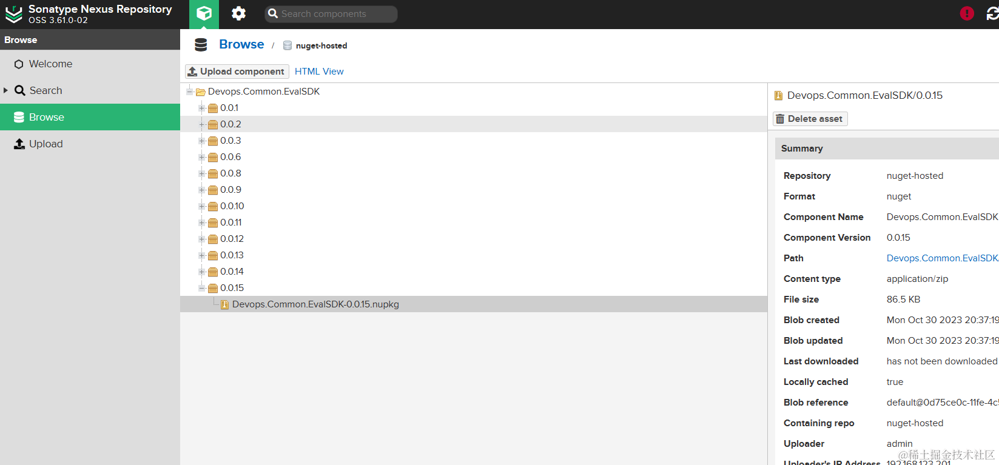
       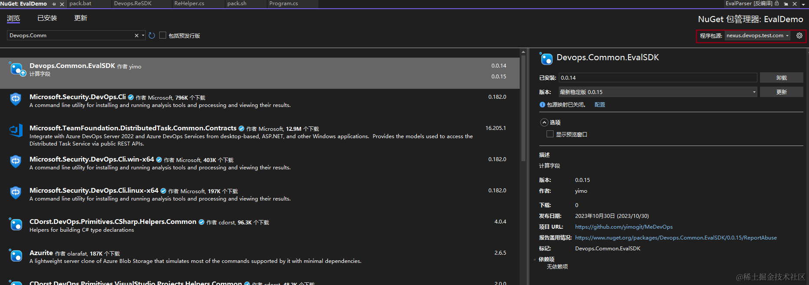

### 使用 Nexus 管理 Docker 镜像

当前版本支持 docker 镜像的管理，使用发现通过 docker-group 推送镜像是需要企业版的，不过还是可以根据拉取和推送的域名/端口分开来达到推送的效果。

可以先看下面这个流程图，再看后续如何配置就很清晰了

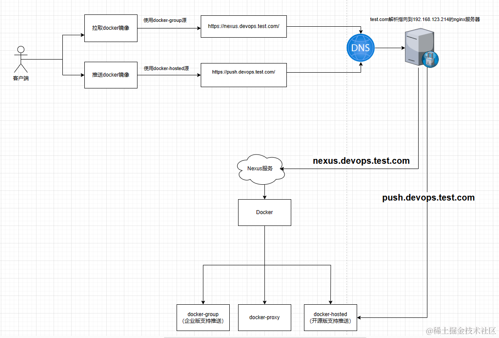

#### 创建角色

权限说明：[文档](https://help.sonatype.com/repomanager3/nexus-repository-administration/access-control/privileges#Privileges-PrivilegeActions) 这里给了所有仓库的拉取以及推送权限，和前面一样，可以只创建对应的 docker 权限

拉取角色：pull-man ，设置权限：`nx-repository-view-*-*-browse` `nx-repository-view-*-*-read`

推送角色：push-man ，设置权限：`nx-component-upload` `nx-repository-view-*-`*`-`*

#### 创建账号

拉取账号：puller ， 设置密码 devops666，设置角色：pull-man

推送账号：pusher，设置密码 devops666，设置角色：push-man

#### 创建 Docker 仓库

和前面 nuget 的三个仓库一样，docker 的仓库也新建三个

-   docker-group：组合存储库，可以将多个远程或本地存储库组合成一个虚拟存储库，默认包含 docker-hosted，docker-proxy。拉取包的地址配置此仓库地址（企业版才支持推送，开源版可以推送到 hosted 库）
-   docker-hosted：托管存储库，本地发布的包可以存储到此存储库。推送包的地址需要配置此仓库地址
-   docker-proxy：代理存储库，缓存 官方 docker 包并从本地服务器上提供它们

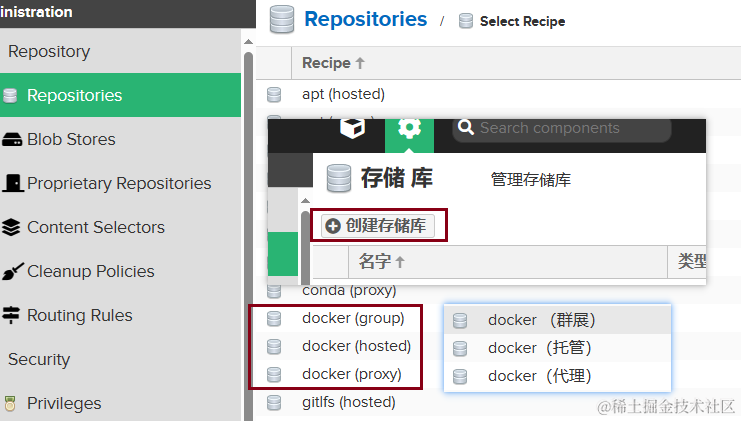

-   创建 docker-hosted 托管库，禁用重新部署，勾上允许部署 latest，存储位置可以自行选择。
-   除此之外，还需要准备一个推送镜像的域名：`push.nexus.devops.test.com`（开源版不支持使用 group 推送镜像）

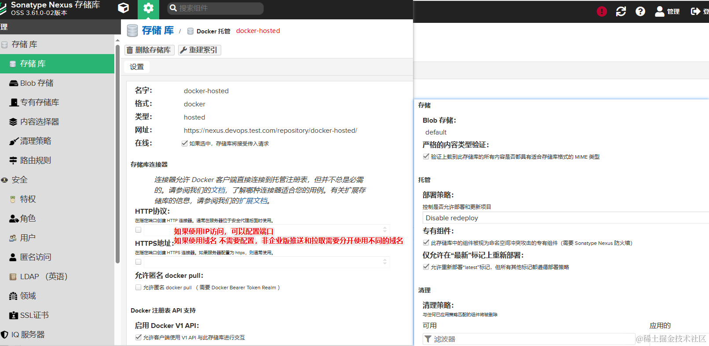

-   创建 docker-proxy 代理库，配置代理地址：`https://registry-1.docker.io`并使用 Use Docker Hub 的索引

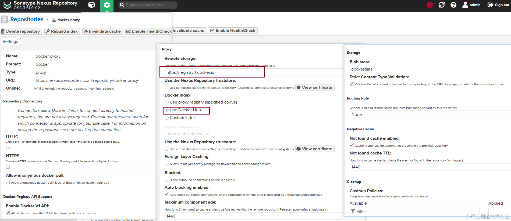

-   创建 docker-group 分组库：选择成员仓库：docker-hosted，docker-proxy 到右边，保存即可

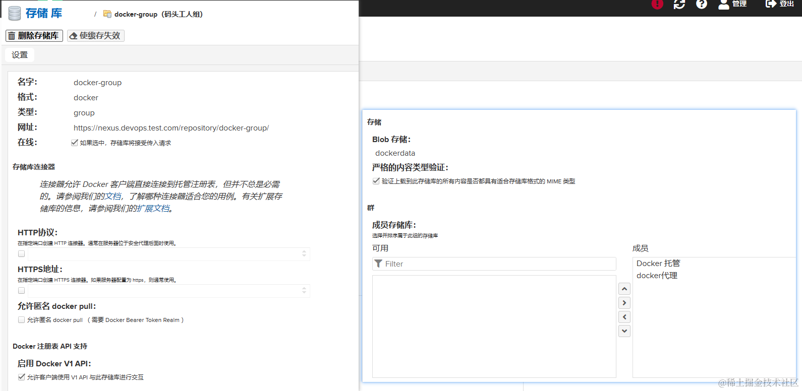

#### 推送和拉取域名的 nginx 代理配置

根据文档与实际使用，https 是必须的，所以依托于之前 [nginx 的证书申请 ](https://juejin.cn/post/7296754422750232576#heading-8)以及 dns 服务的使用，我们可以在局域网中配置域名来访问 nexus3 提供的 docker 镜像仓库服务

默认拉取使用 `nexus.devops.test.com`，推送则使用：`push.nexus.devops.test.com`

以下为 nginx 的配置，根据官方文档所修改，主要替换其中域名与证书，因为是局域网的自定义域名，需要在客户端安装证书才不会有不安全的提示，同理 linux 下使用，也需要安装对应 pem 证书

```

server {
    listen       80;
    listen       443 ssl;
    server_name  nexus.devops.test.com;
    # allow large uploads of files
    client_max_body_size 10G;

    ssl_certificate      /certs/nexus.devops.test.com/server.crt;
    ssl_certificate_key  /certs/nexus.devops.test.com/server.key;
    ssl_session_cache    shared:SSL:1m;
    ssl_session_timeout  5m;
    ssl_ciphers  HIGH:!aNULL:!MD5;
    ssl_prefer_server_ciphers  on;

     location /v2 {
      proxy_pass http://nexus_3_61:8081/repository/docker-group/$request_uri;
      proxy_set_header Host $host:$server_port;
      proxy_set_header X-Real-IP $remote_addr;
      proxy_set_header X-Forwarded-For $proxy_add_x_forwarded_for;
      proxy_set_header X-Forwarded-Proto "https";
    }
    location /v1 {
      proxy_pass http://nexus_3_61:8081/repository/docker-group/$request_uri;
      proxy_set_header Host $host:$server_port;
      proxy_set_header X-Real-IP $remote_addr;
      proxy_set_header X-Forwarded-For $proxy_add_x_forwarded_for;
      proxy_set_header X-Forwarded-Proto "https";
    }
    location / {
      proxy_pass   http://nexus_3_61:8081/;
      proxy_set_header Host $host;
      proxy_set_header X-Real-IP $remote_addr;
      proxy_set_header X-Forwarded-For $proxy_add_x_forwarded_for;
      #proxy_set_header X-Forwarded-Proto $scheme;
      proxy_set_header X-Forwarded-Proto "https";
    }
}

server {
    listen       80;
    listen       443 ssl;
    server_name  push.nexus.devops.test.com;
    # allow large uploads of files
    client_max_body_size 10G;

    ssl_certificate      /certs/push.nexus.devops.test.com/server.crt;
    ssl_certificate_key  /certs/push.nexus.devops.test.com/server.key;
    ssl_session_cache    shared:SSL:1m;
    ssl_session_timeout  5m;
    ssl_ciphers  HIGH:!aNULL:!MD5;
    ssl_prefer_server_ciphers  on;

     location /v2 {
      proxy_pass http://nexus_3_61:8081/repository/docker-hosted/$request_uri;
      proxy_set_header Host $host:$server_port;
      proxy_set_header X-Real-IP $remote_addr;
      proxy_set_header X-Forwarded-For $proxy_add_x_forwarded_for;
      proxy_set_header X-Forwarded-Proto "https";
    }
    location /v1 {
      proxy_pass http://nexus_3_61:8081/repository/docker-hosted/$request_uri;
      proxy_set_header Host $host:$server_port;
      proxy_set_header X-Real-IP $remote_addr;
      proxy_set_header X-Forwarded-For $proxy_add_x_forwarded_for;
      proxy_set_header X-Forwarded-Proto "https";
    }
    location / {
      proxy_pass   http://nexus_3_61:8081/;
      proxy_set_header Host $host;
      proxy_set_header X-Real-IP $remote_addr;
      proxy_set_header X-Forwarded-For $proxy_add_x_forwarded_for;
      #proxy_set_header X-Forwarded-Proto $scheme;
      proxy_set_header X-Forwarded-Proto "https";
    }
}
```

重载配置生效后访问确认 https 是否生效，以及可以查看 restapi 接口是否可以访问

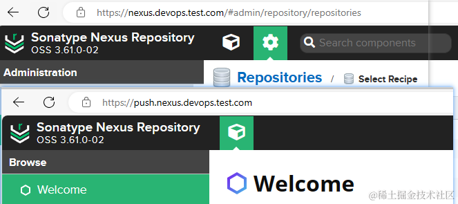

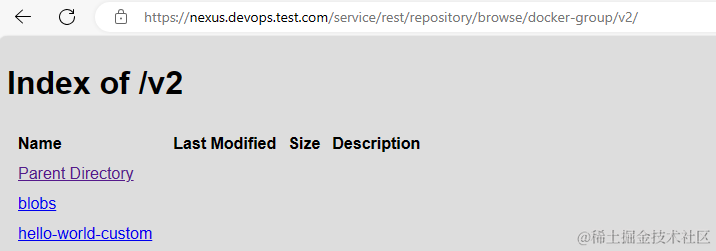

至此，私有的 docker 仓库已经搭建好了，本文基于局域网的自定义域名，如果是服务器，正常解析域名到服务器，申请 ssl 证书等踩的坑都会少一点。接下来就是如何使用 `nexus.devops.test.com`，`push.nexus.devops.test.com` 来拉取&推送 docker 镜像了

#### CentOS8 中使用 Nexus 的 Docker 仓库

因为本文域名是局域网中的 dns 解析，所以需要在 linux 中设置 dns，确保域名能够访问到 nexus 访问，服务器则不需要考虑，跳过直接使用即可

-   使用机器 IP：192.168.123.219

##### CentOS8 设置 DNS

编辑 dns 配置文件：`vi /etc/resolv.conf`

```
nameserver 192.168.123.214
nameserver 114.114.114.114
```

写入后重启网络生效：`systemctl restart NetworkManager`

ping nexus.devops.test.com

ip 是 192.168.123.214 就对了

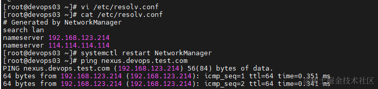

##### 安装自签证书

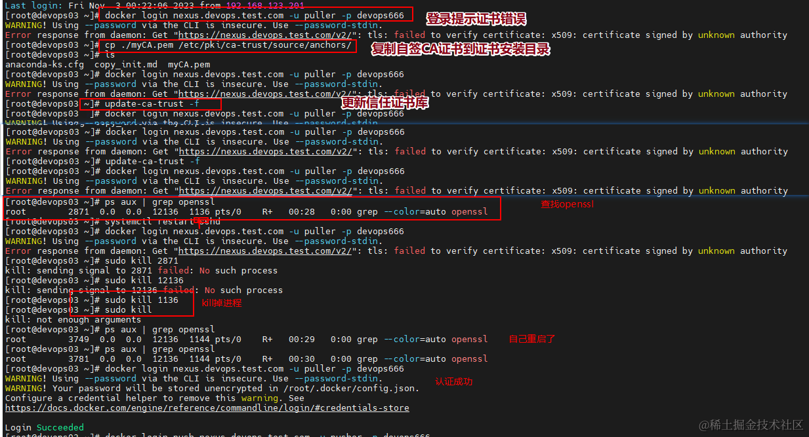

1.  上传或写入证书 myCA.pem 到需要使用的主机 192.168.123.219
1.  复制证书到证书安装目录 `cp ./myCA.pem /etc/pki/ca-trust/source/anchors/`
1.  更新证书信任库：`update-ca-trust -f`
1.  重启 openssl 服务（查找 openssl `ps aux | grep openssl`的 pid: xxx xxx pid 号 pts/0 R+，kill 掉 pid，会自动重新启动 `kill pid号`） **或**直接重启服务器生效（`reboot`）

因为是自签证书，如果未安装证书就使用 `docker login  nexus.devops.test.com`会提示：tls: failed to verify certificate: x509: certificate signed by unknown authority

##### Docker 镜像源认证

```
docker login nexus.devops.test.com -u puller -p devops666
docker login push.nexus.devops.test.com -u pusher -p devops666
```

登录成功后可以查看配置的源：`cat /root/.docker/config.json`

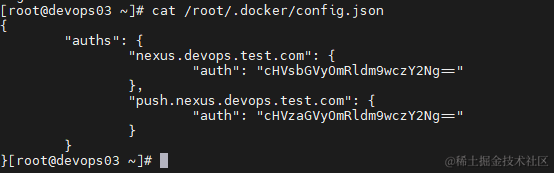

##### 拉取镜像

-   从 nexus.devops.test.com （docker-group）拉取一个 nginx 镜像：` docker pull nexus.devops.test.com/nginx`

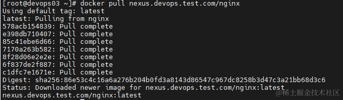

-   拉取完成后，在 docker-proxy 代理库中也可以查看到对应的镜像信息了

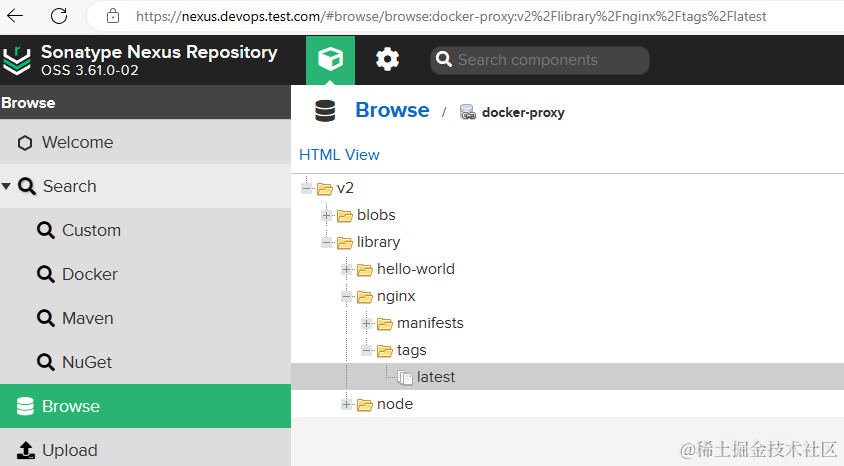

##### 推送镜像

-   确保 push.nexus.devops.test.com 镜像源已认证：` docker login  push.nexus.devops.test.com -u pusher -p devops666 `
-   将上面拉取的镜像打包成新的镜像：

` docker tag  nexus.devops.test.com/nginx` `push.nexus.devops.test.com/nginx_custom`

-   将新的镜像推送到 push.nexus.devops.test.com（docker-hosted） :` docker push push.nexus.devops.test.com/nginx_custom`

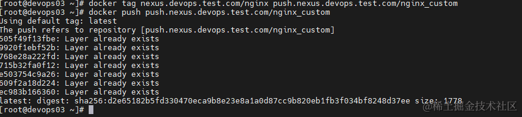

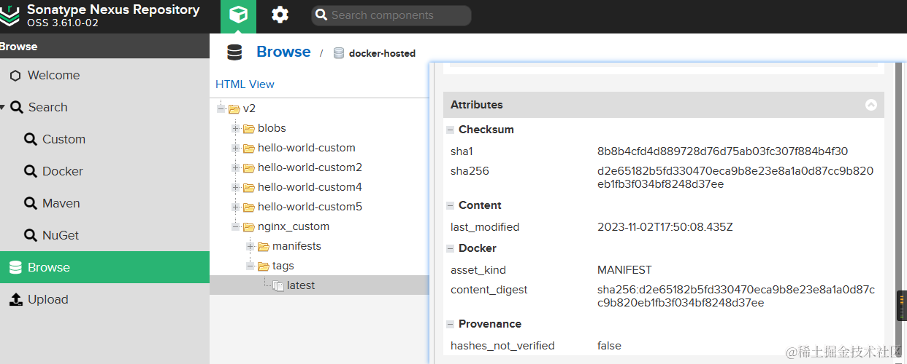

  


  


## 踩坑记录

-   数据目录不设置权限启动失败

       > 数据目录权限：此目录需要可由 Nexus 写入 进程，以 UID 200 的形式运行`chown -R 200 ./data`  
       > 
       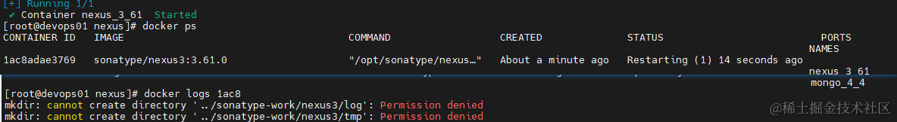

-   NuGet V2 和 NuGet V3 配置对比

       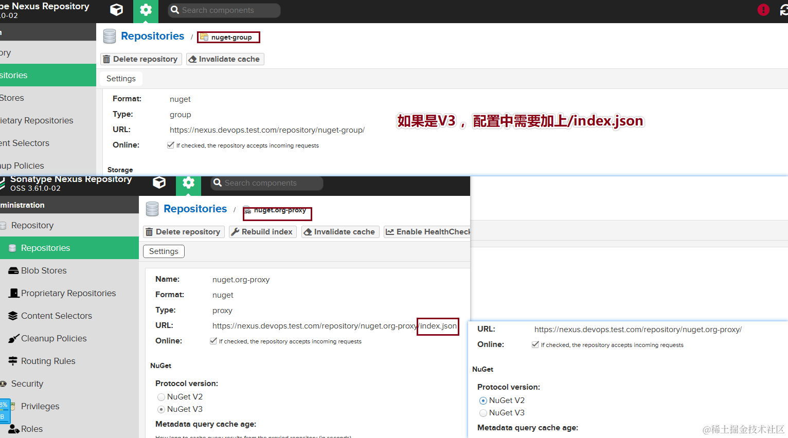

-   NuGet 的 API 密钥生成，但是没有启用领域配置，无法推送包到 Nexus

    -   如果直接使用密钥推送，提示 401，检查 apikey 是否正确，以及设置 NuGet API 密钥[领域](https://help.sonatype.com/repomanager3/nexus-repository-administration/user-authentication/realms#Realms-WhatareRealms)
       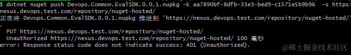
    -     启用 NuGet API-Key Realm
       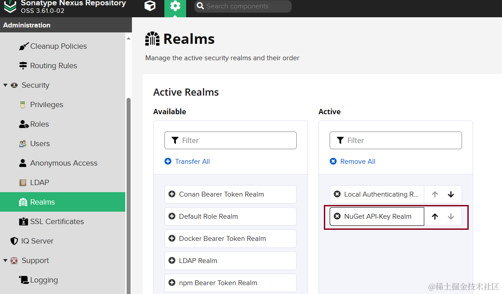

-   禁用重新部署时，但是推送了相同的包时，会返回 400

       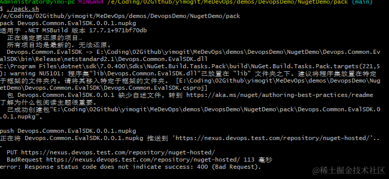

-   Linux 上安装证书，看到很多资料都是执行`update-ca-trust` 就结束了，按着步骤来设置了但无效。最后才想到可能是因为没生效，重启完发现真是，想了下应该是 openssl 需要重启，试了下果然，才得以解决进行下一步。如果不适用局域网域名问题会少很多～

-   Docker 仓库新建的时候那个协议设置理解了半天，找到的文章都是设置端口，配置域名的方式也是一点点理解文档，然后试出来的。

-   解决了之前 Windows 生成自签证书时不能自动输入信息的问题，需要像下面这样写，[参考](https://github.com/openssl/openssl/issues/8795#issuecomment-1605851913)

       ```
        winpty openssl req -new -key $DOMAIN/server.key -out $DOMAIN/server.csr -subj "//C=CN\ST=Beijing\L=Beijing\O=TestOrganization\OU=TestOU\CN=TestRootCA\emailAddress=admin@test.com"
       ```

### 相关文档

-   [官方文档](https://help.sonatype.com/docs)
-   [DockerHub](https://hub.docker.com/r/sonatype/nexus3/)
-   [Github 项目地址](https://github.com/sonatype/docker-nexus3)
-   [Nginx 代理配置文档](https://help.sonatype.com/repomanager3/planning-your-implementation/run-behind-a-reverse-proxy)
-   [Jenkins 插件配置文档](https://help.sonatype.com/iqserver/integrations/plugins-for-continuous-integration-platforms/nexus-platform-plugin-for-jenkins#NexusPlatformPluginforJenkins-RepositoryManager3Integration)
-   [nuget.conf 配置文档](https://learn.microsoft.com/zh-cn/nuget/reference/nuget-config-file)
-   [Docker 仓库域名代理配置文档](https://help.sonatype.com/repomanager3/nexus-repository-administration/formats/docker-registry/docker-repository-reverse-proxy-strategies)

## 后语

> 本篇呕心沥血，绝对是值得收藏的，同时也希望看官们能顺手再点个赞～
>
> 书山有路勤为径，学海无涯苦作舟。
>
> 沉迷学习，无法自拔。jpg
