## 前言

- Hyper-V 安装文档：[在 Windows 10 上安装 Hyper-V](https://learn.microsoft.com/zh-cn/virtualization/hyper-v-on-windows/quick-start/enable-hyper-v)
- CentOS 系统下载：[CentOS 国内镜像源 8.5.2111](https://mirrors.aliyun.com/centos/8.5.2111/isos/x86_64/)
- 作者：[易墨](https://github.com/yimogit)
- 发布时间：2023.10.01
- 原文地址：https://www.cnblogs.com/morang/p/devops-hyperv-centos-install.html

## 使用命令安装

以管理员身份运行 PowerShell 命令：

```
Enable-WindowsOptionalFeature -Online -FeatureName Microsoft-Hyper-V -All
```

> Yes 将会重启

## 配置虚拟机网络

- 创建虚拟交换机-外部-DevOpsNetworkSwitch

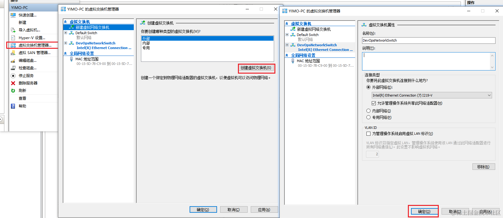

## 创建虚拟机

重启完成后按 Windows 或从开始菜单中找到 Hyper-V 启动开始创建虚拟机

1.  指定名称：devops01

1.  指定目录：F:\HyperV\devops01\

1.  代数：第一代

    1.  > 虽然第二代有更好的安全性、可靠性和灵活性，但不能丝滑的启动！！！
        >
        > 第二代启动连接时会报[UEFI 相关的错](https://internal-api-drive-stream.feishu.cn/space/api/box/stream/download/v2/cover/U5nwbnTdqouh5fxz90xc3GIZnud/?fallback_source=1&height=1280&mount_node_token=S7Mvd9nQwotVOHxYB4RcSGugnZg&mount_point=docx_image&policy=equal&width=1280)，虽然有方案解决，但我选第一代。

1.  启动内存：8096M , 不启用动态内存

    1.  > 动态内存是一种虚拟化技术，在物理内存不足时可以自动调整分配给虚拟机的内存大小。
        >
        > 动态内存可能会引入一定的性能开销，对于需要稳定的应用场景，不适合启用动态内存。

1.  网络连接：DevOpsNetworkSwitch

    1.  > 上一步创建的外部网络交换机，选择后能够获取局域网 IP 进行联网
        >
        > 如果只在虚拟机之间进行通信或单个主机上运行多个虚拟机，可以选择内部网络。如果您需要让虚拟机连接到外部网络并与其他设备进行通信，就需要选择外部网络。
        >
        > 在使用外部网络时，需要分配 IP 地址和子网掩码，并配置默认网关、DNS 服务器等网络参数。

1.  创建虚拟硬盘(100G)：F:\HyperV\devops01\devops01\Virtual Hard Disks\

1.  选择操作系统：F:\HyperVOs\CentOS-8.5.2111-x86_64-dvd1.iso [centos8.5.2111 DVD 版 10G aliyun](https://mirrors.aliyun.com/centos/8.5.2111/isos/x86_64/CentOS-8.5.2111-x86_64-dvd1.iso)

    1.  > DVD 版本：完整的安装镜像，包含了完整的软件包集合和安装工具
    1.  > Boot 版本：仅包含了用于启动和引导 CentOS 安装程序的最小必需的文件和工具。通过网络下载剩余的软件包
        >
        > 版本选择：CentOS 8.5.2111 提供更长时间的支持，直到 2029 年 11 月 30 日

1.  确认信息完成创建

    1.  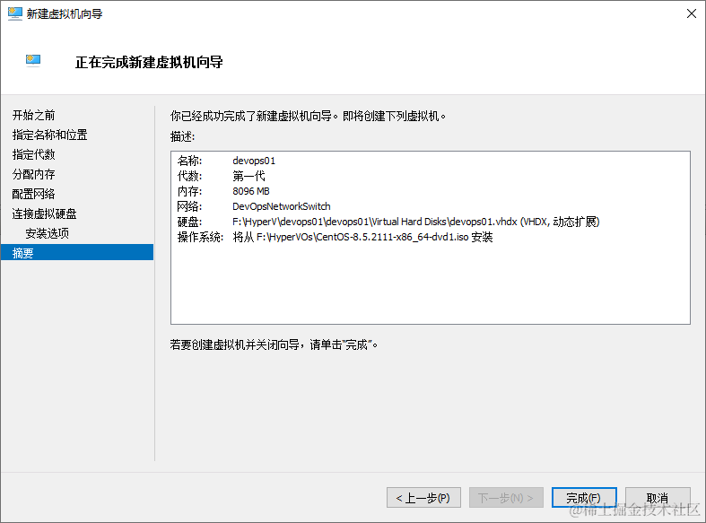

## 安装 CentOS 8.5.2111

1.  启动并连接到虚拟机 devops01

    1.  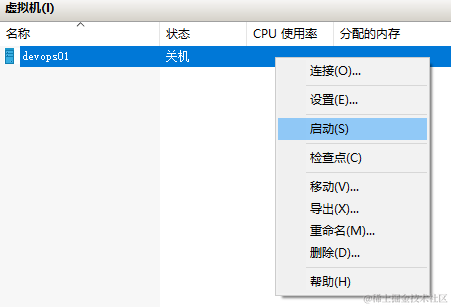

1.  设置安装向导

    1.  > **LOCALIZATION**
        >
        > Keyboard 　　　　　　键盘布局
        >
        > Language Support 　　语言支持
        >
        > Time &Date 　　　　　时间日期设置
        >
        > **SOFTWARE**
        >
        > Installation Source 　　安装来源
        >
        > Software Selection 　　软件选择（这里可以选择安装是带 gui 桌面和最小化安装之类的）
        >
        > **SYSTEM**
        >
        > INSTALLATION DESTINATION 　安装位置
        >
        > KDUMP（默认）　　　　　　　　 KDUMP 用来监控内核崩溃的时候用的,基本上没有,禁用
        >
        > Network &Host NAME 　　　　　　网络和主机名
        >
        > Security Policy 　　　　　　　　　 安全策略
        >
        > **USER SETTINGS**　　用户设置
        >
        > Root Password 　　 root 密码
        >
        > User Creation 　　创建用户

1.  选择键盘布局：默认英文就好，不要选中文

1.  设置时区：Asia shanghai

1.  设置安装源：默认即可

    1.  > 如果使用的 8.4.2105-x86_64-boot 版本，可以先在这里设置 On the network 阿里云的包源：http://mirrors.aliyun.com/centos/8/BaseOS/x86_64/os/

1.  选择软件安装：最小化安装 Minimal Install

    1.  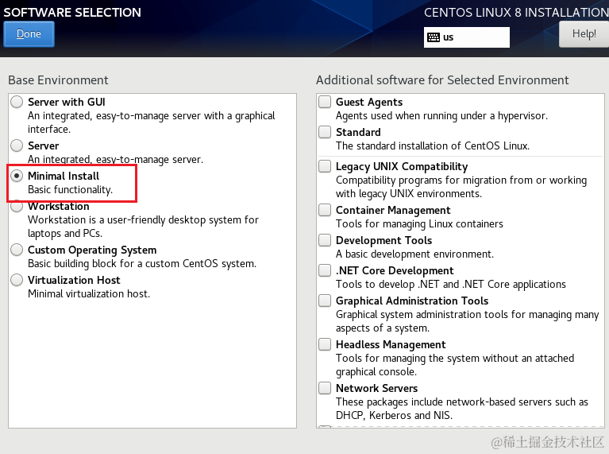

1.  设置分区：不会分就先不分

1.  设置网络：根据自己本地的 IP 信息来配置

    1.  > 也可以安装完再配置，这里我本机的 IP 时 192.168.123.201，网关时 192.168.123.1，子网掩码：255.255.255.0，配置
    1.  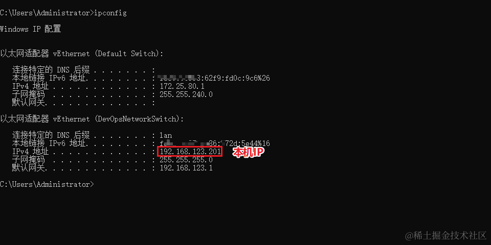
    1.  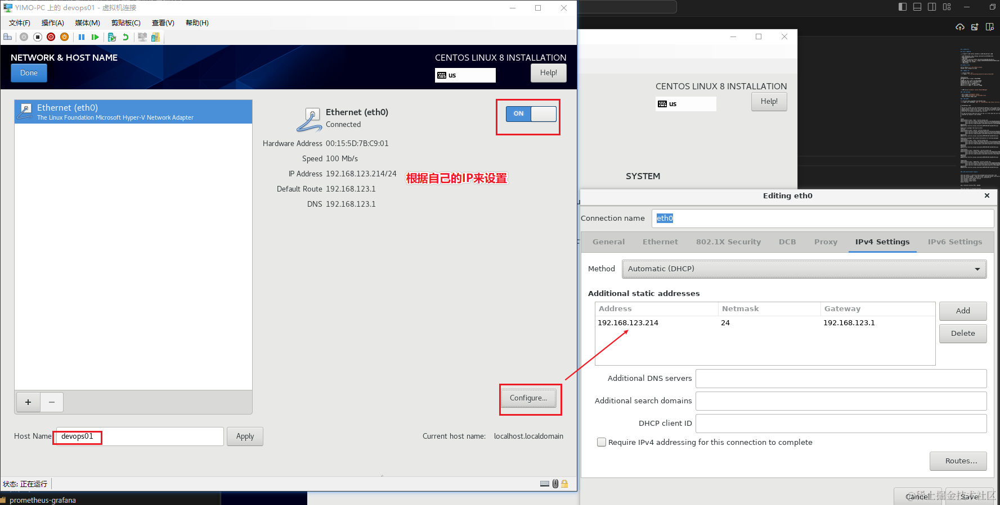

1.  设置 root 密码：devops666

1.  安装完成后重启即可

    1.  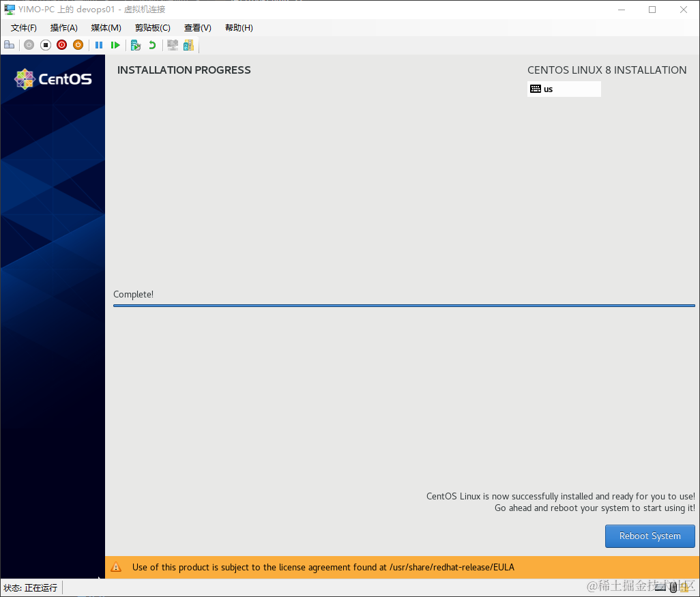

1.  网络测试

    1.  查看 IP：`ip add show`
    1.  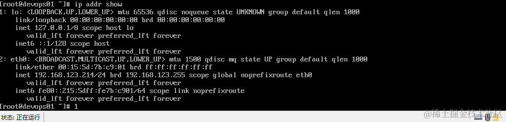
    1.  访问百度：`curl https://www.baidu.com`
    1.  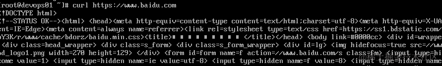

## 使用 MobaxTerm 连接服务器

> 一款功能强大的全功能终端软件，它集成了远程连接、X11 转发和远程桌面等多种功能

官网下载：https://mobaxterm.mobatek.net/download.html

中文汉化版：https://github.com/RipplePiam/MobaXterm-Chinese-Simplified

授权码生成:https://github.com/malaohu/MobaXterm-GenKey

下载后直接运行即可

创建文件夹 devops，并创建会话，使用 root+devops666 即可连接到刚刚超级的虚拟机 192.168.123.214

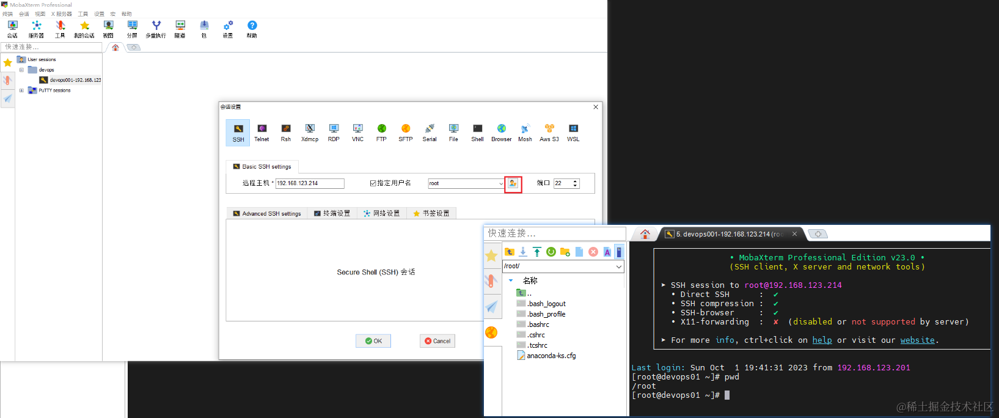

## 网卡配置

将地址修改为静态地址，固定 IP，防止 IP 重新分配

`vi /etc/sysconfig/network-scripts/ifcfg-eth0`

修改 `BOOTPROTO=dhcp` 为 `BOOTPROTO=static`

重启网络生效：`systemctl restart NetworkManager`

```
TYPE=Ethernet
PROXY_METHOD=none
BROWSER_ONLY=no
BOOTPROTO=static
DEFROUTE=yes
IPV4_FAILURE_FATAL=no
IPV6INIT=yes
IPV6_AUTOCONF=yes
IPV6_DEFROUTE=yes
IPV6_FAILURE_FATAL=no
NAME=eth0
UUID=9dcfadf8-90a9-43a0-8c7b-27d4edc48c83
DEVICE=eth0
ONBOOT=yes
IPADDR=192.168.123.214
PREFIX=24
GATEWAY=192.168.123.1
IPV6_PRIVACY=no
```

## 软件源配置

1.  使用 curl 下载包源配置到 /etc/yum.repos.d/CentOS-Base.repo
1.  删除默认的包源配置文件 CentOS-Linux-AppStream.repo 和 CentOS-Linux-BaseOS.repo，
1.  刷新软件包缓存

```
curl -o /etc/yum.repos.d/CentOS-Base.repo https://mirrors.aliyun.com/repo/Centos-vault-8.5.2111.repo
rm /etc/yum.repos.d/CentOS-Linux-AppStream.repo -f
rm /etc/yum.repos.d/CentOS-Linux-BaseOS.repo -f
dnf clean all
```

## 常用命令

- 查看主机名：`hostnamectl status`

- 修改主机名：`hostnamectl set-hostname devops02`

- 查看版本：`cat /etc/redhat-release`

  - > CentOS Linux release 8.5.2111

- 查看网络信息：`ip a`

- 查看网卡配置：`cat etc/sysconfig/network-scripts/ifcfg-eth0`

- 重启网络：`systemctl restart NetworkManager`

## 复制已经装好的虚拟机

1.  导出装好的虚拟机：`F:\HyperVBak`

    1.  将导出后的文件夹重命名为 devops_centos8_docker

1.  导入，并将其存储到 F:\HyperV\devops_centos8_docker\以作为模板使用

    1.  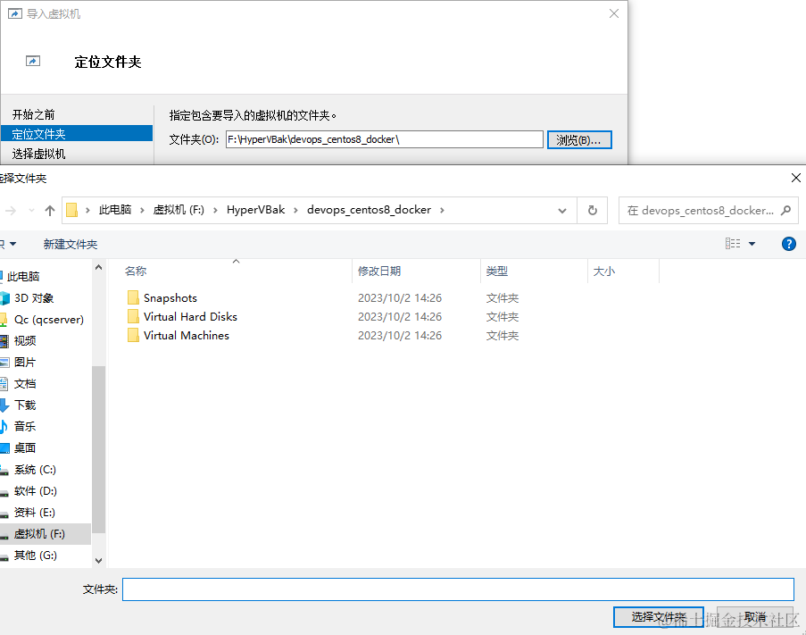
    1.  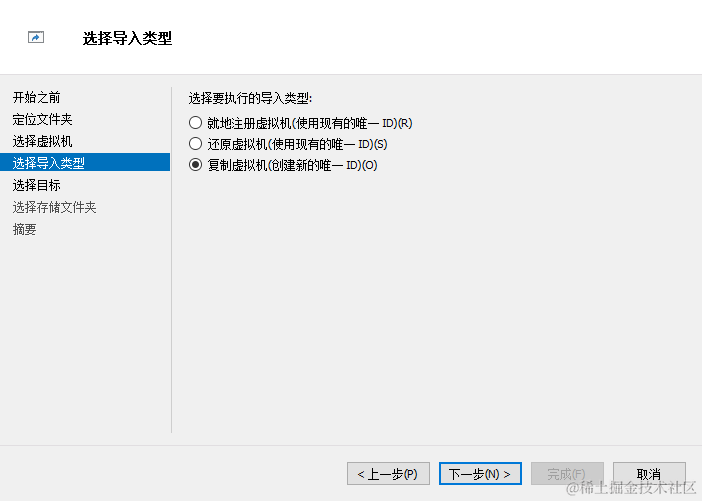
    1.  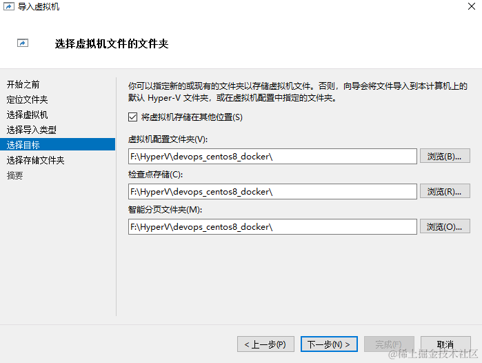
    1.  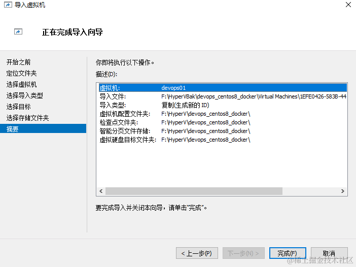

1.  修改主机名：`hostnamectl set-hostname devops02`

1.  修改固定 IP，UUID:`vi /etc/sysconfig/network-scripts/ifcfg-eth0`

    1.  可以先用 ping 192.168.123.216 确保 IP 未被占用，我这为啥跳过 215 就是因为占用了
    1.  

1.  重启主机：`reboot`

1.  可以独立一个虚拟机作为模板主机，将 IP 设置为动态 IP，开机后使用 ip addr show 获得 IP 后就使用 MobaxTerm 连接操作更加方便

## 后语

- 安装&记录耗时：3 小时
- 参考：**[Centos 8 安装](https://www.cnblogs.com/alexlv/p/14744558.html)**
- 如果有用的化，欢迎点赞收藏评论三连
