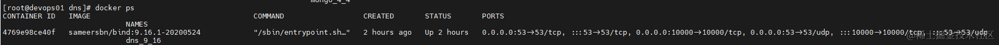
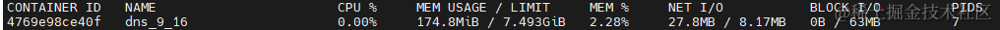
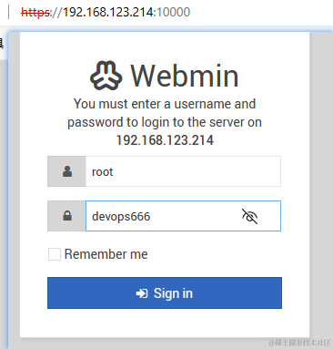
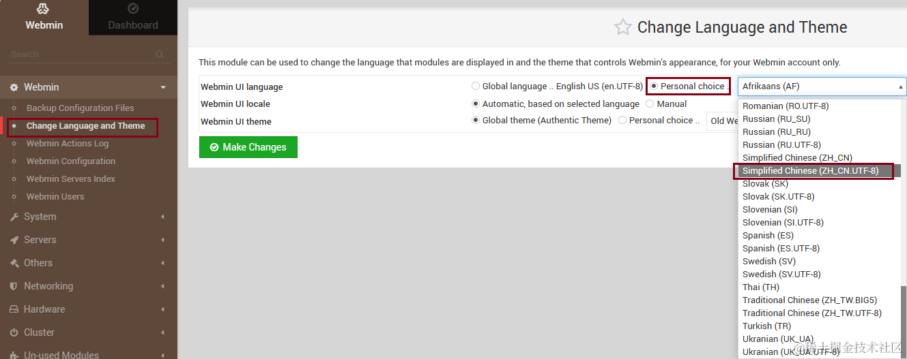
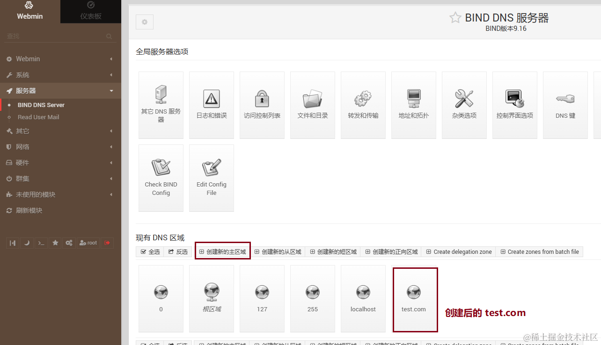
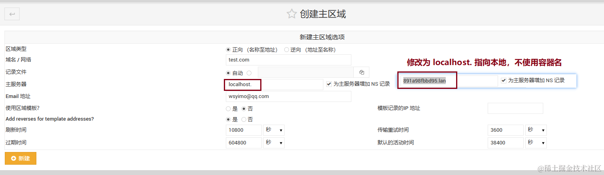
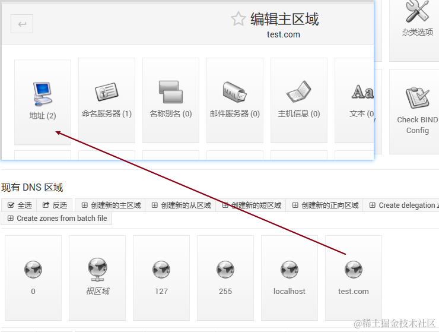
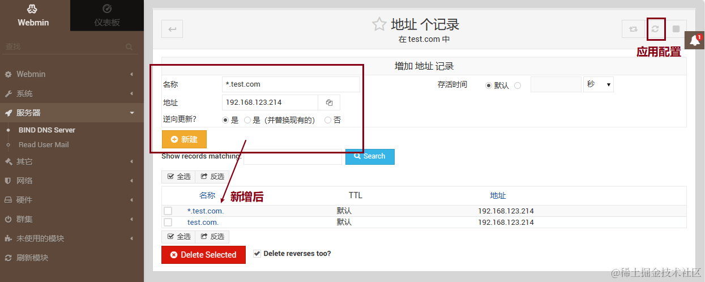
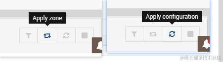
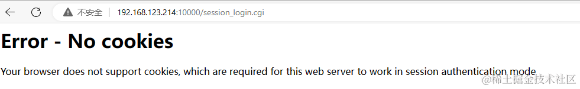

## 前言

> 前面使用 nginx 代理转发了几个域名到服务器，但是每次添加一个域名都需要在客户端添加一行 hosts 文件，无疑是繁琐的，其中也提到可以使用 DNS 来实现自动解析域名 到指定服务器的功能，本篇将介绍开源 DNS 服务 docker-bind 的部署和使用

### 特点

-   docker-bind 是一个基于 BIND 与 Webmin 构建的 DNS 服务镜像
-   BIND 是实现互联网域名系统 （DNS） 协议的开源软件，用于搭建 DNS 服务。
-   Webmin 是一款开源的Web界面管理工具，用于浏览器远程管理服务器
-   开源免费， 配置丰富（复杂），成熟稳定，中文主题支持有限，提供了一些服务器管理功能（监控，远程命令等），资源占用和安全性在使用时需要注意

### 使用情况

-   功能多但是大多有其他的平替，单独使用可以，但是个人不建议在容器中使用
- 用了两天感觉还是太重了，换成 DnsServer 了，下篇分享

## docker-bind 的安装使用

### 准备

-   版本：v9.16.1-20200524
-   docker 镜像：sameersbn/bind:9.16.1-20200524
-   默认端口映射：53:53/tcp 53:53/udp 10000:10000/tcp（53 端口为 DNS 服务使用，10000 为 Webmin 使用）
-   Webmin 访问：https://ip:10000 必须使用 https 访问

### 使用 Docker Compose 安装

> 本篇文章基于 Docker V24 及 Docker Compose V2，安装可以参考之前的[文章](https://juejin.cn/post/7283873796977197108)

#### 配置说明

-   镜像版本：`sameersbn/bind:9.16.1-20200524`
-   指定时区：`Asia/Shanghai`
-   启用 Webmin 并指定 root 密码：`devops666`
-   启用 SSL：默认值为 true，用 https 访问 webmin（https://ip:10000）
-   指定端口映射：53:53/tcp 53:53/udp 10000:10000/tcp（53 端口为 DNS 服务使用，10000 为 Webmin 端口）
-   挂载数据目录：`./data:/data`
-   指定网络：devopsnetwork （`docker network create devopsnetwork`）

#### 配置文件 compose.yml

-   准备好 compose.yml 拷贝到服务器
-   然后运行`docker compose up -d`即可

```
version: '3.1'
services:
  dns:
    image: sameersbn/bind:9.16.1-20200524
    container_name: dns_9_16
    restart: always
    environment:
      TZ : 'Asia/Shanghai'
      ROOT_PASSWORD: devops666
      WEBMIN_ENABLED: true      
      WEBMIN_INIT_SSL_ENABLED: true
    ports:
        - '10000:10000/tcp'
        - '53:53/udp'
        - '53:53/tcp'
    volumes:
      - ./data:/data
    networks:
      - devopsnetwork

networks:
  devopsnetwork:
    external: true
```

#### 部署成功

部署机器 IP：192.168.123.214



容器中资源占用情况



### Webmin 的使用

-   部署成功后访问：https://192.168.123.214:10000 默认启用了 SSL，使用 https://ip:prot



-   启用中文主题， 虽然支持有限，但聊胜于无

       

-   有非常多的功能，监控，远程执行命令等，安装好自行体验即可

-   目前需求是需要配置 dns 以将 test.com 解析到 192.168.123.214 中

1.  服务器->BIND DNS Server->创建新的主区域

      
       

     

1.  现有DNS区域->地址->新增记录，可以使用通配符解析，新建后应用配置生效

      
       

      
        添加配置后记得应用配置
        
      

1.  本机设置 dns `192.168.123.214` 以及 `114.114.114.114`(不然无法访问其他网站)

      

1.  验证dns，正常ping test.com 的IP是存在的，现在就被解析到我们自己的dns了

      
        可能存在dns缓存，使用 `ipconfig /flushdns`刷新即可
      

### 踩过的坑

-   默认启用了 SSL，所以如果使用 http 会提示，使用 https 访问


-   Edge 如果禁用 https 初始化会提示：Error - No cookies Chrome 可以

    -   

-   代理/VPN的设置不对可能导致 DNS 时好时坏，这个时候记得检查下代理，正常dns的生效都挺快的

### 相关文档

-   BIND官网：[BIND](https://www.isc.org/bind)
-   Webmin官网：[Webmin](http://www.webmin.com/)
-   项目地址：[Github](https://github.com/sameersbn/docker-bind)
-   镜像仓库：[DockerHub](https://hub.docker.com/r/sameersbn/bind)
-   安装参考：[docker部署内网dns解析服务](https://blog.csdn.net/qq_36961626/article/details/123314087)

## 后语

> 安装2分钟，文章写了一天，反复的尝试，理论的查询，时间飞逝
