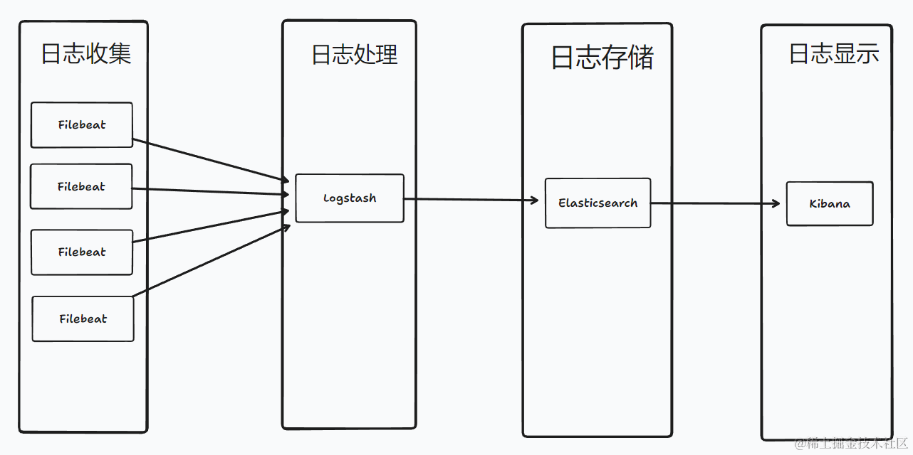
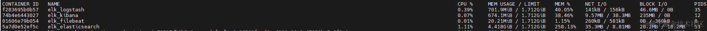
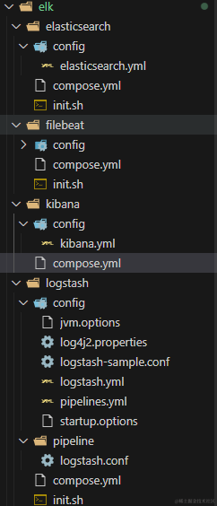
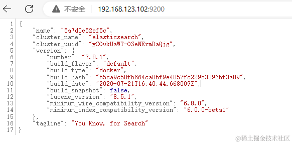
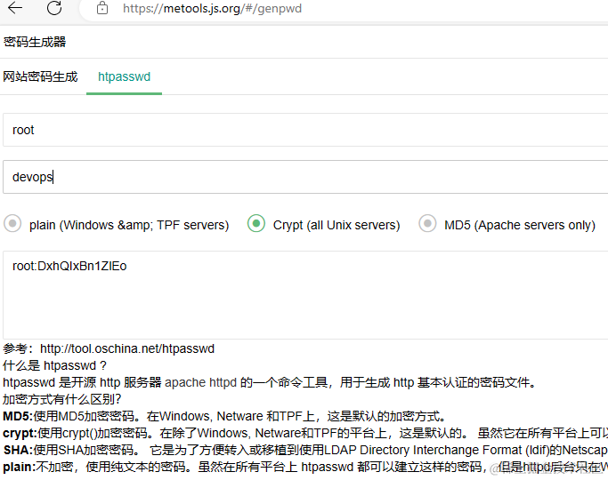
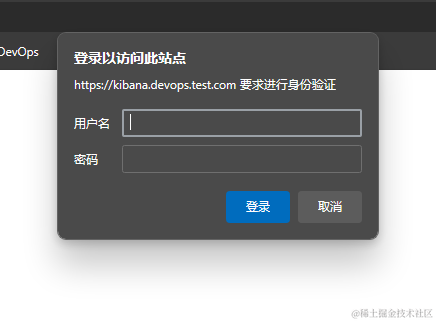

## 前言

> ELK 是指 Elasticsearch、Logstash 和 Kibana 这三个开源软件的组合。
>
> Elasticsearch 是一个分布式的搜索和分析引擎，用于日志的存储,搜索,分析,查询。
>
> Logstash 是一个数据收集、转换和传输工具，用于收集过滤和转换数据，然后将其发送到 Elasticsearch 或其他目标存储中。
>
> Kibana 是一个数据可视化平台，通过与 Elasticsearch 的集成，提供了强大的数据分析和仪表盘功能。
>
> Filebeat 是 Elastic Stack（ELK）中的一个组件，用于轻量级的日志文件收集和转发。它能够实时监控指定的日志文件，并将其发送到 Elasticsearch 或 Logstash 进行处理和分析。

ELK的架构有多种，本篇分享使用的架构如图所示： Beats(Filebeat) -> -> Elasticsearch -> Kibana，目前生产环境一天几千万的日志，内存占用大概 10G 左右



### 特点

-   开源免费
-   灵活性和可扩展性，高可用性，易扩展，支持集群
-   高效的搜索和分析功能
-   实时性
-   易于使用

### 使用情况

-   目前微服务项目使用，ELK单机部署，处理千万级日志无压力
-   使用 Kibana 做了面板，根据面板监控系统情况
-   使用 Docker 部署，方便快捷
-   上手用还算简单，但是弄懂这一套，就不是那么容易了
-   提炼出 docker compose 配置，分分钟部署好

## 实践

### 准备

-   一台 linxu 服务器，内存 8G+
-   安装 docker,docker compose
-   新机器搭建后的运行情况，限制了Elasticsearch的jvm参数 4g



-   本篇文件目录结构,完整文件在Github [MeDevOps 仓库](https://github.com/yimogit/MeDevOps/tree/main/elk)



### 安装

本篇 ELK 的版本为 v7.8.1,本篇使用的容器网络为 devopsnetwork ，需创建 `docker network create devopsnetwork`

#### Elasticsearch 使用 docker compose 安装

-   [官方使用 Docker 安装文档](https://www.elastic.co/guide/en/elasticsearch/reference/7.8/docker.html)

-   compose.yml

    -   指定了jvm参数：4g
    -   暴露端口 9200：该端口是Elasticsearch REST API的默认端口。
    -   暴露端口 9300：该端口是Elasticsearch节点之间的内部通信端口，默认用于节点之间的集群通信
    -   挂载数据目录 `./data`及配置文件`./config/elasticsearch.yml`
    -   需要对两个目录进行授权，这里直接用了777，也可以根据官网使用对应es的用户id 1000

```
version: '3.1'
services:
  elk_elasticsearch:
    image: elasticsearch:7.8.1
    container_name: elk_elasticsearch
    restart: always
    environment:
      - discovery.type=single-node
      - ES_JAVA_OPTS=-Xms4096m -Xmx4096m
    ports:
      - 9200:9200 
      - 9300:9300 
    volumes:
      # 授权 chmod 777 ./config/ && chmod 777 ./data/
      - ./data:/usr/share/elasticsearch/data
      - ./config/elasticsearch.yml:/usr/share/elasticsearch/config/elasticsearch.yml
    networks:
      - devopsnetwork

networks:
  devopsnetwork:
    external: true
```

-   config/elasticsearch.yml

```
network.host: 0.0.0.0
xpack:
  ml.enabled: false
  monitoring.enabled: false
  security.enabled: false
  watcher.enabled: false
```

将其拷贝到服务器执行启动即可

```
#cd /app/elasticsearch
mkdir ./config
mkdir ./data
chmod 777 ./config/ && chmod 777 ./data/
docker compose up -d
```

验证访问



#### Logstash 使用 docker compose 安装

-   [官方使用 Docker 安装 文档](https://www.elastic.co/guide/en/logstash/7.8/docker-config.html)

-   compose.yml

    -   暴露端口5044：用于接收来自其他主机的日志数据、
    -   挂载的 `./pipeline`和`./config`目录可以运行容器复制出来
    -   需要将./config/logstash.yml 和 ./pipeline/logstash.conf 改成es地址，[参考](https://github.com/yimogit/MeDevOps/tree/main/elk/logstash)

```
version: '3.1'
services:
  elk_logstash:
    image: logstash:7.17.16
    container_name: elk_logstash
    restart: always
    ports:
      - 5044:5044 
    volumes:
     # 授权 chmod 777 ./logs/ && chmod 777 ./data/ && chmod 777 ./pipeline/ && chmod 777 ./config/ 
      - /etc/timezone:/etc/timezone
      - /etc/localtime:/etc/localtime:ro
      - ./logs:/usr/share/logstash/logs
      - ./data:/usr/share/logstash/data
      - ./pipeline:/usr/share/logstash/pipeline
      - ./config:/usr/share/logstash/config
    networks:
      - devopsnetwork

networks:
  devopsnetwork:
    external: true
```

-   pipeline/logstash.conf

    -   根据需要修改 output ，这里将推送到es地址中
    -   [输出插件文档](https://www.elastic.co/guide/en/logstash/7.8/plugins-outputs-elasticsearch.html)

```
input {
    beats {
        port => 5044
        codec => json {
            charset => "UTF-8"
        }
    }

}

filter {  
 
}

output {
    elasticsearch { 
      hosts => ["http://192.168.123.102:9200"]
      index => "%{[app]}-%{+YYYY.MM.dd}" 
  }    
  stdout { 
    codec => rubydebug 
  }
}
```

将其拷贝到服务器执行启动即可

```
mkdir ./data
mkdir ./logs
chmod 777 ./logs/ && chmod 777 ./data/ && chmod 777 ./pipeline/ && chmod 777 ./config/ 
docker compose up -d
```

#### Kibana 使用 docker compose 安装

-   [官方使用 Docker 安装文档](https://www.elastic.co/guide/en/beats/filebeat/7.8/running-on-docker.html#_run_the_filebeat_setup)

-   compose.yml

    -   指定es节点是单节点，多节点使用zen
    -   挂载配置文件 `./config/kibana.yml`
    -   暴露端口 5601：面板访问端口

```
version: '3.1'
services:
  elk_kibana:
    image: kibana:7.8.1
    container_name: elk_kibana
    restart: always
    environment:
      - discovery.type=single-node
    ports:
      - 5601:5601 
    volumes:
      - ./config/kibana.yml:/usr/share/kibana/config/kibana.yml
    networks:
      - devopsnetwork

networks:
  devopsnetwork:
    external: true
```

-   config/kibana.yml

```
server.host: "0.0.0.0"
elasticsearch.hosts: ["http://192.168.123.102:9200/"]
i18n.locale: "zh-CN"
xpack:
  apm.ui.enabled: false
  graph.enabled: false
  ml.enabled: false
  monitoring.enabled: false
  reporting.enabled: false
  security.enabled: false
  grokdebugger.enabled: false
  searchprofiler.enabled: false
```

将其拷贝到服务器执行启动即可

```
docker compose up -d
```


#### Filebeat 使用 docker compose 安装

-   compose.yml

    -   挂载filebeat的配置文件，数据目录及日志目录，需要设置权限
    -   挂载容器外的日志到容器内的日志采集目录

```
version: '3.1'
services:
  elk_filebeat:
    image: elastic/filebeat:7.8.1
    container_name: elk_filebeat
    restart: always
    volumes:
      # 授权 chmod 777 ./config/ && chmod 777 ./data/ && chmod 777 ./logs/ && chmod 777 /app/logs
      - ./config/filebeat.yml:/usr/share/filebeat/filebeat.yml:ro
      - ./data:/usr/share/filebeat/data 
      - ./logs:/usr/share/filebeat/logs
      - /app/logs:/app/logs
    networks:
      - devopsnetwork

networks:
  devopsnetwork:
    external: true
```

-   config/filebeat.yml

    -   hosts 节点需要配置 logstash 地址
    -   paths 指定日志目录

```

output.logstash:
  #logstash hosts
  hosts: ["192.168.123.102:5044"]
fields_under_root: true    
filebeat.inputs: 
 - type: log
   enabled: true
   paths:
       - /app/logs/*/*.log    
   close_older: 24h
   ignore_older: 24h   
   json.keys_under_root: true
   json.overwrite_keys: true
   encoding: utf-8 
filebeat.config.modules: 
  path: ${path.config}/modules.d/*.yml 
  reload.enabled: false
setup.template.settings:
  index.number_of_shards: 3  
processors:
  - add_host_metadata: ~
  - add_cloud_metadata: ~  
  - drop_fields:    
      fields: ["log","@version","ecs","agent","beat","host","beat.hostname","beat.version","beat.name","prospector.type","input.type","host.id","host.name","host.os.build","host.os.family","host.os.name","host.os.platform","host.os.platform","log.file.path","tags","offset","host.architecture","host.os.version"]
```

### 安全使用

#### 配置 nginx 域名转发

```
server {

    listen 80;
    listen       443 ssl;
    server_name kibana.devops.test.com;  # 自行修改成你的域名

    ssl_certificate      /certs/kibana.devops.test.com/server.crt;
    ssl_certificate_key  /certs/kibana.devops.test.com/server.key;
    ssl_session_cache    shared:SSL:1m;
    ssl_session_timeout  5m;
    ssl_ciphers  HIGH:!aNULL:!MD5;
    ssl_prefer_server_ciphers  on;

    location / {
            proxy_pass http://192.168.123.102:5601;
            proxy_http_version 1.1;
            proxy_buffering off;
            proxy_request_buffering off;
            proxy_set_header Upgrade $http_upgrade;
            proxy_set_header Connection "upgrade";
            proxy_set_header Host $host;
            proxy_set_header X-Forwarded-For $remote_addr;
    }
}
```

配置完成，即可使用域名访问


#### 配置 nginx 基本认证

在Nginx配置文件中添加以下内容

```
location / {
    auth_basic "Restricted Content";
    auth_basic_user_file /certs/kibana.devops.test.com/passwd;
    ...
}
```

添加对应的passwd文件，使用 htpasswd 生成，如账号密码是 root devops666 的配置文件

```
root:WvesKBTr22.wY
```

可以使用我 [metools](https://github.com/yimogit/metools-plugin) 工具的 [密码生成器](https://metools.js.org/#/genpwd) 生成



配置完成，重载配置后刷新页面就提示输入账号密码了



#### 配置 nginx IP白名单

```
location / {
    allow 192.168.123.201;   # 允许的IP地址
    deny all;              # 拒绝所有其他IP地址
}
```

## 后语

> 本篇只针对 ELK 的安装进行了介绍及整理对应的 Docker Compose 配置文件，后续即可快速安装配置 ELK 环境，如何与项目结合使用后续再分享
