## 前言

> *Redis 是一个开源的使用 ANSI C 语言编写、遵守 BSD 协议、支持网络、可基于* *内存* *、* *分布式* *、可选持久性的键值对(* *Key-Value* *)存储数据库*

-   redis版本：[redis:6.2.13](https://hub.docker.com/_/redis/tags)
-   作者：[易墨](https://github.com/yimogit)

## 安装单机版

-   安装源：[DockerHub](https://hub.docker.com/_/redis)

-   默认配置文件：[配置文件示例](https://redis.io/docs/management/config/) [6.2](https://raw.githubusercontent.com/redis/redis/6.2/redis.conf)

-   运行时指定配置文件

    -   ```
        docker run -v /myredis/conf:/usr/local/etc/redis --name myredis redis redis-server /usr/local/etc/redis/redis.conf
        ```

-   局域网访问配置

    -   ```
        #不限制IP访问，局域网能够访问
        bind 0.0.0.0
        #禁用保护模式
        protected-mode no
        ```

-   设置密码:`requirepass devops666`

- v6.0 后的版本增加了通过 [ACL 的方式设置用户名密码](https://redis.io/docs/management/security/acl/)

-   持久化：`appendonly yes`

- 启用后默认使用的 AOF（Append-Only File）持久化方式

- [AOF/RDB 等持久化方式文档说明](https://redis.io/docs/management/persistence/)

-   compose.yml

    -   ```
        version: '3.1'
        services:
          redis:
            container_name: db_redis_6_2
            image: redis:6.2.13
            restart: always
            command: redis-server /usr/local/etc/redis/redis.conf
            volumes:
              - ./data:/data
              - ./config/redis.conf:/usr/local/etc/redis/redis.conf
            ports:
              - "6379:6379"
            networks:
              - devopsnetwork

        networks:
          devopsnetwork:
            external: true
        ```

-   redis.conf

    -   ```
        #不限制IP访问，局域网能够访问
        bind 0.0.0.0 
        #禁用保护模式
        protected-mode no 

        #端口
        port 6379

        #密码 
        requirepass devops666

        #开启AOF日志 指定持久化方式
        appendonly yes 
        ```

-   安装成功，可以使用 dbeaver 连接查看

    -   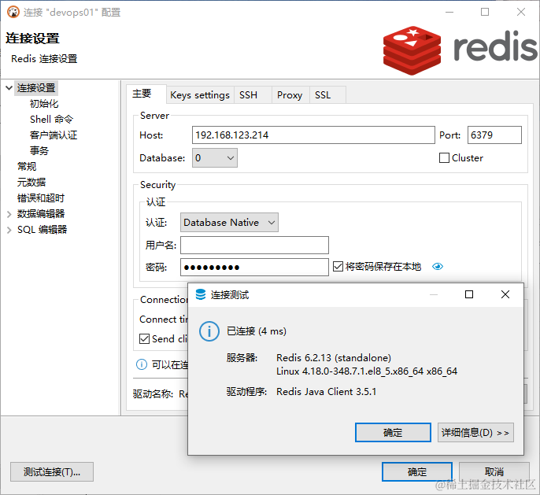
    -   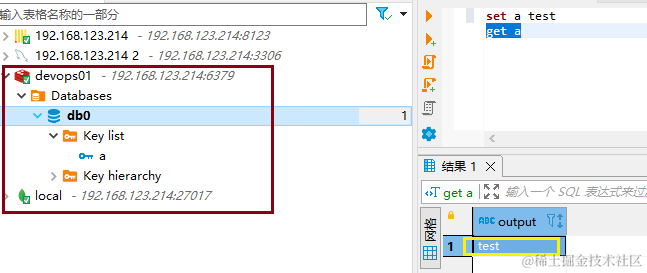

## 搭建 Redis 集群

Redis 集群是一种高可用、可水平扩展的 Redis 部署方式。它将 Redis 数据库分布在多个节点上，是为了提供高性能、高可用性和可伸缩性而设计的分布式 Redis 解决方案

### **需要注意的点**

-   配置、管理和维护成本相对高
-   不支持多数据库,只能使用 0 数据库
-   不支持跨节点的事务操作
-   批量操作时支持有限，如数据不在一个节点，则会报错
-   在部署 Redis 集群模式时，至少需要六个节点组成集群才能保证集群的可用性。

### **集群规划**

-   节点分配

    -   devops02:192.168.123.216
    -   devops03:192.168.123.219
    -   devops04:192.168.123.222

-   端口分配

    -   6389: redis 访问端口
    -   16389: 集群端口, 普通端口号加 10000，集群节点之间的通讯

-   不要设置密码，未找到节点间通信带密码的解决方案，-a password 只是主节点访问使用

-   集群的 redis 配置模板

    -   ```
        #端口
          port 6380

          #是否开启 Redis 集群模式
          cluster-enabled yes

          #设置 Redis 集群配置信息及状态的存储位置
          cluster-config-file nodes.conf

          #设置 Redis 群集节点的通信的超时时间
          cluster-node-timeout 5000
          appendonly yes
          daemonize no
          protected-mode no
          pidfile  /data/redis.pid

          #主节点需要的最小从节点数，只有达到这个数，主节点失败时，它从节点才会进行迁移。
          # cluster-migration-barrier 1

          #设置集群可用性
          # cluster-require-full-coverage yes
          # 集群节点 IP，如果要外部访问需要修改为宿主机IP，如：192.168.123.216 
          # cluster-announce-ip 默认172.x.x.x
          #客户端连接端口
          #cluster-announce-port 6380
          #节点间通信端口
          #cluster-announce-bus-port 16380
        ```

-   docker compose.yml 配置模板

    -   ```
        version: '3.1'
          services:
            redis:
              container_name: cluster_redis_6380
              image: redis:6.2.13
              restart: always
              command: redis-server /usr/local/etc/redis/redis.conf
              volumes:
                - ./data:/data
                - ./config/redis.conf:/usr/local/etc/redis/redis.conf
              ports:
                - '6380:6380'
                - '16380:16380'
        ```

### **集群部署**

将上面的配置模板文件按下面的目录结构创建

```
- node-cluster
  - redis-6380
    - config
      - redis.conf :需要配置模板中修改 port:6380
    - compose.yml:需要配置模板中修改 container_name: cluster_redis_6380
  - redis-6381
    - config
      - redis.conf :需要配置模板中修改 port:6381
    - compose.yml:需要配置模板中修改 container_name: cluster_redis_6381
```

1.  修改 redis.conf 中的 port

1.  修改 compose.yml 中的 container_name: cluster_redis_6381

1.  将 node-cluster 目录上传到准备的集群节点服务器：192.168.123.216，192.168.123.219，192.168.123.222

1.  在服务器的对应目录中执行 `docker compose up -d`,确保容器正常运行

     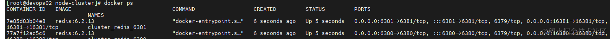

1.  依托于创建的 redis 容器，使用下面的命令创建集群并添加节点

      ```
        devops02=192.168.123.216
        devops03=192.168.123.219
        devops04=192.168.123.222
        docker exec -it cluster_redis_6380 redis-cli -p 6380 --cluster create \
        ${devops02}:6380 \
        ${devops02}:6381 \
        ${devops03}:6380 \
        ${devops03}:6381 \
        ${devops04}:6380 \
        ${devops04}:6381 \
        --cluster-replicas 1 \
        --cluster-yes
      ```
        
      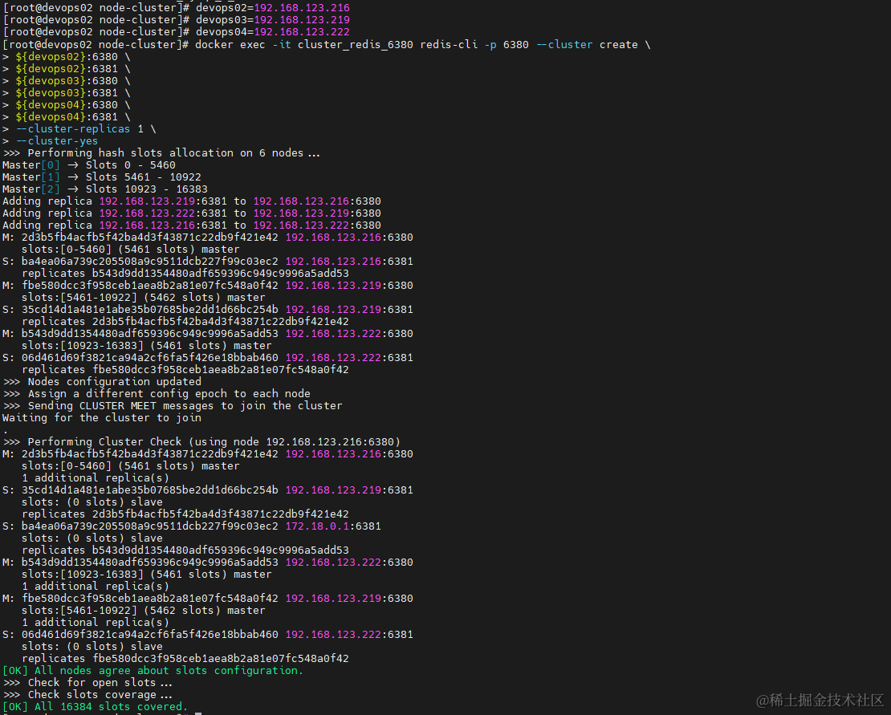

1.  连接集群测试（redis-cli）

    1.  ```
        docker exec -it cluster_redis_6380 redis-cli -p 6380 -c
        ```
    1.  查看集群信息：`cluster info`
    1.  查看集群节点信息:`cluster nodes`
    1.  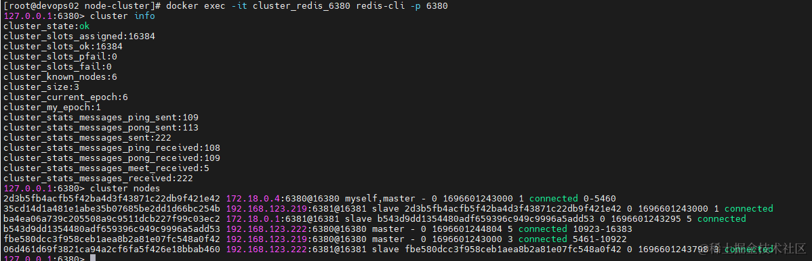
    1.  本地连接测试：`redis-cli -h 192.168.123.216 -p 6380 -c`
    1.  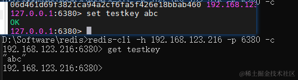
    1.  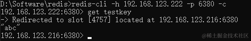
    1.  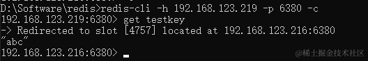


至此，终于是一步步的创建好了 Redis 集群

### 集群外部访问问题

当 redis.conf 没有设置 cluster-announce-ip 时，使用redis-cli访问没有问题，但是会发现连接时访问节点会变成容器内部IP

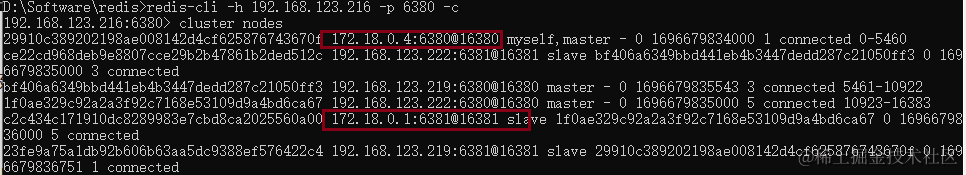

导致的结果就是 使用一些Redis客户端连接会超时，无法使用。要解决这个问题，需要将每个节点的 redis.conf 中的 cluster-announce-ip 配置修改为其宿主机IP即可，可以这样做

-   新建对应文件夹及配置

    -   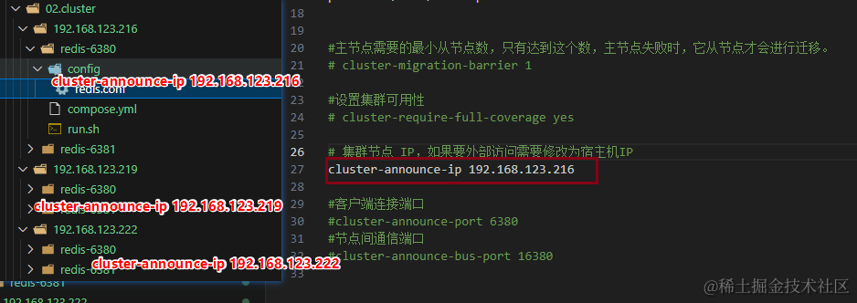

-   复制对应IP文件夹到服务器再创建集群即可

    -   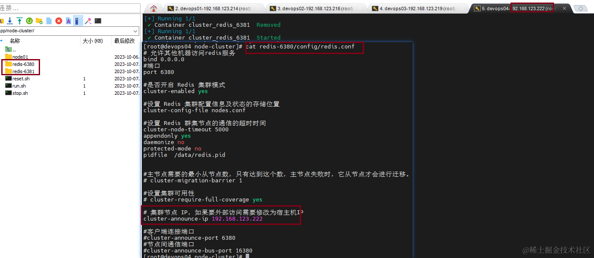

-   工具连接测试

    -   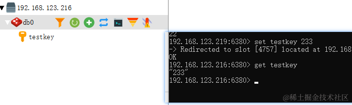
## **后语**

假期结束，先是折腾了一会创建集群密码的问题，然后又是尝试各种连接工具，终于搞定了集群的安装，完美的假期。

-   [本文配置文件及脚本汇总](https://github.com/yimogit/MeDevOps/tree/main/db/04.redis/02.cluster)
-   参考：http://www.mydlq.club/article/93/
-   DevOps 汇总：https://github.com/yimogit/MeDevOps
