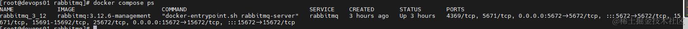
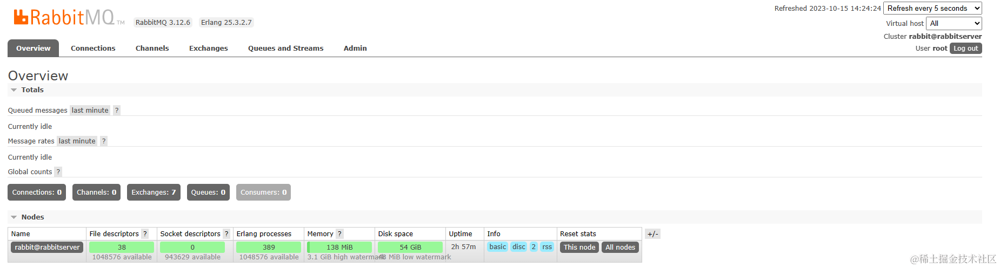
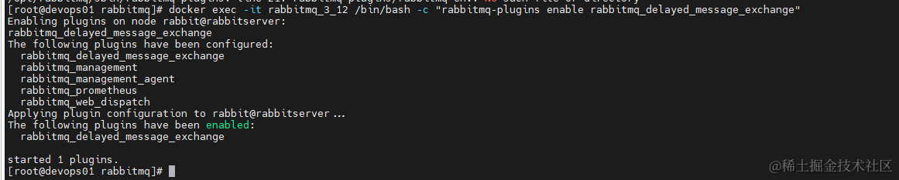
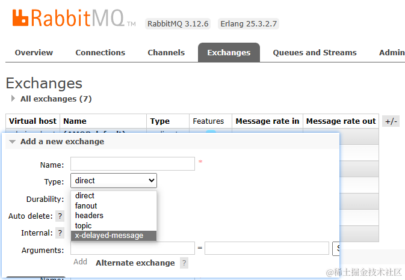
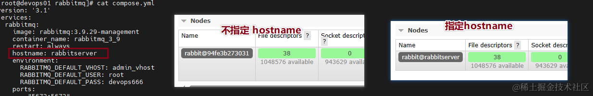
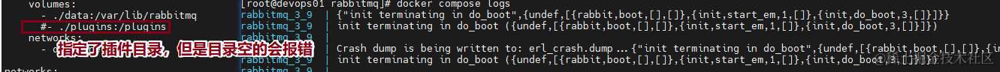
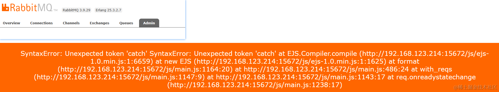
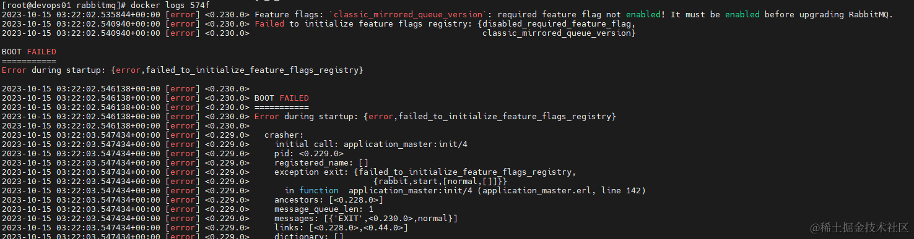
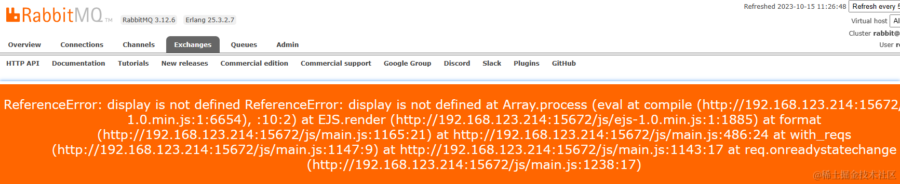

## 前言

> RabbitMQ 是一个功能强大的开源消息队列系统，它实现了高效的消息通信和异步处理。
>
> 本文主要介绍其基于 Docker-Compose 的部署安装和一些使用的经验。

### 特点

-   成熟，稳定
-   消息持久化
-   灵活的消息路由
-   高性能，高可用性，可扩展性高
-   支持插件系统：RabbitMQ 具有丰富的插件系统，可以通过安装插件来扩展其功能，例如管理界面、消息追踪、消息转换等。
-   官方提供了 .NET/Java 的 SDK

### 使用情况

-   项目中用于日志记录，消息发送，数据同步等，稳定可靠
-   业务模块的初始化，数据导入异步处理
-   做好幂等处理，不同场景使用不同的确认方式，防止消息的重复消费
-   RabbitMQ 默认不支持延迟消息，使用[延迟消息插件](https://github.com/rabbitmq/rabbitmq-delayed-message-exchange)实现即可（**有局限，仅支持最多一两天的延迟消息**）
-   使用 .NET SDK：RabbitMQ.Client，后面再分享二次封装使用

## 实践

使用 Docker Compose V2 安装 rabbitmq v3.12.6

### 准备

-   当前版本：v3.12.6
-   使用镜像：rabbitmq:3.12.6-management （带 web 管理界面）
-   默认端口：5672:应用连接端口 15672:web 控制台

### 使用 Docker Compose 安装

> 本篇文章基于 Docker V24 及 Docker Compose V2，安装可以参考之前的[文章](https://juejin.cn/post/7283873796977197108)

#### 配置说明

-   固定了镜像版本：`rabbitmq:3.12.6-management`
-   指定的主机名：`rabbitserver`
-   指定虚拟机名称：`admin_vhost`
-   指定账号密码： `root` `devops666`
-   指定端口：`5672`：应用连接端口 `15672`：web 管理界面
-   挂载数据目录：`./data:/var/lib/rabbitmq`
-   挂载额外的插件目录：`./myplugins:/myplugins` RabbitMQ 容器中默认插件目录是 /plugins 不推荐挂载
-   将 ./myplugins 挂载到容器的，并将其加入插件查找的目录中：`RABBITMQ_PLUGINS_DIR: '/plugins:/myplugins'`
-   指定网络：devopsnetwork (`docker network create devopsnetwork`)

#### 配置文件 compose.yml

-   准备好 compose.yml 拷贝到服务器

-   然后运行`docker compose up -d`即可

       ```
        version: '3.1'
        services:
          rabbitmq:
            image: rabbitmq:3.12.6-management
            container_name: rabbitmq_3_12
            restart: always
            # 节点名 rabbit@rabbitserver，不然会去容器ID
            hostname: rabbitserver
            environment:
              # 默认虚拟机名
              RABBITMQ_DEFAULT_VHOST: admin_vhost
              # 用户名
              RABBITMQ_DEFAULT_USER: root
              # 密码
              RABBITMQ_DEFAULT_PASS: devops666
              # 指定自定义插件目录
              RABBITMQ_PLUGINS_DIR: '/plugins:/myplugins'
            ports:
              - "5672:5672"
              - "15672:15672"
            volumes:
              - ./data:/var/lib/rabbitmq
              - ./myplugins:/myplugins
            networks:
              - devopsnetwork

        networks:
          devopsnetwork:
            external: true
        ```

#### 部署成功

  部署机器IP：192.168.123.214





### 安装插件：延迟消息插件

> 注意：插件消息发布延迟只支持到 数秒、分钟或数小时，最多一两天，注意！！！
>
> 原文： This plugin was designed for delaying message publishing for a number of seconds， minutes， or hours。 A day or two at most.

> ! ! ! 前面的 compose.yml 默认是将。/myplugins 挂载到容器的，并指定了多个插件目录 系统：/plugins 自己添加：/myplugins ,优化了流程，安装插件不需要复制文件和重启容器

1.  需要先下载插件：rabbitmq_delayed_message_exchange-3.12.0.ez，下载对应版本的 。ez 文件：[Github Releases](https://github.com/rabbitmq/rabbitmq-delayed-message-exchange/releases)

1.  将下载的插件文件放到 。/myplugins 文件夹 前面将 myplugins 挂载到了容器

1.  连接容器执行启用插件：`docker exec -it rabbitmq_3_12 /bin/bash -c "rabbitmq-plugins enable rabbitmq_delayed_message_exchange"`

1.  因为已经挂载 myplugins 和设置为插件目录了 会自己去找 /plugins 和/myplugins 对应的 ez 文件以安装

      

1.  启用成功，可在 Exchanges 页查看

      

### 踩过的坑

-   根据上文配置来不会再出现下面的问题，遇到一样的问题可参考

-   延迟消息仅支持最多一两天的延迟消息，项目中有个定时发消息的功能，设置的适合时间设置超过阈值无法被消费 [说明](https://github.com/rabbitmq/rabbitmq-delayed-message-exchange#intended-use-cases)

-   不要挂载/plugins 插件目录，可以用`RABBITMQ_PLUGINS_DIR: '/plugins:/myplugins'`来指定多个目录，这样只需要执行 [文档](https://www.rabbitmq.com/relocate.html#unix)

-   不指定 hostname 节点名称会是容器 Id

      

-   使用了 rabbitmq:3.x-management 镜像（具有 web 管理页面的功能）但是挂载了空的插件目录会报错：`{"init terminating in do_boot",{undef,[{rabbit,boot,[],[]},{init,start_em,1,[]},{init,do_boot,3,[]}]}}`

      

-   Admin 页面提示报错：升级版本吧 [issues](https://github.com/rabbitmq/rabbitmq-server/issues/7425) 我开始用的 3.9.29-management（tags 列表排序 3.9 排在前面，（ ╯□╰ ）），报这个错

      

-   切换版本前需要经。/data 数据清空，不然启动不起来

      

-   Exchanges 页面报错： 我把版本换成 3.12.6-management 后报了这个错，没有退出登录，只需 Ctrl+F5，重新登录下就好

      

### 使用

#### .NET SDK

官方：[RabbitMQ.Client](https://github.com/rabbitmq/rabbitmq-dotnet-client)

#### 连接配置

```
var factory = new ConnectionFactory
{
    HostName = "192.168.123.214",
    Port = 5672,
    VirtualHost = "admin_vhost",
    UserName = "root",
    Password = "devops666",
};
```

#### Demo 示例

建了一个 demo 测试使用 [Demo地址](https://github.com/yimogit/MeDevOps/tree/main/demos/DevopsDemo/MqDemo) ，后续二次封装的时候再展开说怎么封装使用

### 相关文档

-   [RabbitMQ 项目仓库](https://github.com/rabbitmq/rabbitmq-server)
-   [DockerHub 镜像](https://hub.docker.com/_/rabbitmq/)
-   [官方文档](https://rabbitmq.com/documentation.html)
-   [延迟消息插件下载](https://github.com/rabbitmq/rabbitmq-delayed-message-exchange/releases)
-   [.NET SDK 仓库](https://github.com/rabbitmq/rabbitmq-dotnet-client)

## 后语

> 安装还是比较简单的，版本选对，更多的是使用时需要根据业务选择适合的方案
>
> 插件的安装倒腾了一阵子，研究优化了流程
