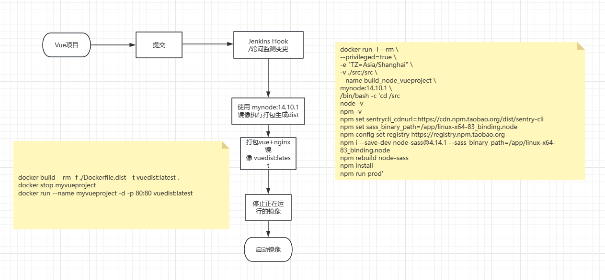

> 文章源于 Jenkins 构建 Vue 项目失败，然后就把 node_modules 删了重新构建发现 node-sass 安装不上了，折腾一天终于可以稳定构建了。  
> 犹记得从学 node 的第一天，就被 node-sass 折磨了一整天，后面本地没问题了然后服务器开始折磨了，这次又遇到，尝试了一次又一次，还是用本地包构建最稳，觉得还算有用，故记录一二。

### 构建环境 docker+jenkins

- [docker 及 docker-compose 的快速安装和简单使用](https://www.cnblogs.com/morang/p/9501223.html)
- [使用 docker-compose 快速安装 Jenkins](https://www.cnblogs.com/morang/p/docker-jenkins-use.html)

之前已经记录过就不在多说了，可参考之前的文章，此为打包构建的流程


本篇文章的目录结构

```
- Dockerfile 构建node打包镜像
- sources.list 阿里云软件源 debian 9
- linux-x64-83_binding.node  node-sass包 v4.14.1
- Dockerfile.dist 构建vue运行的nginx镜像
- nginx.conf nginx镜像的配置
- src  源码
  - dist 由node打包镜像运行的容器生成的构建产物
  - package.json npm包配置
  - ...
```

## 为 vue 项目制制作 node 打包镜像

### linxu 下 node 打包遇到解决的问题

笔者环境：docker:18.06，node:14.10.1，vue:2.6.11 ，webpack-cli:3.3.12

- image-webpack-loader 在 linux 环境需要安装依赖包
  - `apt-get clean && apt-get update && apt-get install -y --no-install-recommends apt-utils autoconf automake file g++ libtool make nasm libpng-dev`
- sentry 下载慢可以设置下镜像
  - `npm set sentrycli_cdnurl=https://npmmirror.com/mirrors/sentry-cli/`
- node-sass
  - 从 GitHub 下载下半天，尝试设置淘宝镜像也没有用
  - `npm set sass_binary_site=https://npmmirror.com/mirrors/node-sass/`
  - 最后各种尝试设置源都无效，于是采用指定本地的方式,
  - 1. [下载](https://npmmirror.com/mirrors/node-sass/) node 所[对应的 node-sass 版本](https://www.npmjs.com/package/node-sass)
  - 2. 指定文件路径： `npm set sass_binary_path=/app/linux-x64-83_binding.node`
  - 3. 安装到依赖：`npm i --save-dev node-sass@4.14.1 --sass_binary_path=/app/linux-x64-83_binding.node`
  - 4. 重新构建包生成相关文件 :`npm rebuild node-sass`(不执行会报错找不到 node_modules/node-sass/vendor)

以上，就是在 linux 中 node 打包 vue 项目的过程中所遇到的一些问题，接下来分享 docker 中如何将这些坑一一解决

### Dockerfile

node14 的镜像[基于 debian 9](https://hub.docker.com/layers/library/node/14.10.1/images/sha256-3ab45e1f177ac393cd00e15a4de6138e22c1683e95c8b122c9ed224e51a0688c?context=explore) ,默认源安装不了软件，故需要指定其他镜像软件源，笔者用的阿里云的

```Dockerfile
FROM node:14.10.1 AS base
COPY ./sources.list /etc/apt/
COPY ./linux-x64-83_binding.node /app/linux-x64-83_binding.node
RUN apt-get clean && apt-get update && apt-get install -y --no-install-recommends apt-utils autoconf automake file g++ libtool make nasm libpng-dev
```

### Dockerfile 用到的 sources.list

阿里云的包源设置，用于软件安装，构建打包镜像会将其复制到 /etc/apt 目录  
！官方文档更新没对，还是在[阿里云包源文档的评论区](https://developer.aliyun.com/mirror/debian?spm=a2c6h.13651102.0.0.467e1b11F3fFAF)的有用

```
deb http://mirrors.aliyun.com/debian-archive/debian stretch main contrib non-free
deb http://mirrors.aliyun.com/debian-archive/debian stretch-backports main
deb http://mirrors.aliyun.com/debian-archive/debian-security stretch/updates main
deb-src http://mirrors.aliyun.com/debian-archive/debian stretch main
deb-src http://mirrors.aliyun.com/debian-archive/debian stretch-backports main
deb-src http://mirrors.aliyun.com/debian-archive/debian-security stretch/updates main
```

### Dockerfile 用到的 linux-x64-83_binding.node

用于 vue 项目构建时指定本地路径，构建打包镜像复制到 /app 目录

- github 下载：https://github.com/sass/node-sass/releases/download/v4.14.1/linux-x64-83_binding.node
- cnpm 下载：https://registry.npmmirror.com/-/binary/node-sass/v4.14.0/linux-x64-83_binding.node

### 构建 node 打包镜像

将上面的 Dockerfile,sources.list,linux-x64-83_binding.node 放到 linux 同一目录中，执行 [docker build 命令](https://www.runoob.com/docker/docker-build-command.html) 打包自定义镜像即可

```sh
docker build --rm  -t mynode:14.10.1 .
```

打包镜像完成，接下来将使用此镜像进行 vue 项目的打包生成 dist 部署文件

## 使用 docker 构建的自定义 node 镜像打包 vue 项目

将项目顶级目录 src 映射到容器中的 /src ,运行刚刚构建的 mynode:14.10.1 镜像并传入打包 vue 相关命令，如果还有下载慢需要加镜像的包，再添加即可。

```sh
docker run -i --rm \
--privileged=true \
-e "TZ=Asia/Shanghai" \
-v ./src:/src \
--name build_node_vueproject \
mynode:14.10.1 \
/bin/bash -c 'cd /src
node -v
npm -v
npm set sentrycli_cdnurl=https://cdn.npm.taobao.org/dist/sentry-cli
npm set sass_binary_path=/app/linux-x64-83_binding.node
npm config set registry https://registry.npm.taobao.org
npm i --save-dev node-sass@4.14.1 --sass_binary_path=/app/linux-x64-83_binding.node
npm rebuild node-sass
npm install
npm run prod'
```

构建生成的容器运行完毕，就可以将 dist 下的构建产物进行发布了

## 制作 vue 项目发布镜像

Dockerfile.dist,nginx.conf 与上面 Dockerfile 等同级目录，故映射前一步的构建产物 ./src/dist 到镜像中

- Dockerfile 文件: Dockerfile.dist

```Dockerfile
FROM nginx:latest
EXPOSE 80
COPY ./src/dist /usr/share/nginx/html
COPY ./nginx.conf /etc/nginx
```

- history 模式的 nginx.conf(根据项目调整)  
- nginx 版本不同可能配置文件会不同，新版的路径也不一样了，配置文件在/etc/nginx/conf.d/，然后conf文件也去掉了http节点。

```nginx
worker_processes auto;

events {
    worker_connections 1024;
}
http {
    server {
        listen       80;
        location / {
            root /usr/share/nginx/html/;
            index index.html;
            try_files $uri $uri/ /index.html;
        }
    }
}

```

- 执行构建

`docker build --rm -f ./Dockerfile.dist  -t vuedist:latest .`

## 运行构建的 vue 镜像

`docker run --name myvueproject -d -p 80:80 vuedist:latest`

至此，记录结束，踩坑不易，文章更不易，如有错误，也欢迎指教
转载请注明出处：By 易墨

