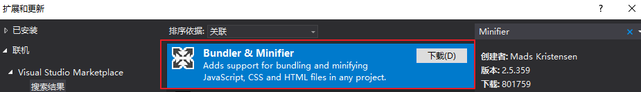

## 0. 在asp.net core中使用BuildBundlerMinifier合并压缩资源文件

> 在asp.net mvc中可以使用Bundle来压缩合并css,js 不知道的见：http://www.cnblogs.com/morang/p/7207176.html

> 在asp.net core中则可以使用BuildBundlerMinifier来进行css，js的压缩合并

> 新建一个core项目可以看到一个根目录下面有一个`bundleconfig.json`配置文件，看名字大概也猜到了几分，点开json文件中的链接，果然就是它~

官方文档地址：[https://docs.microsoft.com/zh-cn/aspnet/core/client-side/bundling-and-minification](https://docs.microsoft.com/zh-cn/aspnet/core/client-side/bundling-and-minification)

好的。接下来跟着文档试试看

## 1. 在vs中下载安装扩展

重启vs2017，卧槽。一遍又一遍无响应（家里公司电脑都没有成功~）..幸好还有其他路可以走...

## 2. 使用NuGet安装 `BuildBundlerMinifier`

- 使用命令`dotnet add package BuildBundlerMinifier` 或者 NuGet包管理器安装完毕

- 重新生成项目

- yes，成功，整个配置文件的配置一看就能明白：结合图看配置就知道是将`inputFiles`配置的条目资源压缩合并成`outputFileName`的资源

### 参数说明

-`outputFileName`:要输出的压缩文件的相对路径。 

    -必填

-`inputFiles`:要输出的压缩文件的相对路径。

    - 可选，为空则输出空文件

    - 空值会在空的输出文件。 支持[组合模式](http://www.tldp.org/LDP/abs/html/globbingref.html)

    - 组合模式 栗子：`"inputFiles": ["wwwroot/**/*(*.css|!(*.min.css)"]` 将获取所有 CSS 文件，不包括缩减的文件模式。

-`minify`:压缩选项的配置

    - 默认启用压缩,更多配置见[BundlerMinifier-Wiki](https://github.com/madskristensen/BundlerMinifier/wiki)

    - 可选

-`includeInProject`:将生成的文件添加到项目文件 (默认的文件中也没有这个选项)

    - 文档写的是 默认false，在vs中转到定义查看是true 。囧,默认是没有这个参数的

-`sourceMaps`:生成捆绑的文件的源映射

    -默认false

## 3.根据不同环境使用不同的css/js

使用新增的`environment`标签去根据不同的环境引入不同的css文件

ok，可以的，那么问题来了

### .net core的`Development`,`Staging`,`Production`这几个环境变量在哪里配置呢？

> 三个环境分别对应 开发 测试 生成，详情见文档(划重点)：[https://docs.microsoft.com/zh-cn/aspnet/core/fundamentals/environments](https://docs.microsoft.com/zh-cn/aspnet/core/fundamentals/environments)

> 简单描述之：项目右键->属性->调试->环境变量->>>一张图说明

> 

> 然后发现原来调试信息什么的都是放到`launchSettings.json`中~

> 将环境变量`ASPNETCORE_ENVIRONMENT`的值修改为`Production`后，运行起来，总算完成了

> 

#### 文档中有说需要注意的地方

> 在 Windows 和 macOS 上，指定的环境名称是区分大小写。 

> 是否将变量设置为Development或development或DEVELOPMENT结果将是相同的。但是，Linux 是区分大小写默认情况下的操作系统。环境变量、文件名和设置需要区分大小写。

#### 命令行设置环境变量

- cmd:`set ASPNETCORE_ENVIRONMENT=Development`

- PowerShell:`$Env:ASPNETCORE_ENVIRONMENT = "Development"`

- macOS、Linux:运行时指定`ASPNETCORE_ENVIRONMENT=Development dotnet run`

- linux 设置计算机级别的环境变量需将`export ASPNETCORE_ENVIRONMENT=Development`写入.bashrc或.bash_profile文件

### 在关于环境变量的底部也说明了如何获取当前的运行时环境

可通过`IHostingEnvironment`接口的扩展直接判断环境    

    

使用    

## 总结

> 收获颇多,明确了目标，之前模糊畏难的东西也逐个解决了

- .net core 如何合并压缩js

- .net core 如何在不同的环境使用不同的资源

- .net core的环境变量如何配置

### 参考文档

- .net core 环境变量的说明：https://docs.microsoft.com/zh-cn/aspnet/core/fundamentals/environments

- asp.net core 压缩合并：https://docs.microsoft.com/zh-cn/aspnet/core/client-side/bundling-and-minification
