## 前言

> 接上篇 docker-bind 的使用搭建了一个 dns 服务，本篇将介绍另外一款 DnsServer 的部署和使用，更专注，更轻量。

### 特点

- 基于 .NET 7 实现 ，支持 Windows、Linux、macOS 和 Raspberry Pi
- 开箱即用，使用简单，高性能
- 提供 Web 控制台，可视化管理，查看使用情况
- 提供了对网络的额外控制，允许阻止域名
- 支持 DNS-over-TLS， DNS-over-HTTPS， and DNS-over-QUIC 
- DNS-over-HTTPS 实现支持 HTTP/1.1、HTTP/2 和 HTTP/3 传输协议
- HTTP API 由 Web 控制台使用，第三方应用或脚本可以使用 Api 接口配置来 DNS 服务器

### 使用情况

- 能够快速上手使用，部署好设置域名解析很流畅
- 用得深入一点就需要看官方的博客了
- 高级的功能没深入研究，暂时只使用了简单的域名解析功能

## DnsServer 的安装使用

### 准备

-   版本：v11.4.1
-   docker 镜像：technitium/dns-server:11.4.1
-   默认端口映射：53:53/tcp 53:53/udp 5380:5380/tcp（53 端口为 DNS 服务使用，5380为面板使用）
-   面板访问：http://ip:5380

### 使用 Docker Compose 安装

> 本篇文章基于 Docker V24 及 Docker Compose V2，安装可以参考之前的[文章](https://juejin.cn/post/7283873796977197108)

#### 配置说明

-   指定版本：`technitium/dns-server:11.4.1`
-   指定时区：Asia/Shanghai 并启用日志使用UTC时区
-   指定账号 admin 密码：`devops666`
-   指定端口映射：53:53/tcp 53:53/udp 5380 :5380 /tcp（53 端口为 DNS 服务使用，5380 为 Web面板端口）
-   挂载数据目录：`./data:/data`
-   指定网络：devopsnetwork （`docker network create devopsnetwork`）
-   指定了本地访问端口范围：`net.ipv4.ip_local_port_range=1024 65000`

#### 配置文件 compose.yml

-   准备好 compose.yml 拷贝到服务器
-   然后运行`docker compose up -d`即可

```
version: '3.1'
services:
  dns-server:
    container_name: dns_server_11_4
    hostname: dns-server
    restart: always
    image: technitium/dns-server:11.4.1
    ports:
      - "5380:5380/tcp" #DNS web console (HTTP)
      # - "53443:53443/tcp" #DNS web console (HTTPS)
      - "53:53/udp" #DNS service
      - "53:53/tcp" #DNS service
    environment:
      - TZ=Asia/Shanghai
      - DNS_SERVER_LOG_USING_LOCAL_TIME=true
      - DNS_SERVER_DOMAIN=dns-server #The primary domain name used by this DNS Server to identify itself.
      - DNS_SERVER_ADMIN_PASSWORD=devops666 #DNS web console admin user password.
    sysctls:
      - net.ipv4.ip_local_port_range=1024 65000
    volumes:
      - ./data:/etc/dns
    networks:
      - devopsnetwork

networks:
  devopsnetwork:
    external: true
```

#### 部署成功

部署机器 IP：192.168.123.214

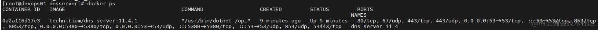

容器中资源占用情况

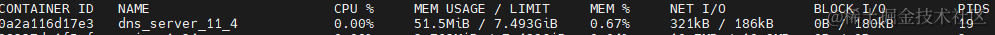

### DnsServer 的使用

-   部署成功后访问：http://192.168.123.214:5380 ,使用 admin devops666 登录 控制台中可以查看到一些监控统计

      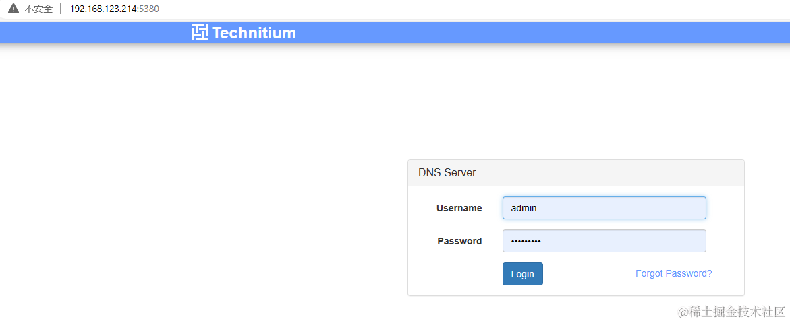
       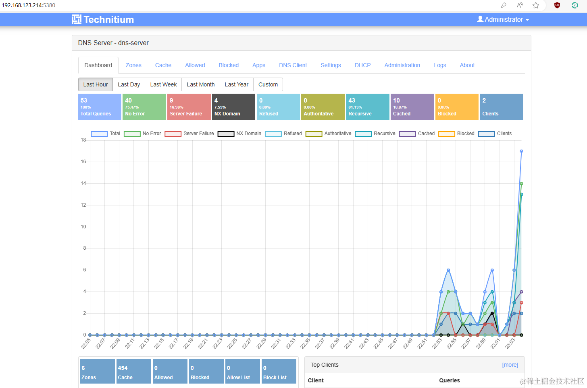

  


#### 局域网域名泛解析到指定IP

和上文一样，需求是需要配置 dns 以将 test.com 解析到 192.168.123.214 中

1.  控制台->Zones->Add Zone 创建主区域 test.com

      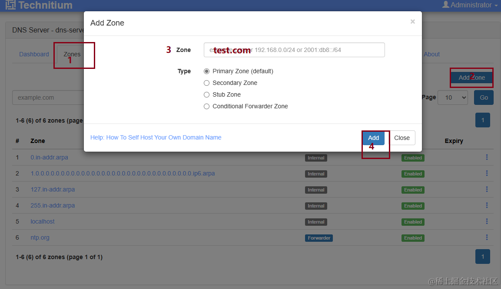

1.  添加泛解析

      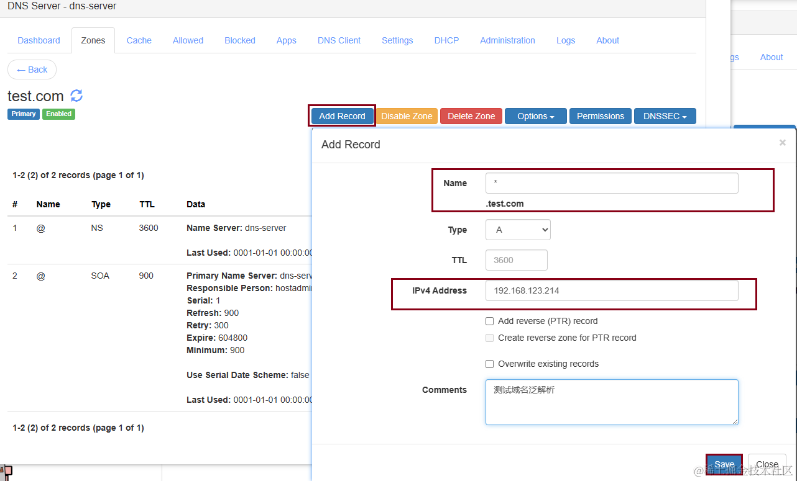
      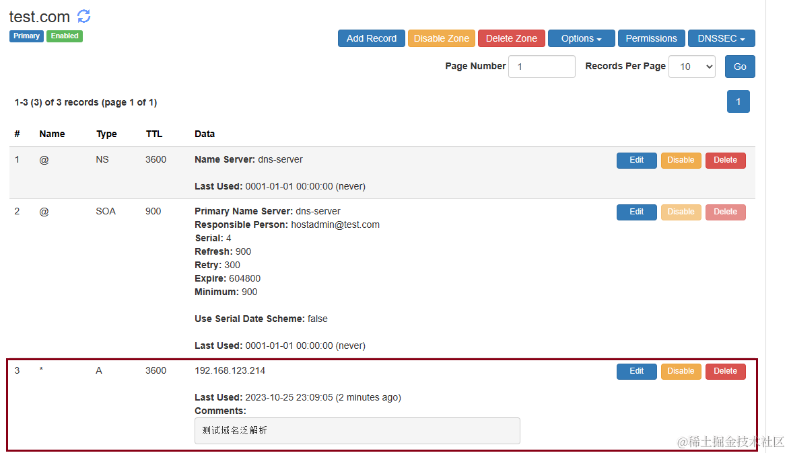

1.  本机设置 dns `192.168.123.214` 以及 `114.114.114.114`(不然无法访问其他网站)

      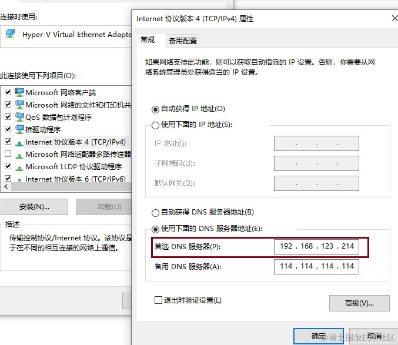

1.  验证dns，正常ping test.com 的IP是存在的，现在就被解析到我们自己的dns了

      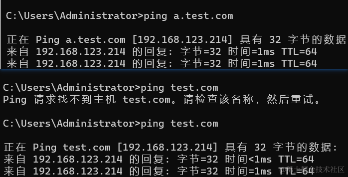
        可能存在dns缓存，使用 `ipconfig /flushdns`刷新即可
      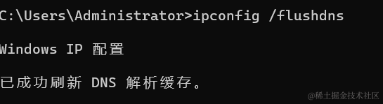

#### 查看系统日志

需要同时设置环境变量`TZ=Asia/Shanghai`及`DNS_SERVER_LOG_USING_LOCAL_TIME=true`才生效，设置后会将设置中的日志配置 Use Local Time默认勾选

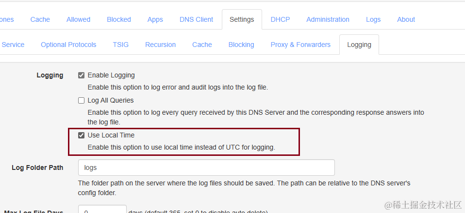

  


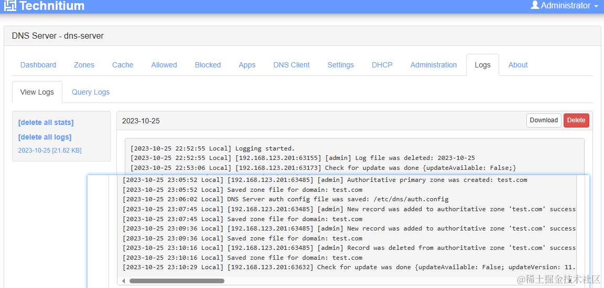

#### 禁用域名访问（Blocked）

可能需要使用 `ipconfig /flushdns`清理dns缓存

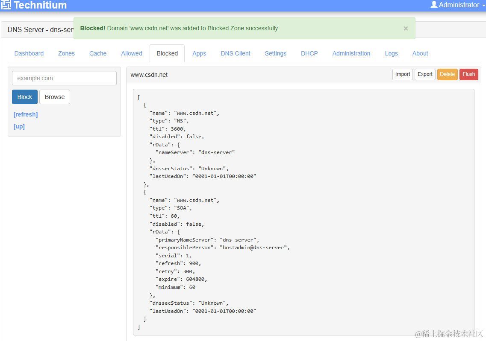

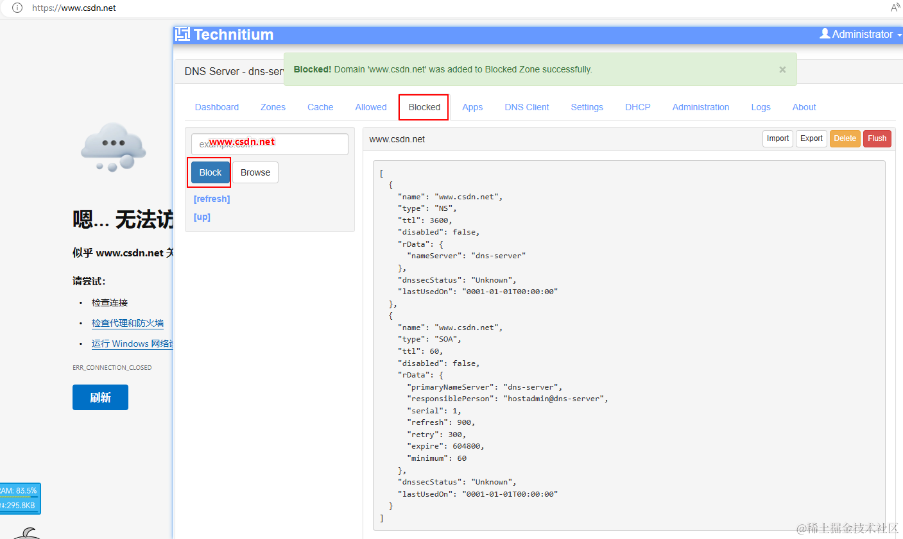

  


### 踩过的坑

-   日志显示，需要同时设置环境变量`TZ=Asia/Shanghai`及`DNS_SERVER_LOG_USING_LOCAL_TIME=true`才生效
-   dns缓存清理：`ipconfig /flushdns`
-   代理/VPN的设置不对可能导致 DNS 时好时坏，这个时候记得检查下代理，正常dns的生效都挺快的

### 相关文档

-   项目地址：[Github](https://github.com/TechnitiumSoftware/DnsServer)
-   镜像仓库：[DockerHub](https://hub.docker.com/r/technitium/dns-server)
-   官方博客：[technitium.com](https://blog.technitium.com/)
-   官方docker-compose:[docker-compose.yml](https://github.com/TechnitiumSoftware/DnsServer/blob/master/docker-compose.yml)

## 后语
> 基于DNS服务，还可以做很多，比如自动 https，但是没有研究成功，后面可能会结合真实的自有域名来实现。
> 预告下篇呕心沥血之作，Nexus3 管理私有 nuget，docker，走过路过不要错过~

