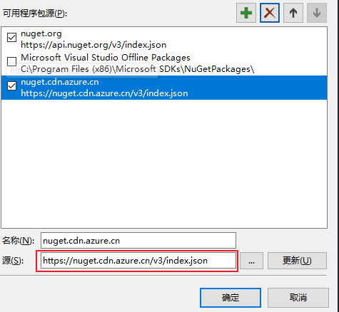
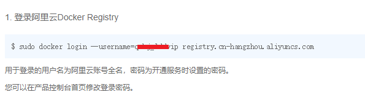
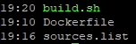

## 先说一个问题


首先记录一个问题，今天在用 Jenkins 构建项目的时候突然出现包源的错误：


```

/usr/share/dotnet/sdk/2.2.104/NuGet.targets(114,5): error : Unable to load the service index for source https://api.nuget.org/v3/index.json. [/....csproj]

/usr/share/dotnet/sdk/2.2.104/NuGet.targets(114,5): error :   The HTTP request to 'GET https://api.nuget.org/v3/index.json' has timed out after 100000ms. [/....csproj]

```

nuget的包源无法访问(无法ping通)，而我在一台服务器上访问`https://api.nuget.org/v3/index.json`时则会自动重定向到`https://nuget.cdn.azure.cn/v3/index.json`。


但是打包机器执行`dotnet restore`却还是无法还原成功，即使指定包源后即`dotnet restore -s https://nuget.cdn.azure.cn/v3/index.json` 能还原一部分包，部分包依旧无法还原


最后测试发现，包源只是部分地区无法访问，可以尝试切换源/使用Nuget.Config文件试试，当然最快的还是通过科学的方式访问~。


若本地 VS 的包管理器也无法正常使用，切换源(https://nuget.cdn.azure.cn/v3/index.json)即可




## 再说另外一个问题


然后这篇文章其实是另外的一个问题，之前我构建了一个基础镜像包，基于`FROM microsoft/dotnet:2.2-aspnetcore-runtime`构建，而我构建时使用的sdk镜像是`FROM microsoft/dotnet:2.2-sdk`


9.23号(.net core 3.0发布)之前还能够正常构建，今天在解决了上面包源问题后，镜像构建成功并发布到服务器，却发现镜像无法启动起来。


报错信息如下

```

The specified framework 'Microsoft.NETCore.App', version '2.2.2' was not found.

  - Check application dependencies and target a framework version installed at:

      /usr/share/dotnet/

  - Installing .NET Core prerequisites might help resolve this problem:

      http://go.microsoft.com/fwlink/?LinkID=798306&clcid=0x409

  - The .NET Core framework and SDK can be installed from:

      https://aka.ms/dotnet-download

  - The following versions are installed:

      2.2.0 at [/usr/share/dotnet/shared/Microsoft.NETCore.App]

```


既然说是版本问题，那就尝试着将基础进行修改为`FROM microsoft/dotnet:2.2.2-aspnetcore-runtime`,果然，重新构建后能够好好的运行起来了。


那么我是如何构建的基础镜像的，只需下面 3 个文件就搞定了。


## 阿里云镜像源


阿里云的软件包源，可用于一些基础镜像中没有的软件安装，写入到 sources.list 供后面使用


- 文件：sources.list

```

deb http://mirrors.aliyun.com/debian jessie main contrib non-free

deb-src http://mirrors.aliyun.com/debian jessie main contrib non-free

deb http://mirrors.aliyun.com/debian jessie-updates main contrib non-free

deb-src http://mirrors.aliyun.com/debian jessie-updates main contrib non-free

deb http://mirrors.aliyun.com/debian-security jessie/updates main contrib non-free

deb-src http://mirrors.aliyun.com/debian-security jessie/updates main contrib non-free

```


## 一个包含图像库的 Dockerfile


基于`dotnet:2.2.2 aspnetcore-runtime`，并在其中安装 `libgdiplus`，设置时区，具体的可以根据自己的项目需要去构建


文件：Dockerfile

```

FROM microsoft/dotnet:2.2.2-aspnetcore-runtime

WORKDIR /app

COPY sources.list /app/sources.list

RUN rm -f /etc/apt/sources.list && mv sources.list /etc/apt/ && apt-get update -y && apt-get install -y libgdiplus && apt-get clean && ln -s /usr/lib/libgdiplus.so /usr/lib/gdiplus.dll


# 时区设置

ENV TZ=Asia/Shanghai

RUN ln -snf /usr/share/zoneinfo/$TZ /etc/localtime && echo $TZ > /etc/timezone


# ENTRYPOINT ["./xxxxx.dll"]


```


## 使用脚本推送镜像到阿里云的容器镜像仓库


要推送镜像到阿里云，需要先去阿里云开通并创建命名空间

需要先登录云端镜像仓库 ，登录阿里云如下





文件名：build.sh (Linux添加执行权限 `chmod +x ./build.sh`)

```

export ALIYUN_DOCKER_CLOUD_URL=registry.cn-hangzhou.aliyuncs.com

export DOCKER_IMAGE_NAME=yimocoding/dotnet2.2.2-base

export BUILD_NUMBER=latest


docker build -t $DOCKER_IMAGE_NAME -f ./Dockerfile .

docker tag $DOCKER_IMAGE_NAME $ALIYUN_DOCKER_CLOUD_URL/$DOCKER_IMAGE_NAME:$BUILD_NUMBER

echo 推送镜像到云端

docker push $ALIYUN_DOCKER_CLOUD_URL/$DOCKER_IMAGE_NAME:$BUILD_NUMBER


echo '删除本地镜像'

docker rmi $DOCKER_IMAGE_NAME

docker rmi $ALIYUN_DOCKER_CLOUD_URL/$DOCKER_IMAGE_NAME:$BUILD_NUMBER

```


## 三个文件的目录结构





文件创建完成后,执行 `build.sh` 即可构建镜像并推送到阿里云的镜像仓库，若想提交到其他云仓库，修改脚本中的变量即可


示例文件：https://github.com/yimogit/MeDocker/tree/dotnet


真是，人在家中坐，锅从天落，而为了更好的接锅，记录一二，免得到时候望码兴叹。
