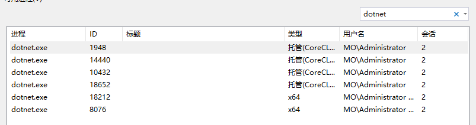
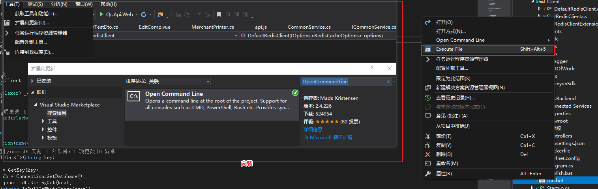

在将项目升级到 asp.net core 2.2 后,很少使用 IIS Express 运行项目了，基本都是控制台运行或者写个脚本批量启动要运行的接口(多个输出项目)，一直以为是我机器的 bug

关于 vs 的 asp.net core 进程调试的这个问题困扰了我好一段时间未曾解决，得空整理记录一下。


## 问题描述


一顿操作猛如虎运行 `dotnet run` 很多个应用程序(前后端分离，多个项目运行的场景)

然后打开项目选择【调试-附加到进程】(`.net framework 要附加到 w3wp.exe,.net core 要附加到 dotnet.exe`)


看到这一排排的 dotnet.exe,一脸懵逼啊！(可能除了多项目还会有其他原因出现更多个，比如 redis 连接没关闭，https 的原因~)





如上图，完全不知道要附加到那个进程，最开始没找到解决方案(懒)，直接就给全选了，后面找到解决方案才开始愉快的玩耍


## 解决方案


新建 `run.bat`，写入以下命令，每次运行时执行脚本运行即可


### run.bat 脚本


```

taskkill /F /T /FI "WINDOWTITLE eq Dotnet.Api1" /IM dotnet.exe

start "Dotnet.Api1" dotnet run

exit

```


#### 脚本说明


1. 关闭名字为“Dotnet.Api1”的 dotnet.exe 进程，新

2. 启动一个标题为“Dotnet.Api1”的窗口运行 `dotnet run` 或者 `dotnet watch run`

3. 退出 run.bat 的 cmd 进程


### publish-run.bat


因为前后端是并行开发的，数据对接的过程中，如果改动一下就编译接口就不太合适，就需要发布运行，可使用下面的脚本快速发布  

发布脚本如下，删除进程，重新发布，再次运行即可

```

taskkill /F /T /FI "WINDOWTITLE eq Dotnet.Web.Publish" /IM dotnet.exe

dotnet publish -c Release

start "Dotnet.Web.Publish" /D "./bin/Release/netcoreapp2.2/publish/" dotnet Dotnet.Api.dll --urls http://*:2333

exit

```


### 脚本执行


在 vs2017 中如果想要快速的执行脚本，可在【工具-扩展和更新】中安装扩展[OpenCommandLine](https://github.com/madskristensen/OpenCommandLine)



安装完成后即可方便的执行脚本了。


## 总结


边写边查资料的过程中，一步步查找资料最后翻到了 GitHub 的 [issues#2007](https://github.com/dotnet/core-setup/issues/2007)

发现早就有人提出问题，也给出了解决方案 `start "My App" dotnet MyApp.dll`~

本文对解决方案进行了补充完善，使其得以更加方便快捷使用。
