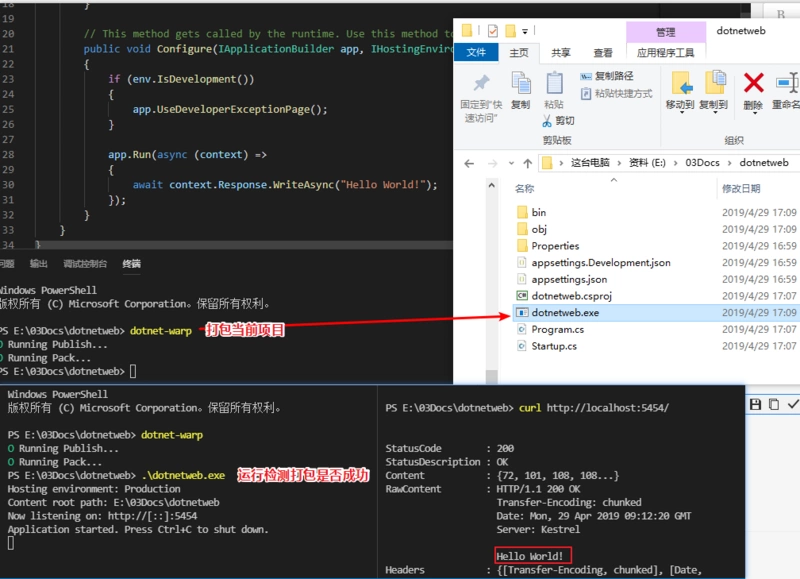
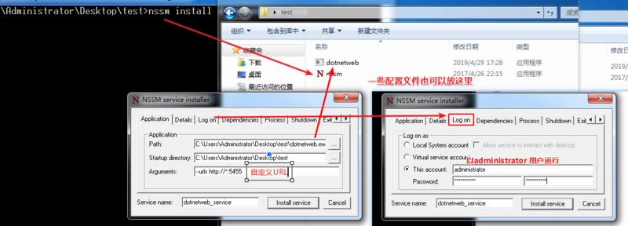
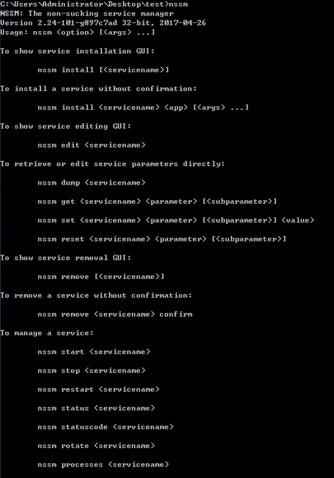

> 如果你想将 .net core 项目以服务的形式部署到 windows 系统,希望本篇文章能够让你少走弯路

## dotnet-warp 安装使用   
> dotnet-warp 是一个全局的.NET Core 工具，允许将.NET Core 项目打包为单个可执行文件   
> 项目地址：https://github.com/Hubert-Rybak/dotnet-warp                     
> 安装：`dotnet tool install --global dotnet-warp`          
> 使用：在项目输出目录执行 `dotnet-warp` 即可将应用打包成一个exe文件 (支持：win-x64，linux-x64，osx-x64)  




## NSSM 安装使用   
> NSSM 是一个服务封装程序，它可以方便的将 Exe 程序封装成 windows 服务运行
> 下载：[nssm-2.24](https://nssm.cc/release/nssm-2.24.zip)
> 使用：下载后将对应版本拷贝到目标机器，然后命令行执行：`nssm install` 即可唤出可视化界面   
> 选择应用路径，有参数的添加参数，指定服务名称，指定执行用户,然后安装即可
> 安装成功别忘记启动：`nssm start 服务名称`




执行/运行 nssm 接口查看所有命令,根据所需执行对应的命令即可



简单的使用nssm编写一个服务安装脚本
```
@echo off
nssm stop xxxx
nssm remove xxxx confirm
nssm install xxxx D:\Software\xxxx\xxxx.bat
nssm start xxxx
```


### 简单的给 asp .net core项目传入监听端口

```charp
public static IWebHostBuilder CreateWebHostBuilder(string[] args)
{
    List<string> urls = new List<string>();
    urls.Add("http://*:5454");//默认监听
    // --urls http://*:6060,https://*:2333
    var urlIndex = args.ToList().IndexOf("--urls");
    if (urlIndex > -1 && args.Length > urlIndex + 1 && !string.IsNullOrEmpty(args[urlIndex + 1]))
    {
        urls.AddRange(args[urlIndex + 1].Split(','));
    }
    return WebHost.CreateDefaultBuilder(args)
            .UseUrls(urls.ToArray())
            .UseStartup<Startup>();
}
```


## 注意事项
- wwwroot 文件夹需要手动拷贝
- 发布到 Windows7 时遇到的错误 `****/hostfxr.dll 找不到`，[下载对应系统版本的 Windows6.1-KB2533623 补丁后重启即可](https://www.microsoft.com/en-us/download/details.aspx?id=26764)
