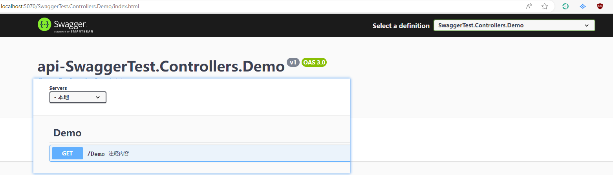

## 前言

> 公司项目是是微服务项目，网关是手撸的一个.net core webapi 项目，使用 refit 封装了 20+ 服务 SDK，在网关中进行统一调用和聚合等处理，以及给前端提供 swagger 文档
> 在我两年前进公司的时候，文档还能够顺滑的打开，在去年的时候文档只能在本地打开，或者访问原始的 swagger 页面，knife4j 的页面更是打不开一点，于是想办法对此进行了优化

## .net core 项目中使用 Swashbuckle.AspNetCore 生成 SwaggerUI
首先再记录一下安装及使用，之前也分享过 Swashbuckle.AspNetCore 的使用，不过版本比较老了，本次演示用的示例版本为 .net core 8.0，从安装使用开始分享一二

### 安装包

- 新建.net core 项目
- 添加 Swashbuckle.AspNetCore 相关包引用
- 设置项目 xml 生成路径，组件将根据 xml 解析接口相关信息

```xml
  <ItemGroup>
    <PackageReference Include="Swashbuckle.AspNetCore" Version="6.6.2" />
    <PackageReference Include="Swashbuckle.AspNetCore.Annotations" Version="6.6.2" />
    <PackageReference Include="Swashbuckle.AspNetCore.SwaggerUI" Version="6.6.2" />
  </ItemGroup>
	<PropertyGroup>
		<DocumentationFile>bin\$(MSBuildProjectName).xml</DocumentationFile>
	</PropertyGroup>
```

### 服务配置

- 一些基础配置使用备忘
   - 配置文档信息 `c.SwaggerDoc`
   - 配置环境 `c.AddServer`
   - 配置模型标识 `c.CustomSchemaIds`
   - 配置唯一标识 `c.CustomOperationIds`
   - 配置解析 xml `c.IncludeXmlComments`
   - 启用数据注解 `c.EnableAnnotations [SwaggerOperation]`
- 完整配置如下

```cs
//框架初始化巴拉巴拉xxx
builder.Services.AddControllers();
//配置 swagger
UseSwagger(builder.Services);

/// <summary>
/// Swagger 注入配置
/// </summary>
/// <param name="services"></param>
/// <returns></returns>
void UseSwagger(IServiceCollection services)
{
    services.AddSwaggerGen(c =>
    {
        //配置文档信息
        c.SwaggerDoc("v1", new OpenApiInfo
        {
            Title = "swagger接口文档测试",
            Description = "这是一个文档",
            Version = "v1",
        });
        //配置环境
        c.AddServer(new OpenApiServer()
        {
            Url = "",
            Description = "本地"
        });
        //配置模型标识，默认type.Name,名称一样，不同明明空间会报错，所以改成FullName,加上命名空间区分
        c.CustomSchemaIds(type => type.FullName);
        //配置唯一标识
        c.CustomOperationIds(apiDesc =>
        {
            var controllerAction = apiDesc.ActionDescriptor as ControllerActionDescriptor;
            return controllerAction.ControllerName + "-" + controllerAction.ActionName;
        });
        //解析站点下所有xml，一般加自己项目的引用的即可
        foreach (var file in Directory.GetFiles(AppContext.BaseDirectory, "*.xml"))
        {
            c.IncludeXmlComments(Path.Combine(AppContext.BaseDirectory, file));
        }
        //启用数据注解
        c.EnableAnnotations(true, true);
    });
}
```

- 启用 swagger

```cs

RunSwagger(app);

/// <summary>
/// 启用swagger
/// </summary>
/// <param name="app"></param>
void RunSwagger(IApplicationBuilder app)
{
    app.UseSwaggerUI(c =>
    {
        c.SwaggerEndpoint("/v1/api-docs", "V1 Docs");
    });
    app.UseEndpoints(endpoints =>
    {
        endpoints.MapControllers();
        endpoints.MapSwagger("{documentName}/api-docs");
        endpoints.MapGet("/v3/api-docs/swagger-config", async (httpContext) =>
        {
            JsonSerializerOptions jsonSerializerOptions = new JsonSerializerOptions
            {
                PropertyNamingPolicy = JsonNamingPolicy.CamelCase,
                IgnoreNullValues = true
            };
            jsonSerializerOptions.Converters.Add(new JsonStringEnumConverter(JsonNamingPolicy.CamelCase, false));
            SwaggerUIOptions _options = new SwaggerUIOptions()
            {
                ConfigObject = new ConfigObject()
                {
                    Urls = new List<UrlDescriptor>
                        {
                            new UrlDescriptor()
                            {
                                Url="/v1/api-docs",
                                Name="V1 Docs"
                            }
                        }
                }
            };
            await httpContext.Response.WriteAsync(JsonSerializer.Serialize(_options.ConfigObject, jsonSerializerOptions));
        });
    });
}

```

### 运行

- 运行后可以看到配置成功,swagger文档已经生成
   

到这里基础的 swagger 配置已可以使用，更深层次的参考官方文档使用即可，接下来才是不一样的东西
随着我们的项目发展，当我们的服务越来越多，接口也越来越多的时候，swagger 就从慢，到打开超时偶尔能打开，到每次都打不开(/api-docs 过大返回超时，渲染卡顿)
这个时候，或者一开始就应该对 swagger 进行分组返回了，优化 /api-docs 接口返回的数据
当然，除了这种方式，还有可以加特效标记的方式，但是几百个服务，加不了一点

## 分模块返回文档

> 一开始并没有想到分组显示，因为在本地运行的时候是可以打开的，只是 json 文件较大，于是做了一个优化是每次在发布应用后，请求一个接口去将 swagger 的 json 文件生成到本地，后续访问直接读取，算是暂时解决了打不开的问题，这样用了大半年，实在受不了这个速度，然后平时在看一些开源项目的时候发现是完全可以按自己的规则进行分组的，于是有了这篇文章

为了兼容之前的文档路由，所以还是在原有配置的基础上，配置了其他模块的接口文档
可有两种方式
- 一种是在原有基础上显示其他分组

- 一种是单独的 swagger 进行显示



### 优化修改
- 先定义好需要分组显示的模块

```cs
//设置需要分组的api接口
var groupApis = new List<string>() { "SwaggerTest.Controllers.Test", "SwaggerTest.Controllers.Demo" };
```

- UseSwagger 修改部分
- 重点是这块的自定义，去分组中匹配路由 c.DocInclusionPredicate [官方文档](https://github.com/domaindrivendev/Swashbuckle.AspNetCore/blob/master/README.md#customize-the-action-selection-process)

```cs
//配置文档信息
c.SwaggerDoc("v1", new OpenApiInfo
{
    Title = "swagger接口文档测试",
    Description = "这是一个文档",
    Version = "v1",
});
//配置环境
c.AddServer(new OpenApiServer()
{
    Url = "",
    Description = "本地"
});
//模型标识配置，默认type.Name,名称一样，不同明明空间会报错，所以改成FullName,加上命名空间区分
c.CustomSchemaIds(type => type.FullName);
c.CustomOperationIds(apiDesc =>
{
    var controllerAction = apiDesc.ActionDescriptor as ControllerActionDescriptor;
    return controllerAction.ControllerName + "-" + controllerAction.ActionName;
});
//加载注释文件
foreach (var file in Directory.GetFiles(AppContext.BaseDirectory, "*.xml"))
{
    c.IncludeXmlComments(Path.Combine(AppContext.BaseDirectory, file));
}
//增加模块接口的注册
groupApis.ForEach(s =>
{
    c.SwaggerDoc(s, new OpenApiInfo
    {
        Title = "api-" + s,
        Description = "api " + s,
        Version = "v1",
    });
});

//启用数据注解
c.EnableAnnotations(true, true);
//自定义分组匹配
c.DocInclusionPredicate((docName, apiDes) =>
{
    if (groupApis.Contains(docName))
    {
        var displayName = apiDes.ActionDescriptor?.DisplayName?.ToLower() ?? string.Empty;
        var existGroup = groupApis.FirstOrDefault(s => displayName.Contains(s.ToLower()));
        return docName == existGroup;
    }

    return true;
});
```

- RunSwagger 修改部分

```cs
app.UseSwaggerUI(c =>
{
    c.SwaggerEndpoint("/v1/api-docs", "V1 Docs");
    //默认页支持分组
    groupApis.ForEach(s =>
    {
        c.SwaggerEndpoint($"/{s}/api-docs", s);
    });
});
//单独的页面
groupApis.ForEach(s =>
{
    app.UseSwaggerUI(c =>
    {
        c.RoutePrefix = s;
        c.SwaggerEndpoint($"/{s}/api-docs", s);
    });
});
app.UseEndpoints(endpoints =>
{
    SwaggerUIOptions _options = new SwaggerUIOptions()
    {
        ConfigObject = new ConfigObject()
        {
            Urls = new List<UrlDescriptor>
                {
                    new UrlDescriptor()
                    {
                        Url="/v1/api-docs",
                        Name="V1 Docs"
                    }
                }.Concat(groupApis.Select(s => new UrlDescriptor()
                        {
                            Url = $"/{s}/api-docs",
                            Name = s
                        }).ToList())
        }
    };
})
```

修改完成后，可以结合自己业务来定义需要单独显示分组，最近又基于此加了一个开放平台的接口，独立于正常网关，单独提供出去，一切都是刚刚好~


## 后语
如果有更好的方式，欢迎分享
若有错误，欢迎指出，谢谢

### 相关文档
- [Swashbuckle.AspNetCore](https://github.com/domaindrivendev/Swashbuckle.AspNetCore/blob/master/README.md)
- [一篇比较细致的 Swashbuckle 使用教程](https://www.cnblogs.com/shanfeng1000/p/13476831.html)

