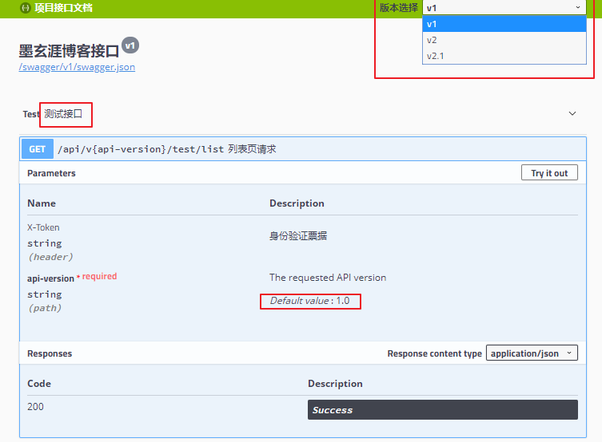

## 关于 Swashbuckle.AspNetCore3.0

> 一个使用 ASP.NET Core 构建的 API 的 Swagger 工具。直接从您的路由，控制器和模型生成漂亮的 API 文档，包括用于探索和测试操作的 UI。  
> 项目主页：https://github.com/domaindrivendev/Swashbuckle.AspNetCore  
> 项目官方示例：https://github.com/domaindrivendev/Swashbuckle.AspNetCore/tree/master/test/WebSites

之前写过一篇[Swashbuckle.AspNetCore-v1.10 的使用](https://www.cnblogs.com/morang/p/8325729.html),现在 `Swashbuckle.AspNetCore` 已经升级到 3.0 了，正好开新坑(博客重构)重新封装了下，将所有相关的一些东西抽取到单独的类库中,尽可能的避免和项目耦合，使其能够在其他项目也能够快速使用。

## 运行示例



## 封装代码
Swagger封装相关源码：https://github.com/moxycoding/moxy.api.dotnet/tree/master/src/Core/Moxy.Swagger
参考下面步骤可自行封装  


### 1. 新建类库并添加引用

我引用的版本如下

```
    <PackageReference Include="Microsoft.AspNetCore.Http.Abstractions" Version="2.1.1" />
    <PackageReference Include="Microsoft.AspNetCore.Mvc" Version="2.1.1" />
    <PackageReference Include="Swashbuckle.AspNetCore" Version="3.0.0" />
```

### 2. 构建参数模型 CustsomSwaggerOptions.cs

```cs
    public class CustsomSwaggerOptions
    {
        /// <summary>
        /// 项目名称
        /// </summary>
        public string ProjectName { get; set; } = "My API";
        /// <summary>
        /// 接口文档显示版本
        /// </summary>
        public string[] ApiVersions { get; set; }
        /// <summary>
        /// 接口文档访问路由前缀
        /// </summary>
        public string RoutePrefix { get; set; } = "swagger";
        /// <summary>
        /// 使用自定义首页
        /// </summary>
        public bool UseCustomIndex { get; set; }
        /// <summary>
        /// UseSwagger Hook
        /// </summary>
        public Action<SwaggerOptions> UseSwaggerAction { get; set; }
        /// <summary>
        /// UseSwaggerUI Hook
        /// </summary>
        public Action<SwaggerUIOptions> UseSwaggerUIAction { get; set; }
        /// <summary>
        /// AddSwaggerGen Hook
        /// </summary>
        public Action<SwaggerGenOptions> AddSwaggerGenAction { get; set; }
    }
```

### 3. 版本控制默认参数接口实现 SwaggerDefaultValueFilter.cs

因为版本不同，相关示例已失效，请按照官方文档使用。仅供参考。
官方相关文档：https://github.com/domaindrivendev/Swashbuckle.AspNetCore#operation-filters

```cs
    public class SwaggerDefaultValueFilter : IOperationFilter
    {
        public void Apply(Swashbuckle.AspNetCore.Swagger.Operation operation, OperationFilterContext context)
        {
            // REF: https://github.com/domaindrivendev/Swashbuckle.AspNetCore/issues/412
            // REF: https://github.com/domaindrivendev/Swashbuckle.AspNetCore/pull/413
            foreach (var parameter in operation.Parameters.OfType<NonBodyParameter>())
            {
                var description = context.ApiDescription.ParameterDescriptions.FirstOrDefault(p => p.Name == parameter.Name);
                if (description == null)
                    return;
                if (parameter.Description == null)
                {
                    parameter.Description = description.ModelMetadata.Description;
                }

                if (description.RouteInfo != null)
                {
                    parameter.Required |= !description.RouteInfo.IsOptional;
                    if (parameter.Default == null)
                        parameter.Default = description.RouteInfo.DefaultValue;
                }
            }
        }
```

最新版本的 IOperationFilter接口实现示例
```
public void Apply(Microsoft.OpenApi.Models.OpenApiOperation operation, OperationFilterContext context)
{
}
```

### 4. CustomSwaggerServiceCollectionExtensions.cs

```cs
    public static class CustomSwaggerServiceCollectionExtensions
    {
        public static IServiceCollection AddCustomSwagger(this IServiceCollection services)
        {
            return AddCustomSwagger(services, new CustsomSwaggerOptions());
        }

        public static IServiceCollection AddCustomSwagger(this IServiceCollection services, CustsomSwaggerOptions options)
        {
            services.AddSwaggerGen(c =>
            {
                if (options.ApiVersions == null) return;
                foreach (var version in options.ApiVersions)
                {
                    c.SwaggerDoc(version, new Info { Title = options.ProjectName, Version = version });
                }
                c.OperationFilter<SwaggerDefaultValueFilter>();
                options.AddSwaggerGenAction?.Invoke(c);

            });
            return services;
        }
    }
```

### 5. SwaggerBuilderExtensions.cs

```cs
    public static class SwaggerBuilderExtensions
    {
        public static IApplicationBuilder UseCustomSwagger(this IApplicationBuilder app)
        {
            return UseCustomSwagger(app, new CustsomSwaggerOptions());
        }
        public static IApplicationBuilder UseCustomSwagger(this IApplicationBuilder app, CustsomSwaggerOptions options)
        {
            app.UseSwagger(opt =>
            {
                if (options.UseSwaggerAction == null) return;
                options.UseSwaggerAction(opt);
            });
            app.UseSwaggerUI(c =>
            {
                if (options.ApiVersions == null) return;
                c.RoutePrefix = options.RoutePrefix;
                c.DocumentTitle = options.ProjectName;
                if (options.UseCustomIndex)
                {
                    c.UseCustomSwaggerIndex();
                }
                foreach (var item in options.ApiVersions)
                {
                    c.SwaggerEndpoint($"/swagger/{item}/swagger.json", $"{item}");
                }
                options.UseSwaggerUIAction?.Invoke(c);
            });

            return app;
        }
        /// <summary>
        /// 使用自定义首页
        /// </summary>
        /// <returns></returns>
        public static void UseCustomSwaggerIndex(this SwaggerUIOptions c)
        {
            var currentAssembly = typeof(CustsomSwaggerOptions).GetTypeInfo().Assembly;
            c.IndexStream = () => currentAssembly.GetManifestResourceStream($"{currentAssembly.GetName().Name}.index.html");
        }
    }
```

### 6. 模型初始化

```cs
    private CustsomSwaggerOptions CURRENT_SWAGGER_OPTIONS = new CustsomSwaggerOptions()
    {
        ProjectName = "墨玄涯博客接口",
        ApiVersions = new string[] { "v1", "v2" },//要显示的版本
        UseCustomIndex = true,
        RoutePrefix = "swagger",
        AddSwaggerGenAction = c =>
        {
            var filePath = System.IO.Path.Combine(System.AppContext.BaseDirectory, typeof(Program).GetTypeInfo().Assembly.GetName().Name + ".xml");
            c.IncludeXmlComments(filePath, true);
        },
        UseSwaggerAction = c =>
        {

        },
        UseSwaggerUIAction = c =>
        {

        }
    };
```

### 7. 在 api 项目中使用

添加对新建类库的引用，并在 webapi 项目中启用版本管理需要为输出项目添加 Nuget 包：`Microsoft.AspNetCore.Mvc.Versioning`，`Microsoft.AspNetCore.Mvc.Versioning.ApiExplorer` (如果需要版本管理则添加)

我引用的版本如下

```
    <PackageReference Include="Microsoft.AspNetCore.Mvc.Versioning" Version="2.3.0" />
    <PackageReference Include="Microsoft.AspNetCore.Mvc.Versioning.ApiExplorer" Version="2.2.0" />
```

Startup.cs 代码

```cs
    public void ConfigureServices(IServiceCollection services)
    {
        services.AddMvc().SetCompatibilityVersion(CompatibilityVersion.Version_2_1);
        //版本控制
        services.AddMvcCore().AddVersionedApiExplorer(o => o.GroupNameFormat = "'v'VVV");
        services.AddApiVersioning(option =>
        {
            // allow a client to call you without specifying an api version
            // since we haven't configured it otherwise, the assumed api version will be 1.0
            option.AssumeDefaultVersionWhenUnspecified = true;
            option.ReportApiVersions = false;
        });
        //custom swagger
        services.AddCustomSwagger(CURRENT_SWAGGER_OPTIONS);
    }

    // This method gets called by the runtime. Use this method to configure the HTTP request pipeline.
    public void Configure(IApplicationBuilder app, IHostingEnvironment env, IApiVersionDescriptionProvider provider)
    {
        if (env.IsDevelopment())
        {
            app.UseDeveloperExceptionPage();
        }
        //custom swagger
        //自动检测存在的版本
        // CURRENT_SWAGGER_OPTIONS.ApiVersions = provider.ApiVersionDescriptions.Select(s => s.GroupName).ToArray();
        app.UseCustomSwagger(CURRENT_SWAGGER_OPTIONS);
        app.UseMvc();
    }
```

## 关键代码拆解

### action 方法的 xml 注释

```cs
new CustsomSwaggerOptions(){
    AddSwaggerGenAction = c =>
    {
        var filePath = System.IO.Path.Combine(System.AppContext.BaseDirectory, typeof(Program).GetTypeInfo().Assembly.GetName().Name + ".xml");
        //controller及action注释
        c.IncludeXmlComments(filePath, true);
    }
}
```

当然还需要生成xml，编辑解决方案添加(或者在vs中项目属性->生成->勾选生成xml文档文件)如下配置片段   

```
  <PropertyGroup Condition="'$(Configuration)|$(Platform)'=='Release|AnyCPU'">
    <DocumentationFile>.\项目名称.xml</DocumentationFile>
  </PropertyGroup>

  <PropertyGroup Condition="'$(Configuration)|$(Platform)'=='Debug|AnyCPU'">
    <DocumentationFile>.\项目名称.xml</DocumentationFile>
  </PropertyGroup>
```

目前.net core2.1我这会将此 xml 生成到项目目录，故可能需要将其加入.gitignore中。

### 版本控制

添加 Nuget 包：`Microsoft.AspNetCore.Mvc.Versioning`，`Microsoft.AspNetCore.Mvc.Versioning.ApiExplorer`
并在 ConfigureServices 中设置

```cs
    //版本控制
    services.AddMvcCore().AddVersionedApiExplorer(o => o.GroupNameFormat = "'v'VVV");
    services.AddApiVersioning(option =>
    {
        // allow a client to call you without specifying an api version
        // since we haven't configured it otherwise, the assumed api version will be 1.0
        option.AssumeDefaultVersionWhenUnspecified = true;
        option.ReportApiVersions = false;
    });
```

controller 使用

```cs
    /// <summary>
    /// 测试接口
    /// </summary>
    [ApiVersion("1.0")]
    [Route("api/v{api-version:apiVersion}/test")]
    [ApiController]
    public class TestController : ControllerBase
    {
    }
```

### 自定义主题

将 index.html 修改为内嵌资源就可以使用`GetManifestResourceStream`获取文件流,使用此 html，可以自己使用`var configObject = JSON.parse('%(ConfigObject)');`获取到 swagger 的配置信息，从而根据此信息去写自己的主题即可。

```cs
    /// <summary>
    /// 使用自定义首页
    /// </summary>
    /// <returns></returns>
    public static void UseCustomSwaggerIndex(this SwaggerUIOptions c)
    {
        var currentAssembly = typeof(CustsomSwaggerOptions).GetTypeInfo().Assembly;
        c.IndexStream = () => currentAssembly.GetManifestResourceStream($"{currentAssembly.GetName().Name}.index.html");
    }
```

若想注入 css，js 则在 UseSwaggerUIAction 委托中调用对应的方法接口，[官方文档](https://github.com/domaindrivendev/Swashbuckle.AspNetCore#inject-custom-css)

另外，目前 swagger-ui 3.19.0 并不支持多语言，不过可以根据需要使用 js 去修改一些东西
比如在 index.html 的 onload 事件中这样去修改头部信息

```js
document.getElementsByTagName(
  'span'
)[0].innerText = document
  .getElementsByTagName('span')[0]
  .innerText.replace('swagger', '项目接口文档')
document.getElementsByTagName(
  'span'
)[1].innerText = document
  .getElementsByTagName('span')[1]
  .innerText.replace('Select a spec', '版本选择')
```

在找汉化解决方案时追踪到 Swashbuckle.AspNetCore3.0 主题时使用的[swagger-ui 为 3.19.0](https://github.com/domaindrivendev/Swashbuckle.AspNetCore/blob/master/src/Swashbuckle.AspNetCore.SwaggerUI/package.json)，从[issues2488](https://github.com/swagger-api/swagger-ui/issues/2488#issuecomment-344077847)了解到目前不支持多语言，其他的问题也可以[查看此仓库](https://github.com/swagger-api/swagger-ui)
在使用过程中遇到的问题，基本上 readme 和 issues 都有答案，遇到问题多多阅读即可

### 参考文章

- [官方示例](https://github.com/domaindrivendev/Swashbuckle.AspNetCore/tree/master/test/WebSites)
- [Asp.Net Core 中使用 Swagger，你不得不踩的坑](https://www.cnblogs.com/gdsblog/p/9279814.html)
