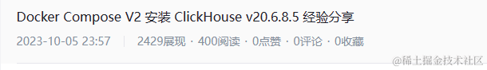

## 假期第一天

玩游戏，刷视频，安逸之中似乎好像又有点无聊~

## 假期第二天

去朋友那玩了一天，逛书店的时候无意中看到一本书，买了下来

以书为契机，准备找点事情来做，于是把之前一直拖延着的想法提上日程：总结下平时用过的一些技术。刚好在一个社群有大佬分享了一个放在飞书上的架构图，于是我打开了飞书，结果发现这网站用来写东西好像好不错，于是开始尝试了我的写作，就一发不可收拾了~

随后就画了画平时用到的微服务相关知识图谱，好家伙，东西还不少

然后开始新建文件夹

## 假期第三天

完事开头难，好在，第一天根据脑图列了个目录，把虚拟机成功搞起来了并写了文章，这波让我觉得我又行了，更是定下了连更7天的小目标(1号开始，本篇结尾，达成~)

CentOS 因为之前都自己安装过，这次也就是复习了

2023-10-01 产出文章： [Hyper-V 安装 CentOS 8.5](https://juejin.cn/post/7283798251404738560)

## 假期第四天

熬了个大夜，把 Docker 和 Docker Compose 安装到了CentOS里面，然后就是测试虚拟机的备份还原复用方案

因为以前也写过文章，但是 CentOS上面弄还是第一次，包源的问题，复用的方案也反反复复尝试了很多次

最后又花了一些时间准备明天更新的文章

2023-10-02 产出文章：[Docker V24 及 Docker Compose V2 的安装及使用](https://juejin.cn/post/7283873796977197108)

## 假期第五天

去参加了初中同学的婚礼，然后白天在和朋友玩，好在昨天已经提前弄了一点，晚上回来接着开干，顺利的把mongo 和 mysql 的容器部署方案给整理好了，其实预计其中还会有 clickhouse，但是其配置文件还是有点复杂，就准备单开文章，继而就去看了下怎么连接数据库，尝试了一些 Web在线管理的方案([Archery](https://github.com/hhyo/Archery) [Cloudbeaver ](https://github.com/dbeaver/cloudbeaver))，都不是很理想，走了点弯路，后面还是使用了客户端 DBeaver 来作为连接工具，并记录了一些使用方式

2023-10-03 产出文章：[Docker Compose V2 安装常用数据库MySQL+Mongo](https://juejin.cn/post/7284630352790011944)

## 假期第六天

当我用DBeaver连接测试完MySql后，兴奋的点开 NoSQL 连接时发现竟然不支持，是的，我用的免费版，不支持。但是，没有关系，我会找到解决方案。

网上大部分的文章都说需要Java环境，然后要自己编译生成许可才行，没有一个能直接运行的，然后就找到了这篇文章

基于这位掘友的文章，尝试改了些代码，做了一个直接运行的包，嗯，完美~

明天要和家人出去玩，然后一下午一晚上把 Clickhouse 研究整理了下

2023-10-04 产出文章：[DBeaver Ultimate 22.1.0 连接数据库(MySQL+Mongo+Clickhouse)](https://juejin.cn/post/7285290243297837108)

## 假期第七天

一大早就和家人逛了动物园，人很多，但是我心里只有我的文章。

然后晚上8点才回来，回来就马不停蹄的开搞了，终于，23:57 完成了更新

2023-10-05 产出文章：[Docker Compose V2 安装 ClickHouse v20.6.8.5 经验分享](https://juejin.cn/post/7285922296009850937)

## 假期第八天

假期最后一天，最后一个懒觉，起来吃完饭12点多就开始坐到电脑边,开始研究 redis，搞完单机版，没忍住继续折腾集群版

等再一次看时间的时候就已经是 22 点了

突然脑子里面冒出来一句：我好卷 哈哈哈哈哈哈哈哈哈哈哈哈

但是，挺快乐的。沉迷学习无法自拔.jpg

2023-10-06 产出文章：[Docker 安装 Redis 单机+集群总结](https://juejin.cn/post/7286307632192766011)

## 假期的收获

-   一本书
-   一个项目
-   一个开始
