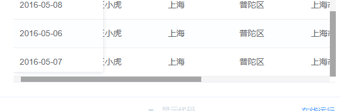

来源于 layui 


## css 代码

```


::-webkit-scrollbar {

  width: 10px;

  height: 10px;

}

::-webkit-scrollbar-button,

::-webkit-scrollbar-button:vertical {

  display: none;

}

::-webkit-scrollbar-track,

::-webkit-scrollbar-track:vertical {

  background-color: black;

}

::-webkit-scrollbar-track-piece {

  background-color: #f5f5f5;

}

::-webkit-scrollbar-thumb,

::-webkit-scrollbar-thumb:vertical {

  margin-right: 10px;

  background-color: #a6a6a6;

}

::-webkit-scrollbar-thumb:hover,

::-webkit-scrollbar-thumb:vertical:hover {

  background-color: #aaa;

}

::-webkit-scrollbar-corner,

::-webkit-scrollbar-corner:vertical {

  background-color: #535353;

}

::-webkit-scrollbar-resizer,

::-webkit-scrollbar-resizer:vertical {

  background-color: #ff6e00;

}


```

## 效果图





## 相关资料


- ::-webkit-scrollbar        滚动条整体部分，其中的属性有width,height,background,border（就和一个块级元素一样）等。        

- ::-webkit-scrollbar-button      滚动条两端的按钮。可以用display:none让其不显示，也可以添加背景图片，颜色改变显示效果。        

- ::-webkit-scrollbar-track         外层轨道。可以用display:none让其不显示，也可以添加背景图片，颜色改变显示效果。        

- ::-webkit-scrollbar-track-piece        内层轨道，滚动条中间部分（除去）。        

- ::-webkit-scrollbar-thumb               滚动条里面可以拖动的那部分        

- ::-webkit-scrollbar-corner               边角        

- ::-webkit-resizer                       定义右下角拖动块的样式
