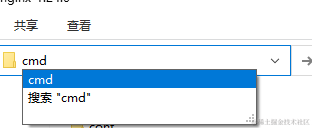

## 前言

> nginx 是一个高性能的开源反向代理服务器和 web 服务器，一般用来搭建静态资源服务器、负载均衡器、反向代理，本文将分享其在 Windows/docker 中的使用,使用 nssm 部署成服务的方案脚本，局域网中自定义域名解决https提示不安全的解决方案，以及一路踩过的坑。

### 特点

-   高性能：事件驱动的异步架构，能够处理大量并发连接
-   静态资源服务器：部署前端静态页面及静态资源
-   反向代理服务器：接收客户端请求，并将请求转发到后端服务，可以实现负载均衡、请求分发和缓存等功能
-   支持 HTTPS

### 使用情况

-   配置域名转发到项目服务

-   外网穿透请求转发到局域网服务器

-   测试环境项目的 https 配置

-   需要明白 nginx 默认启动后会发生什么？

    -   监听指定端口（默认 80）
    -   拦截本机访问 80 端口的请求到 nginx 来进行处理
    -   可以添加配置监听不同的端口
    -   同样监听 80，但是可以通过 server_name 来指定不同的域名使用不同的规则
    -   本地测试可以通过修改 hosts 文件（C:\Windows\System32\drivers\etc\hosts）来将域名请求转发到本机
    -   服务器需要解析域名到服务器 IP，不同的云商还需要注意其安全组，防火墙是否开启或需要设置规则

-   Windows 中路径需要使用 / 或者 \\，如路径 `D:\Software\nginx-1.24.0\ssl` nginx.conf 需要配置为 `D:/Software/nginx-1.24.0/ssl/` 或 `D:\Software\nginx-1.24.0\ssl\`

## 实践

### 准备

-   本文版本：v1.24.0

-   使用端口：80 443

-   最基本组成：一个 server 节点一个域名配置，要添加其他配置添加 server 节点即可

       ```
        worker_processes  1;
        events {
            worker_connections  1024;
        }
        http {
            server {
                listen       80;
                server_name  localhost;
                error_page   500 502 503 504  /50x.html;
                location = /50x.html {
                    root   html;
                }
            }
        }
        ```

### Windows 安装使用 nginx

#### 安装运行

-   直接官网下载即可 [v1.24.0](http://nginx.org/download/nginx-1.24.0.zip)

-   下载后解压到：D:\Software\nginx-1.24.0

-   在目录输入框打开 cmd 并运行：`start nginx`运行 nginx，如果端口没有被占用的话访问 localhost 即可出现 welcome 页面

       
       

-   尝试修改配置：D:\Software\nginx-1.24.0\confi\nginx.conf 添加一个文本返回

       

-   添加的文本及 json 返回

       ```
        #server{....
        #返回文本
        location /text {
            add_header Content-Type text/plain;
            return 200 'This is a plain text response.';
        }       
        #返回json 
        location /json {
            add_header Content-Type application/json;
            return 200 '{"message": "This is a JSON response.233"}';
        }

        #默认配置
        location / {
            root   html;
            index  index.html index.htm;
        }
        #...}
        ```

#### 域名配置

-   因在本地测试，所以需要使用域名访问到 nginx，需要配置 hosts（服务器外网域名配置就将域名解析到服务器）

-   添加一条记录：` 127.0.0.1  ``nginx.devops.test.com` 现在默认就访问`nginx.devops.test.com` 的时候就请求到了 nginx 的默认配置了，nginx 默认监听了 localhost:80 使其返回我们指定的内容

      

-   添加 server 配置节点，重载配置后访问，即可看到访问显示了配置中的内容

    ```
        server {
                listen       80;
                server_name  nginx.devops.test.com;
               location / {
                    add_header Content-Type text/plain;
                    return 200 'nginx.devops.test.com';
                }
            }
        ```
     

     

-   因为浏览器的一些机制，可能会自己默认跳转到 https，然后还看不到协议，此时就需要手动改下


#### SSL 证书申请

为了给网站加把锁（数据传输的私密性），一般个人项目用免费的就行，不过有限制，比如通配符、有效期、安全性等，企业一般会使用付费证书，自行购买即可，一般云商也会提供免费证书，其他免费的目前使用过的就下面两种

-   在线网站申请：可以在 [freessl](https://freessl.cn/) 根据需要申请免费/付费证书，其还包含有证书管理和到期提醒等服务
-   win-acme：一个免费的开源工具，用于 Windows 上的 Let's Encrypt 证书的自动化获取和续订

如果本地也需要使用 https 的话，也可以通过 nginx 来配置证书，为应用加把锁。服务器的证书配置使用上面两种生成，参考下面配置即可

#### nginx 本地配置 https

-   使用 openssl 生成自签证书（会提示不安全，下一步解决）

```
#依次执行，输入信息，我这里都输入了 ym
openssl genrsa -out server.key 1024
openssl req -new -key server.key -out server.csr
openssl genrsa -out ca.key 1024
openssl req -new -key ca.key -out ca.csr
openssl x509 -req -in ca.csr -signkey ca.key -out ca.crt
openssl x509 -req -CA ca.crt -CAkey ca.key -CAcreateserial -in server.csr -out server.crt
```


-   从图里面可以看到都加上 https 了，怎么还是不安全，甚至第一次还被拦截了，这个是浏览器机制问题，找了一晚上，终于找到了[解决方案](https://deliciousbrains.com/ssl-certificate-authority-for-local-https-development/) 思路来源 [stackoverflow](https://stackoverflow.com/questions/7580508/getting-chrome-to-accept-self-signed-localhost-certificate#answer-60516812)，下面详细说明步骤

1.  生成 CA 证书（所在目录：D:/Software/nginx-1.24.0/ssl）

     ```
        winpty openssl genrsa -des3 -out myCA.key 2048
        winpty openssl req -x509 -new -nodes -key myCA.key -sha256 -days 1825 -out myCA.pem
        ```

1.  导入 myCA.pem 证书到受信任的根证书颁发机构（Win+R 打开：`certlm.msc`）

      

1.  创建 CA 签名证书（不同域名创建不同的证书）

```
winpty openssl genrsa -out nginx.devops.test.com.key 2048
winpty openssl req -new -key nginx.devops.test.com.key -out nginx.devops.test.com.csr
```

4.  创建 X509 V3 证书扩展配置文件 nginx.devops.test.com。ext

      ```
        authorityKeyIdentifier=keyid,issuer
        basicConstraints=CA:FALSE
        keyUsage = digitalSignature, nonRepudiation, keyEncipherment, dataEncipherment
        subjectAltName = @alt_names

        [alt_names]
        DNS.1 = nginx.devops.test.com
        ```

4.  生成证书

      ```
        winpty openssl x509 -req -in nginx.devops.test.com.csr -CA myCA.pem -CAkey myCA.key -CAcreateserial -out nginx.devops.test.com.crt -days 825 -sha256 -extfile nginx.devops.test.com.ext
        ```

4.  配置 nginx

      ```
            server {
               listen       80;
               listen       443 ssl;
               server_name  nginx.devops.test.com;

               ssl_certificate      D:/Software/nginx-1.24.0/ssl/nginx.devops.test.com.crt;
               ssl_certificate_key  D:/Software/nginx-1.24.0/ssl/nginx.devops.test.com.key;

               ssl_session_cache    shared:SSL:1m;
               ssl_session_timeout  5m;

               ssl_ciphers  HIGH:!aNULL:!MD5;
               ssl_prefer_server_ciphers  on;
               location / {
                    add_header Content-Type text/plain;
                    return 200 'nginx.devops.test.com666';
                }
            }
        ```

4.  成功，没有不安全字样了

      

4.  如果要在局域网其他机器访问，也需要执行第 2 步操作导入 myCA.pem 证书，并配置对应的 hosts

#### 使用 nssm 创建 nginx 服务

-   每次改完配置还要敲命令重启，开机还要启动，那很明显是不太方便的，所以部署 nginx 服务就很有必要了

-   和 Windows 计划任务设置开机启动相比，我更倾向和习惯于使用 [nssm ](https://nssm.cc/download)（一个服务封装程序，它可以方便的将程序封装成 windows 服务运行）来为应用创建一个服务进行管理。

-   下面分享两个快速创建服务的脚本及使用。通过这两个脚本，只需修改对应路径，就可以为应用创建服务并做到开机自启了

-   添加一个启动 nginx 的脚本 start.bat

    -   放在 nginx 目录中（D:\Software\nginx-1.24.0\start.bat ） ，以**管理员** **身份运行**即可删除 nginx 进程并重新启动
    -   删除进程并重启，**测试环境使用，生产环境不建议直接使用**
    -   ```
        @echo off
        cd  /d %~dp0
        echo kill nginx
        taskkill /fi "imagename eq nginx.EXE" /f
        echo start nginx
        start nginx
        echo start nginx success
        pause
        ```

-   将 start.bat 脚本使用 nssm 的方式设置为服务 [nssm v2.24 下载](https://nssm.cc/release/nssm-2.24.zip)

    -   下载后解压：D:\Software\nssm\nssm-2.24\win64

    -   在目录添加 Nginx-service.bat，以快速创建并启动 nginx 服务，根据需要修改服务名和 nginx 启动脚本的路径即可

        -   ```
            @echo off
            cd  /d %~dp0
            nssm stop Nginx-service
            nssm remove Nginx-service confirm
            nssm install Nginx-service D:\Software\nginx-1.24.0\start.bat
            sc start Nginx-service
            pause
            ```

    -   以**管理员** **身份运行**，即可创建并启动服务，

        -   

    -   至此，电脑重启服务也将自启，并且还可以通过服务的重新启动来重启应用

#### 常用命令

-   启动：`start nginx`

-   重载配置：`nginx -s reload` 如果出错会回滚到上一次正确配置文件保持正常运行，可能会存在缓存，Ctrl+F5 刷新浏览器

-   停止 nginx（删除 nginx 进程）：`taskkill /fi "imagename eq nginx.EXE" /f`

    -   windows 下使用 nginx 一直有个问题就是重载配置后，不管有没有问题都可能会启动多个 nginx 进程，最后重载配置无效，就只能删除进程后再启动了

### 使用 Docker Compose 安装 nginx

> 本篇文章基于 Docker V24 及 Docker Compose V2，安装可以参考之前的[文章](https://juejin.cn/post/7283873796977197108)

#### 配置说明

-   镜像版本：`nginx:1.24.0`

-   指定端口：80 443

-   指定时区：`TZ : 'Asia/Shanghai'`，让日志文件显示北京时间

-   指定挂载目录

    -   `./config/nginx.conf:/etc/nginx/nginx.conf`：默认配置文件，会加载 conf.d 下的所有配置
    -   `./config/conf.d:/etc/nginx/conf.d`：自定义配置文件
    -   `./html:/usr/share/nginx/html`：默认的静态文件目录
    -   `./logs:/var/log/nginx`：默认的日志目录
    -   `./ssl:/ssl`：证书目录，配置中使用 /ssl/xxx 指定

-   配置重载：`docker exec nginx_1_24 nginx -s reload`

-   指定网络：devopsnetwork （`docker network create devopsnetwork`）

-   目录结构

       

#### 配置文件 compose.yml

-   将准备好的 compose.yml config ssl html 拷贝到服务器
-   然后运行`docker compose up -d`即可

```
version: '3.1'
services:
  nginx:
    image: nginx:1.24.0
    container_name: nginx_1_24
    restart: always
    environment:
      TZ : 'Asia/Shanghai'
    ports:
      - "80:80"
      - "443:443"
    volumes:
      - ./config/nginx.conf:/etc/nginx/nginx.conf
      - ./config/conf.d:/etc/nginx/conf.d
      - ./html:/usr/share/nginx/html
      - ./logs:/var/log/nginx
      - ./ssl:/ssl
      
    networks:
      - devopsnetwork

networks:
  devopsnetwork:
    external: true
```

#### 默认的 nginx.conf v1.24

```
user  nginx;
worker_processes  auto;

error_log  /var/log/nginx/error.log notice;
pid        /var/run/nginx.pid;

events {
    worker_connections  1024;
}

http {
    include       /etc/nginx/mime.types;
    default_type  application/octet-stream;

    log_format  main  '$remote_addr - $remote_user [$time_local] "$request" '
                      '$status $body_bytes_sent "$http_referer" '
                      '"$http_user_agent" "$http_x_forwarded_for"';

    access_log  /var/log/nginx/access.log  main;

    sendfile        on;
    #tcp_nopush     on;

    keepalive_timeout  65;

    #gzip  on;

    include /etc/nginx/conf.d/*.conf;
}
```

#### 自定义配置 conf.d/default.conf

将前文 Windows 的配置部分修改到 default.conf 如下所示

```
server {
  listen       80;
  listen       443 ssl;
  server_name  nginx.devops.test.com;

  ssl_certificate      /ssl/nginx.devops.test.com.crt;
  ssl_certificate_key  /ssl/nginx.devops.test.com.key;

  ssl_session_cache    shared:SSL:1m;
  ssl_session_timeout  5m;

  ssl_ciphers  HIGH:!aNULL:!MD5;
  ssl_prefer_server_ciphers  on;
  location / {
      add_header Content-Type text/plain;
      return 200 'nginx.devops.test.com 001';
  }
}
```

#### 创建证书 ssl 目录

上传生成的 ssl 证书或者在 linux 中使用上面 openssl 的方式重新生成域名证书，然后本地添加 pem 证书，即可使用 https

### Nginx 的应用

-   前面文章我们安装了 Apollo，RabbitMQ 及各种常用数据库，下面将通过 nginx 给之前文章中的应用配置域名转发
-   通过域名访问到各自应用中，而无需再使用 IP+端口来访问应用，这样就算后面部署方式/IP、端口发送变化，只需要修改 nginx 的转发配置即可

#### 本地使用域名前的配置

要想在局域网使用自定义的域名访问应用，需要先配置 hosts 文件，这里使用 hosts 将域名请求指向目标服务器 192.168.123.214

```
192.168.123.214 apollo.devops.test.com
192.168.123.214 rabbitmq.devops.test.com
```

还可以搭建一个 dns 服务，设置本机的 dns，即可将域名请求交友 dns 解析到对应服务，并且能够实现泛解析

#### Apollo 的转发配置

-   Apollo 面板地址：http://192.168.123.214:8070/

-   设定域名：apollo.devops.test.com

-   对应 server 配置，因为同属一个网络，所以使用容器名加端口访问即可

       ```
        server {
              listen       80;
              server_name  apollo.devops.test.com;
              location / {
                proxy_pass   http://apollo_portal_2_1:8070/;
                #上游主机名
                proxy_set_header Host $host;
                # 客户端发送的原始主机名
                #proxy_set_header host $http_host; 
                proxy_set_header X-Real-IP $remote_addr;
                proxy_set_header X-Forwarded-For $proxy_add_x_forwarded_for;
                proxy_set_header X-Forwarded-Proto $scheme;
              }
          }
        ```

-   Apollo 配置 https，并重定向 http 到 https

       ```
        server {
            listen       80;
            server_name  apollo.devops.test.com;
            return 301 https://$host$request_uri;
        }
        server {
            listen       443 ssl;
            server_name  apollo.devops.test.com;

            ssl_certificate      /certs/apollo.devops.test.com/server.crt;
            ssl_certificate_key  /certs/apollo.devops.test.com/server.key;
            ssl_session_cache    shared:SSL:1m;
            ssl_session_timeout  5m;
            ssl_ciphers  HIGH:!aNULL:!MD5;
            ssl_prefer_server_ciphers  on;

            location / {
              proxy_pass   http://apollo_portal_2_1:8070/;
              proxy_set_header host $http_host;
              proxy_set_header x-real-ip $remote_addr;
              proxy_set_header x-forwarded-for $proxy_add_x_forwarded_for;
              proxy_set_header x-forwarded-proto $scheme;
            }
        }
        ```

#### RabbitMQ 的转发配置

-   RabbitMQ 面板地址：http://192.168.123.214:15672/#/

-   设定域名：rabbitmq.devops.test.com

-   对应 server 配置，因为同属一个网络，所以使用容器名加端口访问即可

       ```
        server {
            listen       80;
            server_name  rabbitmq.devops.test.com;

            location / {
              proxy_pass   http://rabbitmq_3_12:15672/;
              proxy_set_header Host $host;
              proxy_set_header X-Real-IP $remote_addr;
              proxy_set_header X-Forwarded-For $proxy_add_x_forwarded_for;
              proxy_set_header X-Forwarded-Proto $scheme;
            }
        }
        ```

-   RabbitMQ 配置 https，并重定向 http 到 https

       ```
        server {
            listen       80;
            server_name  rabbitmq.devops.test.com;
            return 301 https://$host$request_uri;
        }
        server {
            listen       443 ssl;
            server_name  apollo.devops.test.com;

            ssl_certificate      /certs/apollo.devops.test.com/server.crt;
            ssl_certificate_key  /certs/apollo.devops.test.com/server.key;
            ssl_session_cache    shared:SSL:1m;
            ssl_session_timeout  5m;
            ssl_ciphers  HIGH:!aNULL:!MD5;
            ssl_prefer_server_ciphers  on;

            location / {
              proxy_pass   http://apollo_portal_2_1:8070/;
              proxy_set_header host $http_host;
              proxy_set_header x-real-ip $remote_addr;
              proxy_set_header x-forwarded-for $proxy_add_x_forwarded_for;
              proxy_set_header x-forwarded-proto $scheme;
            }
        }
        ```

#### 相关脚本汇总

-   脚本本地目录预览，添加了系统判断 linux，执行需要给要执行的脚本添加执行权限：`chmod +x ./01.build-pem.sh`

       

-   nginx-start.bat :删除 nginx 进程并启动 nginx 服务

       ```
        @echo off
        cd  /d %~dp0
        echo kill nginx
        taskkill /fi "imagename eq nginx.EXE" /f
        echo start nginx
        start nginx
        echo start nginx success
        pause
        ```

-   nginx-nssm-service.bat 创建 nginx 服务脚本

       ```
        @echo off
        cd  /d %~dp0
        nssm stop Nginx-service
        nssm remove Nginx-service confirm
        nssm install Nginx-service D:\Software\nginx-1.24.0\start.bat
        sc start Nginx-service
        pause
        ```

-   01.build-pem.sh 创建自签证书

       ```
        #!/bin/sh
        # 生成根证书,访问客户端需要安装导入 myCA.pem，根据myCA.key,myCA.pem再生成nginx需要的证书
        if uname | grep -q "MINGW"; then
          winpty openssl genrsa -out myCA.key 2048
          winpty openssl req -x509 -new -nodes -key myCA.key -days 1825 -out myCA.pem
        else
          openssl genrsa -out myCA.key 2048
          openssl req -x509 -new -nodes -key myCA.key -days 1825 -out myCA.pem
        fi
        ```

-   02.build-ssl.sh 创建域名证书

       ```
        #!/bin/bash

        if [ "$#" -ne 1 ]; then
          echo "Usage: Must supply a domain"
          exit 1
        fi

        DOMAIN=$1

        mkdir $DOMAIN
        #!/bin/sh
        if uname | grep -q "MINGW"; then
          winpty openssl genrsa -out $DOMAIN/server.key 2048
          winpty openssl req -new -key $DOMAIN/server.key -out $DOMAIN/server.csr
        else
          openssl genrsa -out $DOMAIN/server.key 2048
          openssl req -new -key $DOMAIN/server.key -out $DOMAIN/server.csr
        fi

        cat >$DOMAIN/server.ext <<EOF
        authorityKeyIdentifier=keyid,issuer
        basicConstraints=CA:FALSE
        keyUsage = digitalSignature, nonRepudiation, keyEncipherment, dataEncipherment
        subjectAltName = @alt_names
        [alt_names]
        DNS.1 = $DOMAIN
        EOF

        if uname | grep -q "MINGW"; then
          winpty openssl x509 -req -in $DOMAIN/server.csr -CA ./myCA.pem -CAkey ./myCA.key -CAcreateserial -out $DOMAIN/server.crt -days 36500 -extfile $DOMAIN/server.ext
        else
          openssl x509 -req -in $DOMAIN/server.csr -CA ./myCA.pem -CAkey ./myCA.key -CAcreateserial -out $DOMAIN/server.crt -days 36500 -extfile $DOMAIN/server.ext
        fi
        ```

-   03.gen.sh 先创建自签证书，再执行 gen.sh 生成需要的域名证书，配置到 nginx 即可

       ```

        #!/bin/bash
        # 获取当前脚本所在目录
        script_dir=$(dirname "$0")

        sh $script_dir/02.build-ssl.sh nginx.devops.test.com

        sh $script_dir/02.build-ssl.sh apollo.devops.test.com

        sh $script_dir/02.build-ssl.sh rabbitmq.devops.test.com
        ```

### 踩过的坑

#### Windows 环境 nginx -s reload 后多个 nginx 进程

目前只能通过`taskkill /fi "imagename eq nginx.EXE" /f`删除进程再启动

#### Windows 中使用 openssl 需要添加前缀 `winpty openssl`

一开始是执行 `openssl genrsa -out server.key 2048`命令卡死

后面找到一篇[文章](https://xautshuanglong.github.io/2019/02/22/Libraries/OpenSSL%E5%AD%A6%E4%B9%A0%E7%AC%94%E8%AE%B0/)说是 git bash 密码的问题，加了密码参数确实可以了：`openssl genrsa -des3 -out myCA.key -passout pass:mima 2048`但是后续使用 `openssl req`还是卡死，

最后解决自签证书授信的时候才发现是需要加上 winpty 使用才是正解

#### 本地自签证书配置 https 浏览器依旧提示不安全

生产对应域名的证书，并在客户端安装证书，找到的 [解决方案](https://deliciousbrains.com/ssl-certificate-authority-for-local-https-development/) ，以及思路来源 [stackoverflow](https://stackoverflow.com/questions/7580508/getting-chrome-to-accept-self-signed-localhost-certificate#answer-60516812)

#### 容器中 nginx.conf 默认配置问题

不同的版本可能默认配置不一样，可以先不挂载配置把容器的默认配置文件复制出来，在默认配置基础上进行修改，可少走弯路。尤其如果是将 Windows 上面 的配置修改到容器中，需要注意路径问题。

比如 windows 中配置静态站点根目录：`root html;`，在容器中则需要配置为`root /usr/share/nginx/html;`才生效

#### 容器中重载配置

```
docker exec nginx_1_24 nginx -s reload
```

### 相关文档

-   [Nginx 下载页](https://nginx.org/en/download.html)
-   [nssm 下载页](https://nssm.cc/download)
-   [局域网配置 https 参考](https://deliciousbrains.com/ssl-certificate-authority-for-local-https-development/)

## 后语

> 一直都是用到了就搜索，此番整理，加深使用，以备后用
> 最深刻的是本篇对局域网自定义域名不安全https提示问题的解决，简直赏心悦目。
