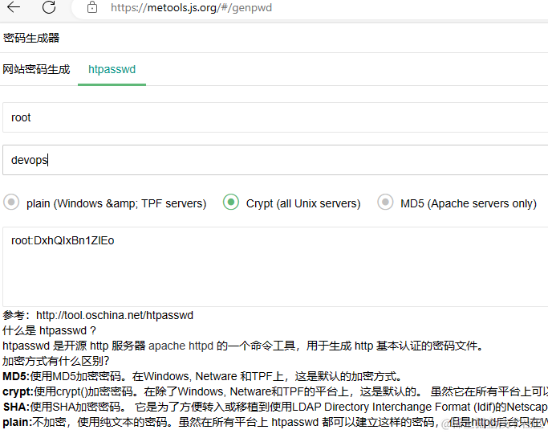

之前分享了 [前后端都用得上的 Nginx 日常使用经验](https://www.cnblogs.com/morang/p/devops-nginx-install-use.html) ，在配置 elk 的时候增加了nginx basic auth 和 IP百名的配置，作为补充分享。
## 配置 nginx 域名转发
常规的转发配置，不需要https部分去掉即可，一般只需要修改域名和转发地址
```
server {

    listen 80;
    listen       443 ssl;
    server_name kibana.devops.test.com;  # 自行修改成你的域名

    ssl_certificate      /certs/kibana.devops.test.com/server.crt;
    ssl_certificate_key  /certs/kibana.devops.test.com/server.key;
    ssl_session_cache    shared:SSL:1m;
    ssl_session_timeout  5m;
    ssl_ciphers  HIGH:!aNULL:!MD5;
    ssl_prefer_server_ciphers  on;

    location / {
            proxy_pass http://192.168.123.102:5601;
            proxy_http_version 1.1;
            proxy_buffering off;
            proxy_request_buffering off;
            proxy_set_header Upgrade $http_upgrade;
            proxy_set_header Connection "upgrade";
            proxy_set_header Host $host;
            proxy_set_header X-Forwarded-For $remote_addr;
    }
}
```
## 配置 nginx 基本认证

用于对未提供账号密码登录的服务添加一个前置基本验证 Basic Auth，在Nginx配置文件中添加以下内容指定密码文件

```
location / {
    auth_basic "Restricted Content";
    # htpasswd 密码文件
    auth_basic_user_file /certs/kibana.devops.test.com/passwd;
}
```

添加对应的 passwd 文件，使用 htpasswd 生成，如账号密码是 root devops666 的配置文件,多个账号换行添加即可

```
root:WvesKBTr22.wY
```

可以使用我 [metools](https://github.com/yimogit/metools-plugin) 工具的 [密码生成器](https://metools.js.org/#/genpwd) 生成



配置完成，重载配置后刷新页面就提示输入账号密码了


## 配置 nginx IP白名单
如下所示，能够只允许 192.168.123.201及10.0.0.0/24网段的IP访问此路径
```
location / {
    allow 192.168.123.201;   # 允许的IP地址
    allow 10.0.0.0/24; # 允许10.0.0.0/24网段的IP地址
    deny all;              # 拒绝所有其他IP地址
}
```

## 最后

修改了配置文件记得重载配置文件： `nginx -s reload`

