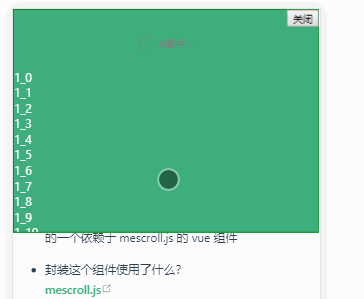
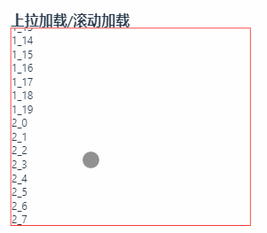

## VScrollFull 介绍


- 这个组件是什么？  

  是为了方便的使用下拉刷新，上拉加载而去封装的一个依赖于 mescroll.js 的 vue 组件（未发布，文末代码~）


- 封装这个组件使用了什么？  

  [mescroll.js](https://github.com/mescroll/mescroll)  

  [vue.js](https://cn.vuejs.org/index.html)


- 封装这个组件的理由？  

  没有找到满意的 vue 下拉刷新组件，正在使用的上拉加载的组件使用也不够优雅，然后找到了 mescroll.js([可以去其官网案例一睹为快](http://www.mescroll.com/demo.html)) 并简单封装了下使其能在 vue 项目中更方便的使用


## 效果演示 [在线体验](http://vue-doc.yimo.link/guide/04-vue-components/vue%2Bmescroll%3DVScrollFull.html#%E4%B8%8B%E6%8B%89%E5%88%B7%E6%96%B0-%E4%B8%8A%E6%8B%89%E5%8A%A0%E8%BD%BD)


### 下拉刷新+上拉加载


> 下拉刷新布局需要注意的是，若第一屏没有现实组件，则无法触发下拉刷新，滑动到滚动位置需要设置 position:fixed，急需要吸顶效果时才能使用下拉，好像没啥毛病~~~


        


<!--写个demo不容易啊，为了文档能在手机上能够正常运行跳了好久好久好久好久~~~👌-->


### 上拉加载/滚动加载





## 项目中使用 [组件所在仓库地址](https://github.com/yimogit/vue-project-summary/blob/master/docs/.vuepress/components/VScrollFull.vue)


1.  安装 mescroll.js : `npm install --save mescroll.js`

2.  将下面代码拷贝到项目/参考下面代码封装自己的滚动组件

3.  在页面中引入并使用


## 组件封装代码


```html

<template>

  <div :id="refName" class="mescroll" :ref="refName">

    <div :class="emptyCls" v-show="showEmptySlot">

      <slot name="empty"></slot>

    </div>

    <div>

      <slot></slot>

    </div>

  </div>

</template>

<script>

import MeScroll from 'mescroll.js'

import 'mescroll.js/mescroll.min.css'

export default {

  props: {

    pageSize: {

      type: Number,

      default: 10

    }

  },

  data() {

    return {

      showEmptySlot: false,

      refName: 'mescroll_' + Date.now(),

      instance: null

    }

  },

  computed: {

    emptyCls() {

      return this.refName + '_empty'

    }

  },

  mounted() {

    this.$nextTick(this.$_init())

  },

  methods: {

    $_init() {

      this.showEmptySlot = false

      if (this.instance) this.instance.destroy()

      this.instance = new MeScroll(this.refName, {

        down: {

          use: true,

          auto: false //默认不执行下拉刷新的回调

        },

        up: {

          callback: this.$_upCallback,

          use: true,

          isBounce: false,

          offset: 100,

          noMoreSize: 10,

          loadFull: {

            //不满一屏自动加载

            use: false,

            delay: 500

          },

          page: {

            num: 0,

            size: this.pageSize,

            time: null

          },

          scrollbar: {

            use: false

          }

        }

      })

      let _this = this

      this.instance.showEmpty = function() {

        _this.showEmptySlot = true

      }

      this.instance.removeEmpty = function() {

        _this.showEmptySlot = false

      }

    },

    // 上拉回调

    $_upCallback(page) {

      this.$emit('load', page.num)

    },

    getInstance() {

      return this.instance

    },

    endByPage(curPagelen, totalPage) {

      this.instance && this.instance.endByPage(curPagelen, totalPage)

    }

  }

}

</script>

```


## 测试代码


```html

<div style="height:300px;border:1px solid green;">

  <v-scroll-full ref="myscrollfull"  @load="loadData">

    <div slot="empty" style="text-align:center">无任何数据</div>

    <div v-for="(item,index) in list" :key="index">

    {{item}}

    </div>

  </v-scroll-full>

</div>


<script>

export default {

  data () {

    return {

      list: []

    }

  },

  methods:{

      loadData(pageIndex){

        setTimeout(()=>{

            if(pageIndex==1)this.list=[]

            for(var i=0;i<20;i++){

                this.list.push(pageIndex+'_'+i)

            }

            this.$refs.myscrollfull.endByPage(this.list.length,3)

        },1000)

      }

  }

}

</script>

```

## 相关资料    


- [mescroll.js](https://github.com/mescroll/mescroll)      

- [vue.js](https://cn.vuejs.org/index.html)        

- [vuepress](https://vuepress.vuejs.org/zh/)    

- [vue-project-summary](https://github.com/yimogit/vue-project-summary)
