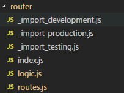

##  打包后使用相对路径


> 在 `build/webpack.prod.conf.js` 的 output 节点添加配置：` publicPath: './' `


## 打包时使用shell复制文件


在入口 `build/build.js` 中使用.

1. 引入 shelljs库 `require('shelljs/global')`

2. 使用示例:` cp('-R', 'favicon.ico', config.build.assetsRoot)`


## 不同环境使用不同模式加载路由( vue 开发环境不适用懒加载)


### router目录结构




- _import_production.js 代码    

`module.exports = file => () => import('@/views/' + file + '.vue')`


- _import_testing.js 代码    

`module.exports = file => () => import('@/views/' + file + '.vue')`


- _import_development.js 代码                

`module.exports = file => require('@/views/' + file + '.vue').default`


- 路由中使用

```

const _import = require('./_import_' + process.env.NODE_ENV)

...

        component: _import('dashboard/index')

...

```


## 使用 `require.context`自动加载模块


使用：` const files = require.context(directory, useSubdirectories, regExp)`


### 参数说明

- directory：说明需要检索的目录

- useSubdirectories：是否检索子目录

- regExp: 匹配文件的正则表达式


### 返回结果

files.keys(): 符合条件的文件路径集合


### 使用

获取当前目录所有 js 文件并获取导出模块


``` js

const files = require.context('.', true, /\.js/)

const modules = {}

files.keys().forEach(key => {

  if (key === './index.js') {

    return

  }

  var mk = key.replace(/(^\.\/|\.js$)/g, '')

  var m = files(key)

  modules[mk] = Object.keys(m).reduce((s, e) => {

    if (e !== 'default') {

      s[e] = m[e]

    }

    return s

  }, m.default||{})

})

//console.log(modules)

```
