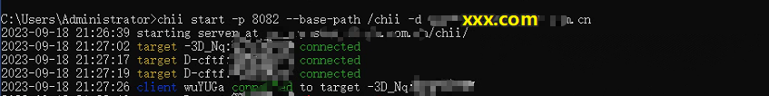
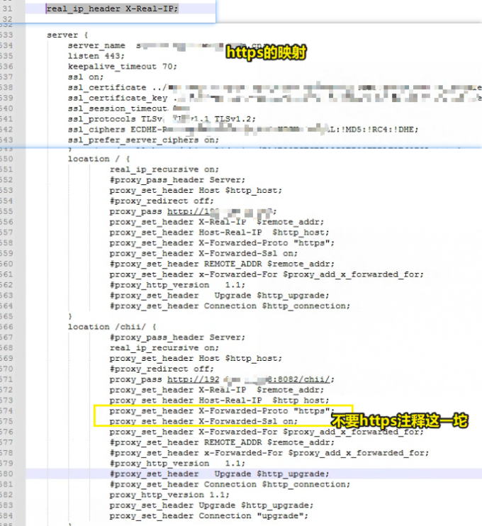
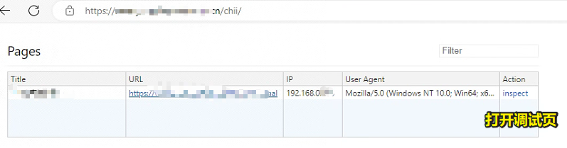
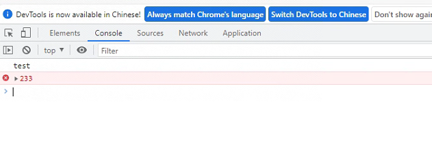
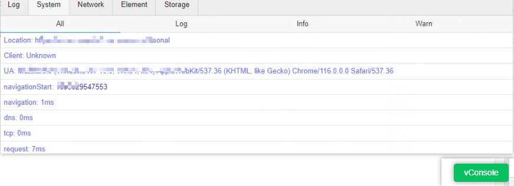

## 前端远程调试方案 Chii 的使用经验分享

> Chii 是与 weinre 一样的远程调试工具 ，主要是将 web inspector 替换为最新的 chrome devtools frontend  
> 监控列表页面可以看到网站的标题链接，IP，useragent，可以快速定位调试页面，监控页信息完善，支持https请求等，开发者工具能看到的都能看到。
> 本文主要介绍其使用，在电脑运行，通过注入 js 的方式将将远端的日志，请求等同步推送在电脑端查看显示，及命令的执行

项目地址：https://github.com/liriliri/chii

### 运行监控一览
- 启动

- nginx配置

- 监控列表

- 监控页


### Chii 安装

使用 npm 安装

```sh
npm install chii -g
```

### Chii 运行及转发配置

- 如果是本地直接运行即可：`chii start -p 8082`
- 考虑到可能存在的跨域情况，可参考如下配置运行使用
- 生产环境运行：`chii start -p 8082 --base-path /chii -d xxxx.xxxx.xxx.com`
  - 结合前缀和域名，不影响生产环境访问，也可以使用生产环境域名访问到chii服务
  - `-p` 端口
  - `-base-path` 前缀
  - `-d` 域名
  - [更多参数见源码](https://github.com/liriliri/chii/blob/master/bin/chii.js)

- 配置转发
  - 若需要调试的网站域名是：xxxx.xxxx.xxx.com，则 nginx 配置其转发 xxxx.xxxx.xxx.com/chii/
  - 如果网站是 https 则将注释处放开

```nginx
real_ip_header X-Real-IP;
server {
    #location / {
    #    ....
    #}
    location /chii/ {
            real_ip_recursive on;
            proxy_set_header Host $http_host;
            # 运行chii的本地地址
            proxy_pass http://192.168.0.188:8082/chii/;
            proxy_set_header X-Real-IP  $remote_addr;
            proxy_set_header Host-Real-IP  $http_host;
            #https则将下面注释的放开
            #proxy_set_header X-Forwarded-Proto "https";
            #proxy_set_header X-Forwarded-Ssl on;
            proxy_set_header X-Forwarded-For $proxy_add_x_forwarded_for;
            proxy_http_version 1.1;
            proxy_set_header Upgrade $http_upgrade;
            proxy_set_header Connection "upgrade";
    }
}
```

访问：https://xxxx.xxxx.xxx.com/chii/ 即可打开调试监控

### chii 注入 js 转发开始调试

- [注入 js 参考](https://github.com/liriliri/chii/blob/master/test/demo.js#L175)

```js
//注意替换其中的域名
function injectTarget() {
  var e = document.createElement("script");
  e.src = "//xxxx.xxxx.xxx.com/chii/target.js";
  location.href.indexOf("embedded=true") > -1 &&
    e.setAttribute("embedded", "true");
  location.href.indexOf("cdn=true") > -1 &&
    e.setAttribute("cdn", "//cdn.jsdelivr.net/npm/chii/public");
  document.head.appendChild(e);
}
injectTarget();
```

将其加入到页面中即可，可以通过 query 参数获其他接口参数控制来是否启用
另外如果是要在高速上给火车换轮子：给生产环境运行中的单页应用中使用思路,可参考下面命令
复制一个 html，然后注入，访问 test.html 即可

```sh
# nginx容器内部路径，根据实际情况调整
cp /usr/share/nginx/html/index.html /usr/share/nginx/html/test.html
echo "<script>function injectTarget(){var e=document.createElement('script');e.src='//xxxx.xxxx.xxx.com/chii/target.js';location.href.indexOf('embedded=true')>-1&&(e.setAttribute('embedded','true'));location.href.indexOf('cdn=true')>-1&&e.setAttribute('cdn','//cdn.jsdelivr.net/npm/chii/public');document.head.appendChild(e)}injectTarget();</script>" >> /usr/share/nginx/html/test.html
```

## 其他调试方案与工具

### vConsole

项目地址：https://github.com/Tencent/vConsole

> 一个轻量、可拓展、针对手机网页的前端开发者调试面板。  
> vConsole 是框架无关的，可以在 Vue、React 或其他任何框架中使用。  
> 现在 vConsole 是微信小程序的官方调试工具。
> 注入 js,会显示一个图标，可以在设备端查看日志等信息

- vConsole 的安装使用

最简单的方式是使用 cdn 引入然后初始化

```html
<script src="https://unpkg.com/vconsole@latest/dist/vconsole.min.js"></script>
<script>
  // VConsole 默认会挂载到 `window.VConsole` 上
  var vConsole = new window.VConsole();
</script>
```

再或者需要先加载 vConsole 也可以使用 sed 命令替换标题注入 js

```sh
cp /usr/share/nginx/html/index.html /usr/share/nginx/html/test.html
sed -i 's#<title>xxxxx</title>#<script src="https://unpkg.com/vconsole@latest/dist/vconsole.min.js"></script>\n<script>\n  var vConsole = new window.VConsole();\n</script>#' ./test.html
```

- 运行后如图所示


### weinre 的安装使用

项目地址：[weinre](https://people.apache.org/~pmuellr/weinre/docs/latest/Home.html)

> 一款基于 Web 开发的远程调试工具。是 Apache Cordova 项目的一部分。
> 经常有断线情况，不再维护，不再推荐

- 安装

```sh
npm -g install weinre
```

- 启动

```sh
weinre --httpPort 9090 --boundHost -all-
```

- 注入 js

```html
<script src="http://localhost:9090/target/target-script-min.js#anonymous"></script>
```

当访问调试页面时打开 http://localhost:9090/client/#anonymous 接口查看到被调试的页面监控链接，访问即可

### sentry

> 是一种开源的错误跟踪和监控解决方案，用于帮助开发者及时发现、修复和预防应用程序中的错误和异常。
> 集成容易，但是用好还是不容易，一些关键性的日志及设置用户上下文的使用还是蛮重要的
> 安装使用可以参考[这篇文章](https://juejin.cn/post/7275980024262443068)

## 写在最后    
文章始于客户反馈产品移动端白屏，因为是在生产环境，故想办法尝试了下chii，用chii排除了一些错误答案，生产环境还是需要反馈用户的积极配合才行  
目前只能是用sentry记录下关键性日志分析了，虽然因客户没有时间来配合最后也没有解决问题，但感觉体验还是蛮好的，特此分享一二。

