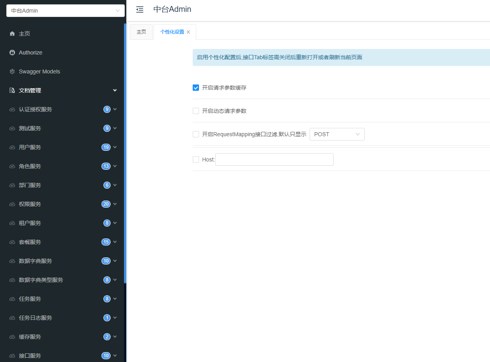

## 中台框架后端项目 Admin.Core 的介绍与配置说明
> 中台admin是前后端分离权限管理系统，Admin.Core为后端项目，基于.NET 7.0开发。   
> 支持多租户、数据权限、动态 Api、任务调度、OSS 文件上传、滑块拼图验证、多数据库，分布式缓存、分布式事务等
- 接口文档一览

- 项目地址
    - Github https://github.com/zhontai/Admin.Core
- 技术栈
	- dotnet7
	- FreeSql 
	- Autofac 
	- CAP
	- Mapster 
- 特点
	- 快速启动，上手简单
	- 系统模块化
	- Swagger的模块化封装
	- 读写分离
	- 分库分表
	- 分布式事务 TCC/ SAGA
	- 动态API
	- 系统权限封装基本满足大部分项目
	- 多租户实现
- 开发环境
    - Vs2022
    - dotnet7
- 项目结构
  - hosts
    - `ZhonTai.Host`:默认启动项目,添加对 ZhonTai.Admin.Dev，模块的引用，并将程序集配置到 assemblyNames
  - platform
    - `ZhonTai.Admin` 核心服务
    - `ZhonTai.ApiUI` 接口文档封装，分模块加载
    - `zhonTai.Common` 通用库封装
    - `ZhonTai.DynamicApi` 动态WebApi库
    - `ZhonTai.Admin.Dev` 代码生成器添加
  - tests
    - `ZhonTai.Tests` 测试库
  - modules 
    - XX.XX 我准备放自己的模块

### 默认实现功能
1. 用户管理：配置用户，查看部门用户列表，支持禁用/启用、重置密码、设置主管、用户可配置多角色、多部门和上级主管。
2. 角色管理：配置角色，支持角色分组、设置角色菜单和数据权限、批量添加和移除角色员工。
3. 部门管理：配置部门，支持树形列表展示。
4. 权限管理：配置分组、菜单、操作、权限点、权限标识，支持树形列表展示。
5. 租户套餐：配置租户套餐，支持新增/移除套餐企业。
6. 租户管理：配置租户，新增租户时初始化部门、角色和管理员数据，支持租户配置套餐、禁用/启用功能。
7. 字典管理：配置字典，查看字典类型和字典数据列表，支持字典类型和字典数据维护。
8. 任务调度：查看任务和任务日志列表，支持任务启动、执行、暂停等功能。
9. 缓存管理：缓存列表查询，支持根据缓存键清除缓存
10. 接口管理：配置接口，支持接口同步功能，用于新增权限点选择接口，支持树形列表展示。
11. 视图管理：配置视图，支持视图维护功能，用于新增菜单选择视图，支持树形列表展示。
12. 文件管理：支持文件列表查询、文件上传/下载、查看大图、复制文件地址、删除文件功能。
13. 登录日志：登录日志列表查询，记录用户登录成功和失败日志。
14. 操作日志：操作日志列表查询，记录用户操作正常和异常日志。

### 框架的使用

#### 1. 从GitHub 克隆/下载项目     
- 后端：`git clone https://github.com/zhontai/Admin.Core.git`          
- 前端：`git clone https://github.com/zhontai/admin.ui.plus.git`      

#### 2. 后端项目的启动
> 使用新下的VS2022打开后，默认启动项目 ZhonTai.Host ，直接Ctrl+F5运行即可         
> 系统将会根据实体生成数据库及表，并根据 Configs/dbconfig.json 配置将 initData/*.json 的数据生成到本地Sqlite中  
(ps:第一次搞dotnet7的项目，vs2019+自己下SDK折腾半天搞不了一点，需要vs2022 17.4+)        

- 官方文档：https://zhontai.net/backend/new-project.html

#### 3. 配置文件说明
  - launchSettings.json 
    - 默认本地启动配置
      - 配置项
          - 运行环境
              - ASPNETCORE_ENVIRONMENT:Development
          - 启动端口
              - 默认：8000
              - 优先级低于appconfig.urls的配置
  - appsettings.{Env}.json
      - 默认的应用配置文件      
      - 配置项
          - 日志等级    
              - 默认：Information   
          - 跨域    
              - 默认：* 
          - CAP配置 
              - 默认：未启用    
          - 滑动验证码  
              - 默认：300s有效期    
              - 是否开启在appconfig.json配置varifyCode.enable
  - Configs\*.{Env}.json  
      - 自定义的应用配置文件
      - dbconfig.json
          - 数据库配置
          - 绑定模型
              - 单例：`DbConfig`
          - 配置项
              - 支持类型：type
                  - 默认：Sqlite
                  MySql = 0, SqlServer = 1, PostgreSQL = 2,Oracle = 3, Sqlite = 4, OdbcOracle = 5,OdbcSqlServer = 6, OdbcMySql = 7,OdbcPostgreSQL = 8, Odbc = 9, OdbcDameng =10, MsAccess = 11, Dameng = 12,OdbcKingbaseES = 13, ShenTong = 14,KingbaseES = 15, Firebird = 16
              - 连接字符串：connectionString
                  - 默认：admindb.db
              - 同步结构
                  - syncStructure：true
                      - 默认启用
                      - 分布式部署需要注意关闭
                  - 监听同步结构脚本 syncStructureSql：false
                  > 将会输出codeFirst执行的脚本
                  将 assemblyNames 配置的所有实体执行结构移 `db.CodeFirst.SyncStructure `     
                  1.创建临时表        
                  2.插入历史数据，修改字段名称情况注意        
                  3.删除旧表，重命名临时表为新表  
                  生产上该自己执行脚本的还是自己执行
              - 同步数据
                  - syncData：true
                  - sysUpdateData:false
                      - 同步更新数据
                      - 确定要修改表数据是最新数据再开启，除localdb测试就不要使用
                  - syncDataIncludeTables：[]
                      - 同步数据包含表，指定表同步，不填同步所有表
                  - syncDataExcludeTables：[]
                      - 同步数据排除表，指定表不同步
                  - syncDataUser
                      - 同步数据操作用户
                  - syncDataPath
                      - 不配置默认为  项目目录/InitData/Admin
                      - 默认会将文件夹下的所有 表名.json 添加到数库中，默认新增所有数据
                      - 如果是租户数据，格式为 表.tenant.json
                  - syncDataCurd：false
                      - 监听同步数据Curd操作
                      - 
                  > 设置是否将syncDataPath文件夹下的 表名.json 加/修改到数据库中
              - 生成数据
                  - generateData：true
                      默认开启但无效，需要将禁用创建数据库及禁用步：createDb:false && syncData:false 
                  - 加了视图菜单就可以使用这个功能来创建生成默认数据

  - cacheconfig.json
      - 缓存配置，未绑定模型，redis缓存，限流参数配置
      - 配置项
          - 支持类型
              - 默认：Memory 
              - Memory = 0,Redis = 1
          - 限流缓存类型
              - 默认：Memory 
              - Memory = 0,Redis = 1
          - Redis配置
              - 127.0.0.1:6379
  - appconfig.json
      - 应用配置
      - 绑定模型
          - 单例: `AppConfig`
      - 配置项
          - appType 应用程序类型
              - 默认：Controllers
              - Controllers ControllersWithViews MVC
          - urls 启动地址
              - http://*:8000
          - corUrls 跨域
              - []
          - assemblyNames 程序集名称
              - ZhonTai.Admin
              - Mapster自动注册程序集
          - tenantc租户
              - true
          - distributeKey 分布式事务唯一标识
              - 为空则不生成分布式事务表
          - validate 验证开关
              - 登录,接口权限,数据权限验证
          - swagger Swagger文档s
              - http://localhost:8000/admin/swagger
          - apiUI 接口文档地址
              - http://localhost:8000/admin/index.html
          - MiniProfiler 性能分析器
              - false
          - identityServer 统一认证授权服务器
              - false
          - aop 面向切面编程s
              - 开启事务
          - log 数据库日志
              - 操作日志
          - rateLimit 限流开关
              - false
          - varifyCode 登录验证码
              - true
          - defaultPassword 默认密码
              - 111111
          - dynamicApi 动态api
              - 结果格式化
          - passwordHasher 标准标识密码哈希
              - 启用后相同密码加密后各不相同
          - maxRequestBodySize 最大请求大小
              - 104857600
          - healthChecks 健康检查
              - enable:true 启用
              - path:/admin/health
  - jwtconfig.json
      - JWT配置
      - 绑定模型
          - 单例：`JwtConfig`
      - 配置项
          - issuer 发行者
          - audience 订阅者
          - securityKey 密钥
          - expires 有效期(分钟) 120
          - refreshExpires 刷新有效期(分钟) 1440
  - ossconfig.json
      - 本地上传配置
      - 绑定模型
          - `IOptions<OSSConfig>`
      - OSS配置
          - Minio
          - 阿里云
          - 腾讯云
          - 七牛
          - 华为云
  - uploadconfig.json
      - 上传配置
      - 绑定模型
          - `IOptions<UploadConfig>`
  - ratelimitconfig.json
      - 限流配置
      - 绑定模型
          - `IOptions`
      - 支持类型
          - IP限流
              - 默认未启用
              - 需要在appconfig.json中配置rateLimit:true生效
              - 使用Redis实现限流
              - 需要在cacheconfig.json中配置typeRateLimit
  - InitData\模块\*.{tenant}.json
      - 默认初始化数据

#### 4. 代码生成
- 官方默认模板生成：
  - `dotnet new install ZhonTai.Template`
  - `dotnet new MyApp -n MyCompanyName.MyProjectName`
- 第三方代码生成器：
  - 后端：https://github.com/share36/Admin.Core.Dev
  - 前端：https://github.com/share36/admin.ui.plus.dev

前端及代码生成见下篇

### 写在最后
文章的起因是想找个不错的框架用来搞个自己用的系统，找了几个dotnet+vue的框架，zhontai的这个是看到上手最容易，前后台的代码也没有封装得太深，二开也很方便，看着用着都挺舒服的。 
唯一的不足就是文档了，一点资料都找不到，就只能一点点看代码，然后边看边记录，以备后用，又想着既然都写了，那就再整理一下了，顺便分享出来咯，希望能够对后面使用框架的有所帮助。
